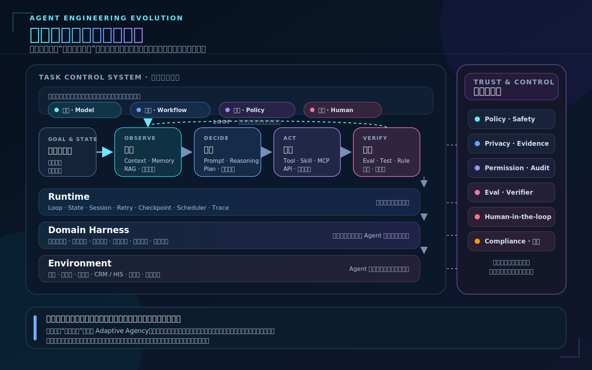

# Agent 工程演进：从组件堆叠到控制权设计



> 图示核心：Agent 工程演进不是组件的线性替代，而是根据任务状态、风险和可验证性，在模型、程序、规则与人之间重新分配控制权。

过去几年，Agent 领域不断出现新概念：Prompt Engineering、Context Engineering、RAG、Memory、Tool、MCP、Planning、Loop、Harness、Runtime、Eval、Multi-Agent。把这些词排列起来，很容易得到一条看似清晰的演进路线：

```text
Prompt → Context → Tool → Harness → Loop → Autonomous Agent
```

这条线抓住了一个真实现象：随着模型能力增强，Agent 可以承担越来越复杂的任务，工程系统需要解决的问题也在不断增加。

但把它理解为严格的阶段演进并不准确。Prompt、Context、Tool、Harness 和 Loop 不是同一种东西，后者也没有取代前者。即使在高度自主的 Agent 中，Prompt、Context 和确定性 Workflow 仍然存在；即使只是一个简单的医疗问答系统，安全、评测、合规和责任也必须从第一天开始考虑。

因此，理解 Agent 工程演进，需要换一条主线。

我的判断是：

> **Agent 工程的本质，不是不断增加组件，而是在重新分配一个任务系统中的控制权。**

更进一步说：

> **传统软件通过预先规定执行路径来控制系统，Agent 工程则通过设计状态、动作边界、反馈和验证机制，让模型在运行时承担部分控制权。**

这才是 Prompt、Context、Tool、Harness、Loop 等概念背后的共同变化。

---

## 一、真正的变化：控制权从编译时走向运行时

传统软件系统的主要控制逻辑由开发者提前写入代码：

```text
满足条件 A，执行动作 B
出现异常 C，进入分支 D
完成步骤 E，进入状态 F
```

任务路径、状态转换、异常处理和结束条件，大部分在系统运行前就已经确定。我们可以把它称为一种“编译时控制”。

Agent 系统的不同之处，是把一部分原本由程序员预定义的控制权交给模型，在运行时进行判断：

```text
当前用户真正想解决什么？
还缺少哪些信息？
下一步应该调用哪个工具？
工具失败后应该重试、换路径还是询问用户？
当前结果是否足以结束任务？
```

这是一种“运行时控制”。

因此，Workflow 和 Agent 并不是两代互相替代的架构。它们只是两种不同的控制权配置：

- Workflow 把更多状态转换权交给代码；
- Agent 把部分状态识别、路径选择和动作选择权交给模型；
- 规则系统负责不可妥协的硬约束；
- Verifier 负责结果验收；
- 人类负责高风险和高不确定性决策。

一个真实的企业 Agent，往往同时由这些控制者构成：

```text
业务主流程        → Workflow
用户意图理解      → 模型
高风险判断        → 规则 + 模型
工具实际执行      → Runtime
任务结果验收      → Verifier
异常情况处置      → 人工
```

所以，企业 Agent 的长期形态很可能不是完全自主，而是**混合控制系统**。

---

## 二、Agent 工程不是消除不确定性，而是管理不确定性

传统软件要求开发者尽可能提前消除不确定性，把业务逻辑写成确定的分支。Agent 则允许模型在运行时处理那些难以提前穷举的问题。

这带来了能力，也带来了新的工程挑战。

当系统只生成一次文本时，不确定性主要存在于输出；当系统可以调用工具时，不确定性开始影响真实动作；当系统进入循环时，不确定性进一步进入任务路径、状态变化和结束判断。

因此，Agent 工程演进也可以理解为：

```text
输出不确定性
    ↓
决策不确定性
    ↓
动作不确定性
    ↓
过程不确定性
    ↓
长期状态不确定性
```

工程系统不能消灭模型的概率性，但可以约束这种不确定性发生在哪里、影响多大、是否可恢复，以及最终如何验证。

这也是为什么 Agent 工程的重点正在从“让模型回答得更好”，逐渐扩展为：

- 状态是否充分可见；
- 动作空间是否明确；
- 副作用是否可控；
- 执行失败能否恢复；
- 结果能否验证；
- 风险是否可以接受；
- 必要时能否收回模型的控制权。

从这个角度看，Agent 工程本质上是一种**不确定性边界设计**。

---

## 三、Prompt、Context、Tool、Loop 分别控制什么

这些概念不是演进阶段，而是控制任务系统的不同机制。

### 1. Prompt：控制一个局部决策点

Prompt 决定模型在当前时刻：

- 扮演什么角色；
- 关注什么目标；
- 遵循什么规则；
- 使用什么判断方式；
- 输出什么结构。

Prompt 不会消失，但它的地位会发生变化。

早期 Prompt Engineering 倾向于寻找“神奇措辞”，未来它会更像普通软件工程中的接口契约：

```text
明确输入
明确输出 Schema
区分事实、规则与指令
维护版本
建立回归测试
关联线上效果
支持失败归因
```

Prompt 仍然重要，但会从一种独立技巧，变成任务系统中的局部行为控制机制。

### 2. Context：控制模型看到什么状态

模型的决策不仅取决于模型能力，也取决于它认为当前世界是什么样的。

Context 决定：

- 哪些事实对模型可见；
- 哪些历史状态被保留；
- 哪些信息被突出；
- 哪些信息已经过期；
- 哪些数据相互冲突；
- 当前任务处于什么阶段。

很多所谓的“模型推理错误”，本质上是状态表达错误：系统没有把正确的信息，以正确的结构，在正确的时机交给模型。

因此，Context Engineering 的核心不是尽可能塞入更多内容，而是建立稳定的**状态装配机制**。

### 3. Tool：定义模型能够改变什么

Tool、Skill、MCP 和 API 共同定义了 Agent 的动作空间。

但“能调用接口”并不等于“能可靠完成任务”。一个适合 Agent 的动作接口至少应该说明：

- 动作的业务语义；
- 前置条件；
- 所需权限；
- 可能产生的副作用；
- 是否幂等；
- 是否支持预览；
- 是否可以撤销；
- 如何判断执行成功。

传统 API 主要服务确定性程序，Agent Tool 还需要服务一个概率性决策者。因此，它必须提供更清晰的语义、反馈和验证机制。

### 4. Loop：允许模型持续获得决策权

Loop 让模型反复执行：

```text
观察 → 判断 → 动作 → 再观察
```

但 Loop 本身并不代表先进。

如果系统没有可靠的状态、反馈、完成条件和异常恢复，那么 Loop 只是一个更容易失控的 Workflow。真正困难的不是把模型放进 `while` 循环，而是决定：

- 每一轮应该观察什么；
- 状态如何更新；
- 什么情况需要重新规划；
- 什么情况允许重试；
- 什么情况必须结束；
- 什么情况需要人工接管；
- 如何证明任务已经完成。

Loop 的价值取决于闭环质量，而不是循环次数。

---

## 四、Runtime、Harness 和 Environment

Agent 工程中最容易混淆的，是 Runtime、Harness 和 Environment。它们在行业里没有完全统一的定义，本文采用下面这组区分。

### Environment：Agent 工作的真实世界

对于 Coding Agent，Environment 可以是：

```text
代码仓库
文件内容
Git 状态
CI 系统
Issue
线上服务
```

对于医疗 Agent，Environment 可以是：

```text
患者表达
病历
问诊状态
医学知识
药品系统
医生接管系统
```

Environment 独立于 Agent 存在，并可能被 Agent、用户或其他系统改变。

### Runtime：驱动 Agent 运行的执行引擎

Runtime 负责：

```text
模型调用
状态保存
Loop 或 Workflow 执行
工具调用
事件处理
并发调度
重试与恢复
Checkpoint
Trace
```

它解决的是“Agent 的计算过程如何运行”。

### Harness：为 Agent 设计的任务工作界面

真实环境通常并不适合 Agent：

```text
状态不可见
接口语义模糊
错误反馈不清楚
动作副作用未知
结果难以验证
失败无法恢复
```

Harness 的作用，是把真实环境整理成 Agent 可以理解、操作和验证的任务世界：

```text
状态可观察
动作语义清晰
权限边界明确
反馈及时
结果可验证
失败可恢复
```

因此，可以将三者概括为：

```text
Environment：真实世界是什么
Harness：如何把真实世界改造成适合 Agent 工作的形态
Runtime：如何驱动 Agent 在其中持续运行
```

在这个意义上，Harness 不是简单的工具集合或沙箱，而是对 Environment 的一次**Agent 化改造**。

---

## 五、真正决定自主性的，不只是模型能力

行业经常隐含一个假设：

```text
模型越强 → Agent 越自主
```

这个关系并不成立。

一个 Agent 可以开放多大自主范围，至少取决于五个因素：

```text
模型能力
状态可观察性
动作可控性
结果可验证性
风险可接受度
```

任何一项明显不足，可靠自主性都会下降。

这解释了为什么 Coding Agent 发展得很快。软件工程环境天然具有很多适合 Agent 的条件：

- 代码状态高度可见；
- 修改结果可以查看 Diff；
- 测试能够快速反馈；
- Git 支持回滚；
- Sandbox 可以限制副作用；
- 任务结果相对容易验证。

医疗任务则不同：

- 患者的真实状态无法被完全观察；
- 关键检查可能在线下完成；
- 结果反馈可能延迟数天甚至数月；
- 错误建议的副作用可能不可逆；
- 很多任务不存在简单的自动化验收标准。

所以，即使医疗模型的认知能力很强，其动作自主性也必须受到严格限制。

由此可以得到一个重要判断：

> Agent 的能力上限由模型决定，但 Agent 的可用自主性往往由环境和验证能力决定。

---

## 六、自主性不是等级，而是向量

把 Agent 简单划分成 L1、L2、L3、L4，会造成“越自主越高级”的误导。

一个 Agent 至少具有四种不同的自主性：

1. **认知自主性**：是否能自行理解、总结、判断和规划；
2. **路径自主性**：是否能选择任务推进路线；
3. **动作自主性**：是否能改变真实外部系统；
4. **时间自主性**：是否能跨时间持续维护目标。

不同任务可以开放不同的自主维度。

例如，医疗 Agent 可以拥有较高的认知自主性，但关键动作必须由医生决定；Coding Agent 可以在沙箱中拥有很高的路径和动作自主性，但没有直接发布生产的权限。

所以，更正确的问题不是：

> 这个 Agent 属于哪个自主等级？

而是：

> 在这个任务的每一个决策点上，哪种自主性可以开放，哪种必须收回？

---

## 七、治理不是最后一层，而是贯穿系统的控制面

安全、隐私、权限、审计和责任并不是 Agent 高度自主以后才出现的问题。

在高风险领域，即使只是一次模型回答，也已经需要考虑：

- 内容是否会误导用户；
- 信息依据是否可靠；
- 哪些问题不能回答；
- 什么时候必须提示人工处理；
- 输入数据是否符合隐私要求；
- 错误发生后能否追溯。

随着 Agent 能力扩大，变化的不是治理从无到有，而是治理对象不断扩展：

```text
输出内容治理
    ↓
上下文和隐私治理
    ↓
模型决策治理
    ↓
工具动作治理
    ↓
任务结果治理
    ↓
长期状态与持续授权治理
```

因此，Governance 不应被画成架构最上方最后出现的一层，而应被看成纵向贯穿 Prompt、Context、Tool、Loop、Harness 和 Environment 的可信控制面。

---

## 八、未来的核心不是 Autonomous Agent，而是 Adaptive Agency

完全自主通常不是企业系统的最佳目标。

更合理的方向是，根据任务状态动态决定控制权：

- 状态足够清晰时，允许模型自主判断；
- 动作可逆时，允许 Agent 直接执行；
- 结果可自动验证时，允许连续运行更多步骤；
- 不确定性升高时，切换到 Workflow 或人工；
- 涉及高风险副作用时，要求审批；
- 验证能力不足时，缩短自主链路。

这可以称为 **Adaptive Agency，即可调节的自主性**。

它要求系统能够在模型、代码、规则、Verifier 和人之间动态切换，而不是永远依赖同一个控制者。

未来企业 Agent 的竞争力，可能不在“谁能够完全自主”，而在：

> 谁能够更精确地判断何时开放自主、开放多少自主，以及何时收回自主。

---

## 九、Agent 工程真正的壁垒可能是 Domain Harness

随着模型和通用框架逐渐成熟，Tool Calling、Planning、Memory、Loop 等能力会不断趋同。真正难以复制的，是把某一类业务任务改造成适合 Agent 可靠工作的环境。

一个医疗 Domain Harness 需要定义：

```text
患者状态如何表达
关键信息缺口如何识别
医学证据如何获取
风险信号如何暴露
哪些动作允许执行
哪些动作只能建议
什么情况必须升级给医生
什么时候算任务完成
结果如何验证
失败如何恢复
```

一个软件研发 Domain Harness 则需要定义：

```text
代码库如何向 Agent 暴露
哪些目录允许修改
测试和构建如何执行
变更如何验证
失败如何回滚
什么情况下可以提交 PR
什么情况下需要人工 Review
```

这些能力不是一个通用 Agent Framework 可以自动提供的。它们来自：

```text
领域知识
+ 任务状态模型
+ 动作接口
+ 风险边界
+ 反馈机制
+ 验证标准
```

因此，未来 Agent 工程真正的护城河，很可能不是又一套通用框架，而是高质量的 **Domain Harness**。

---

## 十、当前最值得做什么

对于已经拥有真实业务、Workflow、工具和监控基础的团队，当前最有价值的不是继续补齐所有热门组件，而是围绕具体任务建立一张**控制地图**。

将任务拆解为一系列状态转换点，并对每一个点回答：

```text
当前状态是什么？
需要作出什么判断？
谁负责判断：模型、代码、规则还是人？
模型需要看到哪些信息？
允许执行哪些动作？
动作是否可逆、可重试、可审计？
执行结果如何观察？
任务结果如何验证？
什么情况下结束或人工接管？
```

然后寻找控制权分配不合理的地方：

- 本应由代码保证的硬约束，只写进 Prompt 提醒；
- 本应由模型处理的语义问题，被写成大量脆弱分支；
- Agent 获得了动作权限，却看不到动作结果；
- 系统允许自主 Loop，却没有可靠的完成判定；
- 保存了大量 Trace，却无法判断真实任务是否成功；
- 允许长期记忆，却没有纠错、时效和删除机制。

这些不匹配，才是 Agent 工程真正的建设空间。

---

## 结语

Agent 工程并不是从 Prompt 线性演进到 Context、Harness 和 Loop，也不是不断增加新组件的过程。

它更准确的演进主线是：

> 随着模型能力增强，软件系统开始把更多运行时控制权交给概率性决策者；工程的任务，则从预先规定每一步，转向设计目标、状态、动作边界、反馈、验证和责任。

Prompt、RAG、Memory、Tool、Workflow 都不会消失。它们会逐渐像数据库、缓存、消息队列一样，成为 Agent 系统的普通基础能力。

未来真正重要的不是下一个概念，而是三个问题：

```text
哪些决策值得交给模型？

模型需要怎样的状态、动作和反馈，才能做好这些决策？

系统如何根据风险和验证能力，动态调整模型的控制权？
```

最终，Agent 架构要解决的不是“如何构建一个完全自主的模型”，而是：

> **如何设计一个由模型、程序、规则、环境和人共同控制，并能够可靠完成真实任务的软件系统。**
