# 论文阅读笔记：Code as Agent Harness

> **论文：** Code as Agent Harness — Toward Executable, Verifiable, and Stateful Agent Systems
> **作者：** Xuying Ning, Katherine Tieu, Dongqi Fu, Tianxin Wei, Zihao Li 等（UIUC / Meta / Stanford）
> **arXiv：** [2605.18747](http://arxiv.org/abs/2605.18747)（2026-05-18）
> **阅读日期：** 2026-07-03
> **配套资源：** [Awesome-Code-as-Agent-Harness-Papers](https://github.com/YennNing/Awesome-Code-as-Agent-Harness-Papers)

---

## 0. 摘要

这是一篇 102 页的大综述。核心主张只有一句话：

> **Code is no longer only an artifact generated by LLMs. It increasingly serves as the operational substrate for agent reasoning, acting, environment modeling, and execution-based verification.**

代码不再只是 LLM 的**产出物**，而是智能体的**运行介质（operational substrate）**：智能体用它来推理、行动、建模环境、验证进展。论文把这个视角叫做 **code as agent harness**——代码作为智能体基础设施的基础。

它把整套体系按三个层次组织：

1. **Harness Interface（§2）**：代码如何连接智能体与推理、行动、环境建模
2. **Harness Mechanisms（§3）**：规划、记忆、工具使用、反馈控制与优化，让 harness 可靠且自适应
3. **Scaling the Harness（§4）**：从单智能体扩展到多智能体，共享代码工件支撑协作、评审与验证

最后（§5）覆盖五个应用领域（编程助手、GUI/OS 智能体、具身智能体、科学发现、个性化推荐）和七个开放问题。

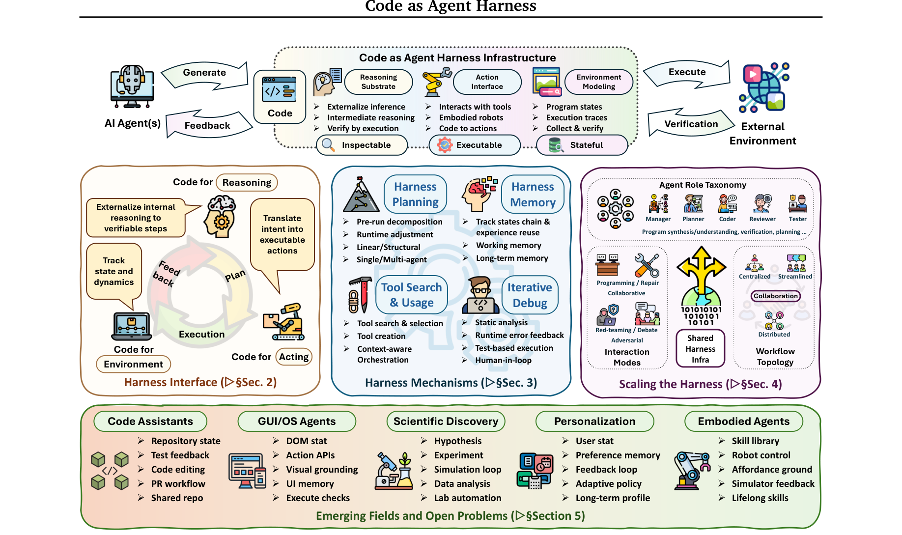

---

## 1. 引言：把"代码是产物"翻转成"代码是 harness"

### 从模型能力瓶颈到系统可靠性瓶颈

最近 LLM 在代码理解与生成上很强，但论文提出了一个视角转换：**自治的瓶颈不只是基座模型的推理能力，更是"把模型输出连接到长程行动与持久状态"的系统的可靠性。**

论文区分了三类耦合元素：

| 元素 | 含义 | 例子 |
|------|------|------|
| **Model-internal capabilities** | 模型自身的推理、感知、规划、模拟、评估能力 | CoT、代码生成 |
| **System-provided harness infrastructure** | 系统预定义的工具、API、沙箱、记忆、验证器、权限边界、遥测、工作流 | Claude Code、Codex、LangChain 的工程层 |
| **Agent-initiated code artifacts** | **智能体在任务循环中创建、执行、观察、修订、持久化、共享的交互式代码对象** | 回归测试、临时工具、DSL 程序、可执行工作流、可复用技能、中间程序状态 |

前两类已经被广泛研究，**第三类（agent-initiated code artifacts）相对未充分探索**——这正是这篇论文的着力点。

### 关键定义：什么是 code as agent harness

> *"Code as the executable and inspectable medium through which agents reason, act, and adapt."*

与自然语言相比，代码有三个使其成为 harness 接口的特质：

- **可执行（executable）**：模型输出变成有可验证结果的操作
- **可检查（inspectable）**：中间计算暴露为结构化轨迹，harness 可读、可存、可行动
- **有状态（stateful）**：演化的程序在步骤间以持久、可修改的形式表示任务进展

### 边界声明（scope boundary）

代码的范畴很广但**不隐喻**：程序、脚本、形式化规约、证明脚本、API schema、工具定义、测试、仓库、模拟器、配置文件，以及由可执行系统产生/消费的轨迹和日志都算。

但**原始感知、物理状态、人类意图、模型内部潜在推理**——这些**不是代码**。代码只是让它们的"选中的某些方面"可执行、可检查、有状态，而不是取代它们。

> *"Code as a harness interface does not replace perception, embodiment, human goals, or model reasoning; rather, it makes selected aspects of them executable, inspectable, and stateful within the agent loop."*

---

## 2. Harness Interface：代码连接模型与环境（§2）

Harness 最基本的工程设计问题是：**什么介质把模型连接到它的任务环境？** 论文的答案是代码。

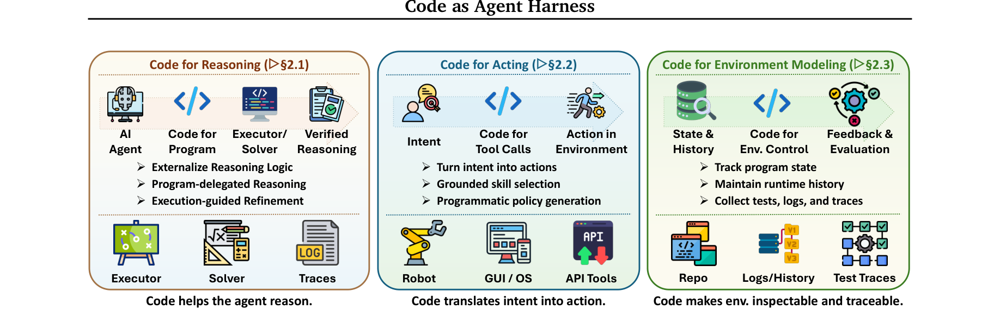

代码在智能体系统中扮演三个角色：

| 角色 | 一句话 | 小节 |
|------|--------|------|
| **Code for Reasoning** | 把内部逻辑外部化为可验证的计算 | §2.1 |
| **Code for Acting** | 把高层意图翻译成在具身/GUI/软件/工具环境中可执行的操作 | §2.2 |
| **Code for Environment** | 用程序状态、仓库、模拟器、测试、日志表示世界状态、动态与反馈 | §2.3 |

> 总纲领：**code makes reasoning executable, action programmable, and environment state inspectable.**

### 2.1 Code for Reasoning（代码让推理可执行）

动机：纯文本 CoT 让模型既负责分解问题又负责执行中间运算——而 LLM 在符号、逻辑、算术运算上不可靠，且纯文本推理**无法被 harness 验证、检查、持久化**。Code-for-reasoning 引入"模型提出过程，harness 执行它们"的分工。

三种范式：

**① Program-Delegated Reasoning（程序委托推理）**——把计算委托给外部解释器
- PoT、PAL：逻辑与计算解耦（PAL 是把推理逻辑与计算分离的代表作）
- Chain of Code：用 "LMulator" 模拟不可执行的语义代码
- 核心价值：**分离高层推理与低层计算**

**② Formal Verification & Symbolic Reasoning（形式验证与符号推理）**——用机器可验证的正式语言作为推理接口
- 证明助手：Lean、Isabelle、Coq；系统：ReProver、DeepSeek-Prover-V2、Goedel-Prover-V2
- 代码验证：Goedel-Code-Prover、VERINA
- 智能体验证：Lean4Agent（用 Lean4 建模并验证智能体工作流与轨迹）
- 核心价值：形式语言不只是推理工具，还是**约束、认证、审计智能体行为的可执行契约**

**③ Iterative Code-Grounded Reasoning（迭代代码接地推理）**——生成→执行→验证→修正的闭环
- NExT：训练模型预测执行行为
- CodePRM：用执行结果评估和细化中间推理轨迹（过程奖励）
- RLEF、CodeRL：把执行反馈当 RL 优化信号
- R1-Code-Interpreter：在持久交互会话中交错推理与多轮代码执行

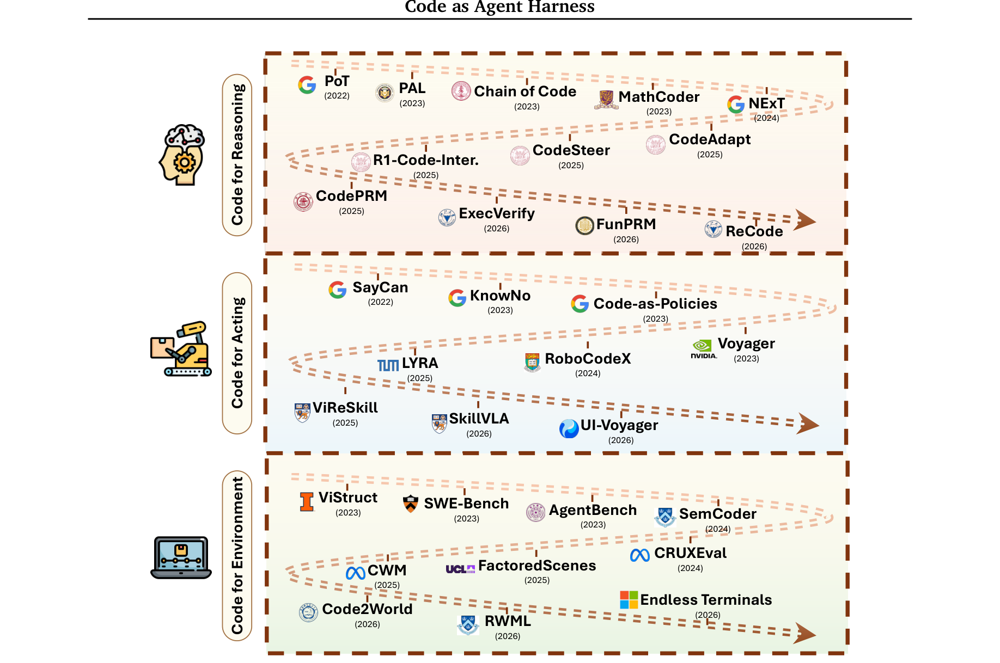

### 2.2 Code for Acting（代码让行动可编程）

与代码推理不同，行动发生在**部分可观测、动态演化的环境**中——失败可能表现为无效状态转移、延迟反馈或静默执行错误（例如机器人去抓工作空间外的物体，却不产生任何运行时异常）。

代码行动接口的三种实现形式：

**① Grounded Skill Selection（接地技能选择）**——把环境当作可执行能力的集合
- SayCan：语言规划 + 物理可行性接地
- KnowNo：共形预测做不确定性校准，歧义时先澄清再行动
- Voyager：终身技能库，开放式任务的自主课程

**② Programmatic Policy Generation（程序化策略生成）**——生成代码作为执行策略
- Code-as-Policies（CaP）：生成响应式机器人控制策略（Python）
- RoboCodeX：多模态树结构代码
- Code-BT：代码到行为树规划

**③ Lifelong Code-Based Agents（终身代码智能体）**——技能随经验演化
- LYRA：把人类修正编码进可复用结构化技能
- UI-Voyager：拒绝微调 + 自蒸馏，移动 GUI 智能体
- ViReSkill：失败时用技能记忆缓存重新规划

关键思想：**代码不取代感知/规划/控制器，而是坐在模型与这些组件之间的接口上**——序列化观察、调用接地与规划模块、触发可执行动作、把验证结果暴露回 harness。还有像 AutoHarness 这样**自动合成代码 harness 来中介模型动作、在执行前过滤非法交互**的显式形式。

### 2.3 Code for Environment（代码让环境可检查、可追踪）

问题：环境状态常常隐式、瞬时、难以验证。Code-for-environment 把环境本身**物化为可执行工件**：模拟器、仓库、测试、执行轨迹、日志、状态转移程序。

四种范式：

**① Structured World Representations（结构化世界表示）**
- ViStruct：视觉场景编码为类/对象层次结构
- FactoredScenes：室内场景建模为组合式 "room programs"
- Code2World：把 GUI 状态预测重构为可渲染 HTML 生成

**② Execution-Trace World Modeling（执行轨迹世界建模）**
- SemCoder：在语句级执行语义上训练
- CWM（Code World Model）：直接从程序轨迹学预测性世界模型
- WorldCoder：智能体显式编写并更新可执行世界模型（Python 程序）

**③ Code-Grounded Evaluation Environments（代码接地评估环境）**
- InterCode：把编码任务重构为"代码即动作、执行反馈即观察"的交互环境
- CRUXEval、LiveCodeBench、SWE-bench、AgentBench：用执行而非纯文本判断评估智能体

**④ Verifiable Environment Construction（可验证环境构建）**——环境本身作为可合成、可扩展、可验证的 harness 工件
- SWE-smith：从现有代码库构造仓库级任务与执行环境
- EnvScaler：程序化合成工具交互环境 + 场景 + 规则验证器

> 核心洞察：环境用代码表示后，**智能体可以显式存储、检查、执行、修改环境状态**，并通过执行而非含糊的自然语言判断来评估交互结果。

---

## 3. Harness Mechanisms：让代码智能体长期可靠（§3）

代码进入智能体循环后，生成不再只是"从提示词产生正确程序"，而是**模型、可变任务状态、人类设计的 harness 基础设施三者的交互**。本节的五个机制类别：

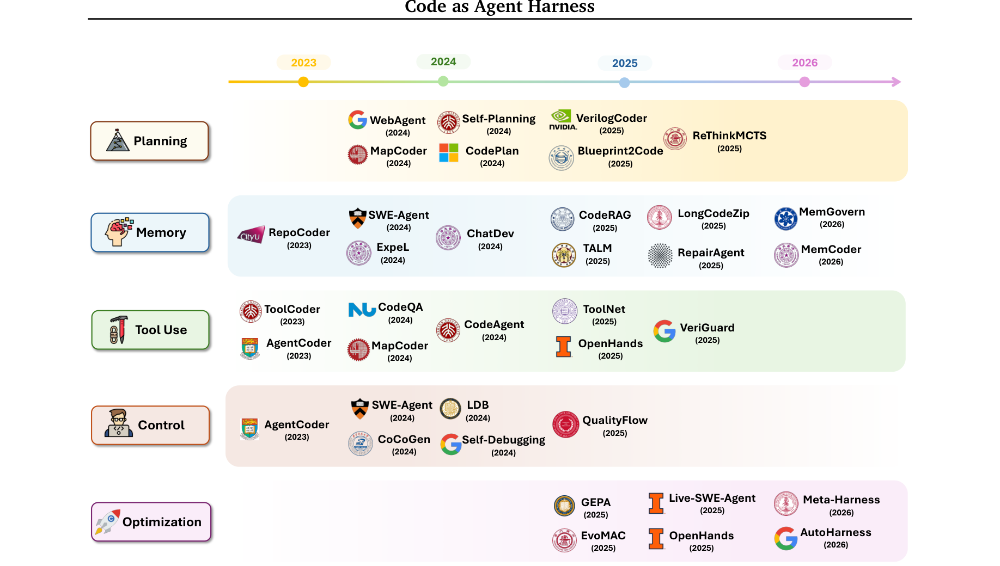

一个关键观点先立住：

> *"Code serves as an executable medium inside the harness, while the harness remains the larger policy-governed system that decides what code may be executed, trusted, persisted, reused, or promoted into future workflows."*

代码是 harness 内部的可执行介质，但 harness 本身是更大的、策略治理的系统。**智能体动态编写的代码不能替代人类设计的 harness 基础设施**——可靠性仍然依赖模型判断 + 人类设计的策略、沙箱边界、权限层、验证 oracle、审计日志、人工评审门。

### 3.1 Planning（规划即 harness 控制）

规划不只是模型的内部推理能力，而是 **harness 控制的一种形式**：它结构化地决定智能体如何把意图外部化为可执行步骤、如何调度与代码工件和工具的交互、如何调节推理-执行-修订的轨迹。

按"harness 控制实现的场所"分为四类：

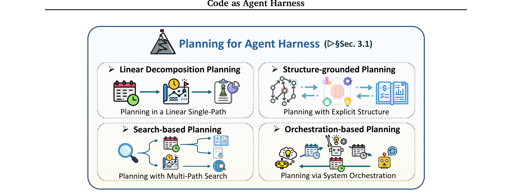

| 类别 | 核心机制 | 代表系统 |
|------|---------|---------|
| **Linear Decomposition** | 先产生单一显式步骤序列再执行；ReAct 是轻量前身 | Self-Planning、WebAgent、KareCoder |
| **Structure-grounded** | 把规划接地在依赖图/仓库图/电路图/知识图上 | CodePlan、GraphCodeAgent、VerilogCoder |
| **Search-based** | 推理时分配算力，在多条候选轨迹上搜索、评估、选择 | ReThinkMCTS、Tree-of-Code、CodeTree、SWE-Search |
| **Orchestration-based** | 通过系统级协调实现规划：角色分工、阶段化流程、控制器为中心 | MapCoder、ChatDev、Natural-Language Agent Harnesses |

几个亮点：

- **PLAN.md 现象**：线性规划脚手架从"临时提示词工件"升级为**文件系统支撑的控制对象**——可被人类评审、用 Git 版本化、被子智能体消费、作为实现真相来源。这是规划作为 harness 对象的重要工业化实践。
- **Search-based 的深层含义**：搜索不只是模型侧采样策略，更是 **harness 级状态管理问题**——运行时必须保留候选、暴露证据、运行验证器、决定哪个分支值得继续。
- **讨论要点**：规划无法与评估问题干净分离——规划收益的结论高度依赖执行条件（执行环境、反馈质量、工具访问、轨迹预算）。规划不只是方法设计问题，也是智能体与环境之间的 harness 问题。

### 3.2 Memory and Context Engineering（记忆与上下文工程）

记忆是代码智能体的核心基础设施，因为真实软件工程任务是**长程、状态密集**的。从 harness 视角看：

> *"Memory is not simply a larger context window or a vector database."*

记忆是统一的状态管理层，有六种类型：

| 类型 | 作用 |
|------|------|
| **Working Memory** | 保持下一步行动接地在当下上下文 |
| **Semantic Memory** | 暴露仓库证据（检索增强） |
| **Experiential Memory** | 支持跨任务迁移（ExpeL、MemCoder） |
| **Long-Term Memory** | 保存验证过的知识 |
| **Multi-Agent Memory** | 跨角色同步共享状态 |
| **Context Compaction & State Offloading** | 压缩长历史 + 把全保真工件卸载到外部存储（MCP 式资源接口） |

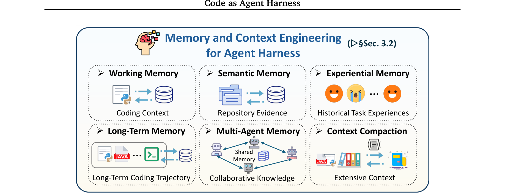

关键工程模式：**把决策相关的上下文与持久证据分开**——智能体拿到紧凑摘要和资源标识符，而不是原始日志/轨迹。例如失败测试报告被压缩为"失败测试名 + 关键栈帧 + 疑似文件 + 完整日志链接"。

> 重要提醒：记忆研究不能与**评估可靠性**分离——测试不足、日志解析缺陷、基准记忆污染都会让"记忆有效"的结论失真。

### 3.3 Tool Use（工具使用即被治理的行动接口）

工具是代码 harness 的**行动与观察层**。从 code-as-harness 视角看：

> *"Tool use is not merely an auxiliary capability for code generation. It is a governed interface between model intent and external systems."*

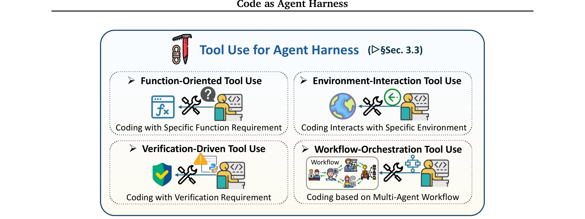

按工具服务的 harness 功能分为四类：

| 类别 | 工具角色 | 代表系统 |
|------|---------|---------|
| **Function-Oriented** | 填模型编程知识空白：API、库、文档 | ToolCoder、CodeQA、RAG-for-Code |
| **Environment-Interaction** | 在仓库/终端/IDE/浏览器/沙箱内行动 | CodeAgent、SWE-agent、RepairAgent |
| **Verification-Driven** | 作为确定性传感器：测试、linter、类型检查、静态分析 | AgentCoder、VeriGuard |
| **Workflow-Orchestration** | 协调多工具、角色、生命周期策略 | ToolNet、MapCoder、OpenHands |

核心机制是 **tool lifecycle control（工具生命周期控制）**：
- **执行前**：权限检查、策略规则、参数验证、HITL 门
- **执行后**：输出清洗、日志压缩、轨迹卸载、记忆更新、触发验证工具

生命周期钩子把工具使用从"模型选择的原始动作"变成"智能体执行循环中的受监控转移"。

### 3.4 Harness Control through the PEV Loop（Plan–Execute–Verify 循环）

论文把"反馈驱动调试"重新框定为 **PEV 控制环**：harness 先外部化一个预期变更及其验证标准（Plan），然后在沙箱化、权限化的环境中执行（Execute），最后通过确定性传感器和人工评审门验证结果（Verify）。

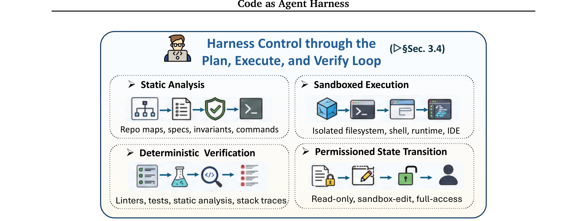

harness 在此扮演 **cybernetic governor（控制论治理器）**：

> *"Rather than merely forwarding error messages to the model, it observes the repository and execution environment through deterministic sensors — linters, parsers, compilers, type checkers, unit tests, integration tests, static analyzers, fuzzers, runtime monitors, and CI pipelines."*

**三个关键设计点：**

**① Planning as Contract Formation**——计划不只是步骤分解，还识别相关文件、预期不变量、验证命令、回滚点、风险操作。计划是 harness 工件（AGENTS.md、MCP 注册表、类型化工具 schema 让动作在执行前可检查）。

**② Sandboxed Execution & Permissioned State Transition**——执行是有界、可观察的状态转移。三级权限模型：

| 层级 | 能力 | 治理 |
|------|------|------|
| Read-only | 仓库浏览、检索、静态检查、日志分析 | 低风险 |
| Sandbox-edit | 本地打补丁、测试执行、隔离工作区内装依赖 | 中风险 |
| Full-access | 网络、凭据、部署、发布、破坏性文件操作、Git 历史改写 | **强制 HITL 门** |

**③ Verification through Deterministic Sensors**——验证阶段用确定性信号（编译、运行时、测试、静态分析）而非自然语言批评作为控制信号。验证还提供修复、反思、终止的证据：

> *"Termination should likewise be governed by verification rather than by model confidence."*

反思只有在**接地于可执行证据**时才可靠；终止应由验证治理，而非模型信心。

### 3.5 Agentic Harness Engineering（自适应 harness 优化）

> **AHE** 是一个 harness 级设计问题：如何测量并修订"把语言模型变成编码智能体的软件底座"。

与 prompt engineering（改指令）、context engineering（改呈现给模型的证据）不同，AHE 把**运行环境本身**作为分析对象：工具 schema、规划工件、记忆策略、检索策略、沙箱配置、验证传感器、权限层、路由规则、多智能体工作流、人工评审门。

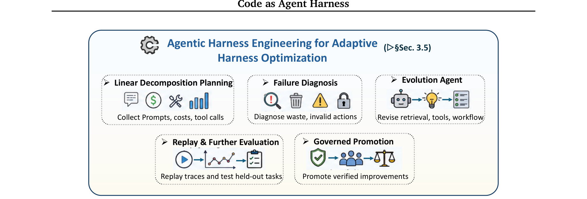

**三个支柱：**

**① Deep Telemetry（深度遥测）——优化底座**
- 浅日志只记最终答案或通过/失败；深遥测记录决策全过程：提示与检索上下文、token 用量与成本、模型/工具延迟、工具参数、权限请求、编辑的文件、沙箱快照、命令输出、测试结果、栈跟踪、lint 警告、分支决策、被拒备选、人工干预、最终任务结果。
- 遥测把 harness 修订从"轶事式调试"变成"比较式诊断"。

**② Evolution Agent（演化智能体）——提出、评估、推广修订的元层智能体**
- 五阶段循环：**观察**轨迹 → **诊断**失败模式（把成本/延迟/无效动作归因到具体 harness 组件）→ **提议**候选修订 → 在保留任务或回放轨迹上**评估** → 只**推广**能提升可靠性/成本/安全且不回归已解问题的变更。

**③ Governed Harness Mutation（受治理的 harness 突变）**
- AHE ≠ 无约束的自我修改。改变权限边界、网络访问、凭据处理、部署行为、人工评审要求的变更，**激活前必须 HITL 批准**。演化智能体本身受 PEV 循环约束——计划一个 harness 突变、在隔离评估环境中执行、通过遥测和回归测试验证、把风险变更升级给人类。

---

## 4. Scaling the Harness：多智能体编排（§4）

### 单智能体的三大局限

1. **上下文窗口限制**：单个智能体装不下整个代码库 + 长交互历史 + 执行轨迹
2. **专业化需求**：一个通用智能体同时做规划/合成/测试/评审/调试不高效
3. **缺乏独立协调与验证通道**：长程执行中智能体无法可靠检测并纠正自己的错误

多智能体的核心原则：**一旦责任分布到专门角色，harness 本身变得更模块化、可检查、可适应。**

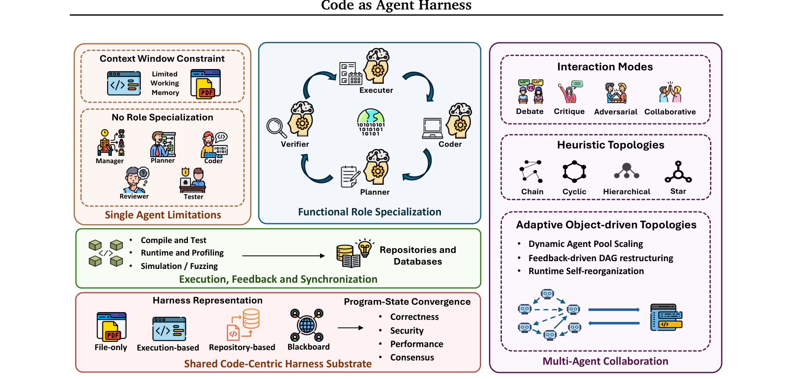

### 4.1 角色专业化与共享程序状态

**角色分类**（代码领域特有的分工）：

| 角色 | 职责 | 例子 |
|------|------|------|
| 代码合成者（Coder） | 生成/修改代码 | Self-Collaboration 的 Coder、AgentCoder 的 Programmer、MetaGPT 的 Engineer |
| 程序理解者（Understand） | 分析代码，产出高层表示 | MAGIS 的 Repository Custodian、HyperAgent 的 Navigator |
| 验证者（Verification） | 生成测试、静态分析、模拟执行 | AgentCoder 的 Test Designer、AutoSafeCoder 的 Static Analyzer/Fuzzing Agent |
| 执行者（Execution） | 直接接口程序运行时（**常是确定性脚本而非 LLM**） | AgentCoder 的 Test Executor（确定性 Python）、MAGE 的 Judge Agent |
| 规划者（Planning） | 分解任务、分配子任务 | MetaGPT 的 Architect/PM、SoA 的 Mother agents（运行时按子函数复杂度动态孵化 Child agents） |
| **元角色**（EvoMAC 独有） | 在 MAS 层面操作：Gradient Agent 归因失败、Updating Agent 改写提示并重构工作流 DAG | EvoMAC |

**四种交互模式**（代码领域以**工件中介通信**为特征，而非纯消息传递）：

| 模式 | 描述 | 例子 |
|------|------|------|
| **Collaborative Synthesis** | 两智能体共同构建组件（结对编程） | PairCoder 的 Navigator–Driver、CodePori |
| **Critique and Repair** | 验证方检查工件产出结构化反馈，合成方修订（**主导模式**） | 几乎所有系统；区分点是批评是 LLM 模拟还是执行接地 |
| **Adversarial Validation** | 用对抗输入破坏代码，而非被动评审 | AutoSafeCoder 的 Fuzzing Agent、MAGE 的模拟不匹配信号 |
| **Reasoning Debate** | 就正确性/规格解读争论后达成共识 | ChatDev 的 communicative de-hallucination、CANDOR 的三评审员多数投票 |

**工作流拓扑**（谁与谁通信、什么顺序、多少次）：

- **预定义启发式拓扑**：链式/瀑布（ChatDev、MetaGPT）、环式/敏捷（AgentCoder、Self-Collaboration）、层级式（MAGIS、SoA 递归孵化）、星型（CANDOR、MetaGPT pub-sub）
- **自适应拓扑**：动态智能体池（SoA、BOAD 用 bandit 发现层级）、反馈驱动 DAG 重构（EvoMAC 的 Gradient/Updating 智能体——**唯一在反馈下结构性修改 harness 拓扑的系统**）、运行时自重组（SEW 用演化算子优化工作流描述、FlowReasoner 为每个问题生成定制 MAS）

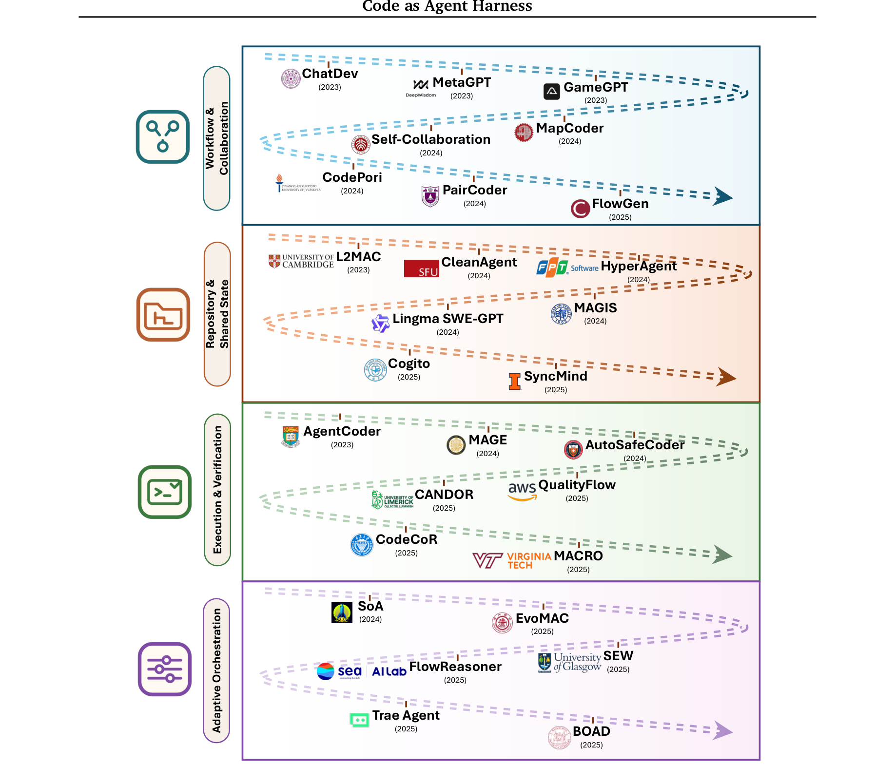

### 4.2 执行反馈与共享 harness 同步

**执行反馈类型**：
- 编译/语法反馈（L2MAC 每次文件写入后 `E(D)` 语法检查作为阻塞条件）
- 测试通过/失败（最常见；QualityFlow 的 **Imagined Execution** 让 LLM 逐步模拟解释器预测测试结果，MBPP 上 98%+ 精度——引发"何时真执行、何时语言模拟足够"的挑衅性问题）
- Fuzzer 崩溃轨迹（AutoSafeCoder：具体失败输入而非通过/失败）
- 安全检查（CWE 静态分析）
- 波形快照（MAGE 的 clock-edge 粒度，文献中最细粒度执行反馈）

**共享 harness 表示的四层形式化程度**（§4.3 的核心立场）：

| 层级 | 表示 | 问题 | 系统 |
|------|------|------|------|
| **Implicit / File-only** | 就是当前代码文件，状态从会话历史隐式重建 | 智能体只能通过最近上下文窗口的窄视角推理共享底座；**状态分歧不可见、不可纠正** | ChatDev、MetaGPT、FlowGen、MapCoder |
| **Repository-based** | 可导航仓库：目录结构、依赖图、调用层次、版本历史 | 支持"在哪改、谁依赖我、如何演化"推理 | MAGIS、HyperAgent、Lingma SWE-GPT、SyncMind |
| **Execution-based** | 状态不是代码长什么样而是代码做什么：编译吗、过哪些测试 | **客观 oracle 信号，不受语言评估的幻觉/偏见影响** | AgentCoder、AutoSafeCoder、QualityFlow、MAGE |
| **Blackboard / Shared-State** | 显式全局可读写数据结构，跨调用持久、可查询 | 最接近形式化 harness 底座 | Self-Collaboration、L2MAC（最原则化）、Cogito 三层记忆 |

**中心缺口（The Central Gap）**：大多数文献停留在 implicit/file-only 类别，缺乏共享 harness 底座的形式化模型。而程序是唯一**可执行**的多智能体工件，能产生客观、非语言的信号——但大多数系统没在架构层面利用这一点。

### 4.3 Harness-State Convergence（收敛判据）

六种收敛模式：

| 模式 | 判据 | 系统 |
|------|------|------|
| **Correctness（test-gated）** | 全部测试通过 | AgentCoder、L2MAC、SyncMind、CANDOR |
| **Security** | 无 CWE 漏洞 + 无 fuzzer 崩溃（**唯一**） | AutoSafeCoder |
| **Performance** | 满足运行时/内存阈值（**唯一**把性能当主收敛判据） | MACRO |
| **Score-based** | 智能体对中间产出打分 | MAGE、CodeCoR、Trae Agent |
| **Consensus** | 多评审员聚合 | CANDOR 多数投票、MAGIS |
| **Implicit** | 固定阶段数/迭代数，无客观质量判据（**最常见 = 最大缺口**） | ChatDev、MetaGPT、Self-Collaboration |

> 洞察：implicit convergence 的普遍存在，是**缺乏形式化共享底座**的直接后果——没有客观的程序状态表示，系统就没有原则化的收敛判据。

### 4.4 Patterns and Trends（模式与趋势）

论文提炼了六条跨系统趋势，几条尤其尖锐：

1. **Implicit harness state 是系统脆弱的根源**，而非可扩展性便利。没有形式化共享底座，智能体无法可靠检测内部理解与真实程序状态的分歧。
2. **代码中介信道不消除协调瓶颈**。文件/API/diff/测试/日志/schema/黑板都是部分信道，各自在保真度、延迟、范围上权衡。核心问题不是"代码是否存在"，而是**哪些工件是权威的、如何压缩、跨信道冲突如何解决**。
3. **执行反馈连接语言推理与形式推理**。执行接地信号不能幻觉。但 Self-Collaboration 和 QualityFlow 显示 LLM 模拟执行可达到 98%+ 的预测精度——执行反馈的价值**不是均匀的**：它擅长发现语言模拟结构上无法想象的边界情况（运行时崩溃、资源耗尽、性能回归），但对很多可修正 bug，模拟推理就够。**成熟 harness 应该两者都集成**：语言推理作为快路径，执行作为需要时的验证 oracle。
4. **两种互补表示**：repository-based（结构：谁调用谁）与 execution-based（行为：运行时状态如何演化）。**没有系统统一两者**——最深的 harness 应该同时支持"哪个组件慢"（需调用图+性能数据）和"这个重构会不会破坏外部 API"（需静态分析+动态测试）。
5. **拓扑复杂度与 harness 状态形式化程度负相关**。L2MAC（最清晰的正式底座）用简单顺序链；隐式状态系统（EvoMAC、SEW）发展出精巧的自适应拓扑来补偿缺失的状态信息。拓扑复杂度部分是**症状**。
6. **上下文管理是隐式共享状态的税**。L2MAC 的 Control Unit、MetaGPT 的 pub-sub、SoA 的池扩展、Cogito 的三层记忆都是同一问题的不同回应。成熟 harness 底座应该用"按需可查询的任务状态表示"统一它们。

---

## 5. 新兴领域与开放问题（§5）

### 5.1 五个应用领域

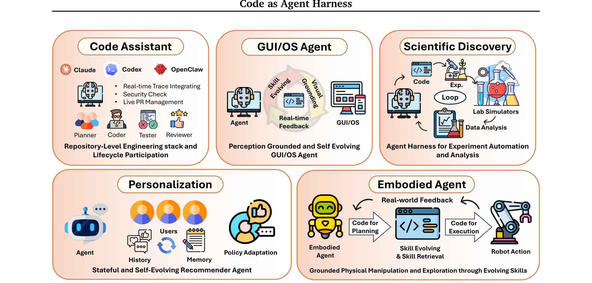

**① Code Assistants（编程助手）**——最清晰的落地领域
- 从内联补全 → 仓库级工作流 → **软件生命周期参与**
- 生产系统：Claude Code、Codex、Copilot coding agents、DeepAgents、OpenHands
- MCP 协议标准化 harness 如何向模型暴露工具/上下文/资源
- 关键趋势：**生产 harness 正在成为下一代模型的训练数据来源**（Cursor Composer 用真实使用轨迹做在线 RL；Codex 系列在长程多轮编码交互上训练）——"智能体"与"智能体周围的 harness"之间的边界正在成为可学习的表面
- 数据点：LingmaAgent（阿里云）自主解决 16.9% 内部 issue、43.3% 需人工干预

**② GUI/OS Agents as a Program World**——GUI 状态可渲染为程序（DOM、可访问性树、HTML 渲染），动作是代码，检查器是程序化验证器；技能随反馈自演化（UI-Voyager）。

**③ Autonomous Embodied Agents**——代码作为可执行策略（SayCan、CaP、Voyager、LYRA）；技能库 + 物理约束接地；模拟器反馈。

**④ Agents for Scientific Discovery as Program Worlds**——假设、实验、分析、实验协议组织为可执行管线；模拟器、数据分析和实验循环都是程序世界；Lab automation。

**⑤ Agent Personalization**——用户状态、偏好记忆、反馈循环、自适应策略、长期画像作为程序状态；个性化 harness 的开放挑战（无可靠用户满意度 oracle、偏好记忆的隐私治理、多利益相关者冲突）。

### 5.2 七个开放问题

| # | 问题 | 核心 |
|---|------|------|
| **5.2.1** | **Harness-Level Evaluation & Oracle Adequacy** | 现有评估测的是"模型+harness"组合，混淆了基座模型能力、harness 质量、工具可靠性、反馈信息量、环境难度。需要 harness 级指标：轨迹效率、验证强度、恢复能力、状态一致性、安全合规、可回放性。**Oracle 充分性**是核心瓶颈——评估器是否捕获了真实任务而非狭窄的可执行代理 |
| **5.2.2** | **Semantic Verification Beyond Executable Feedback** | 执行反馈造成"虚假正确感"——绿色测试不是完整规格。需要**带明确范围的验证栈**：每个验证工件声明它验证什么、不能验证什么、提供什么信心。每个被接受的动作应携带**证据包**（运行的检查、保留的假设、未测试区域、剩余风险） |
| **5.2.3** | **Self-Evolving Harnesses without Regression** | 自动 harness 演化本身不是开放问题；难的是**不过拟合、不削弱安全、不增加成本、不隐藏失败、不回归罕见重要任务**。harness 突变应像对安全关键运行时的代码变更：携带变更契约（改哪个组件、针对哪个失败模式、预测什么改进、必须保留哪些不变量、哪个评估可证伪它、如何回滚） |
| **5.2.4** | **Transactional Shared Program State** | 多智能体同步工件但不同步假设。需要**事务性共享程序状态**：每个动作声明读集、写集、假设、版本依赖、验证器义务、冲突策略。冲突检测应在计划/测试/检索证据/权限/记忆/潜在用户需求层面，而不只是文件 diff 层面。语义级冲突解决（语义合并、回滚、依赖感知锁、信念状态协调） |
| **5.2.5** | **HITL Safety & Accountability as Harness State** | 安全不能委托给基座模型或只编码为自然语言指令。harness 是**模型意图与现实后果之间的安全治理器**：按风险分类动作、执行权限层、拒绝违反硬约束的动作、对不可逆/外部影响转移要求人工批准。**HITL 控制应成为持久 harness 状态**：每次批准/拒绝/政策例外/评审纠正都更新权限规则、升级策略、验证标准、未来记忆检索 |
| **5.2.6** | **Multimodal Code-Harness Systems** | GUI/具身/科学领域的临界状态是多模态的。三大挑战：**多模态上下文压缩**（原始帧存为不可变证据，对象/区域注释做结构化中间状态，紧凑摘要供检索）；**视觉接地契约**（每个动作携带接地参考：边界框、对象 ID、UI 元素、帧索引）；**多模态验证栈**（视觉状态检查、对象追踪、OCR/UI 树检查、模拟器状态、物理传感器、任务特定验证器，每个信号暴露范围与不确定性） |
| **5.2.7** | **Toward a Science of Harness Engineering** | 研究对象的中心从"模型或生成程序"转向"完整闭环系统"。最有前景的系统应结合四个属性：**可执行、可检查、有状态、受治理（governed）** |

---

## 6. 与 What makes a harness 的呼应

这篇论文和之前读的 [2606.10106](reading_notes_what_makes_a_harness.md) 是同一主题的两面：

| 维度 | What makes a harness（定义论文） | Code as Agent Harness（系统综述） |
|------|------|------|
| 任务 | 给 harness 下**构成性定义**（T1–T4 准入测试） | 梳理 harness **工程实践**（接口/机制/扩展） |
| 方法 | 谱系学 + 4 个必要充分条件 + 边界区分 | 三层 taxonomy + 方法分类 + 立场 |
| 代码的角色 | 工具接口（T2）之一，不单列 | **代码就是核心介质**——推理、行动、环境的统一接口 |
| 控制观 | T4 控制机制（护栏、验证、确定性动作） | PEV 循环（cybernetic governor）+ AHE 自我演化 |
| 多智能体 | 明确说"多智能体不是必要的" | 多智能体是 harness 扩展的主战场 |
| 共同结论 | 先知道"harness 是什么"，才能测"harness 值多少" | 需要 harness 级评估，隔离模型变量的贡献 |

两篇互补：定义论文给判据（**是不是** harness），系统综述给工程图景（**怎么做** harness）。

---

## 7. 全文结构速览

```
§1  Introduction — 代码从"产物"到"运行介质"；三类元素（模型/系统基础设施/智能体代码工件）
§2  Harness Interface — 代码连接推理(2.1)/行动(2.2)/环境建模(2.3)
§3  Harness Mechanisms — 规划(3.1)/记忆(3.2)/工具(3.3)/PEV控制(3.4)/AHE自优化(3.5)
§4  Scaling the Harness — 多智能体角色/交互/拓扑 → 共享代码中心底座立场(4.3)
§5  Emerging Fields & Open Problems — 5个应用领域 + 7个开放问题
§5.2.7 Conclusion 四属性：可执行 / 可检查 / 有状态 / 受治理
```
