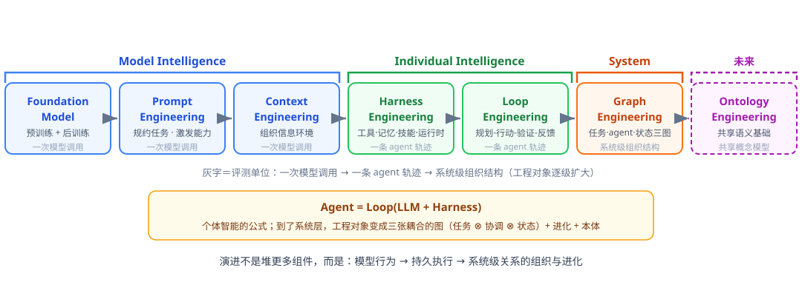
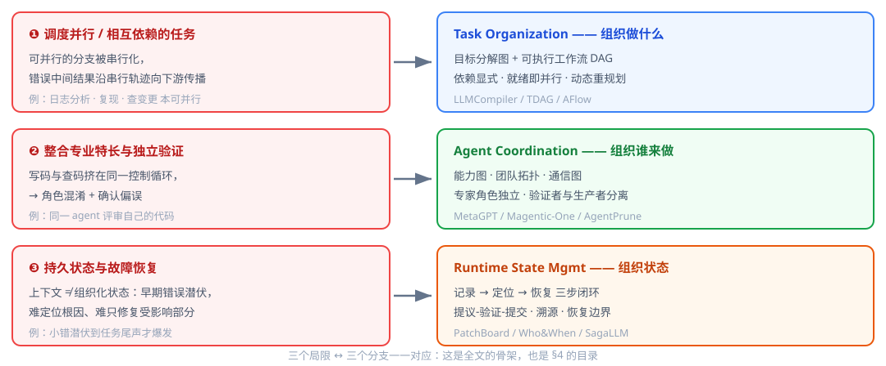
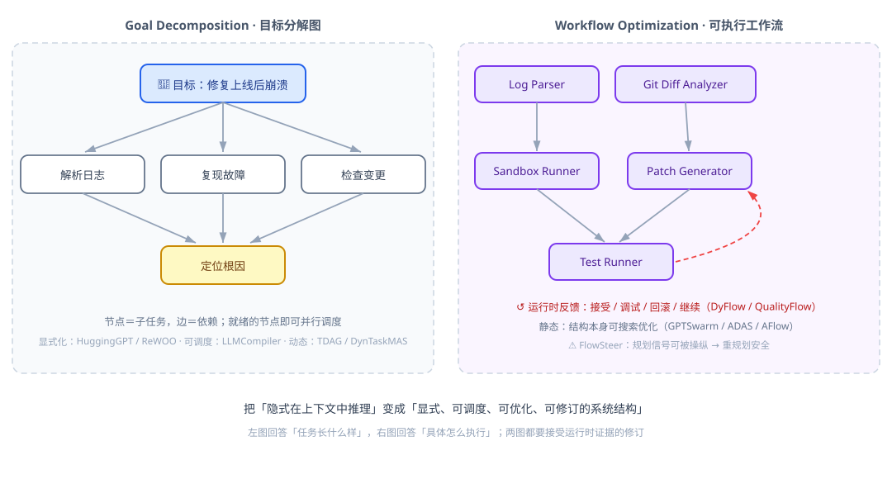
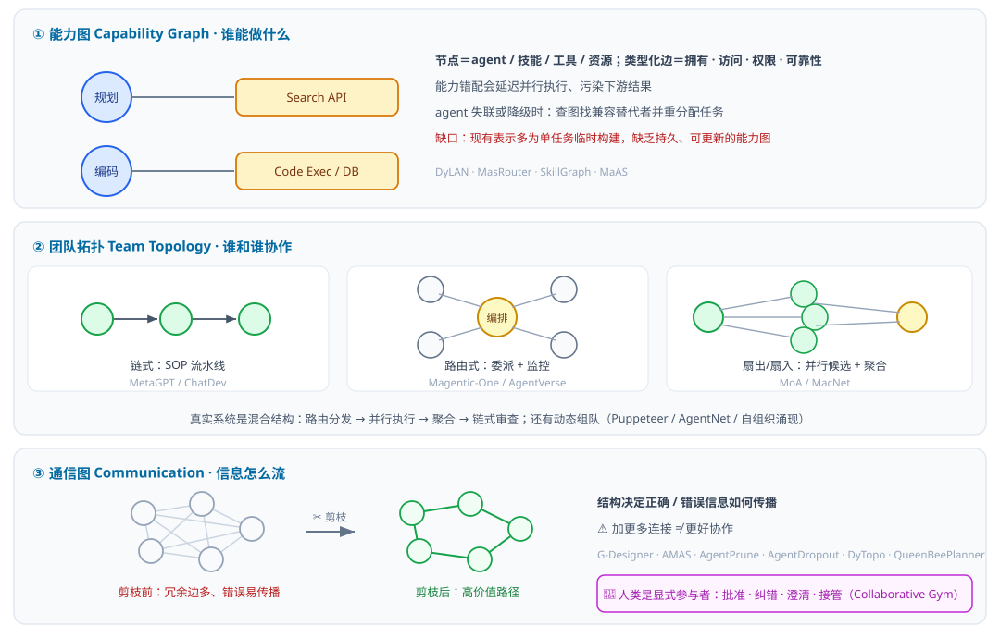
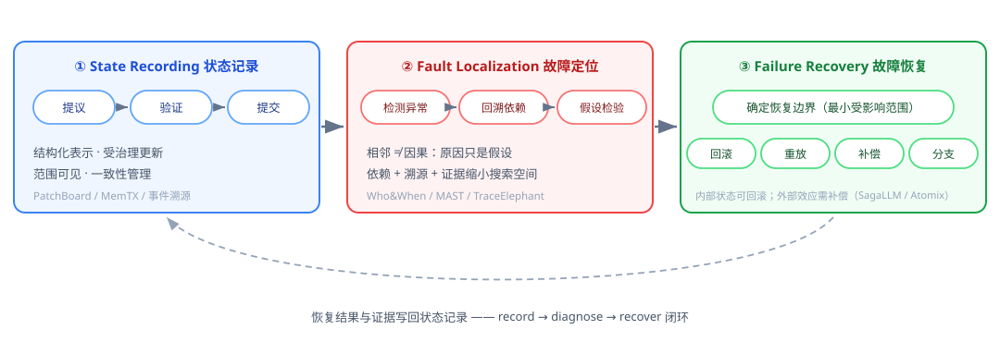
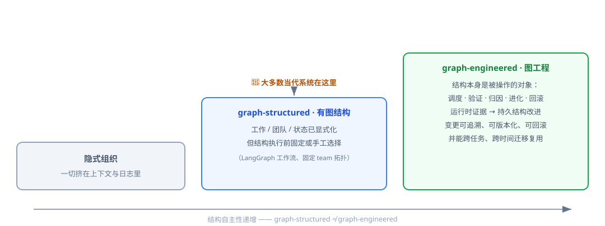

# 阅读笔记：Graph Engineering in the Era of LLM Agents

> **论文**：Graph Engineering in the Era of LLM Agents: From Individual Intelligence to System Intelligence
> **arXiv**：[2608.21156v2](https://arxiv.org/abs/2608.21156)（2026-08-21 v1，2026-08-26 v2）
> **作者**：Yuyuan Feng, Zhishang Xiang 等 35 人（吉林大学、HKUST、浙大、Purdue 等）
> **配套资源**：https://github.com/DEEP-JLU/Awesome-Graph-Engineering
>
> **图目录**：图 1　范式演进链 (§0) · 图 2　三局限→三分支映射 (§3.5) · 图 3　Task Org (§4.2) · 图 4　Agent Coord (§4.3) · 图 5　State Mgmt 闭环 (§4.4) · 图 6　成熟度阶梯 (§9.7)
> **性质**：60+ 页大型综述（约 500+ 引用），提出范式框架并系统梳理文献

---

**目录**：0 一页总览 · 1 Introduction · 2 形式化定义 · 3 范式回顾（Prompt/Context/Harness/Loop + 三局限） · 4 核心章 Graph Engineering（三图 + 进化） · 5 Ontology Engineering · 6 五大开放挑战 · 7 评测 · 8 开源生态 · 9 应用 · 10 Conclusion · 11 附录 · 12 个人点评

**阅读路线**：只关心核心 → 读 0、3.5、4、9.7；关心工程落地 → 读 4.4、7、8；找研究机会 → 读 5、6。

## 0. 一页总览

> **整篇论文一句话**：LLM Agent 的工程化经历了 **Model → Individual → System** 三级跃迁；当前范式正从「造更强的 agent」转向「**组织任务/行动者/状态之间的关系**」，这个组织基底就是 **Graph Engineering**。

这篇论文把 LLM Agent 的工程化演进组织成一条清晰的范式链：

{: .align-center}

*图 1 · 一页纵览：范式演进链——每个范式干预不同的工程对象，评测单位逐级扩大*


**核心论点**（原文反复强调）：System Intelligence ≠ 堆更多 agent。一个拥有多个强 agent 的系统，如果没有清晰的责任边界、协调机制和一致的状态管理，依然不是智能系统。核心挑战从"造更强的 agent"转变为"**如何组织任务、行动者与状态之间的关系**"。

**提出的新范式**：Graph Engineering——以图结构为核心基底，把任务、agent、运行时状态之间的关系**显式化、可调度、可验证、可进化**。它是 Prompt → Context → Harness → Loop Engineering 之后第五个工程范式。

---

## 1. Introduction — 问题的提出

> **本章怎么读**：先在 §1.1 建立「三级智能」心智模型，再看 §1.2 三个组织问题——它们会贯穿全文，§3.5/§4/§9.7 会反复回到这里。

### 1.1 三级智能的递进

**Model Intelligence（模型智能）**
- 定义：单个模型在给定上下文内，利用其知识和推理能力解决问题的能力
- 两条形成路径：
  - 参数级：Pre-training + Post-training 把知识和推理能力编码进权重
  - 推理时：Prompt Engineering（规约任务、约束行为）+ Context Engineering（组织和提供任务相关信息）
- 局限：被"单次自包含推理过程"锁死——不能持久维护状态、不能执行外部操作、不能持续适应反馈

**Individual Intelligence（个体智能）**
- 论文给出的标志性公式：**Agent = Loop(LLM + Harness)**
- 分工：
  - **Harness Engineering** 决定 agent *能访问什么*：外部知识、工具、记忆、技能、执行环境
  - **Loop Engineering** 决定 agent *怎么持续使用*：plan → act → observe → verify → adapt 的迭代循环
- 两者合起来把"生成响应的模型"变成"目标导向、能与环境持续交互的自主实体"

**System Intelligence（系统智能）**
- 定义：智能系统分解和组织复杂目标、向异构计算 agent 分配职责、协调相互依赖的执行、并在任务全生命周期维护系统级状态的能力
- **关键反直觉论点**：加 agent 不等于系统智能。多 agent 系统可能同时具备多个强 agent，却缺乏有效的工作组织、清晰的责任边界、协调机制和一致的状态管理
- 为什么要"组织"而不是"增强"？——论文的架构性诊断：

> 当任务在单个 agent 循环内执行时，异构过程被迫挤进同一上下文和一条中心化的执行轨迹。后果：①任务相关信息竞争有限的上下文容量；②有依赖的操作被串行控制流中介；③不同任务/agent 的状态被迫混进单一共享上下文，无法隔离并行工作、无法在共享结果上同步、无法独立恢复部分进度。

### 1.2 Graph Engineering 的三个组织问题

图工程从系统视角回答三个根本问题（这三个问题贯穿全文）：

| 问题 | 图的角色 |
|---|---|
| **Task Organization**：全局目标如何分解为可执行单元？单元间的依赖、顺序、并发、验证约束如何表示？ | 目标分解图、依赖 DAG、可执行工作流图 |
| **Agent Coordination**：工作单元如何映射到异构 agent？通信、委托、同步、结果整合如何结构化？ | 能力图、团队拓扑图、通信图 |
| **Runtime State Management**：演化的执行状态如何表示和维护？如何跟踪进度、调和并发更新、保留溯源、隔离故障、从偏差中恢复？ | 状态记录、故障归因图、恢复边界 |

关键递进：图从**静态表示**变成**操作机制**——不是画出来看的，是用来调度工作、绑定能力、追溯执行、定位故障、驱动进化的。

---

## 2. Preliminaries — 形式化定义

### 2.1 Individual Agent

```
A_i = Loop(F_i, H_i; st_i)
```
- `F_i` Foundation Model：认知核心（语言理解、推理、规划、生成）
- `H_i` Agent Harness：感知与上下文构造、记忆与知识访问、工具调用、可复用技能、运行时治理的接口集合
- `st_i` 运行时状态：t 时刻 agent i 的本地状态
- 分工公式化：**F 决定内在认知能力上限，H 决定可访问的资源和行动空间，Loop 决定这些能力如何被持续调用**

### 2.2 Agent System

```
S_t = (A_t, R_t, E_t, Π_t, x_t)
```
五个要素：
- **Agent Team A_t**：一群 Individual Agent，各有各的 F、H、Loop、本地状态，可承担不同角色
- **Shared Resources R_t**：多 agent 共享的工具、模型服务、记忆、知识库、验证器、人类支持（各自通过自己的 Harness 访问）
- **Environment E_t**：外部环境，提供观测和反馈，并随 agent 行动演化
- **Coordination Mechanisms Π_t**：任务分配、信息交换、结果整合、冲突解决、故障处理的机制
- **System State x_t**：**系统级**运行时信息——任务进度、共享结果、agent 可用性、资源状态、环境变化、故障记录。这是和个体本地状态 `st_i` 的本质区别

论文强调：系统行为不仅取决于 agent 能力，还取决于**共享资源如何被使用、agent 如何协调、系统状态如何演化**——这三件事正是后文图工程的对象。

---

## 3. From Model Intelligence to Individual Intelligence（范式回顾篇）

> **本章一句话**：前四个范式各自把「一次模型调用 / 一条 agent 轨迹」工程化；§3.5 的三个局限正是单轨迹范式撞到的墙。

这一章是给 Graph Engineering 铺路的文献综述，覆盖前四个工程范式。§3.3（Harness）、§3.4（Loop）、§3.5（三局限）是与本文核心论点衔接最紧的部分。

### 3.1 Foundation Models：建立 Model Intelligence

> 这是为不熟悉 pre/post-training 的读者准备的**快速背景**。已经熟悉可以跳过到 §3.3。

参数级能力开发，两个阶段：

**Pre-training**：训练算力/数据/参数**均衡**扩展（Chinchilla scaling laws）；代表谱系 GPT-3 → LLaMA → DeepSeek-V3；MoE 线（Mixtral/DeepSeekMoE）在算力约束下扩展容量；数据质量（FineWeb、DataComp-LM）越来越成为瓶颈。

**Post-training** 三个方向：
1. **SFT**（指令微调）：FLAN Collection 大规模多样化指令集
2. **偏好对齐**：RLHF（InstructGPT）→ RLAIF（Constitutional AI）→ DPO（直接偏好学习）
3. **能力型 RL**（近年重心）：GRPO（DeepSeekMath）→ R1 涌现长推理链 → **Agentic RL**（Search-R1、ReTool、WebRL、RAGEN、Agent Lightning）

> 现代后训练管线 = 演示 + 偏好信号 + 可验证奖励 + 交互反馈的组合。

### 3.2 Prompt & Context Engineering：激发与条件化 Model Intelligence

不修改参数，通过控制信号和信息环境适配模型能力。**Prompt 管「做什么、怎么做」，Context 管「依据什么信息做」。**

**Prompt Engineering 三个方向**：
- 任务规约：指令、约束、输出格式
- 推理组织：CoT → Self-Consistency → Least-to-Most → Tree/Graph of Thoughts → Self-Refine
- 自动优化：AutoPrompt → APE → OPRO → Promptbreeder/TextGrad → **GEPA**（用执行轨迹 + 自然语言反思进化 prompt，可超过 RL）

**Context Engineering 三个环节**：
- 获取：DPR → RAG → 检索与推理耦合（HyDE、IRCoT、Self-RAG/CoRAG）→ 检索本身 agentic 化
- 加工：排序（RankRAG）、压缩（LLMLingua、RECOMP）、剪枝（Provence）、重构（GraphRAG）；**Lost in the Middle 的教训：长上下文 ≠ 有效利用**
- 管理：MemGPT 分层 → HiAgent/ACON/ACE/AdaCoM → **Context as a Tool**（上下文维护变成显式 agent 动作）

### 3.3 Harness Engineering：编排 Agent 能力（⭐ 与本文核心论点衔接）

核心观察：**Model Intelligence 的操作单元是"一次模型调用"**，而单次调用无法维持持久资源、执行外部操作、支撑持续交互。Harness 提供跨调用持久的可执行能力；Loop 组织它们的反复调用。

论文把 harness 定义为"**包裹模型的运行时层**"——连接记忆、工具、技能、执行环境、状态、验证等支撑机制。四个子领域：

| 子领域 | 核心问题 | 代表谱系（节选） | 趋势 |
|---|---|---|---|
| Tool Integration | agent 如何调用外部能力 | Toolformer → ToolLLM/Gorilla → MCP → CodeAct/SWE-agent/OpenHands | 从函数调用到丰富的 agent-计算机交互 |
| Memory Management | 如何持久组织经验 | MemGPT → Mem0/Zep → AgeMem/MAGE/Text2Mem | 从被动存储到主动治理、状态化 |
| Skill Composition | 如何复用程序性能力 | Voyager → SkillX/SkillOpt → SkillOps/SkillZip | 从单技能获取到技能生态的维护演化 |
| Runtime Orchestration | harness 本身如何工程化 | Anthropic long-running harness、Harness-Bench、Meta-Harness | harness 成为显式优化对象 |

**① Tool Integration**
- 谱系：MRKL/TALM/Toolformer（早期工具连接）→ API-Bank/ToolLLM/Gorilla（大规模 API 生态）→ MCP（标准化接口）→ CodeAct/SWE-agent/OpenHands（执行扩展到代码、文件、shell、浏览器、计算环境）
- 趋势：从"函数调用"走向"丰富的 agent-计算机交互"

**② Memory Management**
- 早期：Generative Agents、Memory Bank、MemGPT（持久长期记忆）
- 组织化：A-MEM、Mem0、Zep、MemoryOS（记忆的组织、固化、复用）
- 近期范式转变——**从被动存储到主动治理**：
  - AgeMem：把短/长期记忆操作（存、取、更新、摘要、丢弃）集成进 agent 策略，由模型决策
  - GAM、HeLa-Mem：图结构组织演化经验
  - MAGE：把记忆当作长时程任务的**执行状态管理**，支持状态重建与恢复
  - Text2Mem：类型化、可执行的记忆操作
  - 还有记忆合并效率、文件系统持久记忆、记忆增删可靠性等方向

**③ Skill Composition**
- 起点：Voyager 可执行技能库、Agent Workflow Memory（复用动作工作流）、Agent Skills（指令+脚本+资源打包）
- 技能构建/组合/进化：SAGE、HASP、SkillComposer、Skill-Use
- 技能库本身成为**自适应工程对象**：
  - SkillX：从轨迹自动构建分层技能知识库
  - SkillOpt：用执行反馈系统性优化技能工件
  - Anything2Skill：把异构外部知识编译成可复用程序性技能
  - SkillOps、SkillWiki：**库级**的维护、溯源、治理、生命周期
  - SkillZip：降低大型技能工件的运行时和维护成本
- 趋势：从"获取单个可复用程序"到"构建、优化、维护、演化**持久技能生态**"

**④ Runtime Orchestration**
- Harness 本身成为显式研究对象：Anthropic long-running harness、AI Harness Engineering、What Makes a Harness a Harness、Code as Agent Harness、Harness-Bench
- 与 Context Engineering 的边界：**Context Engineering 决定一次模型调用看到什么信息；Harness Engineering 维护跨调用持久的资源、接口和执行环境**
- 治理与安全：ToolEmu、ToolSandbox、AgentDojo、CaMeL、MCP Security Bench（故障、安全风险、控制机制）；harness 配置、契约式验证
- 落地：Codex、Claude Code、Gemini CLI、Copilot coding agent
- **Harness 作为优化目标**（近期热点）：Meta-Harness、Self-Harness、HarnessFix、HARBOR、Retrospective Harness Optimization（搜索、适应、诊断、修复、反馈驱动改进）；HarnessHandbook 关注复杂 harness 的可理解性和可维护性

### 3.4 Loop Engineering：使能迭代执行（⭐ 与本文核心论点衔接）

**定义**：Loop Engineering 是对一个**有界的、有状态的、反馈驱动的过程**的工程——协调 agent 运行，直到目标达成有充分证据支撑，或继续执行不再有正当性。

> 关键区分：Loop 的本质属性**不是重复调用模型**，而是**持续用执行结果控制后续任务轨迹**。

**三个耦合维度**：

**① Loop Architecture（控制结构）**
- 组成：初始化（目标 + 验收标准 + 终止条件）→ 控制器维护任务操作状态 → 规划/分解机制 → 进度评估（用验证证据判断是否产生有意义的状态变化）→ 失败响应（改计划/换能力/恢复状态/上报/终止）
- 代表：
  - **Research Loop**：任务契约、证据对象、claim ledger、closeout 条件作为持久控制状态——只有证据要求满足才能推进
  - **Proof-or-Stop**：只有新鲜且机械可验证的证据满足 gate 才允许生命周期转换
  - 无限 agent 循环分析：进度检查、资源限制、显式停止条件是防止无界反馈路径的必要条件
- 要点：**Loop 架构不仅决定执行如何继续，更决定"继续"何时仍然正当**

**② Interaction Paradigm（迭代间信息交换）**
- 每步交换什么：当前目标、任务状态、未解决需求、可用操作 → 模型返回决策/行动意图 → harness 返回执行观测、验证结果、错误条件
- 必须保持足够的连续性，使后续决策能相对先前的行动和结果来解释
- **Sovereign Agentic Loops**：把模型输出形式化为结构化意图，执行前对照系统状态和策略检查
- 诊断/监督反馈：AgentRx 把执行轨迹变成验证记录以定位关键失败步骤；Supervising Ralph Wiggum 在迭代精炼停滞时引入元认知监督

**③ Environment Feedback（外部后果成为证据）**
- Agent 环境建模为动力系统：动作作用于当前状态 → 状态转移 → 返回观测/奖励 → 下一决策以更新后的交互历史为条件 → **闭环**
- 反馈不只包括终局成功信号，还包括中间状态变化、执行轨迹、错误、奖励、验证器判定
- **可靠性挑战**：观测可能不完整、延迟、不确定、过时，或来自与目标系统有偏差的环境。可靠推进需要：可采纳的证据 + 对环境正确性/保真度的信心
- 对策：Proof-or-Stop 把接受的证据绑定到当前源状态；Sovereign Agentic Loops 在真实执行前对照真实系统状态检查提议动作

### 3.5 Limitations of Individual Intelligence（⭐⭐ 全文转折点）

个体智能围绕单一 agent 和它的执行循环组织，面对复杂真实任务有**三个根本局限**。先看图 2 再读文字：

**❶ 调度并行且相互依赖的任务**
- 真实任务含相互依赖或可并行的子任务，单 agent 循环倾向于把它们压缩成串行执行轨迹
- 后果：调度隐式化、浪费并行效率、故障定位困难
- 论文例子：软件故障诊断中，日志分析、故障复现、代码检查本可作为相对独立的分支**并行**进行，修复和测试依赖它们的结果；单 agent 却把这些分支串行化在一条循环里——不仅丢掉并行效率，错误的中间结果还会传播到后续步骤，使出错阶段难以定位

**❷ 整合专业化专长与独立验证**
- 单 agent 即便调用专家模型或工具，这些能力仍在**同一个控制循环**内协调，而非组织成稳定、独立的角色
- 后果：角色混淆 + 确认偏误。论文例子：同一个 agent 既写代码又评代码时，会把自己"认为代码正确"的判断误当作"代码确实正确"的证据——即使 prompt 里给它分了不同角色

**❸ 维护持久状态与故障恢复**
- 个体的上下文不是有组织、持久的状态。错误一旦进入执行循环，会被带到后续步骤，难以只修复受影响的部分，也难以做可追溯、可检验的恢复
- 论文例子：长时程网页/编码任务中，早期的小错误可能潜伏到任务接近尾声才爆发，此时几乎不可能确定和定位错误最初出现的位置

> **这三个局限 = Graph Engineering 三个分支（Task Org / Agent Coord / Runtime State）的直接动机**。一一对应。先看图，后读文：

{: .align-center}

*图 2 · 个体智能的三个根本局限 → Graph Engineering 三个分支（含代表系统）*


---

## 4. Graph Engineering: From Individual Intelligence to System Intelligence（核心章）

> **本章一句话**：三张耦合的图（做什么 / 谁来做 / 状态如何）+ 系统进化，把"关系"本身变成工程对象。图不是画出来看的，是用来**调度、验证、归因、回滚、进化**的。

### 4.1 Overview

- System Intelligence 不来自 agent 的简单聚合，而取决于**任务、组件、运行时状态之间的关系是否被显式表示、约束和优化**
- 为什么是图？三个理由：
  1. 图通过目标分解、依赖建模、工作流细化来**组织任务**——把复杂目标变成可调度、可执行的操作
  2. 图通过操作拓扑和通信模式来**协调组件**——异构组件有效协作
  3. 图通过记录事件、依赖、状态转移来**支撑运行时状态管理**——把散落在上下文和日志里的操作信息变成可审计、可恢复的系统状态
- 定义：**Graph Engineering = 以图结构为核心基底，外化任务、组件、运行时状态之间关系的、以结构为中心的系统智能工程基础**，支撑系统级的组织、协调、监控、恢复和优化

### 4.2 Task Organization: Structuring What to Do（做什么）

**问题**：把高层目标/任务流变成有组织的子任务和操作集合。子目标可能相互依赖、有并行分支、需要验证步骤和动态重规划——只靠上下文难以维护清晰的全局任务结构。

| 分支 | 节点 / 边 | 演进主线 | 代表 |
|---|---|---|---|
| Goal Decomposition | 子任务 / 先序·数据·逻辑依赖 | 显式化 → 可调度化 → 动态化 | HuggingGPT、ReWOO、LLMCompiler、TDAG |
| Workflow Optimization | 具体算子 / 调度·验证依赖 | 静态搜索优化 → 运行时动态适应 | GPTSwarm、ADAS、AFlow；DyFlow、QualityFlow |

{: .align-center}

*图 3 · Task Organization：目标分解（左）→ 可执行工作流（右，带运行时反馈回路）*


**① Goal Decomposition（目标分解图）**

把目标表示为子目标和依赖的图：节点 = 子任务/中间目标，边 = 先序、数据或逻辑关系。

演进三代：
1. **显式化**（让分解和依赖从隐式变显式）：
   - HuggingGPT：把多模态请求分解为子任务并路由给专家模型，用依赖关系定执行顺序
   - ReWOO：用变量引用把推理与工具执行/观测解耦，让计划中工具调用间的依赖显式化
2. **可调度化**（依赖图直接可执行）：
   - LLMCompiler：把 function-calling 计划编译成**数据流 DAG**，上游依赖就绪的节点立即并行派发
   - Plan-over-Graph：直接研究任务图上的规划，生成依赖约束下可并行的 agent 调度
3. **动态化**（图不再假设执行前固定）：
   - TDAG、Flow：任务分解可根据中间结果动态细化；多 agent 场景下，演化的任务图还能驱动 agent 生成、任务分配和并行协作（DynTaskMAS）

**② Workflow Optimization（工作流优化图）**

子目标已知后，还要变成具体计算操作：LLM 调用、专家 agent、检索模块、工具、记忆操作、聚合器、验证器。图上：节点 = 具体算子，边 = 调度/协调/验证所需的依赖。

- **静态优化**（把工作流结构本身变成搜索对象）：
  - GPTSwarm：语言-agent 系统表示为计算图，同时优化节点行为和边连接
  - ADAS：通过搜索代码定义的工作流自动设计 agentic 系统
  - AFlow：**LLM 引导的、对可执行工作流代码的搜索**——代表工作
  - 细化分支：A2Flow（从演示学习抽象算子，节点语义和拓扑共同演化）、MermaidFlow（Mermaid 中间表示 + 安全约束进化编程，提升可读性/有效性/可控性）、VFlow（把领域验证器纳入工作流搜索环——语法检查、功能正确性、可合成性、硬件约束）
- **动态适应**（运行时反馈改图）：
  - DyFlow：不预设固定工作流，用中间反馈动态生成和调整后续算子子图
  - EvoFlow：推理时维护多个工作流候选，把它们当作**相互竞争的可执行假设**来进化
  - QualityFlow：质量检查作为程序合成的控制机制——根据中间质量信号动态决定接受/调试/澄清/回滚/继续
  - FlowSteer：⚠️ 工作流结构可以在执行循环内被修改——也意味着**被操纵的规划信号可以诱导重规划走向不良路径**（安全隐忧）

### 4.3 Agent Coordination: Structuring Who Works（谁来做）

**问题**：把异构 agent 协调成一个连贯系统，而不是在一个控制循环里调用它们。三张图：

| 图 | 节点 / 边 | 回答的问题 | 代表 |
|---|---|---|---|
| 能力图 | agent、技能、工具、资源 / 类型化能力边 | 谁能做什么？坏了找谁顶替？ | DyLAN、MasRouter、SkillGraph |
| 团队拓扑 | agent、角色 / 分配·委托·监督·验证 | 谁和谁协作、什么结构？ | MetaGPT、Magentic-One、MoA |
| 通信图 | agent、人类 / 激活的信息边 | 信息怎么流？哪些路径值得维护？ | G-Designer、AgentPrune、DyTopo |

{: .align-center}

*图 4 · Agent Coordination 的三张图：能力图 → 团队拓扑 → 通信图（可生成、可剪枝、随反馈演化）*


**① Agent Capability Modeling（能力图）**
- 图结构：节点 = agent、技能、工具、模型、资源；**类型化边** = 能力拥有、资源访问、权限、可靠性
- 为什么必须显式：任务阶段相互依赖，一个阶段的能力错配会延迟并行执行、污染下游结果；agent 失去某资源时，系统要能查图找到兼容替代者并重新分配任务
- 方法谱系：
  - 从行为推断能力：DyLAN（估计候选 agent 贡献并保留有用者）、Agent-Oriented Planning（分配可解且不冗余的子任务）、MasRouter（按任务难度和成本选择协作模式/角色/底层模型）——但能力只编码在分数或路由策略里，不是显式可复用的关系
  - 用配置表示能力：AutoAgents（为任务创建专门角色和协作计划）、EvoAgent（进化生成多样专家）、AOrchestra（组合指令/上下文/工具/模型实例化任务专用 agent）、CaptainAgent（交互中新需求出现时招募重组专家）
  - 图化组织：SkillGraph（显式表示技能并指导通信拓扑构建）、MaAS（agentic supernet 中表示 agent 和算子，搜索合适的多 agent 结构）
- **论文指出的缺口**：现有表示多是为特定任务临时构建的；需要**持久、可更新的图表示**，让 agent 专长、可靠性、资源、权限的知识可跨任务查询、修订和复用

**② Agent Team Organization（团队拓扑图）**
- 图结构：节点 = agent/角色/任务；类型化边 = 分配、委托、监督、验证、汇报
- 四种结构谱系：
  - **链式**（阶段依赖清晰）：MetaGPT（SOP 治理的流水线）、ChatDev（设计-编码-测试的顺序聊天链）——执行顺序和责任边界显式，但路径基本执行前固定
  - **路由式**（子任务需要不同专长）：Magentic-One（编排器规划、委派、监控、失败后重规划）、WorkTeam（supervisor 按意图调用专门 orchestrator 和 filler）、AgentVerse（按任务需求组队）——支持专门化分工，但中心化设计给路由 agent 巨大的规划协调负担
  - **扇出/扇入**（需要并行或多样化候选）：Mixture-of-Agents（分层：下层并行生成、上层整合）、MacNet（DAG 泛化分支与聚合，多执行路径在下游节点汇聚）——增加并行度和推理多样性，代价是通信/计算/聚合开销
  - **动态结构**：Puppeteer（按当前任务状态动态选择和排序 agent）、AgentNet（去中心化，agent 按本地专长调整连接和路由）、SwarmAgentic（生成候选系统时联合优化 agent 功能和协作模式）、自组织 agent 研究（无需预定义分配即可涌现角色专门化和浅层级）
- 要点：真实系统需要**混合结构**——协调器路由子任务给专家、分发选中的任务并行执行、聚合输出、再经链式审查。图必须同时表达稳定的责任关系和任务依赖的结构变化

**③ Multi-agent Communication（通信图）**
- 团队组织定义相对稳定的角色职责；通信建模捕捉**执行中涌现的信息流和反馈关系**：动态图，节点 = agent 或人类，激活的边指定谁通信、交换什么、如何影响后续行动
- 通信不只是传结果，更是**检测和纠正错误**：不同 agent 生成、评估、修改输出，把问题返回给相关执行阶段。MAgICoRe：模型自生成的反馈 + 外部分步奖励信号定位推理错误，通过多 agent 交互迭代精炼候选解——形成生成-评估-修正的反馈环
- ⚠️ 关键发现：通信结构决定正确/错误信息如何传播——**加更多连接不一定改善协作**
- 结构构建与优化：
  - G-Designer：综合考虑候选 agent、性能、通信成本、结构鲁棒性，生成任务特定的通信图
  - AMAS：按当前输入选择交互结构（不同任务不同通信模式）
  - **剪枝类**：AgentPrune（从时空消息图中消除冗余连接）、AgentDropout（跨交互轮动态移除低贡献 agent 及其通信边）——不仅要决定"信息能否传输"，还要决定"**哪些信息路径值得维护**"
- 反馈驱动的通信适应：DyTopo（每轮按"一个 agent 需要的信息 ↔ 其他 agent 能提供的信息"匹配重建稀疏通信边）、CARD（通信结构随模型能力、工具可用性、算力等环境信号变化）、QueenBeePlanner（从执行轨迹和评估结果中提取通信设计知识，变成可在后续任务复用和修订的结构规则）
- **人在环中**：隐式偏好、专门知识、高风险动作需要人类澄清需求、纠错、审查、批准或接管。Collaborative Gym 支持人-agent-环境间异步双向交互。图中人类是**显式参与者**：边表示协助请求、反馈、批准、上报——人不再只是最终结果的评估者

### 4.4 Runtime State Management: Structuring How the System Operates（⭐⭐ 全文最扎实的一节）

**问题**：Task Org 和 Agent Coordination 规定"应该发生什么、谁来做"，但**不记录"实际发生了什么"**。执行分布在相互依赖的任务和专门 agent 上，伴随部分观测和外部效应。没有可靠的状态账本：agent 基于不一致的视图行动、故障难以定位、有效进度难以恢复。

三个互补能力：

{: .align-center}

*图 5 · Runtime State Management 三步闭环：记录（提议-验证-提交）→ 定位（假设检验式归因）→ 恢复（回滚/重放/补偿/分支）*


**① State Recording（实际发生了什么？）**

可靠状态的四个条件 + 代表工作：

| 条件 | 含义 | 代表系统 |
|---|---|---|
| 结构化表示 | 从私有的对话上下文转向显式可追溯的运行时状态 | Magentic-One（orchestrator 维护 Task Ledger + Progress Ledger）；Graph of States（结构化信念状态 + 因果图/状态机约束转移） |
| 受治理的更新 | **提议→验证→提交**的显式边界，隔离"观测/提议的变更"与"权威状态" | PatchBoard（提交前对 agent 生成的补丁做 schema/角色权限/运行时不变量校验）；MemTX（区分临时写入与事务性信念提交，带显式溯源和修复语义） |
| 范围可见性 | 共享状态可以协调，而不要求全局可见 | Collaborative Memory（身份和时间范围的投影） |
| 一致性管理 | 并发写入者的状态生成、丢失更新、因果序违反 → 需要隔离、因果排序、冲突解决 | 并发异常防护研究；事件溯源设计（append-only 历史，支持状态重建、回放、分支）——The Log is the Agent |

**② Fault Localization（哪里出了问题？）**

- 难点：长时程系统中，局部错误沿依赖任务和 agent 传播，**可见的故障出现在原始偏差之后的若干步**。运行时状态通过保存依赖、溯源、证据来支撑归因
- **方法论立场：把故障原因当作假设，不假设时间或结构相邻性证明因果**
  - Graph of States：显式的假设-证据依赖约束从证据到可能原因的推理，支持检查早期状态和证据不足时回溯
  - MAGE：执行表示为层次状态树中的路径，可识别错误分支和附近的有效决策边界
  - **Who&When**：把失败同时归因到负责任的 agent 和导致失败的步骤；**MAST**：区分系统设计、agent 间协调、任务验证三类失败；**TraceElephant**：归因需要执行轨迹、中间上下文和完整输入，而不只是最终输出
  - TDAD：通过显式的代码-测试依赖把代码变更连到受影响的测试；Cordon：类型化谱系 + 影子状态 + 语义事务边界，把运行时动作关联到外部效应
  - 要点：**依赖缩小原因搜索空间，但不证明原因**。诊断结果及其支撑证据要记录为运行时状态的一部分，为后续恢复提供可追溯基础

**③ Failure Recovery（如何安全恢复？）**

- 目标：继续执行而**不丢弃有效工作、不重复有害效应**。操作选项：撤销无效状态、重放可恢复的计算、补偿外部效应、分支到替代执行路径
- 关键区分：**可重建的内部状态 vs 需要补偿的外部效应**
- 机制谱系：
  - 局部修复（避免昂贵的全局重算）：MAGE、ALAS、CausalFlow、ReflexGrad——定位故障并选择性修复受影响的执行区域
  - 回放/回滚/分支：事件溯源（The Log is the Agent）、AgentGit、Shepherd——在记录的执行状态上操作
  - 语义有效的恢复边界：DART——在下游依赖和已提交效应的约束下，把恢复限制在语义有效的边界
  - **外部效应补偿**（不能直接回滚的）：SagaLLM、RAC——检查点 + 补偿；Atomix——通过事务结算协调可逆与不可逆效应
  - Aegis：改进 agent-环境交互以减少环境诱发的故障
- 闭环：记录恢复边界、纠正动作、结果状态——闭合 recording → diagnosis → recovery 的循环

### 4.5 System Evolution（系统进化）

- 动机：开放长时程环境中，执行持续产生关于有效结构、协调策略、失败模式的证据。Task Org / Agent Coord / Runtime State 提供了基础，但**不天然随时间改进**
- 定义：System Evolution 利用执行经验跨执行精炼系统的组织和操作。三个维度的进化：

**任务组织进化**：
- 结构级：TDAG（执行中动态分解 + 生成专门 agent）、Flow（用历史性能和历史工作流结构精炼子任务分配）、DynTaskMAS（动态维护任务依赖支持自适应调度）
- 工作流级：DyFlow、EvoFlow（检索/交叉/变异/选择）、QualityFlow
- ⚠️ 安全提示（FlowSteer）：被操纵的规划信号可诱导重规划——可靠的进化要求结构修订建立在**可信的执行反馈**上

**Agent 协调进化**：
- 团队结构：SwarmAgentic（反馈引导的种群搜索联合优化功能和协作结构）、AgentNet（去中心化专门化和重组）、自组织 agent（角色专门化和浅层级自发涌现）、Meta-Team（利用分布式执行经验跨任务改进 agent 行为、协调、团队组织）
- 通信：DyTopo（每轮重建通信路径）、CARD（环境信号条件化）、QueenBeePlanner（轨迹蒸馏为可复用设计规则）

**运行时状态进化**：
- 两个互补过程：**把执行历史蒸馏为可复用知识** + **控制状态修订以防坏经验传播**
  - ReCreate：分析成败原因，从交互历史导出可复用的领域模式
  - SkillGraph：把失败案例蒸馏成推理启发式，维护在演化的 Skill Bank 中
  - SwarmSkills：把成功轨迹提取为可复用协调技能，按有效性/利用率/新鲜度精炼
  - MemTX：临时写入与已验证信念提交分离，信念被撤销时做级联修复，限制无效状态传播
  - ActiveGraph：事件溯源的执行历史支持确定性回放和从先前状态高效 fork，让替代分支建立在已验证的执行历史上

- 总结：执行 → 经验 → 进化的闭环。执行结果为精炼三个图提供证据；验证和回滚机制确保只有可靠的改进留存——**系统智能从运行时适应走向持续的、经验驱动的进化**

---

## 5. Future Direction: Ontology Engineering（语义基础）

> **本章一句话**：图让关系显式，但不保证大家对概念有一致理解——Ontology Engineering 补上语义基础；目前偏愿景，具体机制最少。

### 5.1 Graph Engineering 的局限

> **本节一句话**：图让关系显式，不保证大家对「完成」「状态」「授权」有共同语义。

两个尖锐批评：

1. **端到端成功不足以判定系统智能**。性能提升可能来自更强的底座模型、更长上下文、更多推理样本或更高算力，而不是更有效的任务组织/协调/状态管理。需要干预实验、结构消融、执行轨迹分析来分离**组件能力**与**系统组织的贡献**。
2. **显式结构 ≠ 一致解释**。Graph Engineering 让关系显式了，但 agent 们对"什么算任务完成、什么算充分证据、什么算有效状态、什么算被授权的动作"仍可能有分歧。

> Ontology Engineering 的定位：不是给图加语义注释那么简单，而是定义**哪些实体存在、它们的关系是什么含义、哪些约束必须成立、能从中推出什么结论**。它是连接 Graph Engineering 与更广泛 System Intelligence 的**语义基础**，而非解决所有系统级问题的万能药。

### 5.2 Ontology Engineering 的三层作用

> **本节一句话**：本体承担三个不同责任：让目标与规范可验证（Goal）、让共享概念与世界事实对齐（Grounding）、让评测含义可跨系统比较（Measuring）。

**① Goal Formation & Value Alignment（目标形成与价值对齐）**
- 本体可以表示候选目标的来源、优先级、授权范围、完成标准、约束 → 使系统能识别目标冲突、检测未授权修改、确定完成需要什么证据
- 本体**不能**决定系统应采纳什么价值观，但能让目标和规范约束显式、可验证
- 代表：LAMP（Planner/Builder/Verifier 通过 MCP 协作访问领域本体）、**Agentology**（激进主张：把本体定义的环境而非单个 agent 的 prompt 作为系统设计的主要对象，多个专家 agent 在共享持久的语义结构上推理）

**② Shared Semantics & World Grounding（共享语义与世界锚定）**
- 本体提供跨 agent 的共同定义和映射；但语义一致 ≠ 事实正确，必须连接工具输出、环境观测、时间戳、溯源、验证结果
- 本体基础设施可能不是静态的：OntoCodex（决策/读本体/知识库/术语/脚本生成多 agent 协作丰富 OWL 本体，保留结构约束并把新概念锚定在策划的知识源上）、CoA-Text2OWL（多 worker agent + manager agent 分布式本体学习）、AgentO / Ontology-to-Tools（语义概念连接可执行能力和工具接口）
- agents 可以参与提议、验证、对齐、更新语义模型——前提是保留显式溯源和人类监督

**③ Measuring System Intelligence（度量系统智能）**
- 标准化任务成功、失败、agent 贡献、恢复、状态一致性、运行时成本的**含义** → 执行轨迹跨系统可比，支持结构消融和因果分析
- 本体不替代评测方法，但澄清"测的是什么"——底座模型能力、个体 agent 性能，还是系统级组织
- 参考：Ontology SLR、Palantir Ontology（工业界的先例）

三层的关系：**本体定义 System Intelligence 的共享概念模型，Graph Engineering 把它实例化为任务特定的结构，运行时机制执行其操作后果。**

---

## 6. Open Challenges and Research Opportunities（五大开放挑战）

> **本章一句话**：五个值得投入的方向——本体构建、统一能力图、自进化（记住：运行时适应 ≠ 持久进化）、图原生 Agent OS、隐私伦理。

### 6.1 LLM-based Autonomous Ontology Construction

> **本节一句话**：LLM 提议 + 形式化验证 + 人类治理的混合范式；纯生成不靠谱。
- 本体是异构图数据可互操作、可复用、可验证的前提；Graph Engineering 中任务、agent、工具、能力、状态、事件、证据都要互操作 → 高质量本体构建变得关键
- 现有管线：LLMs4OL（术语类型化、分类发现、非分类关系抽取）→ SPIRES/OntoGPT（schema 约束抽取）→ NeOn-GPT → BERTMap/LLMs4OM（本体匹配 + 结构/逻辑修复）→ DeepOnto（本体处理与深度学习工作流集成）→ OntoExtend（需求驱动、可扩展的本体生命周期管理）
- **结论——混合范式**：LLM agent 提议和解释本体变更；OWL 推理、SHACL 验证、溯源跟踪、回归测试、版本控制、人类治理决定是否接受。无约束生成在语义漂移、逻辑不一致、持续演化下不可靠

### 6.2 Graph-Native Capability Substrates（图原生能力基座）

> **本节一句话**：能力图独立起来只是表象，难点是与任务/agent/状态图连接起来。
- 现状痛点：记忆库、技能库、工具注册表各自独立，能力之间的关系（依赖、替代、组合、权限、适用条件）是隐式的。能力选择越来越是**结构性**问题
- 先兆：A-MEM（记忆动态连成网络）、Zep（时序知识图谱）、Graph of Skills（技能依赖/工作流关系，检索可执行技能 bundle）、SkillDAG（类型化技能关系从执行证据演化）
- 大方向：**统一能力图**——模型、工具、技能、记忆、数据源、验证器、执行环境都是类型化节点；边描述依赖、兼容、组合、替代、授权、成本、可靠性
- 真正的挑战不是把每族能力各自图化，而是**把能力图与任务图、agent 图、运行时状态图连接起来**：任务分解暴露能力需求 → agent 分配考虑可用能力子图 → 执行结果更新能力可靠性和适用性 → Graph Engineering 从"组织系统执行"升级为"组织执行从中构造出来的可复用能力空间"

### 6.3 Self-Evolving Graph Systems（自进化图系统）

> **本节一句话**：运行时适应 ≠ 持久进化；后者需要结构归因 + 跨图协同 + 变革治理三重能力。

- 现有方法已把图结构当优化变量（GPTSwarm、AFlow、DyTopo）和经验积累（ReCreate、MemTX、事件溯源）
- **关键区分：运行时适应 ≠ 持久系统进化**。条件路由、临时 worker 分配、故障恢复只改变一次执行轨迹，不改变治理后续执行的组织结构。自进化系统必须把执行证据转化为**持久、可复用的结构变更**
- 需要的闭环：执行与观测 → **结构归因**（structural credit assignment：哪些任务依赖、agent 关系、能力分配、状态结构该为成败负责）→ 图修改 → 验证 → 提交或回滚；还要判断修改是否超越当前执行泛化
- **跨图协同进化**：图之间不能独立演化——改任务图会改变 agent 团队所需的能力；换 agent 会使通信关系、权限、运行时假设失效。需要在共享约束下协调任务图、agent 图、能力图、状态图的变更
- 长期目标：不是无限制自我修改，而是**积累有用的组织经验，同时防止不可靠的结构变更跨执行传播**（溯源、版本、验证、回放、回滚治理）

### 6.4 Graph-Native Agent Operating Systems（图原生 Agent 操作系统）

> **本节一句话**：现有生态缺一个「图作为一等系统对象」的运行时；这是 Graph Engineering 走向工程完备的最后一公里。
- 基础设施现状：模型服务、harness、工作流引擎、记忆系统、多 agent 框架、状态存储各自为政，对任务/工具/消息/agent/事件/执行状态用不同抽象；MCP 解决能力互操作但不提供可执行系统组织的共同表示；AIOS 提供操作系统式服务（调度、上下文、记忆、存储、工具、访问控制）但没有共同的结构基底
- 愿景：**任务、agent、能力、运行时状态成为通过类型化、版本化图表示的一等系统对象**。共享运行时提供：图调度、能力发现、状态存储、事件与溯源日志、结构事务、权限执行、检查点、回放、回滚、图级可观测性。本体工程定义对象的类型、关系、约束；图运行时执行其操作语义
- 演化路径：共享语义 → 图结构化能力 → 受控结构进化 → 图原生运行时基础设施——通往可扩展、持久的 System Intelligence 的可能路径

### 6.5 Privacy and Ethics（隐私与伦理）

> **本节一句话**：多 agent + 长时程 + 持久状态 = 隐私与责任问题放大 ；需要隐私保护状态、范围化权限、溯源日志。
- 系统智能的多 agent/长时程特征放大风险：敏感信息跨组件复制、沿工作流传播、在持久状态中留存 → 未授权访问、跨任务泄露、从执行轨迹推断私有属性
- 决策分布在交互组件中 → 偏差证据、错误推理、对抗输入被系统放大时**责任难以归因**
- 要求：隐私保护的状态管理、范围化权限、溯源感知的日志、强人类监督

---

## 7. Benchmarks, Datasets, and Evaluation

> **本章怎么读**：先记住三条组织原则（评测跟随智能单位、三类资源、三大缺口），再接各个子节里的代表 benchmark。系统层（§7.3）是本文最创新的部分。

**组织原则**：**评测跟随智能的单位**。三级各评什么：

| 层级 | 评测单位 | 关注点 |
|---|---|---|
| Model Intelligence | 模型输出 | 有界交互内的知识/推理/指令遵循/代码/多模态/RAG |
| Individual Intelligence | **轨迹** | 单 agent 能否结合推理 + 外部能力 + 环境反馈跑完持续轨迹 |
| System Intelligence | **组件组织与关系** | 多组件及其关系能否被组织、协调、维护、改进 |

三类资源：Benchmark（任务+协议+评分）、Dataset（实例/标注/图/交互记录/轨迹）、Environment（可执行状态）。

### 7.1 Model 层

MMLU/MMLU-Pro、GPQA、NPPC（自动可验证的 NP 完全问题）、OlymMATH、IFEval、HumanEval+、MMMU、LiveBench（动态换题抗污染）、GraphRAG-Bench

### 7.2 Individual 层（按子方向）

- **通用**：AgentBench、GAIA、AgencyBench（长时程）、AgentGym2（噪声/欠指定环境下的工具发现与组合）
- **环境**：WebArena、OSWorld、Terminal-Bench 2.0、SWE-bench/Pro、LongCLI-Bench、AppWorld、TheAgentCompany
- **工具/Harness**：τ-bench/τ2-bench、ToolSandbox、AgentDojo（注入攻击鲁棒性）、Harness-Bench、**HarnessOpt-Bench**（固定预算下评测引导的 harness 优化）、A2E（端到端 harness 审计）、Skill-Use
- **记忆**：LongMemEval、MemoryAgentBench、MemoryArena、GateMem（访问控制/删除/选择性遗忘）、MemSyco-Bench、Mem2ActBench（记忆对后续工具动作的贡献）
- **演化**：Trainee-Bench、SEA-Eval（跨任务进化收益与稳定性）、Evo-Bench（模型能否改进自己的 harness）、LongDS-Bench（长执行的状态维护/恢复/回滚）、EvoMemBench、BenchTrace（对失败的反思是否改善后续执行）
- **失败分析**：OpenClawBench（真实 agent 轨迹中的过程性异常）

### 7.3 System 层（按子方向）⭐ 本文最创新的评测部分

- **Work（工作流）**：TaskBench（工具图）、WorFBench（工作流图匹配）、FlowBench、ComfyBench（节点边工作流构建执行）、TPS-Bench（依赖感知调度、吞吐）、JourneyBench（策略约束工作流）、ETOM
- **Team（团队协调）**：LLM-Coordination（心智理论、持续协调）、VillagerBench、MultiAgentBench（拓扑敏感协调）、SILO-BENCH（信息孤岛下的无角色协调）、CoLLAB（结构归因）、Collab-Overcooked（过程导向协作质量）、MAS-BENCH（共享状态一致性、终止）、DPBench、CalBench（隐私下协调）、TAMAS（对抗鲁棒）
- **State（状态/恢复）**：SyncBench（信念-世界一致性、诊断、恢复）、MAST（失败标注）、Who&When/Pro、TraceElephant、MP-Bench（多种合理归因）、R2Act（诊断到动作的推理、恢复有效性）
- **Evolution（自进化）**：AgentsNet（自组织与网络扩展）、DBS（分布式异构隐私下自适应工作流合成）、MASEval（拓扑/编排/框架/运行时为系统级评测变量）、MAS-PromptBench、BenchAgent（单 agent vs 固定多 agent vs 演化工作流受控对比）

### 7.4 评测原则与三大缺口
- 图工程系统额外要求三个维度：**结构保真度**（底层结构是否有效）、**操作正确性**（图操作是否执行正确）、**演化与治理**（结构变更是否可追溯、可控）
- 缺口一：系统级改进无法与"更强模型/更长上下文/更多工具/更多重试/更多算力"的收益分离
- 缺口二：资源碎片化分布在工作组织、协调、运行时状态、演化各处，难以测量跨结构效应
- 缺口三：**结构归因和动态系统级评测很弱**
- 未来基准应提供：匹配的执行预算、版本化的图工件、完整轨迹与状态快照、受控结构扰动、跨任务跨时间的重复评测

---

## 8. Open-Source Libraries and Engineering Ecosystem

> **本章怎么读**：按主要工程目标分三层，跳到 §8.3 看「同个系统级 vs 实际代表」+ §8.4 看「现有生态的三个缺口」就能拿到选型与趋势判断。

组织原则同评测：按**主要工程目标**分三层（允许跨层）。

### 8.1 Model Intelligence 层

Transformers（统一模型定义/执行接口）、Megatron Core（大规模分布式预训练）、LLaMA-Factory（统一微调/后训练配方）、verl（分布式 RL 后训练数据流，PPO/GRPO + FSDP/Megatron + vLLM/SGLang rollout）、slime（训练-rollout-数据缓冲环，自定义奖励/验证器/sandbox/异步 agentic 数据生成）、vLLM（PagedAttention 推理引擎）、SGLang（结构化生成前端 + 高性能运行时 + rollout 集成）

### 8.2 Individual Intelligence 层

- **Harness/Loop**：LangChain（模型/工具/中间件/状态上的 agent loop）、OpenAI Agents SDK（runner + 工具 + guardrails + handoffs + sessions）、**Claude Agent SDK**（可编程 Claude Code 运行时：文件系统/shell 工具、权限控制、MCP、hooks、子 agent）
- **Harness/State**：PydanticAI（类型化 agent + pydantic-graph 图/状态机控制 + 持久执行）、LlamaIndex Workflows（类型化步骤和事件的事件驱动异步工作流）、Haystack（模块化管线）
- **Loop/State**：Apache Burr（动作图解释为持久状态机：显式转移、可恢复性、HITL、遥测）
- **Memory/State**：Letta Agent SDK（持久 agent harness 的有状态 agent）、Graphiti（实体/事件/事实/溯源的时序上下文图）
- **能力 I/O**：MCP Python SDK
- **可视化**：Langflow、Dify

### 8.3 System Intelligence 层

- **LangGraph**：类型化 StateGraph——条件/循环路由、并行 fan-out、多 agent 组合、持久执行、检查点、中断、回放、状态检查
- **Microsoft Agent Framework**：agent 和确定性执行器的图工作流——顺序/并发/移交/群聊、检查点、time travel、HITL、追踪
- **Google ADK**：agent 与可执行节点组合的工作流图——顺序/并行/循环/图/动态/协作工作流

### 8.4 生态三大缺口 ⭐ 对基础设施选型有参考价值
1. **层间碎片化**：模型训练/服务系统与 agent 运行时执行语义不同；agent 框架对工具/消息/工作流/事件/状态的表示互不兼容；多 agent 系统很少共享任务依赖、能力、权限、通信、运行时状态的共同表示。MCP 提升能力互操作，但不提供可执行系统组织的共同表示
2. **动态性都在预定义结构内**：条件边、路由、并行 fan-out、worker 分配、恢复可以改变执行路径，**但不改变治理后续执行的持久组织**。GPTSwarm 等少数研究系统暴露拓扑优化，系统性的跨运行进化仍然罕见——这是当前编排框架与 Graph Engineering 的 RSI 愿景之间的落差
3. **状态分裂**：模型检查点、agent 记忆、工作流快照、消息历史、事件日志、时序知识库各存一份。现有可观测性工具能重建"执行了什么"，但**很少捕捉观测、决策、结构变更、失败、恢复动作与后续系统改进之间的类型化因果关系**

---

## 9. Applications of Graph Engineering

> **本章一句话**：软件工程是个体→系统转变最清晰的领域；跨领域最大发现——graph-structured ≠ graph-engineered。

收录标准很有意思：**只要改变结构就会改变系统执行方式，就算数**——原系统不必自称用了 Graph Engineering。仅把知识图谱当外部检索源的不算。

### 9.1 软件工程与 IT 运维（个体→系统转变最清晰的领域）
- 早期：MetaGPT/ChatDev（预定义阶段与专家角色）、SWE-agent（agent-仓库接口本身强烈影响执行）、OpenHands（持久事件流连接代码/shell/浏览器/委派）
- 近期系统把**并行 agent 工作变成显式工程对象**：
  - Codex：并发 agent 在隔离 worktree 中工作
  - Claude Code：子 agent、检查点、hooks、后台执行、agent teams
  - OpenCode：可配置主 agent + 子 agent（独立权限、工具、子会话）
  - Cline：共享任务板上的任务与依赖、跨会话持久团队状态
  - Project ALICE：IT 运维——专家 agent 基于遥测和软件依赖证据协调定位故障
- 剩余挑战：把规划、代码依赖、所有权、外部副作用、测试、恢复连进**可版本化的结构**，能解释"为什么这种工作组织成功了"而不只是"补丁成功了"

### 9.2 科学发现与实验室自动化
- 谱系：SciAgents（本体知识结构锚定协作科学 agent）→ The AI Scientist（长时程研究流程：构思-实现-实验-写作-评审）→ Virtual Lab（PI agent + 专家科学家 agent + **计算工作连接物理实验验证**）→ Co-Scientist（异步 supervisor 管理的生成-批评-排序-精炼）→ Robin（文献检索/数据分析 agent + 实验室结果直接更新后续假设）
- ⚠️ 论文的清醒提醒：**迭代假设精炼 ≠ agent 组织本身的持久进化**
- Graph Engineering 的更强要求：保留假设、**负结果**、数据谱系、实验干预、因果依赖，同时让证据以可复现的方式影响未来系统结构

### 9.3 医疗与临床决策支持
- 谱系：MAC（多医生 agent + supervisor 复现多学科诊断）→ DeepRare（中心 host 协调表型/基因型/检索/分析 agent，积累可追溯诊断证据）→ CARE-AD/MAP（纵向证据、分阶段临床职责）→ **AMIE**（从单次诊断扩展到跨就诊的疾病管理：对话 agent 维护会话状态 + 管理推理 agent 把纵向患者信息和临床指南合成演化的护理计划）
- 论文要点：医疗中的 Runtime State 不只是会话记忆——**既往症状、治疗、反应、检查、建议都会改变后续动作的有效性**。图组织可以改善协调和可追溯性，但**不能建立临床正确性**；必须同时保留溯源、不确定性、访问边界、人类授权

### 9.4 企业工作流与数字组织
- WorkTeam（NL→工作流，supervisor/orchestrator/filler）、SOAN（可复用结构单元增量封装为 agent 的层级网络）、FinRobot-ERP（业务流程模型协调专家 agent + 对重大事务插入操作控制）、Agent-Ops（SOP 精炼 + 网页执行 + 文档验证，7 个 SOP 类别、1000+ 客户经理的生产部署）、Gemini Enterprise Agentic RAG（多源检索分解为编排/规划/查询改写/搜索/充分性检查/合成）
- 企业场景的特殊约束：**任务完成不够**——结构上有效的企业 agent 还必须尊重权限、职责分离、策略约束、事务边界、回滚义务。"规划的工作流"与"已提交的外部状态"的区分使企业自动化成为 Runtime State Management 和受治理图工程的关键试金石

### 9.5 通用数字 agent 与个人自动化
- OpenClaw：gateway 维护隔离的 agent 身份、工作区、认证、会话、技能、通道绑定 → 持久 agent 跨通信面操作，保持显式状态边界
- Hermes Agent：系统工具 + 委派 + 计划执行 + 持久记忆 + 可复用技能，跨会话跨平台
- 要点：agent 不再为单个任务实例化，而是**拥有累积状态、持续访问外部能力的持久计算实体**
- ⚠️ 暴露的边界：Hermes 能把成功程序转为技能并事后修订，OpenClaw 能维护多个隔离 agent 并路由交互——提供了跨运行适应和持久组织，但**还不是通用的结构自进化**

### 9.6 社会经济仿真
- AgentSociety（3 万 agent 规模）、EconAgent（异构家庭与宏观状态交互）、SRAP-Agent（公共住房分配的政策仿真优化）、TwinMarket（社交+交易行为耦合共享市场反馈，涌现泡沫与衰退）
- 特殊性：图从内部执行机制变成**被研究的现象本身**——Agent Team 结构决定谁与谁交互，Runtime State 记录局部决策如何改变后续 agent 面临的环境
- ⚠️ 认识论风险：涌现行为依赖模型选择、人设构建、交互拓扑、记忆、提示、环境规则——仿真涌现**不应在无校准和不确定性分析的情况下被解读为现实世界因果性的证据**

### 9.7 跨领域发现（⭐ 全文的现实校验）
1. **成熟度不均**：Work Organization 和 Agent Team Engineering 已普遍；Runtime State Management 经由检查点、纵向病历、共享任务板、事件流、实验证据、演化环境正在兴起；**持久的 System Evolution 仍然罕见**——大多数系统在预定义组织结构内适应执行，而不是从积累的证据中永久修订结构
2. **个体→系统的实际转变**：软件 agent 是最清晰的例子（单编码轨迹 → 子 agent、并行 worktree、持久任务板、agent teams、监督界面）；类似变化正在科学发现、企业工作流、持久数字助手中出现
3. **最有价值的区分**：**graph-structured ≠ graph-engineered**。当代系统越来越多地通过显式的工作/团队/状态结构执行，但这些结构通常还是**手工选择或执行前固定的**。走向完整 Graph Engineering 需要：结构化目标、图级可观测性、受控变异、跨结构一致性、以及成功结构变更能跨任务跨时间持久和迁移的证据

{: .align-center}

*图 6 · 成熟度阶梯：显式结构只是起点，证据驱动的持久结构进化才是终点*


---

## 10. Conclusion

- 核心命题重申：LLM 从独立生成器 → 持续交互的个体 agent；但任务更异构、更相互依赖、更长时程时，个体智能的局限清晰：单 agent 循环难以支撑并行工作、专门化专长、独立验证、持久状态
- 下一个前沿是 **System Intelligence**；支撑这一转变的是 **Graph Engineering**——以图抽象让系统关系显式、可操作、可适应
- 三张互补的图视图：work organization、agent coordination、runtime state management。图不仅表示任务/agent/状态，还用于**调度工作、绑定能力、追溯执行、定位故障、使能受控进化**
- 全篇的共同教训（原文）：
> 系统级智能较少取决于增加更多模型或 agent，而更多取决于**显式组织工作、行动者与状态之间的关系**。
- 遗留挑战：语义对齐、图治理、评测、隐私、安全的自我改进

---

## 11. Appendix

### 11.1 与相关综述的对比

三类先行工作及其差异：
1. **通用 agent 综述 & 图-agent 综述**（LLM Agents'26、Graphs Meet Agents'25 等）：组织个体 agent 能力和多 agent 架构，不以"从模型到系统级智能的完整工程进程"为目标
2. **工程基础设施综述**（QA-to-Task Completion、Agent Harness'26、Runtime Graphs、工作流综述）：关注 prompt→context→工作流→harness 的演进，但通常以**个体 agent 运行时或可执行工作流**为主要工程对象
3. **系统级组织与进化综述**（Multi-Agent Orchestration'26、LIFE/Beyond Individual'26、自进化 agent、Dynamic Graph Transformation'26）：最后这篇最接近——把自进化 agent 形式化为动态图变换（记忆/工具/技能/工作流/agent 间关系作为类型化图对象演化）。**区别在于组织问题的出发点**：它从"agent 进化如何建模和治理"出发；本文从"System Intelligence 的组织"出发，把 Task Org / Agent Coord / Runtime State 作为显式且相互连接的系统级结构，进化只是其中一个维度，还额外引入 Ontology Engineering

论文用一张覆盖表（Harness / Loop / Planning / Workflow / MAS / State / Self-Evolution / Ontology 八个维度）对比 11 篇相关综述——只有本文在全部八个维度都是主要组织轴。

### 11.2 与 agent 领域图方法的关键辨析（⭐ 这篇综述的身份声明）

**已有 graph-agent 方法**：图是支撑某项 agent 能力（推理、规划、记忆、检索、工具组织、工作流执行、多 agent 通信）的**表示或计算机制**。

**Graph Engineering**：显式图结构是智能系统的**组织基底**（organizational substrate）本身——Task Org 表示目标/子任务/依赖/可执行工作流；Agent Coord 表示能力/职责/团队结构/通信关系；Runtime State 表示执行状态/溯源/失败/恢复依赖。这三张图是**耦合**的：改任务图会改变能力需求和 agent 分配；改 agent 组织会影响通信和执行假设；运行时证据可以触发任务图和 agent 图的修订。System Evolution 再把执行经验变成可验证、可保留、可复用、可回滚的持久结构改进。

范式链的最终图景：
> 从 Model Intelligence 到 Individual Intelligence 再到 System Intelligence 的进程，不是靠增加更多组件来定义的，而是靠**扩展工程对象**来定义的：从模型行为 → 持久的 agent 执行 → 显式的系统级关系的组织、进化与语义锚定。

---

## 12. 个人点评与延伸思考

> **本节限定**为个人观点，不代表原文立场。

### 12.1 这篇论文在你知识体系里的位置

它基本是对你现有笔记体系的一次"向上抽象"：
- 你整理的 What Makes a Harness / Harness Engineering 线索 = 本文 §3.3
- LoopsBench / Loop Engineering 线索 = 本文 §3.4
- agentic workflow 权衡 = 本文 §4.2 的 workflow optimization
- 本文新增的一层：把 harness/loop 的工程对象从"单个 agent 的运行时"提升到"整个系统的组织结构"，并用图作为统一载体

### 12.2 框架的强与弱

**强**：
- 三个局限（§3.5）→ 三张图（§4.2-4.4）的映射极其工整，每个局限都有对应的工程解法
- "graph-structured vs graph-engineered" 的区分（§9.7）是全文最锋利的一句话——当前几乎所有"多 agent 框架"都还停在前者
- §4.4 Runtime State Management 是最扎实的部分：提议-验证-提交边界、故障归因是假设检验而非时间相邻、内部状态可回滚 vs 外部效应需补偿，这三条可以直接指导工程实践
- 评测章节的"系统级收益 vs 模型/算力收益不可分离"批评切中当前多 agent 论文的通病

**弱 / 需要警惕**：
- "Graph Engineering" 作为范式更多是**重命名既有工作**（工作流 DAG、通信拓扑、状态机、事件溯源都不是新东西），论文的贡献是把它们统一到一个组织性叙事下——这种统一有价值，但也可能掩盖了各子问题本质上的不同（调度问题 ≠ 归因问题 ≠ 一致性问题）
- Ontology Engineering 部分（§5）偏愿景，具体机制最少
- 对 LLM 本身在系统智能中的角色着墨少：图结构谁来生成、谁来理解？大部分被综述的系统还是靠 LLM 在每步"读图-改图"，图的规模上去之后这个成本和可靠性问题论文没有正面回答

### 12.3 可以动手验证的点

1. **用 LangGraph 复刻 §4.4 的提议-验证-提交状态边界**：给一个多 agent 编码任务加 PatchBoard 式的提交门控，看故障定位效率是否真的提升
2. **TPS-Bench / Who&When**：跑一下系统层的调度和故障归因 benchmark，检验论文说的"并行调度收益"在小型系统里是否存在
3. 对照观察 pi / Claude Code 的 subagent + hooks + 检查点机制，正是论文说的 Work/Team/State 三图耦合的工业实现雏形

### 12.4 一句话术语索引（反复出现的概念）

| 术语 | 含义 |
|---|---|
| Agent | `Loop(LLM + Harness)` 公式下的个体智能单元 |
| System | 五要素集 `(A, R, E, Π, x)`，其中 `x` 是系统级状态 |
| 三张图 | Task Org / Agent Coord / Runtime State 三条耦合的图主线 |
| Graph-structured | 有显式图结构，但执行前固定或手工选择（静态） |
| Graph-engineered | 结构本身是被操作的对象：调度/验证/归因/进化/回滚（动态） |
| 提议-验证-提交 | 受治理的状态更新边界，避免上下文里的“观测/提议”与“权威状态”混淆 |
| ⭐ | 与本笔记体系中已有笔记衔接的章节 |
| ⭐⭐ | 全文最扎实、可直接指导工程实践的章节（§3.5/§4.4） |

---

*本笔记为阅读学习性质，与原文章节结构一一对应；引用编号已省略，具体文献请见原论文。*
