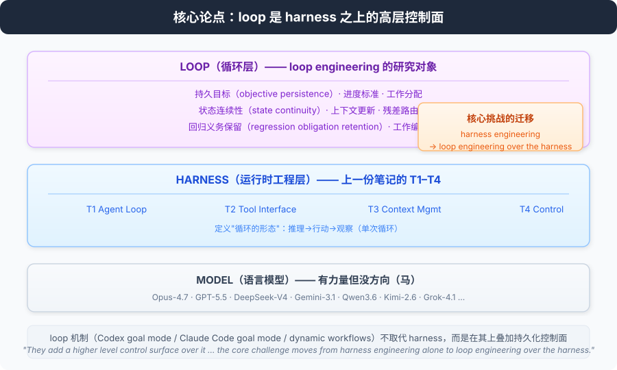
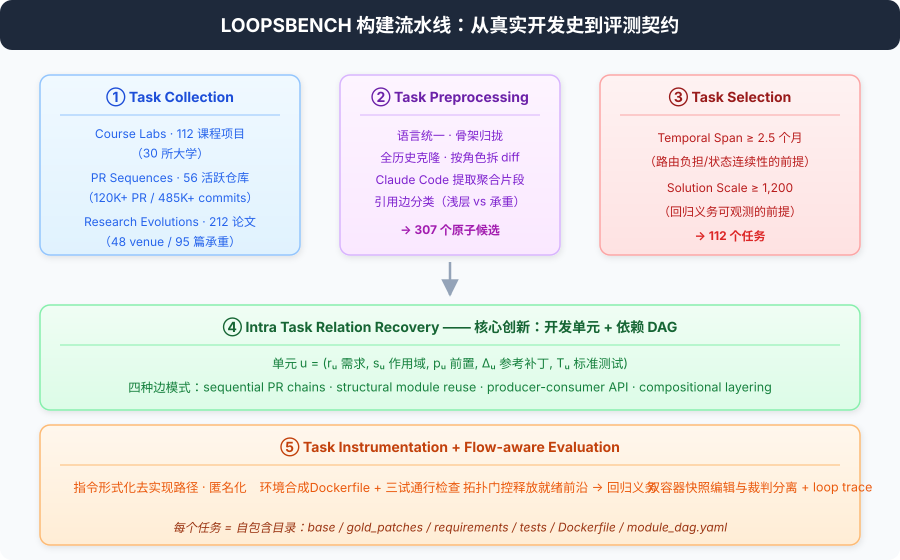
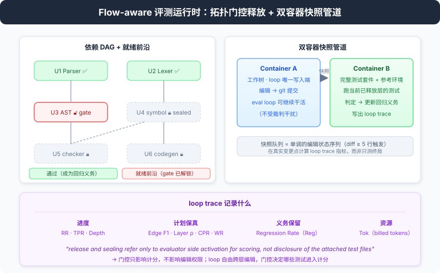
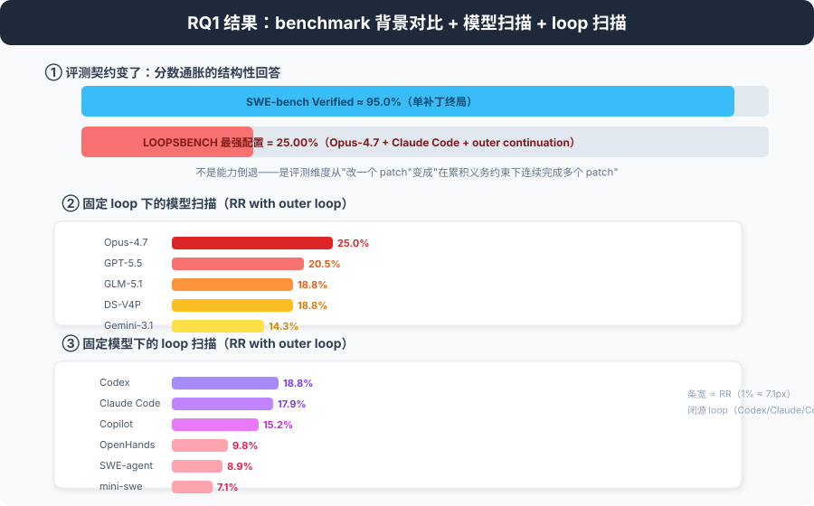
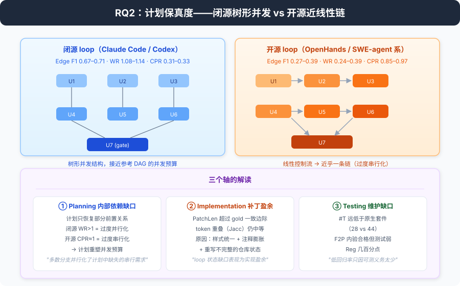
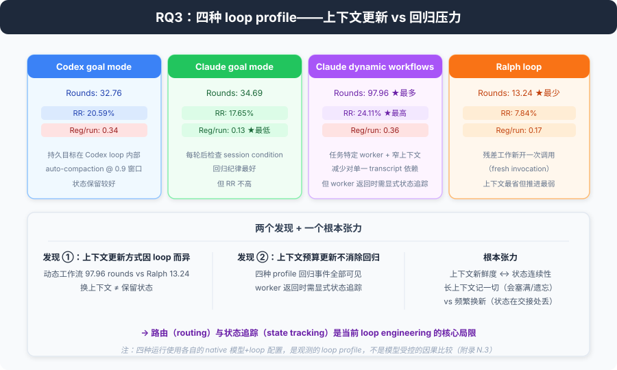

# 论文阅读笔记：LoopsBench — From Harness Engineering to Loop Engineering

> **论文：** LoopsBench: From Harness Engineering to Loop Engineering in Coding Agent Evaluation
> **作者：** Han Li, Zhemin Fang, Rili Feng, Yingqi Zhao, Jiaheng Liu, Pengfei Gao, He Ye, Dayi Lin, Qingwei Lin, Saravan Rajmohan, Dongmei Zhang（Microsoft / Nanjing University / UCL / SJTU）
> **arXiv：** [2608.00267](http://arxiv.org/abs/2608.00267)（cs.SE, 2026-07-31）
> **项目主页：** https://loopsbench.ai/
> **阅读日期：** 2026-07-31

---

## 0. 摘要

这篇论文与 `reading_notes_what_makes_a_harness.md` 精读的那篇是同一个研究脉络的**直接延续**：harness 定义确立了"harness 是什么"，这篇论文转向 harness **之上**的新一层——**loop（循环）**。

开篇一句话点题：

> *"Coding agent infrastructure is shifting from harness engineering toward loop engineering as coding agents are deployed for sustained long-horizon software development."*

**编码智能体基础设施正从 harness engineering 转向 loop engineering**——因为 agent 现在被部署去做持续的长周期软件开发，而现有 benchmark（SWE-bench 及其变体）只测终局状态，看不到持续执行过程中发生了什么。

论文的核心交付物 **LOOPSBENCH**：
- 112 个长周期任务，来自三个真实世界来源（PR 序列 / 课程实验 / 研究演进）
- 覆盖 8 种编程语言、9 个领域，5,300+ 开发单元，中位依赖深度 6
- 每个任务是一个**依赖 DAG**：节点是"可单独测试的开发单元"，边是"有源代码证据的前置关系"
- flow-aware 运行时按"就绪前沿"释放测试，已完成的节点保留为**回归义务**

关键结果（三个发现）：
1. **最强配置只解 25.00% 的任务**（Opus-4.7 + Claude Code + 外层续跑）
2. 评测的 loop 普遍**遗漏前置关系**、产出**更长的补丁**、写的**测试稀疏**
3. 不同 loop 实现的**上下文更新方式不同**，但**回归事件在所有 loop profile 中可见**——路由和状态追踪是核心瓶颈

> 一句话：**harness 解决"agent 能不能干活"，loop engineering 解决"agent 能不能干完一个长期的活"。**



---

## 1. 引言

### 从 harness 到 loop：同一基础设施的两个层次

引言先摆出现实：主流编码 agent 系统都开始暴露**循环机制**用于持续的软件工作——

> *"Current coding agent systems increasingly expose loop mechanisms for sustained software work, e.g., Codex goal mode, Claude Code goal mode, and Claude Code dynamic workflows."*

关键论证是：这些循环机制**不取代 harness，而是在 harness 之上加了一层更高层的控制面**：

> *"These mechanisms do not replace the harness. They add a higher level control surface over it, so objectives, progress criteria, and work distribution can persist across extended execution. The core challenge therefore moves from harness engineering alone to loop engineering over the harness."*

这句话直接呼应了上一份精读笔记里 harness 的构成性定义（T1 是"推理→行动→观察的自适应循环"）——T1 定义的是**单次循环的形态**，而 loop engineering 研究的是**循环如何跨长周期运行**：任务结构（task structure）、状态连续性（state continuity）、回归压力（regression pressure）。

### 现有 benchmark 的局限：终局式（terminal）任务抽象

论文对现有 benchmark 的批判非常明确：

> *"Their task abstraction nevertheless remains largely terminal: agents receive self-contained issues or flat specifications and are judged by final task success. This design measures issue resolution ability but does not reveal whether an agent preserves intermediate obligations, avoids regressions, or follows a viable order through dependent subproblems."*

三个测不出来的东西：
- **是否保留了中间义务**（intermediate obligations）
- **是否避免回归**（regressions）
- **是否按可行顺序穿越相互依赖的子问题**（viable order through dependent subproblems）

### 论文的定位：第一个"loop engineering"基准

LOOPSBENCH 的三个设计回应：

| 需求 | 设计 |
|------|------|
| 暴露中间开发单元 | 每个节点是一个可单独测试的 unit |
| 追踪累积义务 | 完成节点保留为回归义务，后续编辑都要通过 |
| 让执行顺序可观测 | 记录 loop trace，对比录制的计划与源代码恢复的 DAG |

论文明确声明自己"to our knowledge, the first benchmark for loop engineering evaluation"。

> 注意它的严谨之处：恢复的 DAG 是**描述性参考**（descriptive reference），不是"最优性声明"——后面会反复出现这个克制。

### 三个 Takeaways（摘要已经预告）

1. 最强模型 + loop 配置只解 25.00% 任务
2. loop 遗漏前置关系、产出更长补丁、作者测试稀疏
3. 上下文更新方式因 loop 而异，回归事件在所有 profile 中可见 → 路由（routing）和状态追踪（state tracking）是核心局限

---

## 2. 数据构建：一条把"真实开发史"变成"评测契约"的流水线

这是论文最重的部分。Figure 2 给出了全流程：



### 2.1 Task Collection：三个互补的真实来源

**① Course Labs（课程实验）—— 57 个任务**
- 30 所大学官方课程主页 + GitHub 公开镜像的 112 个编程项目
- 每个项目保留完整原生包：handout（作业说明）、skeleton code（骨架）、instructor-side reference tests（参考测试）
- 价值：**课程自带模块化分解**，人工开发顺序可从课程结构恢复

**② PR Sequences（PR 序列）—— 29 个任务**
- 56 个活跃维护的 GitHub 仓库（高 star、长期维护窗口）
- 拉取完整 commit 历史和合并 PR 流：120K+ 合并 PR、485K+ commits
- 价值：**真实合并历史**天然提供依赖证据（一个 PR 依赖前一个 PR）

**③ Research Evolutions（研究演进）—— 26 个任务**
- 48 个会议/期刊的 212 篇论文，带引用的 prior work 和前向引用者
- 要求：高被引 + 官方开源实现（OSI 许可）
- 参考过滤器保留 95 篇"承重继承边"连接的论文
- 价值：**引用图上的方法增量链**，跨度可达 10 年

三种来源对应三种不同的 loop 压力：PR 序列考验**路由负担**，课程实验考验**义务保留**，研究演进考验**长跨度状态连续性**。

### 2.2 Task Preprocessing：归一化

把异构来源归一到统一评测契约：
- Course Labs：混合语言 handout 统一成英文、散落骨架文件归拢 → 112 候选
- PR Sequences：克隆全历史、按角色拆 PR diff（test/source/auxiliary）、Claude Code 提取聚合片段 → 148 候选
- Research Evolutions：Claude Code 分类每条引用是"浅层相关工作提及"还是"承重继承边"，闭包扩张直到收敛 → 47 候选

### 2.3 Task Selection：两个与来源无关的阈值

| 阈值 | 门槛 | 衡量 |
|------|------|------|
| **Temporal Span** | ≥ 2.5 个月 | 任务时间跨度（路由负担/状态连续性的必要条件） |
| **Solution Scale** | ≥ 1,200（各来源自定义刻度） | 工作量规模（回归义务可观测的必要条件） |

过滤后剩 112 个任务。

### 2.4 Intra Task Relation Recovery：核心创新

#### 开发单元（Development Unit）的正式定义

> 一个 materialized development unit 是：**u = (rᵤ, sᵤ, pᵤ, Δᵤ, Tᵤ)**
> - **rᵤ** requirement（需求）
> - **sᵤ** file/symbol scope（作用域）
> - **pᵤ** prerequisite set（前置集合）
> - **Δᵤ** reference patch contribution（参考补丁贡献）
> - **Tᵤ** standard tests（标准测试）

单元边界跟随**来源出处**：PR 序列按合并 PR/有证据的 PR 片段；课程实验按发布的模块/里程碑；研究演进按承重方法增量。

> 无法在不破坏验收契约的情况下拆分的变化，就近归并到前置单元——不强行拆分。

#### 四种被承认的前置模式

| 模式 | 定义 |
|------|------|
| **sequential PR chains** | 沿合并 commit 历史的顺序 PR 链 |
| **structural module reuse** | v 编辑了 u 引入的文件/符号 |
| **functional producer-consumer API edges** | v 调用/导入 u 创建的权威定义 |
| **compositional layering** | v 扩展 u 声明的子类/模式/接口 |

#### 证据规则：宁缺毋滥

边只在**无歧义证据**下才被承认，两种证据：
1. **hunk overlap**（同一文件上的补丁重叠）
2. **symbol-level dependence**（import/call/subclass 某个由 u 引入的权威定义）

**denylist 排除假链**：热单体文件（被大部分 PR 触碰的文件不产生边）、生成产物、lockfile 从不锚定后继。这是恢复 DAG 保持"低误报"的关键机制。

#### ready frontier 的形式化

设 Cₜ = 到时刻 t 为止所有测试全过的节点集合：

> **Rₜ = { v ∈ V \ Cₜ : ∀(u,v) ∈ E, u ∈ Cₜ }**

即：**所有前置都已完成的未完成节点**，就是当前"就绪前沿"。

论文的立场很清醒：

> *"The fixed DAG is an evaluation contract rather than a claim that real development is always monotonic or interface stable."*

DAG 是**评测契约**，不是"真实开发总是单调/接口稳定"的主张。loop 可以修订早期实现，只要已完成的前置义务仍然满足；故意替换早期需求的重构式重设计不在这个抽象内。

### 2.5 Task Instrumentation：把任务变成自包含评测实例

#### ① 指令形式化

gold diff 是 ground truth，从中恢复开发者的验收意图。Claude Opus 4.7 辅助恢复，两个关键作用：
- **移除实现路径证据**：具体编辑位置、gold diff 结构
- **保留公开验收契约**：公开签名、期望输出格式
- 同时剥掉仓库名、课程 ID、论文标题、作者归属，**降低 prompt 级来源识别**（防污染）

#### ② 环境与测试合成

Dockerfile + docker-compose.yaml 固定可复现环境。逐单元按拓扑序合测试，每个单元跑**三试通行检查**：

| 试验 | 判定 |
|------|------|
| **solvability（可解性）** | 完整 gold 方案把每个测试翻绿 |
| **non-triviality（非平凡性）** | 空工作区不翻转任何测试 |
| **discriminativeness（判别性）** | 只用 u 的 DAG 祖先的 gold 方案仍至少有一个测试失败 |

> 判别性试验保证每个单元的测试**只对 u 自己的贡献敏感**——这是让"单元可单独测试"成立的地基。没执行结果的测试归因于环境（改 Dockerfile）；执行了但 gold 下仍失败的归因于断言（原地重写）。

### 2.6 Evaluation Protocol：flow-aware 运行时

#### 拓扑门控测试释放（Topologically Gated Test Release）

- 测试**按层释放**，多前驱节点是门
- 门节点在前驱全部进 Cₜ 后加入就绪前沿；后代测试在 T(v) 从失败翻转为通过前保持"密封"
- **关键区分**：release/sealing 只指评测端的计分激活，**不披露测试文件**；loop 仍可自由跨层编辑
- 一旦单元过门，它的测试 + 所有前驱测试在后续每一层**保持强制**（回归测试）

> *"Regression Rate therefore measures preservation of previously satisfied behavior without staged evaluator feedback about checkpoint outcomes or the active obligation state."*

#### 双容器快照管道（Dual Container Snapshot Pipeline）

```
┌─ Container A（工作树）───┐        ┌─ Container B（测试套件+参考环境）─┐
│  loop 唯一写入目标        │        │  完整测试套件 + run-tests.sh       │
│  编辑 → git 提交          │        │  从 A 读快照，跑当前已释放层       │
└──────────┬───────────────┘        └──────────────▲───────────────────┘
           │ 定期快照采样 + diff（≥5 行触发）       │
           └─────────────── 快照队列 ──────────────┘
```

评测运行时**独立采样**工作树状态，loop 可以继续编辑不受干扰。空 diff 丢弃，非空 diff 入队送进 B 跑。快照队列 = 单调的编辑状态序列，允许在**真实变更点**以及最终状态计算 loop trace 指标。



---

## 3. 实验

### 3.1 RQ1：Coding agent loops 能持续走多远？

三个维度分离变量：

**① 同族模型缩放（vendor loop 下）**

| 模型（GPT/Codex） | RR (w/o→w/) | TPR (w/o→w/) |
|---|---|---|
| GPT-5.5 | 14.29% → 21.43% | 39.62% → 50.84% |
| GPT-5.2 | 9.82% → 13.39% | 33.91% → 43.90% |
| GPT-5 | 5.36% → 8.04% | 28.45% → 36.86% |
| GPT-4o | 1.79% → 3.57% | 21.85% → 28.30% |

| 模型（Claude/Claude Code） | RR (w/o→w/) | TPR (w/o→w/) |
|---|---|---|
| **Opus-4.7** | **16.96% → 25.00%** | **41.18% → 53.05%** |
| Opus-4.5 | 12.50% → 17.86% | 36.97% → 48.21% |
| Sonnet-4.5 | 8.93% → 12.50% | 32.85% → 42.58% |
| Sonnet-4 | 4.46% → 7.14% | 27.43% → 35.54% |

| 模型（Qwen/Qwen Code） | RR (w/o→w/) | TPR (w/o→w/) |
|---|---|---|
| Qwen3.6-Plus | 6.25% → 9.82% | 37.97% → 45.10% |
| Qwen3.5-Plus | 5.36% → 8.04% | 31.75% → 41.17% |
| Qwen3-Max | 0.89% → 1.79% | 17.45% → 23.31% |
| Qwen2.5-72B | 0.00% → 0.00% | 10.61% → 13.88% |

**② 固定 loop（Claude Code）下的模型扫描**：Opus-4.7 25.00% 最高，GPT-5.5 20.54%、GLM-5.1 18.75%、DeepSeek-V4P 18.75%、Grok-4.1-FR 只有 4.46%。

**③ 固定模型（gpt-5.4）下的 loop 扫描**：Codex 18.75% > Claude Code 17.86% > GitHub Copilot 15.18% > OpenHands 9.82% > SWE-agent 8.93% > mini-swe-agent 7.14%。



**RQ1 结论**：

> *"Sustained long horizon loop progress remains limited at frontier scale. The limitation appears in loop level obligations such as global plan maintenance, residual continuity, and regression obligation retention rather than in per unit code generation alone."*

瓶颈不在"单单元代码生成"，而在**全局计划维护、残余连续性、回归义务保留**这些 loop 级义务上。附录 I 的 pass@3 验证了族内单调性不是单次试验运气。

### 3.2 RQ2：loop 如何维护计划 / 代码 / 测试状态？

用 loop trace 与源代码恢复的 DAG 对比，三个轴：

**① Planning（计划保真度）——"内部依赖缺口"**

| Loop | Edge F1 | Layer ρ | CPR | WR |
|------|:-------:|:-------:|:---:|:---:|
| Claude Code | 0.71 | 0.65 | 0.31 | 1.08 |
| Codex | 0.67 | 0.61 | 0.33 | 1.14 |
| GitHub Copilot | 0.58 | 0.52 | 0.41 | 0.92 |
| OpenHands | 0.39 | 0.33 | 0.85 | 0.39 |
| SWE-agent | 0.37 | 0.31 | 0.88 | 0.36 |
| mini-swe-agent | 0.27 | 0.22 | 0.97 | 0.24 |



指标定义（附录 K）：
- **Edge F1**：录制计划边 vs 参考 DAG 边的精确/召回
- **Layer ρ**：两图拓扑层序的 Spearman 相关
- **CPR（Critical Path Ratio）**：关键路径长度/节点数——接近 1 = 近乎线性的计划（过度串行化）
- **WR（Width Ratio）**：计划最大层宽/参考最大层宽——<1 过度串行化，>1 过度并行化

非常 sharp 的观察：

> *"Closed source loop implementations organize execution through a tree shaped concurrent structure and stay close to the concurrency budget implied by the reference DAG, whereas open source loop implementations driven by linear control flow form a near chain."*

**闭源 loop（Claude Code/Codex）形成树形并发结构**，接近参考 DAG 的并发预算；**开源 loop（SWE-agent 系）被线性控制流驱动，近乎一条链**（CPR 0.85–0.97）。闭源的 WR > 1 与其说是计划保真，不如说是**过度并行化**——把序列化的需求并行化了（大多数分支是无效分解）。

**② Implementation（实现）——"补丁盈余"**
在最终解决的单元上，PatchLen 稳定超过 gold 参考，而 token 重叠（Jacc）保持中等。附录 L 解释了矛盾：

> *"Candidate patches often impose a uniform style, add extensive comments, and rewrite existing repository blocks when repository state in the loop is incomplete."*

**循环状态缺口表现为实现盈余**——补丁更长不是实现不同，而是样式统一化+注释膨胀+重写不完整的仓库状态。

**③ Testing（测试）——"长周期维护缺口"**
- #T（loop 自写测试数）远低于原生套件（Claude Code 28 vs 原生 44）
- F2P（fail-to-pass 产出率）提交前内验合格
- Reg（回归率）：闭源 loop 几个百分点，轻量实现回归率低只是因为"能测回归的义务太少"

> *"The lower apparent Regression Rate of lighter implementations reflects the limited number of passing obligations eligible for regression measurement."*——**回归率必须和 RR 联合解读**，低 RR 配置的"低回归"不构成稳定性的证据。

**RQ2 结论**：长周期差距的核心是 **loop 状态纪律（loop state discipline）**——依赖缺失、补丁膨胀、测试稀疏，三者都指向 plan/code/test 状态在运行中如何被维护。

### 3.3 RQ3：哪些 loop engineering 因素塑造长周期执行？

对比四种代表性 loop 运行：

| Loop 配置 | Rounds | Reg/run | RR |
|-----------|:------:|:-------:|:--:|
| Codex goal mode | 32.76 | 0.34 | 20.59% |
| Claude Code goal mode | 34.69 | 0.13 | 17.65% |
| **Claude dynamic workflows** | **97.96** | 0.36 | **24.11%** |
| Ralph loop | 13.24 | 0.17 | 7.84% |

- **context-budget round** = 初始上下文 + 每次实现压缩策略开的段 + 外部重启
- **Claude dynamic workflows 用 97.96 个 round**（worker 上下文窄，频繁换新），Resolve Rate 最高 24.11%
- **Ralph loop（残差工作新开调用）**最少 round（13.24）但只有 7.84%

两个发现：
1. **上下文更新方式因 loop 而异**：动态工作流把工作分散到更窄的 worker 上下文，减少对单一不断增长 transcript 的依赖
2. **上下文预算更新并不消除回归压力**：dynamic workflows 仍有 0.36 回归事件/run——**完成义务在 worker 返回时仍需显式状态追踪**

> *"Dynamic routing therefore reduces dependence on a single growing transcript, but completed obligations still require explicit state tracking when workers return."*



**RQ3 结论**：loop engineering 改变的是**上下文如何更新 + 残差工作如何路由**。动态工作流观测结果最强，但回归事件在四种 profile 中全部可见。

---

## 4. Related Work：一张清晰的分族地图

附录 A 的 Table 5 把相关工作按"证据类型 × 与 loop engineering 的关系"分成八族：

| 族 | 代表 | 与 loop engineering 的关系 |
|----|------|--------------------------|
| 函数级代码生成 | HumanEval, APPS, LiveCodeBench | 局部单元测试，无状态保留 |
| SWE-bench 家族 | SWE-bench(+M/Pro), Multi-SWE-bench, SWE-Lancer | 仓库级 issue，主要报终局补丁 |
| SWE-bench 审计 | OpenAI 的 SWE-bench verified 退出声明 | 污染/过拟合风险 |
| Feature/Evolution | FeatBench, SWE-EVO, RefactorBench, SlopCodeBench | 扩大任务范围，但前置结构不进可执行义务 |
| 交互/轨迹基准 | METR 长任务, RE-Bench, CoreBench, LongCLI-Bench | 延长交互，但完成的单元不进入活跃回归义务 |
| **Loop 实现与基础设施** | Claude Code, Codex, Devin, OpenHands, SWE-agent, Agentless | **被评测的系统边界** |
| **Loop engineering 基础设施** | Codex goal mode, Claude goal/workflows, Ralph | 描述持久目标/外层循环/worker 编排，但**没有定义基准** |
| 推理框架 | CoT/ToT/Reflexion/MetaGPT/AutoGen/MemGPT | 提供原语，无可执行 loop trace 证据 |
| SE 前置研究 | Lehnert 变更影响分析, release planning | 依赖结构作为显式工件——LOOPSBENCH 的源头概念 |

> 论文对 SWE-bench 系与 long-horizon 系的核心批评：*"Across these families, prerequisite state, residual work routing, and regression obligations generally remain outside the executable scoring contract. Success is therefore assigned to submitted artifacts rather than to the loop state that produced them."*——**成功被归于提交的工件，而不是产生工件的 loop 状态。**

---

## 5. 结论与局限

### 结论

> *"LOOPSBENCH makes loop engineering a measurable dimension of coding agent evaluation alongside end state scoring."*

四个支柱：依赖 DAG 形式化长周期任务 → 沿图边释放测试 → 已完成单元测试保留为持久回归义务 → 执行顺序留给被评 loop。loop trace 捕获残差路由、状态连续性、义务保留。**模型选择与 loop 配置的联合归因**成为可能。

### Limitations（诚实清单）

1. **恢复的 DAG 是前置结构的下界**，不是完整因果图——可能漏掉配置、数据格式、构建系统、跨服务里的隐式依赖
2. 单元边界和参考补丁**非唯一**，探索式重设计不在范围内
3. 只覆盖有可审计前置证据的来源：**移动端、前端重型、硬件相关项目在范围外**
4. 正确性指标绑定在发布测试套件上，测的是**可执行义务**而非完整语义等价
5. 隐藏 checkpoint 状态会让回归同时反映"反馈不足"和"回归纪律"
6. Claude Code 只用于离线构建；被评 loop 共享一个契约，无构建 transcript/gold/frontier
7. 模型辅助物化仍可能偏置措辞、边界和测试；公开来源有**污染风险**（附录 E 专门论证，后面详述）
8. 只能测 loop 接口内的事件；内部事件无法直接测量

### 附录 E 的污染论证（值得单独记住）

两个论点反驳"记忆化主导"：
- **经验性**：最强配置用 Anthropic 原生模型+loop 也只有 25%——如果权重级记忆是主因，公开的课程实验/研究演进任务应该接近更高解决率
- **结构性**：解决一个任务要求跨许多编辑的前置一致性 + 上下文更新间保留状态 + 沿 DAG 的测试反馈路由——**单个实现片段的回忆不足以通过 loop 评测**

---

## 6. 与既有 benchmark 的定位对比（Table 1 浓缩）

| Benchmark | 证据类型 | 语言 | 任务形态 | 独立单元 | 显式 DAG | Patch | Tests | 时长 |
|-----------|---------|:---:|---------|:---:|:---:|:---:|:---:|:---:|
| **LOOPSBENCH** | **loop trace 指标** | **8** | **依赖 DAG** | **✓** | **✓** | 37,296 | 74 | **6.6m** |
| SWE-bench | end state F2P | 1 | issue | ✗ | ✗ | 33 | 9 | 24.6d |
| Multi-SWE-bench | end state F2P | 7 | issue | ✗ | ✗ | 107 | 21 | 18.5d |
| SWE-bench Pro | end state F2P | 11 | issue/feature | ✗ | ✗ | 462 | 38 | 1.7m |
| FeatureBench | end state F2P | 1 | feature | partial | ✗ | 1,256 | 38 | 19.5d |
| SWE-EVO | end state F2P | 1 | 软件演进 | partial | ✗ | 610 | 31 | 7.1d |
| MLE-Bench | end state F2P | 1 | repo 生成 | ✗ | ✗ | 514 | 1 | 3.0m |
| NL2Repo-Bench | end state F2P | 1 | repo 生成 | partial | ✗ | 1,623 | 247 | 3.4y |
| ProgramBench | end state F2P | 1 | repo 生成 | partial | ✗ | 2,104 | 52 | 12.4d |
| RepoZero | end state F2P | 1 | repo 生成 | partial | ✗ | 3,287 | 68 | 21.7d |

> 论文的分界线是**双重的**：先区分"暴露可单独测试的中间单元 vs 只给终局任务"，再在暴露单元者中区分"有显式前置 DAG vs 没有"。SWE-bench 系的 "F2P" 证据是**端到端补丁级**，LOOPSBENCH 的证据是**运行中录制的 loop trace**。

---

## 7. 数据统计速览

**构建规模**（Figure 2 数据）：
- 485K+ commits、120K+ 合并 PR、12.7 年 commit 跨度、最长演进跨度 10 年
- 112 个课程项目（30 所大学）、56 个活跃仓库、212 篇论文（48 venue，25K+ 引用）

**任务池**：112 任务 = 29 PR Sequences + 57 Course Labs + 26 Research Evolutions
- 中位依赖深度 6；5,300+ 开发单元；37,296 参考补丁行；74 测试/任务

**来源难度分层**（附录 M，重要！）：
- **PR Sequences 最难**：14 个配置中 RR ≤ 3.45%，其中 9 个配置 0 个 PR 任务都没解
  - 原因：合并链中每段常依赖几个 PR 前建立的跨模块不变量；早期段一旦破坏前置不变量，下游就受义务保留支配
- **Course Labs 占解决任务 ≥70%**：中位深度 3（全池 6），课程模块分解让人类开发顺序可恢复
- **Research Evolutions 居中**

> 注意附录 M 的统计陷阱提醒：*"Doubling PR Sequence RR moves the aggregate by less than one percentage point while materially changing the loop engineering interpretation."*——聚合数字会**稀释掉最难来源的信号**。

---

## 8. 与"harness"精读笔记的对话

两份笔记现在可以放在一起读了，这是最值得的一层：

```
What makes a harness a harness（2606.10106）
  └─ harness = 包装 LLM 的运行时工程层（T1 agent loop / T2 tools / T3 context / T4 control）
       └─ T1 只定义了"循环的形态"：推理→行动→观察
            └─ 未回答：这个循环如何跨长周期运行？
                 └─ LoopsBench（2608.00267）
                      loop = harness 之上的高层控制面
                      ├─ 评测对象：目标持久性 / 状态连续性 / 回归压力 / 残差路由
                      ├─ 评测方法：依赖 DAG + 就绪前沿 + 回归义务 + loop trace
                      └─ 关键发现：状态纪律是瓶颈，上下文更新≠状态保留
```

- **相同点**：都强调"控制不能依赖模型配合"；都拒绝把"是不是"和"好不好"混为一谈
- **延续点**：harness 论文的 RQ5 指出"没有方法隔离 harness 的贡献"；LoopsBench 的 loop sweep 设计（固定模型变 loop、固定 loop 变模型）正是**朝这个方法论缺口迈出的第一步**
- **互补点**：harness 论文用 T1–T4 判定"是不是 harness"；LoopsBench 用 loop trace 指标度量"loop 在长周期里维护得怎么样"——前者是**归属测试**，后者是**质量测量**

---

## 9. 精读后的个人思考（未验证）

1. **"计划保真度"可能是被低估的指标**。Edge F1 只有 0.27–0.71，CPR 显示开源 loop 几乎串行化一切——这说明当前 loop 的规划能力与其说是"规划"，不如说是"贪心串行执行"。这或许正是 SWE-agent 系线性控制流的代价。
2. **"测试稀疏"是隐患最大的发现**。agent 自写测试数只有原生套件的 1/4–1/2，而 F2P 又"合格"——意味着 agent 倾向于写**容易过的弱测试**。这呼应了 karpathy-guidelines 里"define verifiable success criteria"的告诫：验证薄弱时，越长的 loop 越危险。
3. **dynamic workflows 的 97.96 rounds 是一个矛盾信号**：RR 最高但 Reg/run 也最高（0.36）。"上下文新鲜度"与"状态连续性"可能是 loop 设计的根本张力：要么一个长上下文记住一切（但会塞满/遗忘），要么频繁换新上下文（但状态在交接处丢失）。**状态追踪（state tracking）是两者之间的杠杆**。
4. **25% 的绝对水平**放在 SWE-bench 95% 的背景下看极其反直觉——不是能力倒退，而是**评测契约变了**：从"改一个 patch"变成"在一组义务的约束下连续完成多个 patch"。这本身就是对"benchmark 分数通胀"现象（OpenAI 退出 SWE-bench verified 的声明）的结构性回答。

---

## 10. 全文结构速览

```
§1 Introduction — harness engineering → loop engineering；终局式 benchmark 的局限
§2 Pipeline — 三大真实来源 → 归一化 → 双阈值选择 → 单元+DAG恢复 → 物化 → flow-aware 评测
   2.1 Collection — Course Labs(57) / PR Sequences(29) / Research Evolutions(26)
   2.2 Preprocessing — 三种来源各自归一化
   2.3 Selection — Temporal Span ≥ 2.5mo & Solution Scale ≥ 1200
   2.4 Relation Recovery — u=(r,s,p,Δ,T)；四种边模式；hunk/symbol 证据；denylist
   2.5 Instrumentation — 指令形式化(去实现路径) + 三试通行测试合成
   2.6 Evaluation — 拓扑门控释放 + 双容器快照 + loop trace
§3 Experiments
   3.1 RQ1 — 模型/loop/续跑三维分离；最强 25.00%
   3.2 RQ2 — 计划(EdgeF1/Layerρ/CPR/WR) 实现(PatchLen/Jacc) 测试(#T/F2P/Reg)
   3.3 RQ3 — 四种 loop profile：rounds / regression / RR
§4 Related Work — 八族分图；"成功归于工件而非 loop 状态"
§5 Conclusion — loop engineering 成为可测量维度
Limitations — DAG 下界 / 范围 / 污染 / 接口可见性
附录 A–Q — 相关工作分族 / 任务统计 / schema / 物化示例 / 污染论证 / 指标定义 / 模型元数据 / pass@3 / 评测契约 prompt / 运行配置
```
