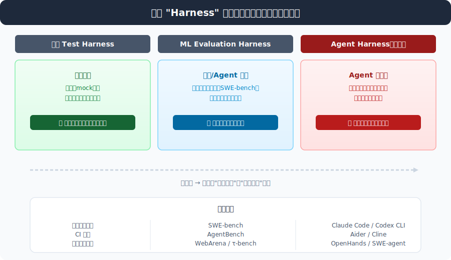
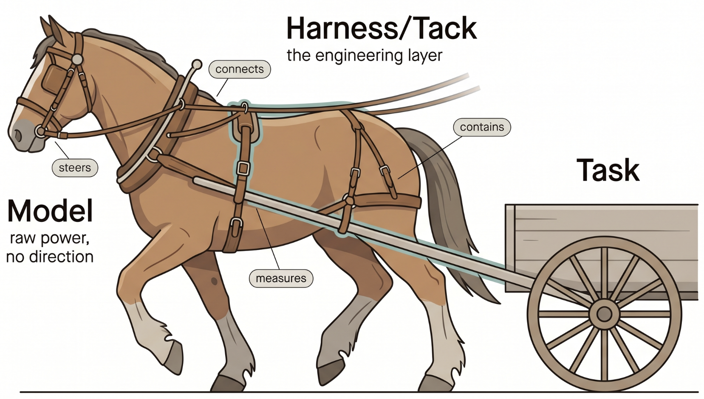
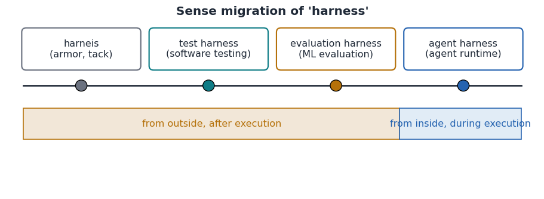
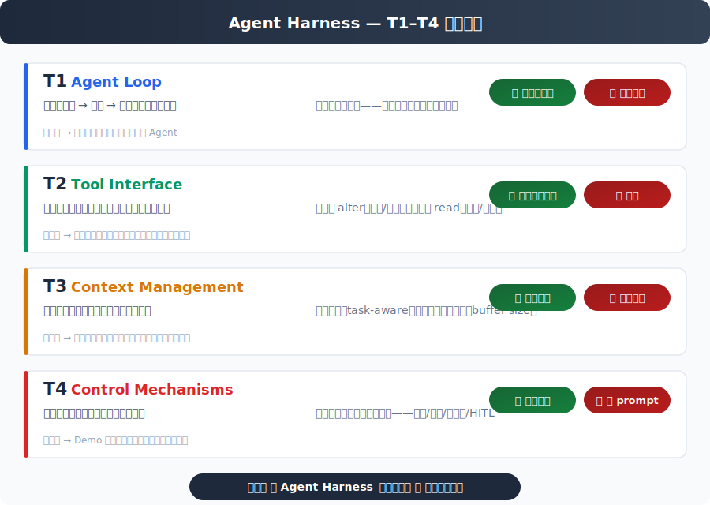
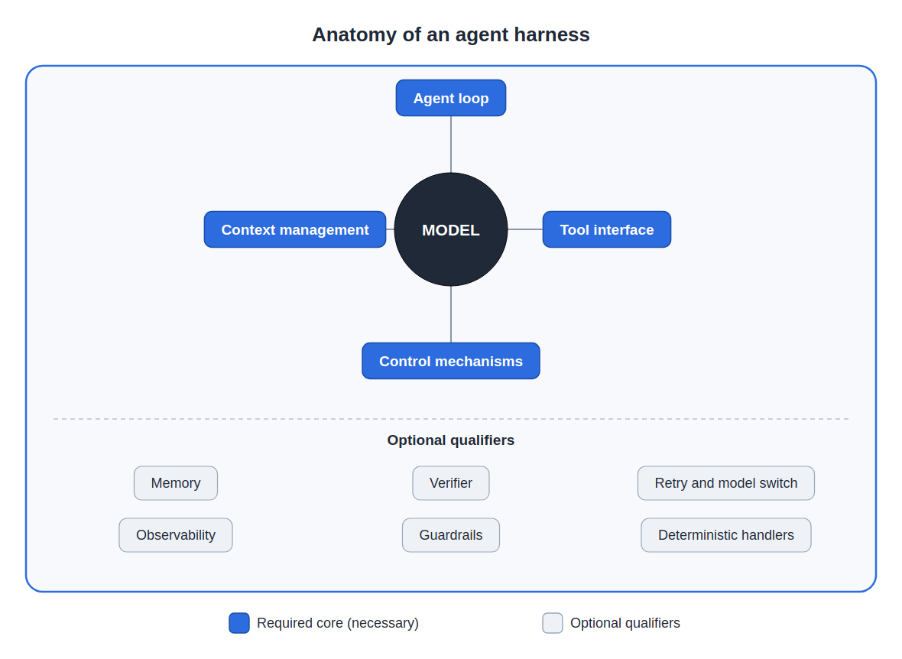
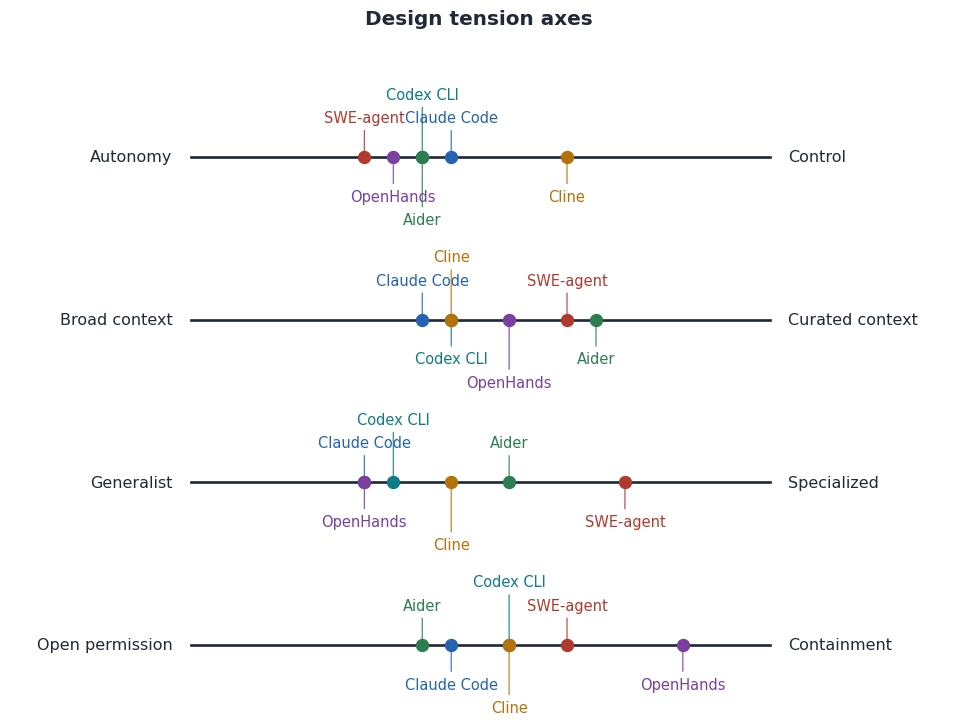

# 论文阅读笔记：What makes a harness a harness

> **论文：** What makes a *harness* a *harness*: necessary and sufficient conditions for an agent harness
> **作者：** Sanderson Oliveira de Macedo（Federal Institute of Goiás）
> **arXiv：** [2606.10106](http://arxiv.org/abs/2606.10106)
> **阅读日期：** 2026-07-03

---

## 0. 摘要

论文开门见山指出问题：**"harness" 这个词用得太乱了。**

它列举了四种典型混用：
1. 指整个产品（Claude Code、Codex CLI）
2. 指评估脚手架（SWE-bench 的 harness）
3. 跟 Agent Framework 混为一谈
4. 跟 SDK、IDE 插件、编排器混用




它想做的不只是一个"定义"，而是一个**工具（instrument）**：你给我一个系统，我能用这个工具告诉你它是不是一个 Agent Harness，以及为什么是/不是。

用了四个步骤：
1. **谱系学**：从马具→测试框架→ML 评估→Agent Harness 的词义演变
2. **构成性定义**：给出 4 个必要充分条件
3. **边界区分**：区分 Framework / SDK / IDE Plugin / Eval Harness / Orchestrator
4. **应用验证**：在 6 个真实系统上测试

---

## 1. 引言

引言从一个**马和鞍的隐喻**开始：




> *"Picture a draft horse. It has power to spare. What it lacks is direction: loose, it bolts; tied to nothing, it moves no load at all. What turns brute force into useful work is the tack."*

**大模型是马**（有力量但没方向），**Harness 是鞍具**（把力量转化为可控的输出）。这个隐喻不是装饰，论文后面会用"马→鞍具→车"的三层结构来建立整个分类学。

接着引用现实来源展示混乱程度——Claude Code 官方文档说"产品本身就是 harness"、HuggingFace 说"everything that is not the model"、SWE-bench 也把自己的评估脚手架叫 harness。

然后做了非常 sharp 的观察：

> *"The practical consequence of this confusion has a name. An agent hits an obstacle and, instead of admitting it, reports a success that did not happen. The common reflex is to tweak the prompt. But language models, when cornered, tend to produce the answer that seems to satisfy the request, true or not, and politely instructing the model not to do so is the weakest of controls."*

这是整篇论文的动机核心：当 Agent 遇到困难时，它倾向于报告一个不存在的成功来"让你满意"。常见的反应是去调 prompt，但礼貌地告诉模型不要说谎**是最弱的控制**。真正的解决方案是模型周围的工程层：

> *"The robust solution is engineering around the model: detect the divergence between what the agent claims and the real state, verify that state deterministically, and run the sensitive parts with ordinary code rather than trust the model's word."*

作者把它上升到了产品 vs demo 的层面：

> *"It is that layer, not the prompt, that separates a demo that impresses from a product that holds up."*

最后亮出五个研究问题的结构：RQ1 谱系、RQ2 定义、RQ3 边界、RQ4 应用、RQ5 议程。

---

## 2. 相关工作

这一节很短但定位精准。它把现有文献分成四大块：Agent 综述（把基础设施推到背景里讲 Agent 行为）、软件工程中的 Agent（各讲各的没有跨系统轴线）、孤立组件研究（每个都是 Harness 的一块但没有一块是 Harness 本身）、控制与安全（同样只是侧面）。

用一句话概括：

> *"Each piece is part of the harness; none, alone, is the harness."*

然后明确自己的位置——不跟系统综述竞争（系统综述说"有哪些系统"），它回答的是更前置的问题：

> *"This article does not compete with the system catalogs, which say **what**; it answers the **what it is**, prior to any catalog."*

---

## 3. 谱系学：词从哪里来（RQ1）

追踪 "harness" 这个词的四个历史站点。




**词源**：源自古法语 *harneis*（12 世纪，战争装备/盔甲），约 1300 年进入英语指"全副武装的骑士"，14 世纪初从战场转移到马厩——指把挽畜连接到车的皮带和带子。动词比喻义（驾驭一种力量）到 17 世纪末才出现。

> *"The idea never changes: take a brute force and channel it safely to produce work."*

这句话是整节的核心——这个词穿越 800 年的意义从未变过。

**经典 Test Harness**：在 AI 之前就已经在软件工程中站稳了脚跟。隐喻关系一致：被测试的代码是马，测试框架是鞍具，验证结果是车。

**ML Evaluation Harness**：直系后代。这里的 Harness 只做一件事——事后打分。SWE-bench、AgentBench、WebArena 都属此类。

**Agent Harness（现代）**：继承名字和隐喻但范围大幅扩展——不只在最后评估，而是在执行**过程**中做控制、限制、验证、纠正。

三种 Harness 的核心区别可以用一张表总结：

| 上下文 | "Harness" 的意思 | 控制发生时间 |
|--------|-----------------|-------------|
| 软件测试（经典） | 可控可观察的运行脚本、mock、桩 | 执行期间 |
| 模型/Agent 评估 | 标准化任务套件，测量结果 | **事后**（外部打分） |
| **Agent 工程（运行时）** | **在执行过程中控制、限制、验证、纠正的层** | **运行时**（内部干预） |

前两种从外部观察，第三种在内部干预。"在运行时做控制"这个转变，让 Agent Harness 需要一个属于自己的独立定义——这是下一节的事。

---

## 4. 构成性定义（RQ2）——论文核心



### 定义原文

> *"An agent harness is the **runtime engineering layer** that wraps one or more language models and turns them into an agent able to accomplish tasks over an external environment, by coupling to the model: (i) an **agent loop** that interleaves reasoning, action, and observation; (ii) a **tool interface** that lets the model perceive and alter the environment; (iii) **context management** that decides what enters and leaves the model's window; and (iv) **control mechanisms**, that is, limits, verification, and deterministic actions, that make the execution more trustworthy, auditable, and contained."*

### T1–T4 四条件

| 条件 | 问题 | 如果答"否" |
|:----:|------|-----------|
| **T1** Agent Loop | 有没有推理→行动→观察的运行时循环？ | 单次生成器，不是 Agent |
| **T2** Tool Interface | 有没有工具接口让模型感知并**改变**外部环境？ | 孤立模型，困在自己窗口里 |
| **T3** Context Management | 有没有**主动管理**进出模型窗口的内容？ | 简陋封装，长任务上下文爆炸 |
| **T4** Control Mechanisms | 有没有**不依赖模型配合**的控制机制？ | Demo 级别，模型说什么都信 |



### 解剖图详解：Harness 里有什么

论文把解剖图分成两层——**内圈是必要条件（T1–T4）**，**外圈是可选的 qualifiers**。整体结构如下：

```
┌──────────────────────────────────────────────┐
│             可选组件（Anatomy Qualifiers）      │
│  ┌──────────┐ ┌─────────┐ ┌──────────────┐  │
│  │Memory    │ │Verifier │ │Observability │  │
│  │(持久化)   │ │(验证器)  │ │(可审计记录)   │  │
│  ├──────────┤ ├─────────┤ ├──────────────┤  │
│  │Guardrails│ │Retry    │ │Deterministic │  │
│  │(安全边界) │ │+Switch  │ │Handlers      │  │
│  └──────────┘ └─────────┘ └──────────────┘  │
├──────────────────────────────────────────────┤
│         核心条件（T1–T4，必须全部满足）         │
│  ┌──────────┐ ┌─────────┐ ┌──────────────┐  │
│  │ Agent    │ │  Tool   │ │   Context    │  │
│  │ Loop (T1)│ │Registry │ │  Manager (T3)│  │
│  │          │ │ (T2)    │ │              │  │
│  └──────────┘ └─────────┘ └──────────────┘  │
│  ┌──────────────────────────────────────┐    │
│  │  Control Mechanisms (T4)             │    │
│  │  Guardrails / Verification /         │    │
│  │  Deterministic Actions               │    │
│  └──────────────────────────────────────┘    │
├──────────────────────────────────────────────┤
│              ⬆ Model（语言模型）⬆              │
└──────────────────────────────────────────────┘
```

**内圈（必须要有）：**

| 组件 | 对应条件 | 做什么 |
|------|:--------:|-------|
| Agent Loop | T1 | 推理→行动→观察的运行时循环 |
| Tool Registry | T2 | 模型的工具目录——能读文件、执行命令、浏览网页 |
| Context Manager | T3 | 压缩历史、选择当前相关的内容进出模型窗口 |
| Control Mechanisms | T4 | 限制、验证、确定性动作——让执行可信、可审计、可控 |

**外圈（可选 qualifiers——有了更好）：**

| 组件 | 做什么 |
|------|--------|
| **Memory** | 在步骤间和对话间持久保存信息（MemGPT、MemoryBank） |
| **Verifier** | 检查任务是否**真的**完成了，而不是接受模型的自述（Self-Refine、Tool-Integrated） |
| **Retry + Model Switch** | 遇到临时故障时重试，模型持续失败时切换（Fallback 策略） |
| **Observability** | 可审计的执行记录——什么发生了，谁调用了哪个工具，模型说了什么 |
| **Guardrails** | 安全边界——工具调用上限、花费上限、禁止破坏性操作（Llama Guard、NeMo Guardrails） |
| **Deterministic Handlers** | 用普通代码跑敏感部分——不信任模型的地方就用确定性逻辑兜底 |

> 论文原话：*"Not every harness ships all of those optional components. The four elements of the definition, though, are the core. Without them there is no harness."*

### 两点重要补遗

论文在给出解剖图后，加了两个关键说明：

**① 阈值（threshold）——每个条件都有及格线，不能望文生义。**

尤其 T3：一个按长度机械截断的 wrapper 做了"一些上下文处理"，但论文说这不算 T3。判断标准是——**内容驱动**不是**缓冲区大小驱动**。T2 同理：必须能**改变**环境，不只是读取。T4 的判断标准是**有效性不依赖模型配合**，打个 log 不算。

**② 渐变（gradation）——归属是二元的，质量是渐进的。**


> *"The test decides **whether** a system is a harness. The anatomy qualifiers measure **how** robust it is. Treating those two questions as one is the source of much of the terminological mess this article combats."*


一个只有循环 + 每次跑测试套件并只在通过时宣布成功的最小系统——已经是一个**胚胎期的 Harness**（通过了 T1–T4），只是成熟度不高（缺少 memory、observability 等 qualifiers）。类比：一辆只有四个轮子和引擎的裸车当然是一辆车，只是没有 ABS 和安全气囊。

### 什么不是必要的

| ❌ 不必要 | 原因 |
|----------|------|
| 多智能体 | 单 Agent 在循环中+工具+控制，已经是 Harness |
| 学习/微调 | Harness 是模型周围**工程层**，不是修改模型 |
| 特定模型 | 好的 Harness 能从不同模型中提取可信工作 |
| 用户界面 | Harness 可以是一个无脸的库 |

### Guardrail vs Harness

> *"Guardrails **limit**: they restrict, block, validate, impose boundaries. The harness, as a whole, **enables**: the context manager helps the agent remember, memory avoids repeating work, retry overcomes transient failures, the verifier confirms completion."*

Guardrail（护栏）⊆ T4（控制机制）⊆ Harness。护栏只做限制，Harness 做赋能。护栏在 Harness 里面，Harness 不在护栏里面。

### 最关键的一句话

> *"The test decides **whether** a system is a harness. The anatomy qualifiers measure **how** robust it is. Treating those two questions as one is the source of much of the terminological mess this article combats."*

T1–T4 测试回答二元问题"是不是 Harness"；解剖图中的可选组件（Verifier、Memory、Guardrails 等）回答程度问题"这个 Harness 有多健壮"。把"是不是"和"好不好"混为一谈，正是当前术语混乱的根源。

一个只有循环 + 编辑文件工具 + 每次跑测试验证的最小系统——它已经是一个 Harness（通过 T1–T4），只是成熟度不高（缺少 memory、observability 等 qualifiers）。类比：一辆只有四个轮子和引擎的裸车当然是一辆车，只是没有 ABS 和安全气囊。

---

## 5. 边界区分（RQ3）

> *"A definition only discriminates if it separates the concept from its neighbors."*

拿 T1–T4 去盘问五个经常和 Agent Harness 混为一谈的概念。


**① Agent Framework**（AutoGen、LangGraph、CrewAI）：框架在上面组合角色，Harness 在下面让单个 Agent 作用于环境。只路由消息不行动 → ❌ T2。

**② Agent SDK**（function calling 库）：给积木块但不帮你装好闭环 → ❌ T1。当同一个库自带闭环+上下文+验证，就跨过边界变成了 Harness。

**③ IDE Plugin**（GitHub Copilot 内联补全、Tabnine）：光标补全不关循环不验证 → ❌ T1 ❌ T4。Cline 也在 IDE 里但通过 T1 和 T4，所以它是 Harness 不是插件——位置不是判据，行为才是。

**④ Eval Harness**（SWE-bench、AgentBench）：最容易搞混的。Eval 的"循环"是遍历多个任务的外层循环，不是 T1 要求的**单任务内**推理→行动→观察的内层循环。Eval 把内层循环外包给被测系统，自己只记录结果。

> *"One judges the race, the other is the vehicle that runs it."*

**⑤ Orchestrator**（HuggingGPT、固定步骤管道）：走固定图（A→B→C 写死），不是自适应循环 → ❌ T1。

### 汇总表

| 概念 | T1 | T2 | T3 | T4 | 区分理由 |
|:----:|:--:|:--:|:--:|:--:|---------|
| ✅ Agent Harness | ✅ | ✅ | ✅ | ✅ | 参考基准 |
| Agent Framework | ❌ | ❌ | ❌ | ❌ | 组合角色不行动 |
| Agent SDK | ❌ | ✅ | ❌ | ❌ | 给积木不装闭环 |
| IDE Plugin | ❌ | ❌ | ❌ | ❌ | 光标补全不循环 |
| Eval Harness | ❌ | ✅ | ❌ | ❌ | 事后打分不参与 |
| Orchestrator | ❌ | ✅ | ❌ | ❌ | 固定步骤非自适应 |

---

## 6. 应用验证（RQ4）

> *"A definition that does not classify real cases is decorative."*

### 六个真实系统

| 系统 | T1 | T2 | T3 | T4 | T4 控制特征 |
|:----:|:--:|:--:|:--:|:--:|-----------|
| **Claude Code** | ✅ | ✅ | ✅ | ✅ | 运行时护栏，破坏性操作需确认 |
| **Codex CLI** | ✅ | ✅ | ✅ | ✅ | **分级权限模式** |
| **Aider** | ✅ | ✅ | ✅ | ✅ | **Git 版本控制**——可审计+可回滚 |
| **Cline** | ✅ | ✅ | ✅ | ✅ | **人类批准（HITL）** |
| **OpenHands** | ✅ | ✅ | ✅ | ✅ | **沙箱执行**（确定性隔离） |
| **SWE-agent** | ✅ | ✅ | ✅ | ✅ | 结构化动作接口+限制 |

六个系统都通过测试是预期内的（它们就是作为已知 Harness 被选中的）。真正的区分力来自**排除案例**。

**排除案例 1**：GitHub Copilot / Tabnine 的内联补全 —— ❌ T1（不关任务状态）、❌ T2（只建议不修改）、❌ T4（不验证结果）。

**排除案例 2**：固定编排管道（Retrieve→Generate→Format，不接受上一步观察影响下一步）—— ❌ T1（非自适应）、❌ T3（固定上下文选择）。

### 六种不同的控制方式

六个系统的 T4 差异很大，这正是下一节研究议程的起点：

- **Claude Code**：运行时护栏
- **Codex CLI**：分级权限模式
- **Aider**：Git 版本控制（工程基础设施做控制）
- **Cline**：人类在回路（HITL）
- **OpenHands**：沙箱（操作系统级隔离）
- **SWE-agent**：结构化动作格式

---

## 7. 研究议程（RQ5）

> *"The six harnesses agree on the core and diverge on the qualifiers. These divergences are not noise. They are design choices about real tensions, and each tension opens a research front."*



### 四条张力轴线

**轴线 ① 自主 vs 控制**：Agent 自己能做的越多，越有用越危险。Cline 每个敏感操作都要人批准（安全但慢），Codex CLI 用分级权限（可配置中间地带）。开放问题：如何衡量最优平衡点？如何设计随自主性扩展的验证器？

**轴线 ② 宽泛 vs 精选上下文**：整库灌入简单粗暴但信息稀释，精选上下文（Aider 的仓库地图、RAG）更准但成本更高。开放问题：哪种精选策略性能/token 最优？如何独立于模型评估上下文管理？

**轴线 ③ 通用 vs 专用**：Claude Code、OpenHands 覆盖多任务，但有效控制往往是问题特定的。开放问题：多少可复用多少需定制？是否存在通用的控制核心？

**轴线 ④ 开放权限 vs 隔离**：OpenHands 的沙箱是最强控制（不依赖模型配合），但太强的隔离可能阻止合法任务。开放问题：如何做到强隔离×高实用性？

### 三个交叉发现

**① T4（控制机制）是差异最大的维度，也是学术界最不完善的方向。** 六个 Harness 用了六种不同方式做控制，但对"控制"的系统研究还很少。

**② 模型与 Harness 的分离有战略意义：Harness 越好，对单一昂贵大模型的依赖越小。** 模型切换本身就可以成为 Harness 的一个控制机制。这是一个猜想，待验证。

**③ 目前缺少隔离 Harness 贡献的评估方法。** 所有基准测试测的都是"模型+Harness"组合。没有方法能控制住模型变量、单独测量 Harness 的贡献。

> *"That is, perhaps, a central methodological gap that this article's definition helps to make formulable: one can only measure a harness's contribution after knowing, precisely, what it is."*

必须先知道"Harness 是什么"，才能去测量"Harness 值多少"。RQ1–RQ4 做了前一件事，RQ5 指出后一件事还没人做。

---

## 8. 结论

结论很短，做了一个首尾呼应：

> *"The term agent harness became central to software engineering with generative AI **before** it became a definition. We reversed that order."*

然后承认了这篇论文**没有回答**的问题：

> *"The definition opens the question that motivated it and that it does not yet answer: how do we measure a harness's contribution by isolating it from the model it wraps? That is the natural continuation of this work. Knowing what the harness is was the necessary step toward knowing, next, how much it is worth."*

---

## 9. 全文结构速览

```
§0 Abstract — "usage is loose and polysemous"
§1 Introduction — 马与鞍的隐喻 + 术语混乱的实际后果
§2 Related Work — "each piece is part of the harness; none, alone, is the harness"
§3 Genealogy (RQ1) — 盔甲→马具→Test Harness→Eval→Agent
§4 Definition (RQ2) — T1–T4 四个条件 + 及格线 + 解剖图
§5 Boundary (RQ3) — Framework/SDK/Plugin/Eval/Orchestrator
§6 Application (RQ4) — 6 个真实系统 + 2 个排除案例
§7 Agenda (RQ5) — 四条张力轴线 + 三个交叉发现
§8 Conclusion — "Knowing what it is → knowing how much it's worth"
```
