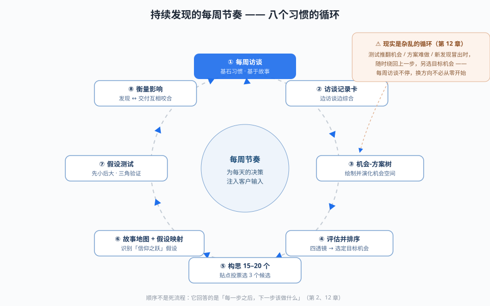
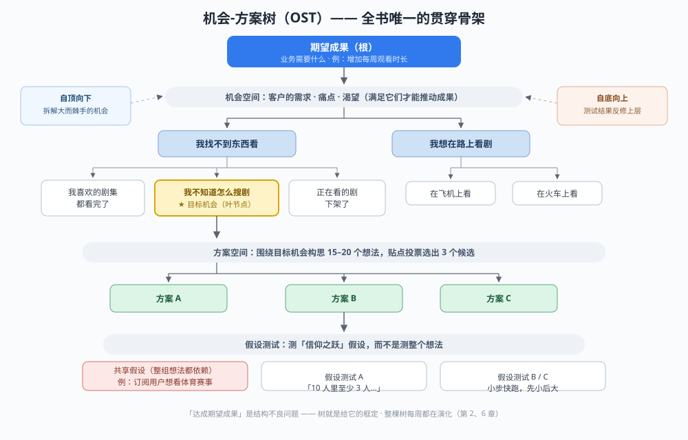
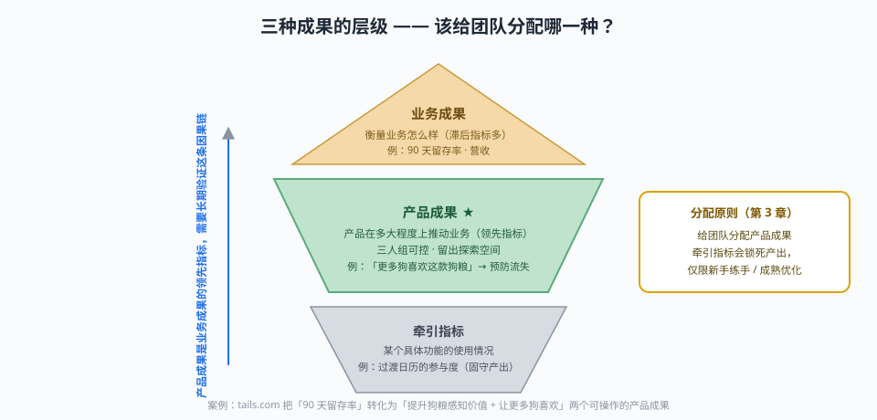
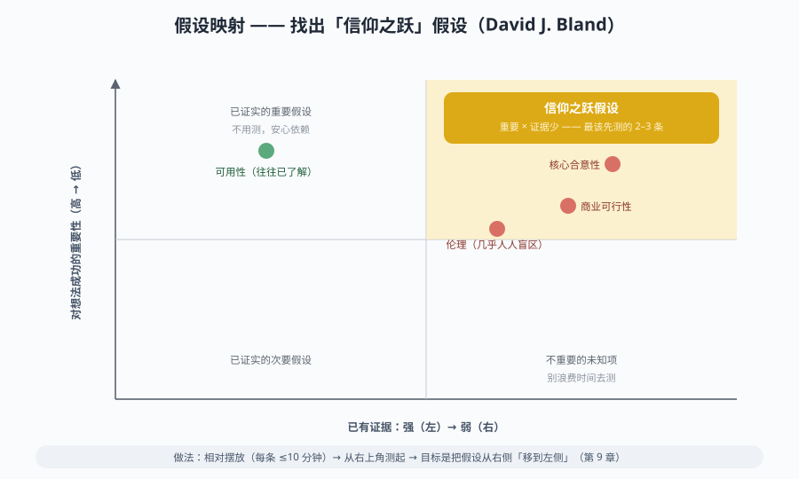
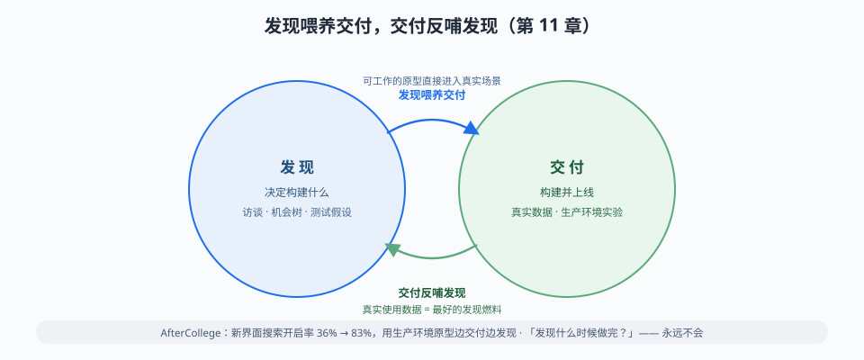

# 《持续发现习惯》阅读笔记

> 原书：*Continuous Discovery Habits*，Teresa Torres，2021
> 笔记说明：不按原书章节顺序，按全书内在逻辑重新组织；所有观点、案例、研究均出自原书（括号内标注出处章节），无自行演绎。
> 配图：`assets/` 目录下 5 张 SVG，可在支持图片的 Markdown 查看器中直接显示。

**一图流总览**（全书方法的运转方式）：



## 一句话总结

产品发现不该是一次性项目，而是一组**每周都在运转的习惯**：以成果为导向，持续访谈客户，把「机会空间 → 方案空间 → 假设测试」可视化在一棵树上，用比较与对照代替爱上第一个想法，用小测试快速降风险——最终让团队每天的产品决策都能接上客户输入。

---

## 1. 全书在回答什么问题：什么是「持续发现」

产品工作分两半：**发现**（决定构建什么）和**交付**（构建并上线）。多数公司重交付、轻发现——只考核按时按量交付，不问构建的是不是对的东西；团队上线后才发现「发布的功能没人用、改版后指标纹丝不动」（第 1 章）。

作者给出持续发现的**工作定义**，四个条件缺一不可：

1. 至少**每周**与客户保持触点；
2. 由**正在构建该产品的团队**亲自来做（不外包给研究公司）；
3. 其间开展**小规模**研究活动；
4. 始终以**追求某个期望成果**为目的。

关键洞察：团队每天都在做决策。如果一个月才接触一次客户，就等于一个月都在没有客户输入的情况下做决策（第 1 章）。

**这套方法的设计对象是产品三人组**（产品经理 + 设计师 + 工程师，可扩展为四/五人组）。PM 带业务语境，设计师带设计功底，工程师带技术功底，三人共同对「为客户创造价值的同时为业务创造价值」负责。加人要付代价：参与决策的人越多，决策越慢——决策速度与包容性之间要平衡（第 1 章）。

**采纳前先换六种心态**（第 1 章）：成果导向、以客户为中心、协作（拒绝竖井与阶段门）、可视化（画出来——引 Barbara Tversky 的空间认知研究）、实验思维（像科学家一样识别假设、收集证据）、持续（从项目心态到持续心态）。

> 背景：这套方法是作者离开创业公司、做了 7 年产品发现教练之后，从她 12 周教练项目里沉淀出来的——教的就是 PM、设计师、工程师如何**就「做什么」做出团队决策**（引言）。

---

## 2. 全书的方法骨架：机会-方案树（OST）



树的四层结构（第 2 章）：

```
期望成果（根）—— 业务需要什么
   ↓
机会空间 —— 客户的需求、痛点、渴望（满足哪些能推动成果）
   ↓
方案空间 —— 候选解决方案
   ↓
假设测试 —— 验证哪个方案真的可行
```

「机会」这个词是刻意选的，不用「待解决问题」——因为大量产品满足的是**渴望**而非修复问题（Disneyland、冰淇淋、山地车：把它们硬塞进「需求」里，读书、吃菠菜、健身也许是更有效的替代方案）（第 2 章）。

为什么需要这棵树：「如何达成期望成果」是一个**结构不良问题**（ill-structured problem，没有唯一正确答案，大量功夫花在框定问题上）。树的两大根本作用：

- **框定问题**：成果约束了值得探索的机会，机会约束了值得考虑的方案。反例是富国银行（Wells Fargo）：只设「提高人均账户数」的成果而不结合客户视角，激进配额 + 高压激励最终逼出欺诈开账户丑闻——**成果被做歪了**（第 2 章）。
- **建立共同理解 + 管理利益相关者**：把思考画出来，而不是口头争论；向利益相关者展示「我们是怎么得出结论的」，而不是只甩结论（第 2、13 章）。

OST 的七大好处（第 2 章）：化解业务需求与客户需求的紧张关系、建立并维持共同理解、养成持续心态（把大机会拆成串行小机会逐个交付）、解锁更优决策、解锁更快的学习循环、建立对「下一步做什么」的信心、让利益相关者管理变简单。

两个容易忽略的纪律：

- **自顶向下和自底向上同时演化**：假设测试的结果会反过来修正机会空间甚至成果的定义；方案测试失败时不该只跳到下一个想法，而要先问「我对客户的哪些理解出了偏差」，修正好机会空间再想新方案（第 2 章）。
- **问题空间与方案空间协同演化**（Nigel Cross 的专家设计师研究）：别拿组织角色当借口切断两者——「问题归 PM、方案归设计/工程」在实践中必然崩塌（第 2 章）。

---

## 3. 习惯链条之一：从产出转向成果

**成果 = 对客户和业务产生的影响，产出 = 你交付的东西**（引 Josh Seiden）。富国银行的故事说明：成果心态若不与以客户为中心结合，会直接做歪（第 2、3 章）。



三种成果要分清（第 3 章，tails.com 狗粮定制订阅案例）：

| 类型 | 定义 | 例子 |
|------|------|------|
| 业务成果 | 衡量业务怎么样（多为滞后指标） | 90 天留存率 |
| 产品成果 | 产品在多大程度上推动业务（领先指标，三人组可控） | 「更多狗喜欢这款狗粮」 |
| 牵引指标 | 某个具体功能的使用情况 | 过渡日历的参与度 |

要点：

- **给团队分配产品成果，别分配牵引指标**——牵引指标把团队锁死在一个产出上：万一客户根本不买账「过渡日历」，就没有探索余地。仅有的两个例外：新手团队练手（优化挑战比开放探索好上手）、成熟产品的优化型团队（大问题已有答案，专注优化已知关键方案）（第 3 章）。
- **成果应由产品负责人与三人组双向协商**：负责人带全局视角与战略意图（可以收窄客户群/区域，但不能收到变成牵引指标的程度），三人组回报「这段时间能让指标移动多少」（如：三个月内把该客户群喜欢狗粮的狗提升 10%），此刻不必承诺建什么。研究支持：参与设定自身成果的团队更主动、表现更好（Green et al., 2017）（第 3 章）。
- **稳定三人组 + 稳定成果**：每次搅动团队或更换成果都要缴「学习税」（第 3 章）。
- 面对新指标，先设**学习目标**（发现能推动参与度的机会），再设 S.M.A.R.T. 绩效目标——目标设定研究显示：对复杂任务，没有策略支撑的挑战性目标反而降低绩效，「尽力而为」更有效；只有先识别出策略，绩效目标才带来提升（第 3 章）。
- 四个反模式：①同时追多个成果（摊得太薄）；②在成果间来回摇摆（永远吃不到学习曲线红利，专注几个季度）；③三人组各扛各的个人目标（PM 扛业务、设计扛可用性、工程扛性能——目标与薪酬挂钩时最常见，协作不可能发生）；④把产出误当成果（「推出 Android 应用」vs「提升移动端参与度」；判据：你的成果代表一个数字吗？追问它带来的影响——「提高课程评价数量」被追问出「更多学生看到有评价的课程」后，正确成果其实是「提高包含评价的课程浏览数」）（第 3 章）。
- 同时要**监测健康指标**：在「不负面影响满意度」的前提下提高获取——这就是对富国银行教训的制度化防范（第 3 章）。

---

## 4. 习惯链条之二：发现机会（可视化 → 访谈 → 机会树 → 排序）

### 4.1 先画出你以为你知道的（旅程图）

面对新成果，三人组**各自单独画**客户当前体验的旅程图，再合并成共享版。为什么先各自画再合并：防群体思维（群体往往以能力最弱成员的水平表现）；每个人都有独特视角——案例三人组中，PM 最懂客服工单里的投诉、设计师（新人）捕捉到客户的困惑与不安、工程师还原了完整流程并发现「前一步填错会让人脱轨」（第 4 章）。

关键纪律：

- **画出来，别写出来**——语言含糊，两个人以为达成一致其实各怀想法；画图迫使具体化、暴露思考空白。「绘画是工具箱里的魔法工具」（第 4 章）。
- **画客户的体验，不是产品的逐屏流程图**：Netflix 例子中要画「客户如何用视频娱乐自己」——怎么听说内容、怎么决定、和谁一起、在哪卡住——而不是逐屏线框图（第 4 章）。
- **范围划定是战略决策**：太宽（「客户如何娱乐自己」）会被淹没，太窄（「客户如何用我们的服务」）会掐断外部灵感；「客户如何用视频娱乐自己」是合理中间态。没有唯一正确范围，关键是团队对话对齐（第 4 章）。
- 地图是假设不是事实，须随访谈持续演化——否则哪怕面对同一份访谈，各人的理解也会很快分道扬镳（第 4 章反模式）。

### 4.2 持续访谈：全书最核心的基石习惯

**为什么不能直接问客户要什么**（第 5 章，全书最有说服力的一段论证）：

- 问「你买牛仔裤考虑什么？」她答「合身」；问「讲讲上次买牛仔裤」，实际是「品牌 + 打折 + Amazon 网购」。**人们说的理想行为和实际行为系统性不一致**，而且不是撒谎——大脑不擅长回答直接事实性问题（调查性访谈研究：Fisher & Geiselman 等）。
- 引 Gazzaniga 裂脑实验的「**左脑解释器**」：左半球在根本不知道原因时编造一个连贯理由——而且我们全都有这个机制，不只裂脑患者。引卡尼曼：「你很少被问住」；自信反映的是故事的连贯性，不是真伪。
- 作者自己踩过的坑：基于客户说「想挖被动候选人」构建了产品，失败——招聘人员的绩效取决于快速填补职位，实际行为全是主动候选人。「好比因为顾客说想吃健康，就在麦当劳对面开沙拉吧，然后疑惑沙拉为什么输给 Big Mac」（第 5 章）。

**正确做法——基于故事的访谈**：

- 区分**研究问题**（想学什么）和**访谈问题**（怎么问）；抛弃多页讨论提纲。每次访谈的首要研究问题固定为：「对这位客户来说，最重要的需求、痛点和渴望是什么？」——**让访谈对象定方向**，客户在乎的优先于你要学的（第 5 章）。
- 问题形态：「跟我讲讲你上一次……的经历」——具体事例的记忆远比泛化概括可靠。
- 范围可宽可窄：窄问题（「上一次用我们的服务」）优化现有产品；宽问题（「上一次看任何流媒体」）带出竞品故事；最宽（「上一次享受娱乐」）发现新机会/新市场，揭示品类在跟什么竞争（电影院、演唱会、聚会）（第 5 章）。
- 需要下功夫**挖掘**完整故事：开头就声明「请把完整故事讲给我，别漏细节」（重置 50/50 对话预期），用时间性提示（「从头开始讲」「然后呢」「在那之前发生了什么」）、场景、人物、挑战来挖；对方一泛化（「我通常……」）就温和拉回具体实例（第 5 章）。
- **访谈黄金法则**：让访谈对象谈他们最关心的话题。碰上不配合的，别勉强——持续访谈的节奏下，一次失望的访谈很容易被下一位冲掉（第 5 章）。

**边访谈边综合——访谈记录卡**（第 5 章），一页纸包含：

| 元素 | 作用 |
|------|------|
| 照片/视觉元素 | 记忆的钥匙 |
| 难忘引语（一字不差） | 例：「我比较老派。敏捷那套对我没用。」 |
| 客户快速信息 | 细分、注册时长、行为特征——把故事放进情境 |
| 洞察 | 不确定怎么用的先记下，常会长成机会 |
| 机会 | 把功能请求转译为需求：「我希望直接说出电影名」→ 问「这会为你带来什么」→「不想打长标题」→ 语音搜索、输入自动补全……更大的方案空间 |
| 手绘故事图 | 记住故事 + 为跨访谈找模式做准备 |

**节奏与招募**（第 5 章）：

- 每周至少一位客户；**保持习惯比开始-停止-重启容易得多**。Simply Business 的 Raya Raycheva：「周二毙掉一个机会，周三选定新的，周四用早已排好的访谈了解它。」
- 自动化招募三法：产品内嵌招募（「花 20 分钟聊聊，换 20 美元」）；请销售/客户成功/支持团队按触发条件转介（取消订阅来电、询问某功能……给话术，让他们能轻松说「好」）；难触达人群（医生、CEO、小市场）用客户顾问委员会做月度一对一访谈（风险：不代表更广市场，须搭配其他招募法）。
- **三人组一起访谈**：不许任何人垄断「客户代言人」——否则决策时「客户想要 X」就成了那个人的专属武器。不同角色天然听到不同重点（Netflix 访谈案例：PM 抓「热门全是电视剧」、设计师抓「不会搜电影名」、工程师抓「推荐全是儿童电影」）；屋子里视角越多元，每次访谈产出越大。一次访谈可以只有 5 分钟，人人抽得出时间。

### 4.3 绘制机会空间地图

把访谈记录卡里的机会放到树上，用**父子关系**（子集：解决子机会部分解决父机会）和**兄弟关系**（相似但互不重叠：解决一个不必解决另一个）组织。好处：把「这部剧好看吗？」这类大而棘手的问题拆成一串可解决的小问题，随时间逐步交付价值——先解决「这部剧有谁参演？」这种容易且大量观众真在用的，一点点啃掉大问题（第 6 章）。

组织步骤（第 6 章）：

1. 用旅程图的时间节点做**顶层机会**（流媒体例：决定看什么 / 选择看什么 / 正在观看 / 观看终点）；旅程图不成熟就改从访谈故事的画稿里找反复出现的关键节点。
2. 逐一回顾记录卡，三问过滤才上树：是需求而非方案吗？出现过不止一次吗？能推动成果吗？
3. 相似机会：是兄弟就找父机会（父机会没人提过、直接补上也没问题）；是同一件事就合并；归好后逐层向上收拢。

机会的六个反模式（第 6 章）：

| 反模式 | 说明 / 判据 |
|--------|-------------|
| 公司视角框定 | 没有客户会说「我想多订几个订阅」，但会说「我想看到更多有意思的内容」；自查：「我们在访谈中听到过这个吗？」 |
| 纵向机会 | 父→子→孙单链堆叠：要么合并成一条，要么补漏掉的兄弟机会 |
| 太不具体 | 「太难了」「很方便」→「用遥控器输入电影名很难」 |
| 伪装成机会的解决方案 | 判据：解决它是否**不止一种方式**？「希望快进跳广告」→ 背后是「我不喜欢广告」（做有趣广告/快进/无广告订阅） |
| 把情绪本身当机会 | 情绪是路标：记「我讨厌每次买剧都要输密码」，而不是「我很沮丧」 |
| 一个机会多个父节点 | 说明框定太宽，按时间节点拆成多个机会 |

结构要「恰到好处」：30 分钟画完=想得太浅；纠结几小时=过了。结构会不断「被建立、推翻、再重建」（Barbara Tversky）（第 6 章）。

### 4.4 为机会排序：策略发生在机会空间

核心论点（引 Melissa Perri「构建陷阱」）：产品策略不在解决方案空间，而在机会空间。多数团队跳过机会决策直接给功能排序，策略沦为追赶竞争对手——「而无论我们多么努力，似乎总是越落越远」。作者在 Mind the Product 大会上的收场金句：「**你离成功永远不止一个功能的距离……而且永远也不会只是这一个功能。**」（第 7 章）

排序方法（第 7 章）：

- 一次只聚焦**一个叶节点机会**：沿树自顶向下，把兄弟机会比较对照、层层下钻直到没有子机会——单是「评估顶层机会并排序」这一个决策，就让你可以合法忽略树的其他分支。这与看板「限制在制品」同理（奥卢大学研究：限制在制品是交付质量提升的关键要素）（第 7 章）。
- **四组评估透镜**：

| 透镜 | 回答的问题 | 示例 |
|------|-----------|------|
| 机会规模 | 多少客户 × 多频繁（粗估即可，用行为数据/工单/记录卡） | 别陷入数据马拉松 |
| 市场因素 | 基本门槛 vs 差异化优势；外部趋势（例：剪线族 → 优先「想看体育直播」） | 缺门槛项会重创销售 |
| 公司因素 | 战略/价值观/政治成本/自身优劣势（公司、业务群组、团队三层） | 不愿烧政治资本就另选 |
| 客户因素 | 对客户多重要 × 对现有方案多满意（引 Dan Olsen 的重要性/满意度框架） | 优先「重要且不满意低」 |

- **不要打分加权**——这是主观相对判断；把结构不良问题数学化，会让人相信存在唯一正确答案、从而停止思考。让四个透镜喂给团队一场健康辩论（第 7 章）。
- 这是**双向门决策**（引 Bezos 的一级/二级决策）：选目标机会只是承诺「用发现工作探索它几天/几周」，随时可转身。研究（Bullens et al., 2013）：把决策视为可逆转的人，决策后仍继续批判性评估、更能看到所选方案的负面属性——**可逆决策观本身就是对抗确认偏误的机制**（第 7 章）。
- 反模式：为更多数据拖延（设时限：一两个小时，最多一两天）、只用一组因素、带着预设结论往回倒推（第 7 章）。

---

## 5. 习惯链条之三：发现解决方案（构思 → 假设 → 测试）

### 5.1 超强构思：先独自、再分享、循环

创造力研究（第 8 章）：

- 创造力三标准：**流畅性**（数量）、**灵活性**（多样性）、**独创性**（新颖性）；流畅性与后两者正相关——**数量是质量的预测指标**（引 Leigh Thompson）。最具独创性的想法出现在构思**临近结束时**，不是第一批。
- 但头脑风暴小组产不出这个效果：四个削弱因素——社会惰化（独自工作时更卖力）、从众与自我审查、生产阻断（正要说被插话打断忘了要说什么）、下行规范设定（群体被最弱成员拽低）。元分析（Mullen et al., 1991）结论：**独自构思的个人完胜头脑风暴小组**。
- 拥护者为什么迷信头脑风暴：**群体生产力错觉**（Nijstad et al.）——小组卡壳少（认知失败少），自我感觉良好，实际产出更少、更雷同。
- 出路（Korde & Paulus：独自与分享交替能提升后续质量）：**个人自己构思，但从同伴的想法中汲取刺激**——先独自 → 分享 → 回去继续独自，循环。

实操流程（第 8 章）：

1. 回顾目标机会（确认是叶节点、背景人人清楚）；
2. 独自生成想法（卡壳就休息，善用**酝酿**——大脑在停止有意识思考后继续后台加工；跨行业找类比：Velcro 源于苍耳；招聘网站可看电商/酒店比价/保险报价怎么解决「评估选项」；想极端用户：重度/首次/残障/偏远地区；故意想天马行空的——能让可行想法变得更好）；
3. 团队分享并即兴发挥（实时会或 Slack 异步均可）；
4. 重复 2–3，直到 **15–20 个想法**；
5. 先剔除不回应目标机会的，再**贴点投票**（每人 3 票，唯一标准=回应目标机会的程度；多轮直到选出 3 个；确保每个想法至少有一位强拥护者）。

为什么选出 3 个而不是 1 个：为后面「比较与对照」铺垫，用原型和假设测试继续缩小——群体评估在行、群体构思不行，所以评估交给群体，生成留给个人（第 8 章）。

反模式：没有纳入多元视角（可请利益相关者参与，先给足机会语境）、全是同一想法的变体、把构思限定在一次会议上、选出没回应目标机会的想法（别推翻上一章的战略决策）（第 8 章）。

### 5.2 识别隐藏假设：想法之下的五个类别

波特兰经济适用房案例（第 9 章）：为帮助绅士化流离失所家庭建了以一居/两居室为主的公寓——而多数流离失所家庭是四口以上；项目多年卖不动，数千万美元打水漂。**一个没人检验的假设毁掉整个项目**。背后是**确认偏误**（只找佐证，忽略负面反馈）和**承诺升级**（投入越多越死心塌地，加之要向利益相关者捍卫想法，越来越执着）。

关键转变：**测试假设，而不是测试想法**——这是能达到 Marty Cagan 说的「熟练团队每周 10–20 次发现迭代」的前提（单个想法做不到：不可能为三个想法各建一个可测试版本再 A/B）。而且**投入在一个想法上的时间越少，越不容易爱上它**（第 9 章）。

五类假设（第 9 章）：

| 类别 | 问的问题 | 易踩的坑 |
|------|----------|----------|
| 合意性 | 有人想要它吗？客户会做我们要求的行为吗？ | 好用 ≠ 想要（合意性与可用性常被混为一谈） |
| 商业可行性 | 我们该建它吗？收入 > 成本（也含亏损引流品的设计逻辑） | 最常被忘的一类 |
| 可行性 | 我们能建它吗？技术 + 法务/安全/合规/文化 | 有棘手可行性问题时，团队容易跳过「先测想要」 |
| 可用性 | 好用吗？能找到、理解、做到吗？无障碍吗？ | 最被重视，但别独大 |
| 伦理 | 有没有潜在危害？ | **整个行业的盲区** |

四种挖假设的方法（混合搭配，专补团队盲区）（第 9 章）：

1. **故事地图**（引 Jeff Patton）：假设方案**已存在**，画出每个角色（可含聊天机器人这类界面角色）获得价值必须做的每一步，按时间横向排；沿每一步生成合意性/可用性/可行性假设——一个 5 步地图轻松产出 20 条（流媒体体育直播的例子全程演示）。
2. **事前验尸**（Gary Klein）：设想「六个月后产品**已经**彻底失败了，出了什么问题」——必须用确定语气才有效（前瞻性后见之明研究：Mitchell et al., 1989，只有确定的结果才能产生更好的解释）。
3. **沿 OST 连线反推**：「方案能解决机会，因为……」「解决机会能推动产品成果，因为……」「产品成果能推动业务成果，因为……」——每层推理都是一条可检验假设；特别用来挖商业可行性假设。
4. **追问潜在危害**：数据问题清单（收集什么/客户知道吗/与谁共享）、成瘾性、排他性（假设了有钱有闲有网会把谁排除在外）、网络喷子会怎么滥用；杀手问题——「**如果 NYT/WSJ 在头版报道我们的内部讨论和数据用法，是好事吗？如果不是，为什么？**」

**假设映射**（David J. Bland）：



两轴 = 已有证据强弱 × 对成功的重要程度；右上角即「**信仰之跃**」假设——每个想法先测那 2–3 条。快速做（每个想法 ≤10 分钟，研究作者经验：快做的团队与反复斟酌的一样好），相对摆放即可（第 9 章）。

反模式：假设生成太少（简单想法也能有 20–30 条，大多无害但没挖出来就没法排）、写成否定句式（要用「客户会记住密码」这种你希望它**为真**的句式——正向表述更好测）、不具体（「客户会有时间」→「客户会花时间浏览入门页上的所有选项」）、偏科（多数团队擅长可用性忘了合意性，或反之；伦理几乎人人盲区）（第 9 章）。

### 5.3 测试假设：模拟体验、评估行为、小步迭代

**同时测试三个想法的假设**，而不是一次测一个想法——否则确认偏误和承诺升级卷土重来。共享假设（如「订阅用户想看体育赛事」是三个想法共同依赖的）可以一次评估整组想法；测过一两轮后，共享假设还能帮**催生更好的新想法**（第 10 章）。

设计框架：**假设 → 模拟一个时刻 → 事先定义成功标准**（第 10 章）：

- **模拟的是客户生活中的具体时刻**（「打开主界面会选什么」），让参与者有机会表现出符合或不符合假设的**行为**——而不是问他们会怎么做（问出来的只是理想自我）。
- **成功标准必须事先、用具体数字定义**（「10 人里至少 3 人」，不是「一部分人」也不是「70%」）：①保证团队对结果解读一致，不会一人觉得可信、一人存疑——那样这次测试等于没学到东西；②预先堵住确认偏误（不事先定标准，大脑解读时专挑佐证）。数字怎么定是主观权衡：用尽量少的人测，但让团队能放心行动；模拟不完美就调门槛补偿。
- **早期信号 vs 大规模实验**：先花一两天跑 10 人小测试，有正面信号才升级（例：真主页加版块推介一场赛事 → 点赞/点踩冒烟测试 → 500 人里至少 100 人点赞）。在收到「走在正确轨道上」的信号之前，不值得投入两周和利益相关者许可的代价。**大多数学习来自失败的测试**——小测试让你更早、更便宜地失败和转向（引卡尔·波普尔：「好的测试能淘汰有缺陷的理论；我们依然活着，还能再猜一次」）。
- **假阳性/假阴性都可承受**：多样化招募 + 多个数据点 + **三角验证**（多种方法测同一假设）摊薄风险；三个想法都测同一假设时，全是假阴性的概率很低；最坏情况（错杀一个真机会）代价也不大——能解决目标机会的想法成百上千，不存在唯一正确答案。
- **不是科学实验**：科学家在创造新知识、追寻真理，要几十年复现；产品团队只**降低风险**——做刚好能降低公司承受不起的风险的研究，一点不多（第 10 章）。

工具箱三件套（第 10 章）：

| 工具 | 用法 | 注意 |
|------|------|------|
| 无主持用户测试 | 传原型 + 任务/问题，第二天收操作视频；过去几周 → 现在一两天 | 筛选招募对象 + 多样化；小众人群可传自有名单 |
| 单问题调查 | 快速检验一条假设；与原型模拟做三角验证 | 问过去的具体事例（「上周/上个月」），**不问未来行为** |
| 数据挖掘 | 自家数据库（例：多少用户搜过体育内容） | 埋头挖之前先定义评估标准 |

反模式：模拟过度复杂（第一轮测试要一两天内能跑，别做几周）、用百分比代替具体数字（「70%」模糊，10 人里 6 人算过没过会吵起来）、评估标准不完整（邮件测试要定义：多少人收到/等多久/「打开」还是「点击」）、找错测试对象（要切身体会过该需求 + 多样化，别找最容易触达或嗓门最大的）、故意在非理想情境测试（反而要在**最可能通过**的场景测——在最理想受众面前失败了，结论才不模棱两可）（第 10 章）。

---

## 6. 衡量影响：发现喂养交付，交付反哺发现



AfterCollege 案例（作者亲历，第 11 章）：入职第一周启动持续访谈，发现绝大多数应届生答不上所有求职网站都在问的两个问题（「想要什么类型的工作？什么地点？」）——22 岁的人不知道自己胜任什么、对地点很灵活。团队握有独家数据（学生申请行为 + 雇主需求），于是改为问「你学的什么」：用每个学习领域的已保存搜索粗略近似未来的机器学习推荐，几天内让可工作原型上线、真实流量小比例分流。

数据：旧界面 36% 的访客开始搜索（三分之一访客从不开始）；新界面 **83%**。浏览/申请略有下降但总体大幅更好。三条经验：

1. **别沉溺于成功的假设测试**——合意性成功 ≠ 推动了成果。预期成果不是搜索开启数，而是「通过平台找到工作的学生人数」；浏览/申请并不总是录用的领先指标。所以他们继续分流量，直到确认新界面下找到工作的概率不降反升。**产品成果到业务成果的因果链是一条需要长期验证的理论**——如果观看分钟数上升而留存率没动，就得换一个真正推动业务成果的产品成果（流媒体例：先与本地频道合作直播一场赛事，测真实影响，绕开整包内容的商务/法务成本）。
2. **埋点从小处开始**：只为本周假设测试的评估标准埋点，别把埋点做成瀑布项目（几周争论事件命名后才开始）。数「人数」还是数「动作次数」取决于问题——「一个人做很多次的价值 = 很多人各做一次吗？」数人数看多少人走向成功，数动作看每个人要多大努力才能成功。
3. **不怕衡量难的东西**：签约发生在平台之外，团队就利用学生不懂面试谈判这一点，发申请后 21 天跟进邮件（四个选项：没回音/进面试/收录用/已入职，顺带给建议），回复率从 5% 迭代到 14% 再到 37%。「职位申请数」是个容易被操纵的指标（鼓励多申请 ≠ 提高成功率），不能因为它好量就只量它。

所以「发现什么时候做完、什么时候交给交付」这个问题的答案是：**发现永远不会做完**；两者不是先后阶段，而是互相咬合的循环（第 11 章）。

三个反模式：卡在「什么都想衡量」上、过度聚焦假设测试忘了沿 OST 反推商业可行性、忘了测试产品成果与业务成果之间的关联（第 11 章）。

---

## 7. 管理周期：发现不是线性流程，是意外驱动的循环

第 12 章用四个真实团队故事说明：发现功夫不在「走流程」，而在**何时绕回上一步**：

- **Simply Business**（英国保险）：访谈+市场研究+政府数据都指向「账款拖欠」小企业最头疼的痛点，选为目标机会几乎毫无悬念。三个方案的假设测试不到一周上线，然后**全部失败**：客户不想让第三方插手收款——「我和客户关系很好，把自己摘出去收款反而损害关系」。机会真实，但不是他们当下能解决的。因为每周访谈没停，换目标机会不是从零开始。**发现工作的果实，往往正是决定不构建某样东西省下的时间**——只投了一周，对比多少团队花几个月构建错误功能。
- **CarMax**（二手车零售）：机会「我希望确信这辆车车况良好」。客户口头欢迎竞品的「外观瑕疵可视化」，但 CarMax 的价值主张恰是瑕疵已在整备流程修好。团队先测「外观整备对购买决策的影响」（同一辆车：有瑕疵便宜 1000 美元 vs 无瑕贵 1000 美元——证实人们愿为整备付钱），再用通用数据（图片浮层「无明显凹陷」）几轮实验都达不到门槛——消费者仍要**车辆级**信息。结论：当下能做的做完了，机会**推到未来**，转攻另一个当下机会，同时用发现工作为将来车辆级方案的投资争取理由。机会选择有时间性；速赢行不通时，用发现工作为自己赢得啃难方案的资格。
- **FCSAmerica**（农业信贷）：业务想要自助服务，客户却珍视与财务专员的信任关系——看似冲突。团队没有浅层地下结论（本可就此放弃数字化战略），而是挖出「**我买得起什么**」这个客户本来就愿意线上完成的环节，加了聊天功能做实验——客户在申请流程的这个阶段**不想跟人交谈**（怎么改措辞换图都直接关浏览器）。两个结论：计算阶段不需要真人介入；该机会可以数字化解决。最终长成 FarmLend：客户保留与专员的信任关系，更多流程在线完成。
- **Snagajob**（小时工市场）：以提升 NPS 为成果，意外发现全新机会「**我联系不上我的候选人**」——招聘经理打十个电话一个也不接。这是**全行业无人理解的大而棘手问题**，难在不知从哪下手。做法：实地走访零售店餐厅，免费当 30 天「私人招聘助理」，逐个拆小机会：打电话没用（候选人是移动优先一代，语音信箱都没设好）→ 打电话**之前**先发短信 → 短信追问 + SurveyMonkey 表单链接（真人 vs 机器人发短信都是权宜之计，方案必须对双方都可行）→ 面试排期 → 面试爽约……回头看说不清哪个改动带来了成功，**是一个机会一个机会啃完整棵树，累积出大影响**。

四个反模式：对当下交付不了的机会过度承诺、回避难题（把快速迭代误当只做简单方案）、从浅层认知草率下结论、小改变还没滚雪球就放弃（第 12 章）。

---

## 8. 展示你的工作：别跳到结论

Airship 案例（第 13 章）：被要求照抄竞品「客户旅程构建器」，团队靠发现做出差异化（发现现有产品太复杂、营销人员不知从何入手、建出的旅程冗余难维护），但差点被坚持「客户要什么就给什么」的销售团队否掉——靠领导层同意一个月小范围 beta，用成功说服了所有人。教训：**光做好发现不够，必须带着利益相关者走完你的思考路径。**

方法（第 13 章）：用同一套可视化工具向利益相关者展示工作——

1. 从树的顶端讲起：提醒期望成果，问「自上次一致以来有变化吗」；
2. 分享机会空间（突出顶层机会，只在被问处深入；问「漏了什么吗」并记下建议，以后访谈核实）；
3. 分享评估与排序的每个决策点，问「你会怎么选」并认真考虑；
4. 用记录卡让利益相关者与客户共情——**在分享方案之前必须先让他们充分理解机会**，这是把对话从偏好移开的锚；
5. 分享候选方案（他们的想法可能比团队更多样，别怕替换）；
6. 分享故事地图/假设清单/假设映射/测试结果，请他们补充——这正是他们独有专长的价值；
7. 重复。**在工作中就一路分享，而不是最后全盘托出**；按对象调颗粒度。

为什么不直接讲结论：把对话框定在解决方案空间，等于邀请观点对决——「如果利益相关者职位比你高，获胜的大概率是他们的意见」。这就是 HiPPO 问题的自我制造（第 13 章）。

反模式：只说不展示（**知识的诅咒**——你的结论对你显然，对别人不是；放慢脚步从头发起）、用细节洪流淹没对方（CEO 只需知道：团队在找到客户喜爱、能推动成果的方案）、当面论证「你的想法行不通」（记到树上/想法待办；或陪他画故事地图、生成假设，让他**自己**得出结论）、只想打赢理念之争（选择你的战场：把理念之战留到以后或永远不打，专注眼前决策，用结果展示工作方式的好处）（第 13 章）。

---

## 9. 底层心理机制（贯穿全书的暗线）

全书反复出现的不是工具，而是**人类决策的失效模式**及对策——这是这本书比一般方法论书耐读的原因：

| 偏误/陷阱 | 出处 | 书中的对策 |
|-----------|------|-----------|
| 确认偏误（只找佐证） | 卡尼曼/希思兄弟 | 事先定义成功标准；同时测一组想法的假设；把决策视为可逆转（Bullens 研究） |
| 承诺升级（投入越多越执着） | 西奥迪尼《影响力》 | 三个候选方案并行；测假设而非想法（投入少 → 不易爱上） |
| 过度自信 / 分析瘫痪 | Heath《Decisive》四决策反派之一 | 「智慧 = 对所知的信心 + 对可能错的怀疑」的平衡（Karl Weick）；双向门决策观 |
| 「要不要做」式决策 | Heath《Decisive》 | 换成「比较与对照」式问题（这批机会哪个优先？还有别的方案吗？）——最常犯的产品决策错误 |
| 群体思维 / 群体生产力错觉 | Leigh Thompson / Nijstad | 个人先独自画图/构思，再共享；贴点投票（评估行、构思不行） |
| 左脑解释器（编造连贯但不真实的理由） | Gazzaniga | 访谈只挖具体故事，不问直接问题 |
| 分析瘫痪 | 多处 | 给决策设时限（一两个小时，最多一两天）；大多数发现决策是可逆的 |
| 知识的诅咒 | Heath | 向利益相关者展示工作而非说结论；扮演「聪明的过滤器」 |
| 富国银行式「只盯一个指标」 | 第 2 章 | 成果 + 健康指标双轨监测 |

---

## 10. 个人怎么起步（第 14 章）

作者反复强调：她几乎从没得到过高层的支持去做发现——在 HighWire Press 任由客户决定构建什么、在初创公司看着 VP 管理「从 CEO 那里来的功能需求电子表格」、在另一家客户提交什么就做什么。22 岁第一次客户会议上被当面说「这太糟糕了」，是她贴近客户的起点。核心是**自主意识**：你比你以为的更有权决定自己怎么工作（她 32 岁成了别人创办公司的 CEO）。

- **先组三人组**：哪怕公司不支持，也从一个小请求开始拉设计师和工程师参与一个小决策，逐次迭代；没设计师就找「有设计思维的人」（化繁为简、接触过客户、有同理心）。
- **基石习惯 = 每周访谈**（引杜希格《习惯的力量》）：养成了每周访谈的团队会自然更多地做原型、做实验、怀疑已知、测试假设——这一个习惯带动其他一切。
- **倒推**：被派活时问「这个方案会为客户带来什么？」「会为业务创造什么价值？」——不断打磨到得到一个清晰的指标，那就是你的成果；这两个问题顺手搭出第一棵机会-方案树。再给功能埋点、发布后和利益相关者做影响复盘（预期影响 vs 实际影响），功能不达标时就是发声的最佳时机（但别摆「我早说过」的姿态）。
- **用回顾改进流程**：问「这个冲刺我们学到了什么让我们意外的？」「我们怎么才能更早学到它？」——意外不是失败，是改进流程的原料。
- 反模式：①「这套在我们这行不通」（作者：这些习惯在银行、医疗、零售、营销自动化、安全领域，从 2 人初创到数十万人企业**全部落地过**——注意力该放在你能做什么上）；②当「唯一正确方式」的布道者（不存在唯一正确方式，别让完美成为够好的敌人，下周比上周好就行）；③坐等许可（从和任何「像你客户的人」聊起：银行员工的朋友都有账户、做医院系统的亲戚里就有临床医生）。

---

## 附录 A：全书工具速查表

| 工具 | 干什么用 | 一句话用法 |
|------|----------|-----------|
| 旅程图 | 可视化团队对客户当前体验的共同理解 | 各自先画 → 探索差异 → 合并共享；画客户体验而非产品流程 |
| 访谈记录卡 | 边访谈边综合 | 照片 + 引语 + 快速信息 + 洞察 + 机会 + 手绘故事 |
| 机会-方案树 | 框定结构不良问题、共同理解、利益相关者沟通 | 成果 → 机会 → 方案 → 假设，自顶向下 + 自底向上演化 |
| 四透镜评估 | 机会排序 | 规模 / 市场 / 公司 / 客户，主观相对判断，不打分 |
| 贴点投票 | 构思后从 15–20 缩到 3 | 每人 3 票，唯一标准=回应目标机会 |
| 故事地图 | 让想法具体化 + 挖假设 | 假设方案已存在，画角色获得价值的每一步 |
| 事前验尸 | 挖假设（尤其商业可行性盲区） | 「六个月后它**已经**彻底失败了，出了什么问题」 |
| 假设映射 | 挑「信仰之跃」假设 | 证据强弱 × 重要程度，右上角先测 |
| 模拟测试 | 验证假设 | 模拟一个时刻 + 事先定数字成功标准 |
| 无主持测试 / 单问题调查 / 数据挖掘 | 执行工具 | 一两天内出结果；调查只问过去的具体事例 |

## 附录 B：反模式总清单（按主题归并）

- **成果设定**：多成果并行、成果摇摆、个人成果、产出当成果、只盯一个指标不管健康指标
- **可视化**：无休止争论细节（画出来）、用文字代替画、把地图当事实、学到新东西不更新
- **访谈**：依赖单人招募与访谈、问「谁什么为什么怎么何时」清单题、想起来了才访谈、甩几页笔记/录音给同事、攒一批访谈停下来综合
- **机会树**：公司视角、纵向机会、不具体、伪装成机会的方案、情绪当机会、多父节点
- **排序**：为数据拖延、只用一组透镜、预设结论往回倒推
- **构思**：缺多元视角、全是变体、限定在一次会议、选出不回应目标机会的想法
- **假设**：生成太少、否定句式、不具体、偏科（尤其伦理盲区）
- **测试**：模拟过度复杂、百分比代数字、评估标准不完整、找错对象、非理想情境测试
- **埋点**：什么都想衡量、忘测产品成果→业务成果的因果链
- **周期**：对交付不了的机会过度承诺、回避难题、浅层认知下结论、雪球没滚起来就放弃
- **利益相关者**：只说不展示、细节洪流、当面否定对方想法、打理念之战
- **起步**：「我们这行不通」、当正确工作方式布道者、坐等许可

## 附录 C：书中引用与推荐的外部书

- Heath & Heath《Decisive》——作者推荐所有 PM 读完本书后**第一本**读的书
- 卡尼曼《Thinking, Fast and Slow》——确认偏误与自信的来源
- Jeff Patton《User Story Mapping》、Melissa Perri《Escaping the Build Trap》、David Bland《Testing Business Ideas》（后三分之一是实验类型大全）、Laura Klein《UX for Lean Startups》（定性测试深入）
- 其他被引用：Drucker《The Essential Drucker》、Grove《High Output Management》、Doerr《Measure What Matters》、Wodtke《Radical Focus》、Croll & Yoskovitz《Lean Analytics》、Thompson《Making the Team》、Catmull《Creativity, Inc.》、Tversky《Mind in Motion》、Duhigg《The Power of Habit》、Cagan《INSPIRED》、Seiden《Outcomes Over Output》、Gottsfeld & Seiden《Sense & Respond》

---

## 11. 金句摘录（均为原书原句）

### 章首引言精选

> 「管理者必须把社会的需求转化为有利可图的商业机会。」—— Peter Drucker（第 2 章）

> 「如果给我一个小时去解决问题，我会花 55 分钟思考问题本身，再花 5 分钟思考解决方案。」—— 爱因斯坦（第 2 章）

> 「成果，是能够推动业务结果的人类行为的变化。」—— Josh Seiden《Outcomes Over Output》（第 3 章）

> 「自信是一种感觉，它反映的是信息的连贯性以及处理它的认知轻松感。」—— Daniel Kahneman《Thinking, Fast and Slow》（第 5 章）

> 「保持怀疑的状态，进行系统而持久的探究——这些是思考的要素。」—— John Dewey《How We Think》（第 6 章）

> 「结构是复杂的。它不断被建立、推翻、再重建。」—— Barbara Tversky《Mind in Motion》（第 6 章）

> 「『构建陷阱』是指组织陷入用产出而非成果来衡量自身成功的境地。」—— Melissa Perri《Escaping the Build Trap》（第 7 章）

> 「富有创造力的团队深知，数量是质量的最佳预测指标。」—— Leigh Thompson《Making the Team》（第 8 章）

> 「如果你只固守熟悉之物，就永远不会偶然撞见意料之外的惊喜。」—— Ed Catmull《Creativity, Inc.》（第 8 章）

> 「就假设自己正过度自信吧，然后给自己留出健康的安全余量。」—— 希思兄弟《Decisive》（第 9 章）

> 「好的测试能淘汰有缺陷的理论；我们依然活着，还能再猜一次。」—— 卡尔·波普尔（第 10 章）

> 「你的错觉，无论多么令人信服，都会在数据的冷酷光芒下凋零。」—— Croll & Yoskovitz《Lean Analytics》（第 11 章）

> 「领导者越了解团队所处的位置，就越会退后一步，放手让团队执行。」—— Melissa Perri（第 13 章）

### 作者 Teresa Torres 正文里的金句

> 「你离成功，永远不止一个功能的距离……而且永远也不会只是这一个功能。」（第 7 章）

> 「发现工作的果实，往往正是我们决定不去构建某样东西时所省下的时间。」（第 12 章）

> 「我们的目标不是追寻真理，而是降低风险。我们只需要做刚好能降低公司承受不起的那部分风险的研究，一点不多。」（第 10 章）

> 「绘画真的是你工具箱里的一件魔法工具，多用它。」（第 4 章）

> 「没人喜欢万事通。」（第 13 章）

> 「世界需要更好的产品，这要靠我们来实现。」（引言）

---

## 12. 读后最值得记住的五句话（原书观点的浓缩）

1. 你离成功永远不止一个功能的距离，而且永远也不会只是这一个功能（第 7 章开场演讲）。
2. 客户说的和做的系统性不一致——访谈只信具体故事，不信直接回答。
3. 最好的团队不是测试想法最多的团队，而是**每周测试 15–20 条假设**的团队。
4. 好的发现不能阻止失败，它只是降低失败的概率；失败仍会发生，要准备好接受自己可能错了。
5. 仅仅做好发现是不够的——没有把利益相关者带在身旁，一切工作可能付诸东流。

---

*笔记基于中文全译本（books/continuous-discovery-habits/cn/）整理，2026-09-10。*
