# 《逃离构建陷阱》读书笔记

**英文书名**：Escaping the Build Trap: How Effective Product Management Creates Real Value
**作者**：梅丽莎·佩里（Melissa Perri）
**出版**：O'Reilly，2018 年
**配图**：文中 11 张示意图在本页 `assets/` 目录下，浏览器中可直接显示。

---

## 写在前面

这本书回答一个所有做软件的公司都会撞上的问题：**为什么我们发了那么多功能，业务却毫无起色？**

作者给这种状态起了个名字——**构建陷阱**：组织深陷其中，用「产出」而不是「成果」衡量成功。产出是你生产出来的东西：功能数量、发布次数、团队的开发速度；成果是功能真正交付、客户的问题真正被解决之后才出现的东西。真正创造价值的是后者，但绝大多数组织测量和奖励的是前者。于是公司变成一台高效的交付机器：功能按期按预算上线，用户却根本不用，年底一算账，目标全部落空。

这本书最重要的判断是：**这不是团队的能力问题，而是组织系统的问题。**作者创业时是产品经理，最初也以为把功夫下在团队身上就够了——教产品经理怎么和客户对话、怎么用实验思维思考。她确实教会了很多人，可两年后回访时发现，这些人都滑回了旧习惯。原因五花八门，但指向同一处：

> 「我的奖金跟发布的功能挂钩。眼看就到年底了，我得赶紧把功能放出去。」
> 「我的经理因为我们没有发布而不满。我们明明在做用户调研，可他们看不到其中的价值。」

她由此推倒重来，把书写成了给整个组织看的指南。全书的结构是四个同心圆，由内到外：**角色、战略、流程、组织**。第一部分讲病理，后面的每一部分修一层。

贯穿全书的是同一个翻转，在四个层面上反复发生：

| 层面 | 停留在构建陷阱 | 走向产品主导 |
|---|---|---|
| 角色 | 产品经理写规格、维护待办列表 | 回答「为什么」，把业务目标与用户问题撮合起来 |
| 战略 | 功能清单 + 甘特图 + 年度预算 | 一套让人做决定的框架：愿景→战略意图→产品举措→选项 |
| 流程 | 为发布而构建 | 为学习而实验 |
| 组织 | 奖金挂钩交付、预算必须花完 | 奖金挂钩成果、像风险投资一样分阶段拨款 |

另有一条暗线也值得留意：**自主是用约束换来的**。战略层把方向收窄到少数几个目标，组织层给出允许失败的空间和明确的边界，团队才既敢做决定、又不会跑偏——约束太松和太紧同样让人动弹不得。

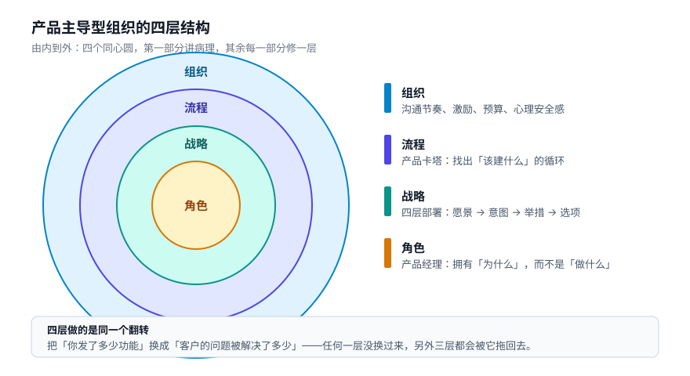

这份笔记按书的五个部分逐章记录要点、案例与数据，并在最后附上概念清单、书摘和评价。

---

## 全书结构

| 部分 | 主题 | 回答的问题 |
|---|---|---|
| 第一部分 | 构建陷阱 | 我们是怎么掉进去的？有哪些迹象？ |
| 第二部分 | 产品经理的角色 | 谁来做？这个岗位到底是什么、不是什么？ |
| 第三部分 | 战略 | 方向从哪来？如何层层部署到团队？ |
| 第四部分 | 产品管理流程 | 具体怎么找出「该建什么」？ |
| 第五部分 | 产品主导型组织 | 为什么很多转型走到最后一步会撞墙？ |

---

# 第一部分 构建陷阱

## 价值交换系统

公司之所以掉进构建陷阱，是因为误解了价值。作者从最基础的地方讲起：**公司靠价值交换运转**。一边是客户和用户，带着各自的问题、期望和需求；另一边是企业，做出产品或服务来解决它们。只有这些问题被解决，客户才算真正获得了价值——也只有到那时，他们才会把价值回馈给企业：金钱、数据、知识资本或声誉。

从企业角度看，价值很简单，就是能喂饱业务的东西；从客户角度看，价值很难衡量，而且**产品和服务本身并不自带价值——有价值的是它们替客户做了什么**。当公司没有吃透客户的问题，又不想下功夫去搞清楚，就会找一个容易度量的替身。于是「价值」变成了交付功能的多少，发布功能的数量成了衡量成功的主要指标。

这个替身一旦上位，就会顺着爬满整个系统：开发者因写出大量能跑的功能而受奖，设计师因像素级完美的设计而受奖，产品经理因写长篇规格文档（在敏捷世界里则是庞大的待办列表）而受奖，团队因发布海量功能而受奖。

一个例子很能说明问题。作者合作过一家做企业数据平台的公司，进去时它已有 30 个功能，待办列表里还排着 40 个。实测这些既有功能的用户使用情况，**客户只稳定使用其中的 2%**——可开发仍在继续加新功能，而不是回头重新评估已有的这些。它是怎么走到这一步的？三个原因几乎是所有陷阱公司的通病：

- **追赶竞品**。对手每发布一个功能就跟上，甚至不知道那些功能在对手那儿效果如何，管理层却硬要「对齐」。作者举了 Google+ 追 Facebook 的例子：从没能拉开差距，只剩下照抄。
- **销售过度承诺**。只要能签下合同，客户要什么给什么，结果堆出一大堆只满足单一大客户需求的一次性功能，而不是出于策略考量去做能覆盖许多客户的东西。
- **不做价值分析**。没有去分析这些功能各自如何带来独特价值、如何推进公司战略，只是被动反应地做东西。

可它依然自诩成功，因为它有上百万个功能，可以在用户大会上拿出来说嘴。**公司忘了自己的产品凭什么吸引客户。**

## 价值交换系统的约束

客户和用户不是活在真空里的——他们会受社区、家人、朋友影响，也会受手边能用的其他技术影响，所以需求和机会都在不断演化。这些外部环境公司控制不了，能做的只有理解它们。但企业对自己的约束——对的人、对的流程、对的战略、文化、政策——握有完全的控制权。

作者用一个调查说明大多数公司处于什么状态。每次开工作坊，她都会问产品经理：「上一版发布之后回去迭代过的人，请举手。」**通常只有 15% 到 20% 的人举手。**下一个问题是：「你们怎么知道自己发布的东西是成功的？」答案基本绕不开两样：赶上了截止日期，交付的代码没有 bug。

这就是一家为产出而优化、而不是为成果而优化的公司。它的流程被截止日期推着走，目标是尽量多划掉清单上的功能；政策存在的意义是推着团队多写代码、多发布功能，而那些真正有价值的努力——比如和客户聊天——被当成浪费。**因为不衡量自己行动的成果，公司也就察觉不到这些因素对自己的破坏性影响**，战略和愿景被渐渐丢在脑后。

要变得有战略，首先得停止用发布功能的多少来评判团队，转而定义价值、衡量价值，为团队真正交付了成果而嘉奖。然后再去构建有助于达成这一切的产品。

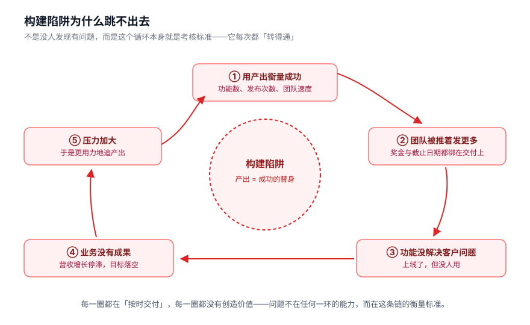

## 项目、产品与服务

转向战略思维，也要求换个方式看待产品开发。很多公司沿用**基于项目的开发周期**：划定要做的工作，立下截止日期和里程碑，让团队开工，项目结束就转到下一个。这些项目大多有自己的衡量标准，但上面没有一层把它们对齐的战略。外部有大批项目管理框架和认证——PRINCE2、项目管理协会、PMBOK——困在陷阱里的公司常把它们误当成产品管理框架。

三个概念需要分清：

- **产品**是价值的载体，反复向客户交付价值，而不需要公司每次重新构建。它可以是硬件、软件、消费品，Microsoft Excel、婴儿食品、Tinder、iPhone 都是产品。
- **服务**主要靠人力交付价值，比如设计公司、会计公司。服务可以「产品化」（每个客户同样的服务、同样的价格），也可以自动化、放大规模，做成让软件去执行的软件产品。
- **项目**是一份有明确目标的离散工作范围，通常带截止日期、里程碑和具体产出。项目做完，目标达成，就转到下一个。

项目是产品开发必不可少的部分，**但「只想着项目」的心态会造成伤害**。产品是需要一路培育、养到成熟的东西，要花很长时间。你发布功能来增强产品时，是在为这个产品的整体成功添砖加瓦——这项功能增强本身是一个项目，但你的工作不会因为做完它就算完。你需要不断迭代、划定新项目，一步步接近总成果。

这正是产品管理这门纪律对公司如此重要的原因：它让你朝「围着产品组织，而不是围着项目组织」的方向走。**产品主导型组织**就是那些通过优化产品来创造价值的公司——靠产品驱动增长，用软件产品撑起组织规模的扩张，并持续优化直到达成期望的成果。

## 产品主导型组织

产品主导型公司明白：产品的成功是公司增长与价值的首要驱动力。他们围绕产品成功来排优先级、做组织、定战略。反过来问：如果你不是产品主导，那你是什么？作者给了三种常见形态，每一种都可能把人送进构建陷阱。

**销售主导型**：合同定义产品战略。前面那家「30 个功能没人用」的数据平台公司就是销售主导的典型——路线图由承诺给客户的东西驱动，从不回头对齐整体战略。小公司起步时这样没什么不可以，你必须拿下第一个大客户才能活下去；但等你有了 50 到 100 个客户，不可能为每个客户分别建一套东西。很多不想走定制路线的公司，在销售主导模式里待得远比该待的时间长，销售流程跑到产品战略前头，产品团队连制定战略、探索新机会的余地都没了。

**愿景主导型**：苹果是最典型的例子。乔布斯推着公司一路向前，制定产品战略，带着苹果跨过失败产品，走到今天的成功。这类公司可以非常强大——前提是你有一位对的愿景家。可世上没有那么多乔布斯，而且一旦愿景家离开，产品方向通常会垮掉。**靠愿景主导运营是不可持续的：创新必须熔铸进系统本身，让单个人不再是最薄弱的一环。**当有 5000 个大脑而不是一个在同一个问题上使劲时，你才能更好地驾驭这股力量。

**技术主导型**：被最新最酷的技术牵着走，常常缺一个面向市场、以价值为导向的战略。技术对软件公司的成功至关重要，但它不能驱动产品战略——让技术领路的公司常常发现自己只是在原地打转：做出大堆很酷的东西，却没有买主。

**产品主导型**公司为业务成果做优化，把产品战略对齐这些目标，优先排定最有效的项目，把产品培育成可持续的增长引擎。好消息是，做出这个改变在技术上并不难：你不需要新招一整个团队，也不需要把现有产品全扔掉重来。真正需要的——有时反而更难落地——是**心态的转变**：把重心放到成果上，抱持实验的心态，消解「正在建的东西到底能不能达成长远目标」这份不确定性。

## 我们知道什么，不知道什么

产品开发充满不确定性，把「事实」和「需要学习的东西」分开至关重要。作者给了一个 2×2 的框架：

- **已知的已知**（事实）：从数据里提炼出的事实，或来自客户的关键需求。这些是构建的依据。
- **已知的未知**（问题）：已经清晰到你知道该问什么问题的东西——想测试的假设、可以调查的数据点、能识别出来并加以探索的问题。你用探索和实验去澄清它们，把它们变成事实。
- **未知的已知**（直觉）：那些「我觉得这么做是对的」的时刻，是多年经验磨出来的直觉。它值得听，但**偏见最爱在这种地方滋生**，务必去检验。
- **未知的未知**（探索）：你连对的问题都问不出来。它们是需要去发现的惊喜时刻——出现在外出和客户聊天时，出现在分析看似毫不相干的数据时，也会在调研过程中突然冒出来。**它们可能改变整个公司的形态。**

**产品管理的领地，是识别并研究「已知的未知」，同时不断压缩「未知的未知」周围的疆域。**谁都能拿着已知的已知去跑方案，那些事实唾手可得；难的是从海量信息里筛出该问的问题、判断该何时发问。

产品经理恰好站在技术侧和业务侧中间那片没人管的空地上。公司里形形色色的角色——销售、市场、技术、设计——大多在这两侧之间没什么交集，而产品经理站在正中间，把需求翻译成既能满足客户、又能维持并做大业务的产品。可太多公司把不具备这些能力的人放进这个岗位，还分给他们错误的责任和期望。

---

# 第二部分 产品经理的角色

## 坏产品经理的原型

想学产品管理，路屈指可数：大学不教这门课，在岗培训大多不成体系，真正为产品经理铺出入门级职业路径的大型公司，数来数去也只有微软和 Google 两家。你遇见过的大多数产品经理，要么是公司内部平级转岗，要么是从开发岗位「升」上来的。

就算有人正儿八经教过，学到的东西也大多是手把手的活：写需求文档（或敏捷里的用户故事）、和开发者开会排计划、主持进度碰头会、收集业务团队的需求、验收开发出的成果和 bug。这些步骤许多源自传统瀑布式环境。在瀑布流程里，产品经理的第一步是去找内部干系人要需求——培训里被灌输的第一条是「永远让干系人满意」。需求细化完毕交给设计，再和开发对表，编码动辄几个月甚至几年，**客户要等到流程最末端才第一次见到产品**。

敏捷的出现在很大程度上是对这套体系的纠正，但作者点出一个被忽略的缺口：**敏捷大大忽略了如何做好产品管理。**它默认有人在管漏斗顶端那一环——不断产生想法、验证想法——而它只负责优化软件的生产。可这一环偏偏在半道上丢了，因为公司相信光靠敏捷就足以做好软件开发。于是许多敏捷组织里的产品经理，依然揣着瀑布式的心智在干活。

要弄明白产品经理这个角色不是什么，得先看清三种常见的坏原型。

**迷你 CEO**。「产品经理就是产品的 CEO」这句话在招聘启事里十有八九能见到，作者尤其讨厌这个说法。CEO 在许多事情上握有唯一权威：能解雇人、能改组团队、能掉转方向；产品经理这些事都做不了，尤其是在人事上毫无权力，因为他们不是团队这一级的管理者——**他们只能依靠影响力，推动人们真的往某个方向走**。这个神话催生出一种狂妄至极的原型，觉得自己统治着世界。作者在 Marquetly 撞见过一位叫尼克的年轻人：刚从商学院毕业就进了这个岗位，所有开发者和设计师都讨厌他，因为他把自己想象成下一个乔布斯，向团队发号施令、告诉他们该造什么。作者用自己的经历劝他：当年在 OpenSky，她抓着经理头衔不放，从不接受别人对她点子的批评，团队没人想跟她共事，直到被老板警告「要是再不赢得团队的支持，你就要干不下去了」才改变做法。**职责是创造价值，而不是开发自己的想法。**直到她学会谦卑，才做出人们真心喜欢的产品。

**侍者型**。骨子里是个接单员：去找干系人、客户或经理，问人家想要什么，然后把愿望变成一张待开发清单。没有目标，没有愿景，也谈不上什么决策。这个位置上的产品经理问得最多的问题是「怎么排优先级」——因为**没有目标来为取舍提供参照，排优先级就成了一场比人气的比赛**，往往是职位越高的人，其功能越被排到前面。

侍者型最典型的后果是产品顾问大卫·布兰德所说的**产品死亡循环**：没人用我们的产品 → 于是问客户缺什么功能 → 构建缺失的功能 → 还是没人用。**你在实现想法，却从未验证过它们。**想出解决方案不是客户的活儿，那是产品经理的活儿——你要做的是深入理解他们的问题，再为他们找出最佳方案。侍者型的思维是被动的，背后通常还掺着一定程度的习得性无助：他们不相信自己能顶回这些方案、往问题更深处挖下去。可客户想要问题被解决，领导想要目标被达成，**敢于顶回去正是做出成功产品的关键，这是工作的一部分**。

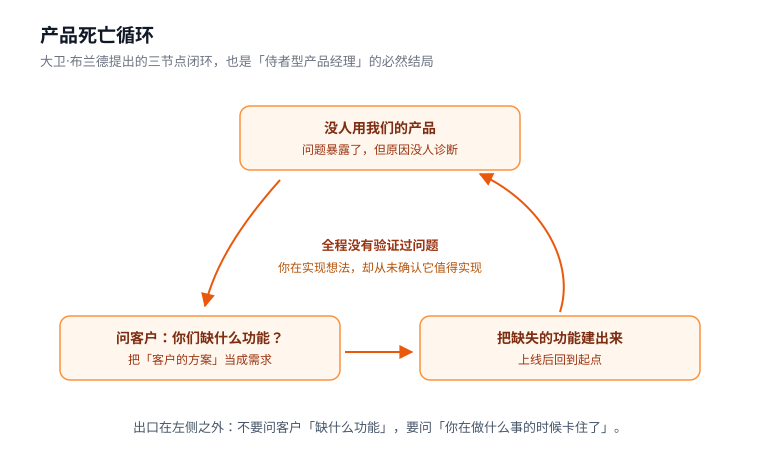

**前项目经理**。产品经理不是项目经理，尽管要恰当履行这个角色多少得懂一点项目管理。区别在于追问的对象不同：**项目经理对「什么时候」负责**——项目什么时候做完？大家有没有走在正轨上？能赶上截止日期吗？**产品经理对「为什么」负责**——我们为什么做这个？它如何给客户带去价值？它如何帮助达成业务目标？后面这些问题比前面那些难回答得多，而太多没吃透自己角色的产品经理，干脆退回去做项目管理那种活儿。敏捷把项目经理的职责摊到了团队身上，于是当初公司里那些项目经理，如今很多都变成了产品经理或产品负责人，却缺了成为优秀产品经理所需的那份经验——因为回答「为什么」需要一种战略心智，能同时理解客户、业务、市场和组织。

## 优秀的产品经理

产品经理在组织里的真正职责，是带着团队做出正确的产品——既满足业务需求，又解决用户问题。要做到这一点，他们得一人分饰多角：要懂市场，懂业务的运作方式，真正理解公司的愿景与目标，还要对产品的用户抱有深切同理心。

「产品经理」这个头衔本身就有点误导。**高效的产品经理并不是管理者，这个职位并没有多少直接的权力**，靠的是影响他人的能力——说服团队以及公司上下，正在做的事确实是该做的东西。

对这个角色最大的误解，是认为他们拥有整个产品、因此可以指挥所有人造什么。照着这个想法行事，只会把团队其余的人越推越远。**产品经理真正拥有的，是他们所做之事的「为什么」**：他们清楚手头的目标，明白基于公司战略团队应该朝哪个方向建造，并把这个方向传达给团队其余成员。至于产品「是什么」，真正拥有它的是整个团队，所有人加在一起。

产品经理负责把点连成线：把客户调研、专家信息、市场研究、业务方向、实验结果和数据分析这些输入收集起来，筛选分析，用它们塑成产品愿景。要做到这一点，方法上必须足够谦逊、愿意学习，也得接受自己并非全知——重要的是明白，**不是所有好点子都出自自己**。

一个常见的招聘错误，是想找一个技术专家或市场专家。**产品经理不是这两个领域的专家，他们是产品管理的专家。**这不代表不需要这两个领域的知识，而是要懂到刚好够用：能和工程师对话、能在知情的前提下做出明智决定，知道该向工程师问哪些问题才能理解某个功能或改进的复杂程度；除非产品高度技术化，否则不需要会写代码。市场也一样，关键在于平衡团队的能力构成。作者最看不上的是独狼心态——认为产品的成败只系于自己一人。

这本书里最好的产品经理画像，出现在一个房贷案例里。梅根在一家大型零售银行做个人住房抵押贷款的软件，她脑子里放第一位的是房贷部门的愿景：让房贷申请者随时随地申请、也让房贷持有者随时调取自己的信息，更轻松、更方便。她和产品副总裁一起，定下了与这个愿景对齐的业务目标：**提高首次房贷申请提交的数量**——因为当时启动房贷流程的首次申请者里，有 60% 没能在这家银行走完流程，转而投向流程更顺畅的竞争对手。

梅根的做法值得完整记下来：

- 她给用户起了名字（玛丽和弗雷德，住在纽约市，正想在康涅狄格州找第一套房，因为玛丽怀孕了想要更大的空间），把这对夫妻要跑的流程讲得一清二楚：跑当地银行网点、会见贷款专员、填海量纸质表格、忘带材料第二天再跑一趟、然后漫长等待。**她对客户了如指掌，对他们的痛点一清二楚。**
- 评估客户需求时，她只问一句：「这样做，能不能提高这些人把申请在我们这儿办完的可能性？」
- 她调出数据，找出那些开了头却没办完的人，主动联系他们；**定期带团队成员——开发者和设计师——参加用户调研，让大家都能清楚地看见问题**。很快他们发现了规律：许多潜在客户被要求到网点核验材料，因为这事线上做不了，而想约到能来核验的空档要等太久。她又面向更广的人群发了一轮问卷，发现这是个普遍问题——**遇到这个麻烦的人里，只有 25% 真的办完了申请**。
- 问题明确后，她把团队叫到一起开研讨会集思广益，**刻意不急着下结论**，想出了好几种解决问题的思路，同时决定跑几个短实验。
- 其中一个实验是**人肉顶上**：挑一批首次申请者，请他们把材料用邮件发过来，银行指定专人负责审核批准。实验期间，**新申请者办完申请的比率，比跑去网点核验材料的人高出 90%**。
- 顺着这个结果倒推产品第一版：扩大成功的实验，让申请者在申请过程中把材料发进来，核验环节仍交给人工——虽然没法在线上核验每个人的信息，却把必须跑网点的核验次数**砍掉了 50%**。后续还规划了继续迭代的方案，包括引入人工智能和在线公证，直到实现核验零到访。

梅根的总结是：**「永远盯着问题本身。只要把自己锚定在『为什么』上，你更可能做出对的东西。」**

她之所以能成，很大一部分要归功于经理和组织为她铺好了路：大家一起定了目标，老板给了她达成目标的自由空间，公司支持她做该做的事。最要紧的是，她享有别人未必有的优势——**被允许和用户交谈**。

顺着这个案例，作者列了一串「从为什么开始」的问题，每一个都代表一个可能让项目夭折的风险：为什么我们要把房贷领域的一切都数字化？为什么这个项目非做不可？我们期望在这里达成什么结果？成功是什么样子？如果我们全做成数字化，却没人来申请房贷了，怎么办？我们如何消解这个风险？太多时候，产品经理一头扎进方案里，根本没想过背后的风险。而组织自上而下派发方案时，十有八九会跳过设定成功指标这一步——一旦如此，方案执行里就埋下了失败的种子，产品经理连纠偏的空间都没有。

这一章还澄清了一个容易被混淆的概念。翻看大部分 Scrum 文献，产品负责人通常有三项职责：定义产品待办列表、为开发团队创建可执行的用户故事；梳理待办列表并排优先级；验收完成的用户故事。短期培训（通常一两天）着重讲的就是这些流程和仪式，却留下一大堆没人回答的问题——而这些问题恰恰是做出成功产品的关键：怎么确定价值？怎么衡量产品在市场中的成功？怎么确保我们做的是对的东西？怎么给产品定价、怎么打包？怎么把产品推向市场？自研还是采购？怎么和第三方软件集成、进入新市场？

一句话说清了：**产品负责人是你在 Scrum 团队里扮演的一个角色，产品经理则是一条职业路径。**就算把 Scrum 团队撤走、把 Scrum 当作流程拿掉，你还是产品经理。产品管理可以配合 Scrum，但并不依赖它。

作者对规模化敏捷框架（SAFe）的批评相当直接。在 SAFe 里，产品经理是产品负责人的管理者，负责一切面向外部的互动与工作；产品负责人则面向内部，定义方案的组件并交付。作者用它训练过几十支团队，**从没见过它真正跑顺过**：产品负责人和用户脱节，因为他们对问题理解得不够深，做不出有效方案；产品经理则基本上是把需求像瀑布一样砸下去，团队不被允许去验证这些是否是该做的东西——**没有人做验证工作**。常见的辩解是产品负责人没时间同时干两份活，作者的回答是：我接触过的产品负责人，每周要花 40 个小时写海量用户故事——**如果一个人每周把这么多时间花在写用户故事上，那你十有八九已经掉进构建陷阱了**。

她教客户的分工是：资深产品经理（副总裁、产品负责人或中层经理）专注于基于市场调研、公司目标与战略，为团队定义愿景与战略；没有 Scrum 团队或团队较小的产品经理，则负责验证这套战略，并为之贡献对未来产品的看法；方向验证通过之后，再围绕这些人组建更大的团队把方案做出来。**团队规模要随产品阶段灵活调整**——如果你还处在探索模式，却塞给产品经理一支大 Scrum 团队的待办列表去维护，他会被撕扯成两半，两边都做不好。

## 产品经理的职业路径

公司还小的时候，产品团队也小，大家几乎什么活都得亲手干。公司开始扩张，产品团队跟着扩张，职责任务随之变得越来越清晰，产品管理组织里就长出更多层级。各层级的人干什么，取决于他们做的三类工作各占多少：

- **战术工作**，聚焦短期动作——做出功能、把它送出门去，包含和开发者、设计师一起拆解任务、划定范围，以及把数据算明白决定接下来做什么。
- **战略工作**，关乎产品和公司在市场上的定位——好在竞争中取胜、达成目标，着眼产品和公司的未来状态，以及要走到那一步都得做些什么。
- **运营工作**，是把战略接回战术工作的那一环——产品经理在这里做出路线图，把产品现状和未来状态连起来，让团队在具体工作上对齐。

和开发团队协作的底盘、钻到单个用户需求里去的功夫、度量数据的本事，对任何层级的产品经理来说永远都是必备技能。但随着产品组合或产品本身越做越大，公司需要产品人把这份认知从单个功能抬升到更宽的全局上——正因为如此，**产品经理越往上走，工作就越从战术端往外移**。

典型的职业路径有六级：

**初级产品经理**是入门级岗位。除了微软和 Google，很少公司会设这种岗位——作者认为这是整个行业需要改变的地方。她相信产品管理的底子可以交给任何一个人，只要他有兴致、愿意学，但这是一门必须当作**职业**来精通的手艺，得靠经验和实践一点点磨出来，跟任何一门专门技术一样。开发者跟着资深架构师结对学手艺，销售新手跟着资深销售主管学门道，产品管理需要的也是这个——正因如此，设立初级产品经理培养项目、让有经验的产品人多带带新人，至关重要。市面上资深产品人才不多，出现一个就被抢走，所以公司要自己开始培养。

**产品经理**和开发团队、设计师一起构思并做出对客户而言正确的方案，是一线的人：和用户交谈、汇总数据、站在功能的角度拍板，通常负责一个功能或一组功能。这个层级往往更偏运营而非战略，职责重心落在路线图上功能的短期影响和交付上，可以当成一个按季度计的焦点。**危险在于变成 100% 的运营**——只盯着发布产品的流程，而不是从全局出发去优化功能，就会在功能成功所必需的战略与愿景工作上掉队。也正因如此，要把项目管理性质的活儿尽可能推回团队。产品经理向产品总监汇报，在较小的公司里则向产品副总裁汇报。

许多公司加设了「产品负责人」头衔，当作产品经理之前的入门级岗位。作者认为这是错的：如果你把产品经理看成只管战略、把产品负责人看成只管战术，就漏掉了愿景和日常工作之间的连接，也就掉进了「产品人太战术化」的危险；而且产品负责人没有做战略所需的经验，没法在职级阶梯上继续往上走。**她的主张是整个行业都放下「产品负责人」这个头衔，把这种位置上一律叫作产品经理**——这样才有一条连贯而有意义的职业路径。

**高级产品经理**负责同样的事，但掌管的范围更大、或产品更复杂。这是产品管理领域里作为独立贡献者能到达的最高位置——他们不带人，想专心做产品。这个角色尤其难干，因为手边没有替你接走运营那块活的人，得同时扛起高度战略、高度运营的担子；它适合喜欢啃硬产品问题、想扑在全新创新产品上、替公司闯进新地盘的人，**很像开发里的架构师**——重心是搭好结构、把它放大，而不是管理别的开发者。这类人通常还带点企业家气质，往往是替企业开出一条条新产品线的人。

**产品总监**通常只出现在较大的公司里，是规模化这个节骨眼上的关键角色。当向产品负责人汇报的人多到管不过来、产品范围又在扩大时，产品总监就成了必需：帮忙推动战略对齐和运营效率，把产品组接回产品或产品组合的愿景。他们是**第一级管人的人**，管理一组围绕某个产品对齐的产品经理，对产品的战略路线图负责（眼光通常放到一年左右），同时也要为团队的运营效能负责。

**产品副总裁**掌舵整条产品线的战略与运营，负责把公司目标接回自己产品线的增长上，结合团队成员的输入和他们提供的数据，为整个产品定下愿景与目标。在大型企业里，他们还要直接对产品线的财务成败负责——不只是把功能交付出去；大公司里所有产品副总裁都得在战略和意图上保持一致，才能确保产品组合的成功。在较小的公司里，产品副总裁通常是顶了天的职位（因为只有一个产品），往往只带一两个产品经理，还得亲自扎进产品的战术细节，这类人通常更富企业家精神、特别擅长发布和壮大新产品。一个成功的产品副总裁，骨子里得更像一个战略人，**而且要懂得：想让组织规模化，就得雇人把战术和运营的部分接过去**——这也让他们有机会成长为首席产品官。

**首席产品官**（CPO）是相当新、却至关重要的角色，掌管公司全部的产品组合，是产品经理的最高职位，也意味着在公司高管桌上有一席之地。公司该在什么时候考虑加设 CPO？**当它开始做第二个产品、打进另一个地区，或者与别的公司合并的时候。**这个角色的职责是通过产品组合的增长来驱动公司的经济成功：和各位产品副总裁共事，确保每个产品都在战略上和公司目标对齐，也确保每个产品从资源和人的角度看都不缺实现目标所需要的东西。CPO 还得能和董事会打交道。Insight Venture Partners 的合伙人雪莉·佩里对 CPO 角色颇有研究，她这样解释：「董事会成员关心的是技术和产品决策的**财务影响**。成功的 CPO 必须能够把自己的行动翻译成董事会听得懂的语言。」佩里招 CPO 时会留意三个关键人格特质：**能激发信心、能共情，而且百折不挠、韧性十足。**

## 团队组织

如何搭建产品团队、如何让它们围着该干的活组织起来，对产品开发的成败影响深远。公司大致有三种组织方式：围绕**价值流**、围绕**功能**、围绕**技术组件**——而后两种都会催生以产出为导向的心态。

作者进 Marquetly 时，公司是按技术组件组织的（CTO 说敏捷教练建议在产品每个区域都放一支 Scrum 团队，这样哪块都有人管）。听上去合理，实践里却助长了糟糕的产品管理。一次研讨会上，一位产品负责人插话说：「这里绝大多数内容都很好，我也想这么干。可我不能——我得把我们的登录 API 的待办列表随时养得满满的。我要是不这样，手下的开发者就没活可干了。」作者问她这是不是个新 API、是不是有一大堆问题等着修，结果根本不是：它什么大毛病都没有，一直运行良好。再问她目标是什么、凭什么判断这个 API 已经做完、可以转去做别的了，她的回答是：

> 「噢，不不不。这就是我拥有的东西。这个 API 是我们团队拥有的，我们永远不会换成别的。这是我们的功能——我们得永远守着它。」

他们正在做的，其实是一个早已进入稳定状态的技术组件——从达成公司目标的角度看根本不需要再去动它；可她还是不停地给团队找活干，只因有人告诉她：这是你拥有的东西。按功能组织也有同样的问题：很多团队这样做是为了拿到**覆盖**（把产品的每一块都握在自己手里），从零起家时无可厚非，但时间一长就会催生「总想在自己那一亩三分地里再堆出点东西」的心态。**退一步把这些工作对齐到产品战略的整体愿景上，就会发现其中许多压根不该排上优先级。**

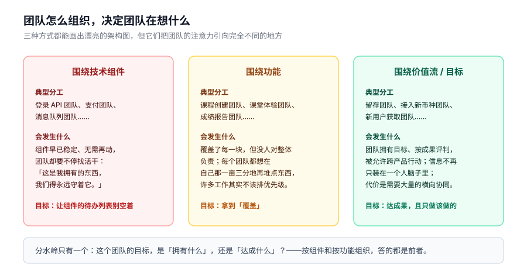

公司还小的时候，完全可以围绕想达成的目标来组织。作者举了 TransferWise 的例子：这家总部在伦敦的公司做低手续费跨境汇款，产品团队相当少，大约 12 支。一支团队专注做留存，另一支负责接入新币种，还有一支做新用户获取。**每支团队都是自己目标的拥有者，成败只按成果来评判，还被允许跨产品行动**——只要有助于达成目标，做什么都行。这需要大量协同，但因为团队少，大家才能围着最重要的举措做毫不留情的取舍，没有一件是无用功。这种结构还制造了一种很好的冗余：**关于某个产品的重要信息，不会只装在某一个人的脑子里**，有人离职也不必担心知识跟着走；一支团队正忙时，另一支想修个 bug 也不用干等。

公司一旦规模化，尤其开始同时维护不止一个产品时，这个做法可能就走不通了，需要加上另一块拼图：**价值流**。一条价值流，是为把价值交付给客户所需的全部活动——从发现问题、设定目标、构思想法，到把产品或服务真正交付出去。围绕价值流组织，做法是从客户或用户入手，倒推他们在获得这份价值的路上会和你公司有哪些触点，再想清楚如何组织才能精简这段旅程、更快地提供更多价值。

作者用保险公司举例说明「产品」这个词有多容易让人犯迷糊：保险公司的产品就是他们卖给客户的东西——车险、家财险、寿险，我买车险是因为出事故时它能给我一份安心。那个能管理保单的 iPhone App，只是这个产品价值流里的一块。**你依然可以安排一位产品经理来拥有那个 App 的体验，但必须确保他是那个承载真正价值的更大部门——车险部门——的一分子。**这样的结构让战略可以在部门层面制定，产品经理则去执行与自己产品绑定的产品举措。**把战略和价值的执行握在同一个地方，是关键**；这个做法让你能真正评估团队里正在发生的工作，确保它对达成战略不可或缺。

随着公司扩张，需要更多管理层级才能有效照看各个领域，但别做过头——**层级数量得当与否，对战略的影响也很大**。把层级压到最少、给产品经理更大的产品自主范围，才能建起一支结构上支撑产品战略的产品组织。

Marquetly 的重组是这一章的实例。它当初有 20 支围绕组件的产品团队，产品经理们每分每秒都在写用户故事，而这 20 位多半其实只该算初级产品经理，能指点他们的资深人只有一个：副总裁凯伦。作者的诊断是：凯伦是位非常出色的产品副总裁，但她胜任不了首席产品官这一层——她很擅长战术和战略层面的工作，能为单一产品定愿景、把它做起来，可不理解怎么管理一个产品组合，也没法面对董事会讲清楚这个业务从营收角度该怎么长大。所以第一步是请一位有经验的 CPO；同时要围绕价值流重构，另找一位产品副总裁接手学生体验。重组后的理想终态是：CPO 之下分学生体验和教师平台两条线，再往下挂五个产品经理岗位。**图上根本没有 20 个人**——当我们把产品拆成价值流、围绕能交付完整价值的整组功能（而不是像 API 那样的组件区域）来组织时，会发现根本没有 20 个区域。**团队围绕价值而非组件重构时，这种事常常发生：达成目标根本用不了那么多人。**

作者还举了 Pandora 的例子：这家订阅制音乐服务把「团队小的约束」变成了成功的机会——靠着每个季度给公司要做的工作排出不含糊的优先级，他们凭 40 名工程师撑起了每月 7000 万用户，也为 70 亿美元的估值打下了地基。**保持小规模，逼着它只把对业务增长最重要的事做好。**

---

# 第三部分 战略

## 战略是什么

这本书里最好懂的一个开场故事：周一下午，作者正在指导的团队围在会议桌边，准备规划下一个实验——他们在探索怎么提高产品的用户获取，但没人确定是什么在阻止人们注册，这个会就是要搞清楚这一点。正当此时，CTO 走进来坐下，打断了开发者的发言：

> 「我不明白你们的产品战略是什么。它是什么？」
> 「他们正在诊断问题，以便决定之后该建什么。他们有一个目标，只是在发现围绕这个目标的问题。」
> 「不。你们需要有战略。这周末之前，我要看到一份规格文档，把所有内容都排布好：网站要什么内容、你要什么后端，以及未来三个月你们要建的所有东西。」
> 「如果还不确定为什么要建，他们怎么可能说得出该建什么？在搞清楚要解决什么问题之前，他们没法确定正确的产品。」
>
> **他不需要一份战略。他需要的是一份计划。**

作者由此给出全书的战略观：**好的战略不是一份详细计划，而是一个帮你做决策的框架。**太多人把产品战略当成一份文档，里面是干系人的功能愿望清单和实现这些愿望的详细说明，还撒着一堆「平台」「创新」之类的流行词。沟通产品的终局状态本身没有错——你应该朝一个愿景努力；**但危险在于，我们在未经任何验证的情况下就承诺了这些愿景和功能集**。当她问人们战略是什么、对方开始背待办清单时，她总会追问一句：「你怎么知道这就是该建的东西？」大多数时候得不到一个直截了当的回答，或者听到「我不知道，我老板让我建的」。再往上问一级「为什么建这个产品」，答案就更有意思了：市场调研、要和竞品保持功能对等、CEO 的要求，以及最让她心里一紧的那个——「一家大型咨询公司建议我们这么做」。

词典把战略定义为「为达成重大或总体目标而设计的行动计划或策略」，这似乎也是商业世界里对战略的普遍理解。许多公司花几个月做次年的「战略规划」，详尽列出将完成的任务、成本以及将带来的收入，通常还和预算流程绑在一起，团队必须提交商业论证和时间线才能拿到资金。**把战略当成计划，正是让我们掉进构建陷阱的原因**：我们不断往清单上加新功能，却没有办法在公司整体语境下评估这些功能是不是对的。

作者更认同战略部署专家斯蒂芬·邦吉在《行动的艺术》里的定义：

> **战略是一个可部署的决策框架，使行动达成期望结果，受当前能力约束，与现有情境连贯对齐。**

好的战略应该超越功能的迭代，着眼更高层的目标与愿景，应该能支撑一个组织数年。**如果你每年、每月都在换战略，又没有来自数据或市场的充分理由，那你就是在把战略当计划用，而不是当框架用。**

## 战略差距

邦吉在研究中发现，当公司把战略当成计划时，往往达不成预期。这种失败源于组织在「成果」「计划」「行动」之间存在三个缺口，它们最终会在组织内部制造摩擦。

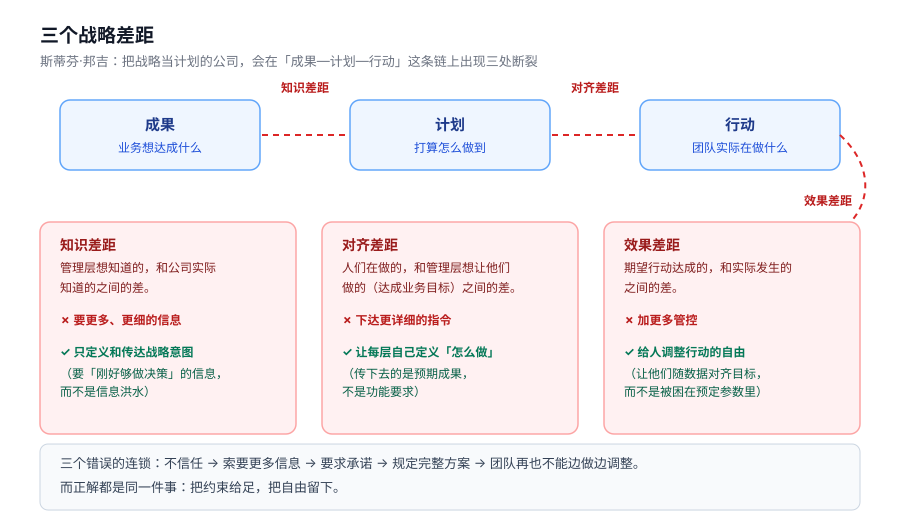

**知识差距**，是管理层想知道的和公司实际知道的之间的差。组织试图用提供和索取更详细的信息来填它。作者把这个概念讲给一位 CEO 听时，对方脱口而出「哦，糟糕，这就是我」——**这个缺口大概是最容易被认出来的那个**。Marquetly 的 CTO 也在这里犯过错：他要求把一个尚未验证的产品每个细节都列出来，好让自己对正在做的事更有确定感。但**信息洪水对高层管理并不总是有帮助的；你需要聚焦在沟通和索取「刚好够做决策」的信息上**。正确的做法是：管理层把方向限制在定义和传达**战略意图**，也就是业务目标——它们合起来说明公司正朝哪走、到了那里想达成什么，把团队指向业务想要的结果。

在 Marquetly 的案例里，当时有太多未知，根本做不出详细计划——它还不明白用户为什么在某些步骤流失，而这是它在想出正确方案之前需要先搞明白的核心问题。**公司需要实验的空间，在能提出「怎么解决」之前，先理解「为什么」。**

作者给了一个健康的说法模板：一个产品经理如果这样跟你说——「我在建这个，因为它能帮助提升获客，而新客户获取是公司层面为驱动营收而优先的大目标。我知道我的产品能带来用户。我们知道这里有问题，但还不确定是什么。下一步是发现这个问题、用方案攻克它、然后优化方案来提高获客」——**这个产品经理应该让你感到放心**。可惜通常恰恰相反，领导们还是会一层层下去索要更详细的信息。这常被理解为不信任，而且往往确实是；但通常还有别的东西：**在每一个她见到领导这样行事的组织里，故事都不完整——典型情况是缺乏对齐，团队的目标没有和公司整体的愿景与战略挂上钩。真正造成「要更多信息」的，是这个对齐差距。**

**对齐差距**，是人们在做什么和管理层想让他们做什么（达成业务目标）之间的差。组织试图用更详细的指令来填它，而正确做法是**让公司里每一层自己定义如何实现上一层的意图**。

作者在一家公司做过一个实验：她逐个问上百支团队的产品经理「你们为什么在做当前这个项目」，然后再问他们的领导同一个问题——**两个层级给出两套不同的答案**。他们无法把团队的活动连回公司的成果，因为领导层传下去的是功能要求，而不是预期成果和目标；而功能一旦被承诺，就几乎不可能更改，因为公司期望它们被交付。

最让她难以释怀的例子是一家大公司（书中称为 Company B）：它请了一家大型咨询公司研究并制定未来五年的产品路线图，路线图一层层落到团队。可这些团队一直在和客户对话，**他们知道咨询公司提出的方案不是客户想要的**；然而他们的绩效考评基于交付这些产品。他们想对得起客户，却不敢——怕丢工作。于是他们**明知是错的还是建了**。年底公司错过了所有目标，团队被罚，尽管他们交付了路线图上的东西。作者说，当这些团队发现客户不想要那套方案时，本该有自由去探索其他选项——**这才是产品主导型组织的运作方式，也是让我们不进构建陷阱的东西**。只要团队和公司的整体战略意图、愿景保持一致，管理层就该放心地把必要的自主权授予有能力的人。

**效果差距**，是我们期望行动达成的和实际发生的之间的差。组织看不到想要的结果时，会试图用更多管控来填这个缺口——**而在这种情形下，那是最糟糕的做法**。真正能让人达成结果的做法，是给个人和团队自由去调整自己的行动，使之对齐目标。

这三个错误的连锁反应会不断累积：不信任导致索要更多信息，接着要求团队对下一年做出承诺、规定完整的解决方案，最后团队被限制在这些参数里，不能再学习和调整决策。而战略之所以重要，是因为**它是你让组织规模化的方式——通过自主的团队让行动发生**。

这一章的最后一节讲自主团队。Marquetly 的两个声音很典型：一位经验丰富的产品经理说「领导总告诉我要拥有产品的愿景，可我不被允许。经理一直塞给我方案，每次我想提点不一样的就被压回去——我们转敏捷的时候说 Scrum 团队应该是自主的，这绝对不是自主」；而领导那边的说法是「我们的产品经理不肯站出来拥有产品，我只能不停给他们开方子，因为他们不主动」。作者说这是构建陷阱公司里常见的一对矛盾，**全都是「没有好的战略框架来让行动发生」的症状**：团队没有对齐清晰的方向和目标时，就没法有效做决策；真要试，多数时候领导会跳出来说「不，那不对」。

**自主性才让组织规模化。**替代方案是雇成百上千个靠权威管人的中层——随着组织长到几千甚至上万人，这变得极其低效和昂贵，还会造成不必要的管理层级和大量挫败感，人不开心，而不开心的人很少能做出伟大的工作。靠权威领导是工业时代的方法论遗迹（那时低技能工人需要被密切监督以最大化产出）；在软件世界不是这么工作的——我们招的是极其聪明的人，付他们高薪，让他们通过做出客户喜爱的复杂软件来决定公司如何成长。**当你拥有这样的人才，你需要给他们做决定的空间，才能充分获得他们知识和技能的好处。**如果对齐得当、有好的战略框架，你就可以让人在很少的管理层监督下做决策。

## 搭建好的战略框架

Marquetly 请来了一位出色的首席产品官詹。她第一周就发现了和作者一样的问题：「我在组织里走访了所有产品经理，问他们为什么在做某些事。没人答得上来。没有目标，没有方向，他们只是在被动地建客户提的需求。」接着她又去问领导层的同侪「作为一家公司，我们能做的最重要的事是什么」——**每个人都给了不同的答案**。只用一周，她就击中了要害：Marquetly 卡在被动反应模式里，它按客户请求或合同给大项目排优先级，从没战略性地思考过如何让产品成长。

公司的 CEO 克里斯原本以为问题出在开发团队（「他们不够快，他们在偷懒」）。他很推崇 OKR，全公司都上了，但那些 OKR 是非常产出导向而不是成果导向的：「发布新版教师平台的第一版」是一个目标，「2018 年 6 月前交付」被当成一个关键结果——**它们没有和任何成果挂钩，无论是业务的还是用户的**。

回顾公司当时的战略流程：11 月进入规划会议，每个人出来时手里都是一份要建的功能清单，分派给产品经理；产品经理和开发同事一起估算完成时间，报回领导层，然后据此规划预算、组织路线图。领导层那边也定了目标：对投资人承诺的营收目标、衡量用户是否持续使用的指标。**组织的每个部分都在测量着什么，可过去几年公司就是没达成目标**——营收目标没达到，有些承诺的功能也没交付。问题出在：**公司没有正确地创造和部署战略。**领导层基于自己认为该建什么来决定工作优先级，而不是基于客户的反馈；它在回应叫得最响的客户，而不是评估这些请求是否符合战略目标。公司士气低落，而正因为低落，员工产出也不好。

一个公司的战略应该由两部分组成：**运营框架**，即如何让公司日常活动持续运转；以及**战略框架**，即公司如何通过产品和服务的开发在市场上实现愿景。**很多公司把这两个框架混为一谈、当成一回事**。两者都重要，但把战略框架做对，是开发出优秀产品和服务的关键——因为它直接影响到产品管理。

这个战略框架把公司的战略和愿景，与团队开发的产品对齐起来。作者批评了那个反复出现的年度周期：每到十一月，公司进入恐慌模式，试图预测下一年的营收、对股东的承诺、预算，功能清单堆成详细的甘特图；1 月 1 日开始干活，干满一年，到 12 月 31 日这个人为的截止日期停下，然后采纳下一套战略——年复一年，**没有给长期项目或战略留下任何空间**。**把预算、战略和产品开发绑在这个人为的年度时间周期上，只会造成失焦和无法贯彻。**公司应该持续评估自己在哪里、需要在哪儿采取行动，然后为这些决策拨款。

作者借 Spotify 的做法说明另一种思路。亨里克·克尼伯格介绍过这家公司用的一套叫 **DIBBs** 的东西——Data（数据）、Insights（洞察）、Beliefs（信念）、Bets（赌注）：前三者喂养一件叫「赌注」的工作。**把举措想成赌注是很有力的，因为它设定了一种不同的预期。**Spotify 不设立高层指令来规定该建什么，管理者给员工参加黑客松、实现自己想法的余地，营造一个可以安全尝试和失败的环境；高层愿意接受「客户想要什么」这件事上的不确定性，从而创造出拥抱实验和创新的工作环境，必要时能迅速调整方向。

**战略部署**是把战略里的故事讲通、对齐的动作。Jabe Bloom 解释了为什么要把不同层级的战略理解为不同时间尺度的故事：

> 「在组织的不同层级，我们讲述不同时间尺度的故事，关于我们的工作以及为什么做它。为了让人们能对听到的故事采取行动，这些故事的时间尺度和他们习惯的不能差太多。敏捷团队很擅长讲两到四周的故事，那是他们每天打交道的。随着你在组织里往上走，你讲的是时间跨度更长的故事。高管很擅长讲五年的故事，但一个习惯以两到四周思考的团队没法对一个五年故事采取行动——**那里面有太多可以探索的空间了**。」

所以，战略部署就是**在组织里设定恰当层级的目标和目的，把活动的场子收窄，让团队能够行动**：高管看五年战略，中层管理者思考年度或季度的较小战略，把团队约束在一个方向上，让他们能以月或周为单位做决定。Bloom 还讲了另一半：

> 「**毫无约束的团队，是组织里最害怕、最不敢行动的团队。**他们觉得自己做不了决定，因为选项太多了。而约束恰当的团队——方向被设定在适合他们的层级——就敢于做决定，因为他们能看见自己的故事如何与组织的目标和结构对齐。」

不给出恰当层级的指引就会掉进构建陷阱：团队收到的指令要么过于具体，要么过于宽泛——高管扎进细节、靠权威管理、不给自主；要么像 Bloom 说的那样，给了太多自由，反而让团队无法行动。

作者列举了同类框架的几个例子：Google 用的 OKR、丰田用的方针管理（Hoshin Kanri）、军队用的任务式指挥（mission command）。**它们都建立在同一个前提上——为组织的每一层设定方向，让他们能行动。**选哪个框架对组织很重要，但理解「什么构成一个好的战略框架」更重要。

在多数产品组织里，战略部署有四个主要层级：**愿景、战略意图、产品举措、选项**。前两个在公司层面，后两个针对公司的产品或服务。需要强调的是，战略部署和战略创造是两件不同的事——定义这四层各该是什么、在产品线和团队之间协调、再上下沟通以取得认同，要做的工作相当多。

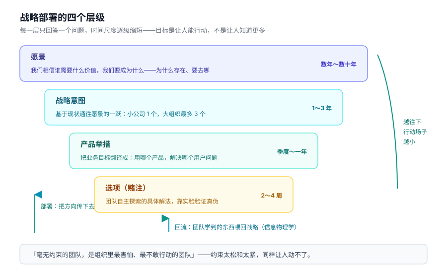

**战略创造**是弄清公司该朝哪个方向行动、并建立人们据此做决策的框架的过程。作者特别提醒：**如果你还没有战略，这绝不是一个一天或一周的流程**——她见过公司试图把战略创造压缩到那个时间框里然后失败。这需要时间和专注去打磨和维护；你需要在战略的每一层识别问题、并决定如何组织起来解决它们。**如果你是 C 层高管，把这件事做对应该是你的头等大事——否则你就是在为你成百上千的员工布置失败。**

战略关乎如何把组织从当前所在带到愿景。要创造战略，你必须先理解愿景（想去哪），然后识别挡在路上的问题或障碍，围绕它们做实验，反复这样做直到抵达愿景。这是丰田持续改进框架的基础，也就是**改进卡塔**，它教会公司里的人如何战略性地攻克问题以达成目标。在 PDCA（Plan-Do-Check-Act）循环里，团队系统性地识别挡在目标状态（下一个目标）路上的障碍，规划如何攻克，然后做实验看计划是否奏效，再复盘进展（check）并在下一轮相应行动。

把同样的方法用到产品开发上，作者称之为**产品卡塔**（第四部分会详细展开）：根据你从哪一层开始，你看向愿景、战略意图或产品举措来理解方向；当前状态关乎你相对愿景所处的位置，也反映成果的当前测量值；**选项目标**是团队下一层级的目标——是为推进举措或意图必须达成的成果；然后你用产品流程去系统地攻克问题、逼近目标。

最后一点很关键：**愿景不是纯粹由管理层自上而下设定的。**整个组织应该在学到「什么能达成目标」时共享信息，反过来帮助形成战略。Bloom 把这称为「信息物理学」：

> 「我从高管那里听到的最大问题之一，是他们没有做决策所需要的数据。人们要求他们创造愿景，却没有持续地把信息以有助于战略决策的方式呈现出来——让组织能够实现那个愿景。团队应该在外面分析、测试、学习，然后把他们发现的东西回传给同侪和管理团队。**这就是我们设定战略的方式。**」

信息和方向在组织里上下、左右流动，是对齐得以维持的方式；但它必须先从公司层开始。

## 公司级愿景与战略意图

**公司愿景是战略架构的支点。**它设定方向，为后面的一切提供意义；有了坚实的公司愿景，你才有思考产品的框架。亚马逊是个好例子，它的愿景是「成为地球上最以客户为中心的公司，让客户能够在线找到并发现任何他们想买的东西，并努力为客户提供尽可能低的价格」。公司由许多不同的产品线组成，从 Prime Video 到 Fulfillment，每一条都在帮亚马逊实现这个整体愿景；**通过盯住整体愿景，负责测试、开发和增长这些不同产品的人就能对「该追求什么、不该追求什么」做出有效决定。**

如果你是像 Roku 这样的单产品公司，这就简单了，因为公司愿景和产品愿景非常接近甚至相同；如果你是像美国银行这样的大公司，就复杂得多——战略需要从公司层开始，穿过业务线，最终到达产品。**在这类公司里，产品只是公司愿景如何体现的细节，是价值的载体**——你卖给客户、并从客户那里获得某种回报的东西；公司愿景则是给所有产品服务赋予意义的那个外壳。

很多人会问：公司使命和愿景有什么区别？**好的使命解释公司为什么存在；愿景则解释基于这个目的，公司要往哪里去。**作者认为最好的做法是把使命和愿景合并成一句陈述，提供公司的价值主张——做什么、为什么做、凭什么赢。她举了三个范例：

> 「以革命性的价格提供设计师眼镜，同时引领有社会意识的企业。」——Warby Parker
> 「在美国银行，我们被一个共同的使命所指引：通过把客户和社区连接到他们成功所需的资源，帮助人们改善财务状况。」
> 「成为全球最优秀的娱乐分发服务：在全球范围内授权娱乐内容，为电影创作者打开人人可触达的市场，帮助世界各地的内容创作者找到全球观众。」——Netflix

这些愿景陈述都提供了聚焦：**短、好记、清楚表达、不含浮夸术语**。反例是「成为在线照片存储的市场领导者」这类——想当市场领导者是好事，但它留下整个公司去问「怎么做、为什么」，太宽泛了。作者说她不想在「怎么做」上过于规定，但你确实需要把公司聚焦在你想要集中的地方；Netflix 那句之所以好，是因为它在说「想成为最好的娱乐分发服务」之外，还给出了路径：在全球授权内容、创造可触达的市场、帮助内容创作者。

**如果你的愿景已经模糊了一段时间，那就需要的不只是一句愿景陈述。**公司领导者要花时间沟通愿景、解释他们的选择、描绘即将到来的图景——**这不意味着你要把这一切如何体现讲得超级细，只是说你必须讲故事**；故事讲到位之后，你就能用那句简单的愿景陈述提醒所有人。

Marquetly 早就有了一句很好的愿景：「我们帮助数字营销专业人士成长，让他们以引人入胜、专为在短时间内最大化学习而设计的方式，获得覆盖广泛主题的优质培训。」它解释了公司为什么存在、做什么来达成这个目的。难点在于把它接回公司的运营——**这就是战略意图必要的地方**。

**战略意图**传达公司当前的聚焦领域，帮助实现愿景。愿景应该长期保持稳定，**但你打算如何抵达愿景，会随着公司成熟和发展而变化**。战略意图通常要一段时间才能达成，量级在一年到几年。它们在确定时，公司高层应该问的是：**「基于我们现在所处的位置，为达成愿景，我们能做的最重要的一件事是什么？」**——不该是一长串愿望或目标，而只是少数几件必须发生、能带来一大步跨越的事。**让战略意图的清单保持简短，才能让所有人聚焦。**

Marquetly 过去在这一点上和其他公司一样挣扎：每年进入年度规划循环，开一个通常只对副总裁及以上开放的会，会上列出一份产品功能清单——去年那份上面有「分享课程给别人」「推荐码」「一种新的测验方式」「全站排行榜」。这些想法不算坏，**但它们比 C 层高管该关心的层级低太多了**。领导层本该专注于创建战略意图，而不是把这些方案往下压给团队；那样做才能让产品层的决策与业务目标对齐。可它们在做的是**「摊花生酱」——把自己薄薄地摊在许多工作领域上，而不是在一个方向上形成合力**。

作者为 Marquetly 的领导层主持了一次战略研讨，要设定战略意图，首先得理解「业务价值」到底是什么意思。她引用商业与产品顾问、延迟成本专家乔舒亚·阿诺德的一个模型来说明怎么思考业务价值。组织在规划战略意图时，应该思考组织的每个部分如何为这些目标做贡献；**对成长型公司来说，增加营收会是最重要的那一桶；而对更大的企业，你应该在每个领域评估公司的举措。**

Marquetly 专注于增加营收——它需要在几年内从 5000 万美元增长到 1.5 亿美元才能上市，这是投资人期待的回报。分析之后，它意识到要达成所需增长，应该聚焦两件事：**向上扩张，卖给更大的公司（企业市场）**，这能让它批量销售授权、带来更多营收和更好的续费（已经在用的少数企业客户往往会每年续约）；以及**提高个人用户带来的营收**，因为当时的获客率并不好。管理层把这两件定为公司的战略意图，并配上相应的营收目标：

| 战略意图 | 目标 |
|---|---|
| 扩张到企业业务 | 企业收入从目前每年 500 万美元，三年内提升到每年 6000 万美元 |
| 把个人用户带来的营收增长翻倍 | 个人用户的营收增长从同比 15% 提升到同比 30% |

**战略意图的层级和数量极其重要。**太多高层级目标就又回到了摊花生酱。作者见过一家 5000 人的公司有 **80 个战略意图**——结果是**每个季度只发得出来一个功能**，因为每个人都被分散得七零八落。**小公司通常一个意图就够，大组织三个就算充裕**——「是的，三个。我知道对几千人的组织来说这听起来少得可怜，但那正是关键。」这里层级和时间跨度也很重要：战略意图应该是高层级、面向业务的，关乎进入新市场、创造新的收入流、或是在某些领域加倍下注。回过头看 Netflix：它曾有一个清晰的战略意图「主导流媒体市场」，它所有决策——从让设备联网到专注为用户创造更多内容——都在帮助达成这个目标；**这个目标实现之后，Netflix 换了方向，通过自制内容来维持自己的位置——这是另一个战略意图**。这些不是小目标，它们需要一支军队来执行，从产品开发到市场到内容创作——**这正是要点：战略意图关乎整个公司，而不只是产品方案。**

Marquetly 用了**两个月**走完这个过程，执行团队每两周碰一次，最终围绕两件能达成目标的大事对齐了。

## 产品愿景与产品组合

**产品举措把业务目标翻译成我们要用产品解决的问题**。它回答的是「怎么做？」——我如何通过优化现有产品或构建新产品来达成这些业务目标？

以 Netflix 为例：要让流媒体真正起飞，它最需要做的是让人们能在任何设备、任何地方观看。想想当时的情形——那时想下载点东西只能在笔记本电脑上看，没有联网设备，而没人愿意一直盯着小小的笔记本屏幕看电视：首先这意味着没人能陪你一起看，其次 13 英寸的屏幕算不上什么影院体验。Netflix 为这个用户问题创建了一个产品举措，写成用户故事就是：**「作为一个 Netflix 订阅者，我希望能够随时随地、和任何人、舒舒服服地看 Netflix。」**然后它探索了许多可能的解决方案——**开发 Roku、与 Xbox 合作并为它做应用，最终让所有能联网的设备都能用**。所有这些解决方案，也就是作者称为**选项**的东西，都和这个产品举措对齐。

**选项就是你的赌注**，是 Spotify 的说法。它们代表团队为解决产品举措会去探索的可能方案。有时候方案一目了然、容易理解（基于最佳实践或以往工作），其他时候你需要做实验来找方案。产品经理负责确保产品举措和选项，与现有产品或产品组合的愿景对齐——有时你甚至最终会创建新产品来解决用户的这些问题，而**产品愿景和组合愿景让你锚定在你想探索的问题和方案上**。

**产品愿景**传达的是你为什么在建某个东西、对客户的价值主张是什么。亚马逊在这方面做得特别好，它为每个产品愿景写所谓的**新闻稿文档**——通常一两页，描述用户面临的问题，以及方案如何让用户解决这个问题。**产品愿景从围绕解决用户问题的实验中涌现**；在你验证方案是正确的那一个之后，才能把它发展成可规模化、可维护的产品。但要注意别把产品愿景写得太具体——它不能描述每一个小功能，而应该包含它为用户带来的主要能力；**如果你过于规定，可能会扼杀产品成长和后续添加的方式。**

Marquetly 当时正在为它的产品制定产品愿景：平台上已经有很多学员，方向已经被验证，但公司需要把它做的事情收拢成一句连贯的陈述。在詹的带领下，他们做了一次练习，得到了这样一句：

> 「我们帮助营销专业人士提升技能：让他们了解自己当前的能力水平，轻松找到通往下一级最相关的课程，然后以最吸引人、最易消化的方式，跟随营销领域世界级的老师学习。」

这句简单的陈述描述了用户试图解决的问题，以及产品为帮助他们解决这个问题所具备的能力。**它没有涉及具体功能的细节，而是聚焦在对用户重要的那些品质上：易用、相关、有吸引力。**顺着它，你可以开始画出这个产品如何运作，以及需要哪些组件：有一个评估，有告诉用户该上哪些课的东西，还有一种上课并了解自己技能是否提升的方式。**这是一个很好的起点，帮助公司组织团队、理解范围。**

**产品愿景通常由产品副总裁拥有，但他们可能不是第一个设定它的人**——产品是从实验中涌现的，所以通常是一个较小的团队负责确定产品长什么样；当产品变得更强大时，你才围绕它建立团队去发展它。但产品副总裁要确保每个人都对齐到这个整体愿景上。

在只有单一产品的公司，产品举措描述的是公司正在优先解决的主要用户问题，它们需要和战略意图对齐。产品副总裁和下面的产品经理一起确定哪些问题该解决，才能同时达成这两者。**有时候，应该解决的一个问题和产品愿景没有直接关系——这正是公司决定推出新产品、创建产品组合的地方。**

**产品组合**：有不止一个产品的公司，常常把产品包在所谓的组合之下；非常大的公司有多个产品组合，都按它们为客户提供的价值类型来对齐。比如 Adobe 的 Creative Cloud 是一个产品组合，包含 Photoshop、Illustrator、InDesign 等应用；它还有另一个面向下一代应用的产品组合，包含更新的创意工具，比如用于快速原型设计的那些。

**首席产品官负责设定方向、统管产品组合。**对产品和服务如何帮助公司在近期或长期达成那个愿景，有一套理念是关键。为此，CPO 要为团队回答这些问题：

- 我们所有的产品如何作为一个系统，为客户提供价值？
- 每条产品线提供什么独特的价值，让这个系统有吸引力？
- 在决定新的产品方案时，我们应该考虑什么总体价值和准则？
- **我们应该停止做什么、停止建什么，因为它不符合这个愿景？**

产品举措正是从整个产品组合层面需要做的工作中涌现的——既为达成战略意图，也为推进各个产品愿景。这也是要平衡团队工作与公司方向的地方，CPO 负责在一个框架里平衡这些工作领域，要看为了在所有方向上取得成功，需要完成什么、如何平衡投资、人数和产能。

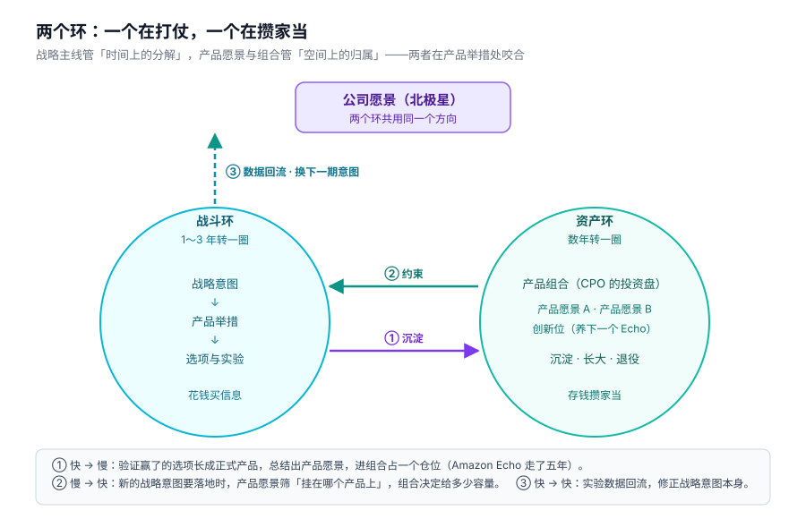

这套做法还有助于**为创新找到时间**。领导者总抱怨没时间创新，而这通常是容量规划和战略创造做得不好造成的：

> **不是你没时间创新，是你没有为创新腾出时间。**

要找到那个空间，你需要对一些事情说不。我们都被工作困住，总有一百万件明天就能有回报的事可做；但如果你想创新，就必须专门拨出团队，在产品组合里腾出空间，确保这一切发生。**亚马逊是把创新纳入产品组合的王者**：它在秘密实验室里组建团队，这些团队花数年时间研究如何扩张公司的业务——**Amazon Echo 就出自这样一个举措**：公司让一整支团队专门探索「语音控制如何帮助人们更好地购物」，产品团队又花了五年时间探索、定义和打磨 Echo 和 Alexa，才把它推向市场、大获成功。**亚马逊为进入这个新市场所需的探索，预留了时间与空间。**

---

# 第四部分 产品管理流程

这一部分回答：战略给了方向之后，团队具体怎么找出「该建什么」。答案是一套循环，从理解方向走到方案优化。

## 产品卡塔

**产品卡塔是一套用来找出该构建哪些正确方案的流程**，它以系统化的方式教产品经理带着解决问题的视角去构建产品。像武术里的卡塔一样，一遍遍重复做，这套流程就会深深印进你的大脑；练得久了，这种思维模式便成了本能。

它的四个步骤是：**理解方向**（视起点而定，看公司愿景与战略意图，或产品举措）→ **分析当前状态**（意图现状，或举措与产品现状）→ **设定下一目标**（产品举措或选项目标）→ **选择产品流程中的步骤**（问题探索、方案探索或方案优化）。前三步属于战略制定与部署，第四步属于执行，然后回流成闭环。

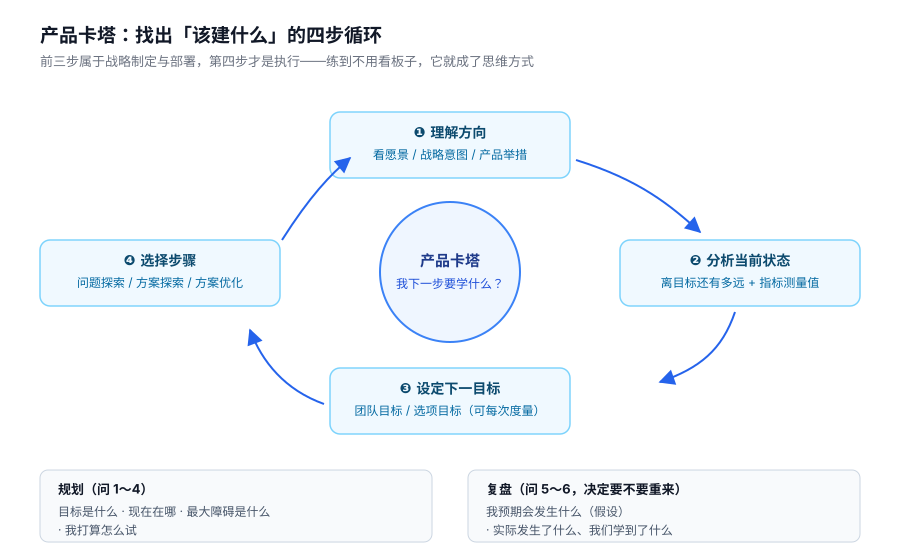

要判断是否在一步步接近产品举措的目标，就得把成功指标拆细，拆成能在更短时间尺度上度量的东西——作者称之为**团队目标**，用它来衡量选项是否成功。虽然实现产品举措的目标可能要花六个月甚至更久，但**团队目标应该做到每次发布后都能度量**，好让我们获得反馈、确认选项正按期望的方式发挥作用。设定团队目标用的是和设定产品举措目标一模一样的流程。

**「情境很重要」是这一章的核心提醒。**自从精益创业登上舞台，实验成了许多软件公司里炙手可热的话题，作者见过不少团队急不可耐地扑向某个 A/B 测试或原型。**但在投入任何工作之前，退一步看清自己身处哪个阶段、这个阶段需要什么，才是要紧事。**定下目标之后，走卡塔要依次回答这些问题：

1. 目标是什么？
2. 对照这个目标，我们现在处在什么位置？
3. 挡在我达成目标路上的最大问题或障碍是什么？
4. 我该尝试怎样解决这个问题？
5. 我预期会发生什么（假设）？
6. 实际发生了什么，我们又学到了什么？

前四个问题用来规划团队下一步怎么走，后两个用来复盘前面的工作、决定下一轮要不要回到起点重来。这些问题带你依次走过问题探索、方案探索和方案优化几个阶段；具体选哪几步、用哪些工具，都取决于你身处哪个阶段。

作者说她在产品管理里见过的最大错误之一，**就是团队在错误的阶段急吼吼地套用某个工具或做法**——很多时候问题还没弄清楚，或者对方案已经很有把握了，他们却还在做没必要的实验。Zappos 前用户体验负责人布莱恩·卡尔马的话常被她引用：

> 「别把时间耗在过度设计上，也别为那些并非价值主张核心的东西去搞独创的、创新的方案。如果别人已经用最佳实践解决了这个问题，那就去学习它，把他们的方案用起来，收集数据看看在你的情境下是否奏效，然后再迭代。**把时间和精力留给那些决定你价值主张成败的事情。**」

电商网站的结账页就是好例子：如果你并不想做成一家给其他电商公司提供结账服务的公司，就别在这上面耗光所有时间——围绕这个具体方案已经有大量实验成果，可以直接利用。**而当你要解决的问题属于价值主张的核心，那就退一步，别急着扑向第一个方案**，用你独有的情境把自己和竞争对手区分开，在敲定一个方案之前先拿几个方案想法做实验。

最后是心态：**「眼下你能做的最好的事，就是杀掉那些糟糕的想法！功能越少越好。」**这才是降低产品复杂度的办法，否则你很快会让客户陷入**功能疲劳**。记住，关键在质量，不在数量——**你用这套思路做产品管理，并不意味着你尝试的所有东西都会被发布出来，但愿其中大部分不会。**

## 理解方向并设定成功指标

这一章用 Marquetly 的实操演示了「先有数据才谈目标」。当时的对话是这样的：留存率 40%，「这不算好，因为接下来几个月我们还打算在获客上花更多的钱，如果留不住用户，就意味着要烧掉不少钱」；Qualaroo 调查挂了一个月，55% 的受访者说想找更多样的课程，这个数字已经有了统计显著性，**也就是说每个月可能错失 82500 名潜在注册用户**；流失用户中 90% 说课程不够多、提不起兴趣，**据此估算每月损失 18 万美元收入**。然后推算现实的目标：留存从 40% 提到 70% 每月多赚 9 万，获客翻倍一年能再多拿 700 多万——加起来一年 800 多万，**能让他们非常接近战略意图里 30% 的营收增长目标**。这份数字最终写成给 CPO 詹审批的举措声明：

> **我们相信，通过在网站上关键兴趣领域增加内容量，我们可以让获客翻倍、把现有用户的留存率提高到 70%，从而为个人用户每年带来约 800 万美元的潜在营收增长。**

这些概念随后被系统展开：

**产品指标**告诉你产品有多健康，最终也告诉你业务有多健康——它们是每一位产品经理的生命线。但很容易陷进去、专去衡量错误的东西。

- **虚荣指标**（出自精益创业）：永远在变大、看起来光鲜、让人印象深刻的指标——多少用户、每天多少页面浏览量、多少次登录。它们也许能让你在投资人面前很好看，**却帮不了产品团队或业务做决策，不会促使你改变行为或优先级**。
- **把一个虚荣指标变成可行动指标很容易——给它加一个时间维度**：你这个月的用户比上个月多吗？你做了什么不一样的事？
- 除了虚荣指标，还要提防**以产出为导向的指标**（发布的功能数量、完成的 Story 点数、做过的用户故事）——它们是不错的生产力指标，**但不是产品指标**，无法把产品开发的结果与业务挂钩。

作者最喜欢两个产品框架：

- **海盗指标（AARRR）**，由 500 Startups 创始人戴夫·麦克卢尔创立，用漏斗讲用户在产品里的生命周期：**获客**（用户发现你的产品）→ **激活**（用户获得很棒的第一体验）→ **留存**（让用户持续回到你的产品）→ **推荐**（用户因喜爱而向他人推荐）→ **营收**（用户因看到价值而付费）。激活和获客的区别通常最难理解：获客是用户落到你的网站并注册；**激活则是某人带着产品迈出、通往绝佳体验的第一步**——对 Marquetly 来说，激活就是去做测评，好让他们明白该选哪些课程。不过并不是每家公司变现用户的路径都一样：这套路径适合带免费增值属性的消费类产品；如果你是一款配有销售团队的 B2B 产品，用户还未激活你就已经产生营收了，可以调换这些环节的顺序来匹配你产品的流向。有了正确的漏斗，你可以轻松算出每一步的转化率，**这能告诉你人们往往在哪里流失，从而让你着手修复**。
- **HEART 框架**，由谷歌的凯丽·罗登创建，衡量**愉悦度、参与度、采纳度、留存**和**任务成功率**，用来补上海盗指标没有涉及的**用户满意度**。其中采纳度与海盗指标里的激活类似（都是某人第一次使用产品），留存含义一致。用 HEART 时你要加入其他指标来谈论用户如何与产品互动：愉悦度衡量满意程度，参与度衡量互动频率，任务成功率衡量用产品完成既定目标有多容易。

**「用数据确定方向」还有三条原则：**

- **建立一套指标体系，而不是孤零零一两个指标。**当只有一个指标、成为你唯一的焦点时，要想做文章作弊太容易了。作者把这种互相制衡、成对出现的指标体系称为**相互制衡对**——比如无论探索什么选项来提升获客，都应该一直盯着这些用户的留存率，确保它不会跌破某个阈值。
- **区分先行指标和滞后指标。**留存是滞后指标，无法立刻据此行动——要等几个月才能拿到扎实数据证明人们留了下来。所以还需要衡量先行指标，比如激活、愉悦度和参与度，**它们能告诉我们自己是否正走在达成留存这类滞后指标的路上**。通常，围绕选项设定的成功指标，是**对举措预期成果的先行指标**，因为选项是更短时间尺度上的策略；**成功指标需要和那里押注的时长相匹配**——在选项层度量指标，有助于在日后举措层出现残酷现实时避免措手不及。
- **部署一套指标平台**，这是每家公司应该最先做的事之一。Amplitude、Pendo.io、Mixpanel、Intercom 和 Google Analytics 都是数据平台，其中一些还实现了良好的客户反馈闭环（提供了触达客户、向客户提问的工具）。自研还是第三方都行，**但对一家产品主导型公司来说不可或缺**，因为它能让产品经理做出信息充分的决策。

最后是**务实**：克丽丝塔和凯伦查看了调查结果和产品分析数据来推算这些数字，还看了历史趋势尽量让估算建立在现实之上（比如她们知道自己不可能每个月获客超过 80000 名新用户，但由于有大量反馈指向「缺乏适用的内容」这个问题，她们或许能把现有的获客率翻倍）。**如果不先调查问题，你就无法设定成功指标**——这正是需要先做问题探索的原因：你设定的成功指标，将与你发现的那个问题、以及为解决它而实施的方案息息相关。

## 问题探索

产品经理常被称作「客户之声」，可作者说他们当中太多人并没有像应该的那样走出门去和客户交谈。为什么？**因为那意味着要跟活生生的人打交道**——约访谈要花不少力气，有时比窝在办公室里做 A/B 测试、翻数据还让人望而生畏。数据分析固然重要，却讲不出完整的故事。

这一章区分了两类研究：

- **可用性测试**是**评估性**研究：拿出一个原型或网站，让对方照着指令完成一系列操作。你学到的是对方能不能方便地使用这个方案，**而不是这个方案是否真正解决问题**。
- **基于问题的用户调研是生成性研究**：目的在于找到你想要解决的那个问题，要求你走到客户问题的源头、理解它周围的脉络。做这种调研时，你是在试着定位痛点与问题的根本原因。**当你理解了客户问题周围的脉络，就能构想出更好的方案去解决它；没有这层理解，你只是在瞎猜。**

作者提醒一个常见的陷阱：**我们天生爱解题，哪怕根本不知道问题是什么——大脑就是喜欢用方案来思考。**这对业务可能很危险，因为如果你对问题没有底层理解，就永远无法刻意地创造出正确的方案，唯一歪打正着的办法就是靠运气。

最常见的失足点是**把「问题」误当成「缺了某个功能」**。她复现了一段典型对话：

> 我：「你们在为你的用户解决什么问题？」
> 公司：「我们的用户没有自定义仪表盘。」
> 我：「那么……你们的方案是什么？」
> 公司：「自定义仪表盘。」

追问为什么用户想要自定义仪表盘，才得到三种货真价实但彼此不同的问题：想每天轻松查看最重要的指标，好确认某次构建有没有搞坏东西；想轻松向老板汇报最近一次发布的进度，而且只汇报自己负责的那部分指标；想每天监测自己产品的目标，好据此决定下一步怎么做。**某些自定义仪表盘确实能解决这些问题，但每个场景下构建的方式会略有不同**——如果某个人只有第二种问题，你就能省下一些工作量。

人很容易对自己认准的方案生出执念，作者承认自己也一样。就在几个月前，她有个自认为绝妙的想法想赶硅谷潮流——在网站上放一个聊天机器人、编程成像教练那样回答问题。她已经开始盘算怎么快速上线并测试，幸好她们的产品经理凯西足够清醒：「梅丽莎，我们现在就是不需要它。这个功能没有任何问题要解决。」她的朋友乔什·韦克斯勒有句话很传神：**「没人想听别人说自己孩子丑。」**绕开它的办法就是不要太执念——**在坏点子耗费团队太多时间精力之前，就把它们掐掉；相反，你要去爱上那个你正在解决的问题。**

书里有一个案例专门说明「客户要的往往不是他们说的那个东西」。几年前，一个女性商业社群的创始人请作者去评估一款 App 点子。公司前一年上过一款完全不同的 App，下载率相当成功、带来了不少获客，于是深信这款新 App 也会带来大量客户生意——他们想做一个类似 Tinder 的界面，帮女性匹配潜在的事业导师，假设是「女性需要快速获得导师来获得职业建议和晋升，并且愿意和同城的其他女性建立联系」。团队在这条假设上押了很大赌注，作者建议退一步问那个直截了当的问题：**「女性是否乐于用这种方式跟陌生人建立导师关系？」**访谈结果很直接：「噫，不要。」这些女性不想要陌生人来当导师——她们得谈论工作关系中极其私密的细节，觉得彼此先要有共同点才能建立关系；许多人是从自己信赖之人的推荐里找到导师的（父母的朋友、大学校友、姐妹会活动、职场或各种聚会）。**方案被证伪了**，公司既明白了客户想要什么，也明白了客户不想要什么；而且**它本可以在一周之内就证明或否定这个点子，而不是先付给开发者一大笔钱开始做这款 App**。

关于「跟客户对话很难甚至不可能」这件事，作者的态度是**知道一点，总比什么都不知道强**。她讲了朋友克里斯·马茨的故事：他当年在一家公司工作时被告知不能跟客户交谈，他去找那个定规矩的人，那人又把他打发去找另一位据说是定规矩的人；一路往上爬，终于找到真正下禁令的人——对方看着他：「什么？我从没说过外人不能跟那些客户交谈。我只是说要走一个特定的流程。你把这张表填了。」第二天他就和客户聊上了。在消费行业，你通常可以经由朋友的朋友联系到有相应背景的人；在 B2B 环境里，可以请销售或客户经理当你的**调研间谍**——让他们在销售电话或后续会面里替你问出你可能需要知道的问题。Marquetly 联系不上那些在注册前就流失的用户时，就转而求助于 Qualaroo。**只要跳出固有思维，你总能想出点什么来帮忙。**

客户调研还有一个坑：**人们往往一上来就直接告诉你方案**（「哦，我只需要一个按钮，能在这里做 X」）。身为产品经理，你需要往后退一步问：「那好，但为什么？你为什么需要一个按钮？你到底想达成什么？」——要理解的是用户的需求，而不是那个按钮。作者把这句话作为本节的落点：**「解决自己的问题并不是客户的职责。你的职责，是问出对的问题。」**

Marquetly 的问题探索过程是一个「层层剥洋葱」的完整案例：

- 克丽丝塔带团队走卡塔：目标是「把已发布课程的比例提高到 50%，把老师创建第二门课的比例提高到 30%」，现状是发布率只有 25%、二次开课率 10%。他们问自己挡在路上的最大障碍是什么——**「我们对老师们创建课程时遇到的问题，还了解得不够。」**于是约了 20 位老师、每人一小时，观察他们创建课程；主程里奇也旁听（因为这套流程有一半是他六个月前作为开发者设计的——当时公司才终于有了 UX 设计师）。
- 第一轮访谈整理出五条问题陈述：从别的学校转课时想轻松准确地迁移所有信息；创建新课时想轻松导入全部内容；想要纯音频选项；上线课程时希望得到定价建议；想知道潜在学生想学什么。他们画出用户旅程、标出痛点，选定「把内容弄进系统所花的时间」作为起点，写下假设：**「我们相信，通过帮助老师轻松、快速地把自己课程的内容弄进系统，我们能把课程发布率提高到 50%，并让老师创建第二门课的比例提高到 30%。」**
- 然后**第一次验证就翻车了**。团队联系 20 位刚开始创建新课程的老师，其中 10 位说确实遇到麻烦，5 位同意合作两周。他们请老师按任何方便的形式把手上已有的东西发过来，收上来的东西五花八门：Dropbox 链接、Google 文档、课程表电子表格，还有 YouTube 链接；最出乎意料的是视频——老师们发来没剪辑的原片，还附上希望怎么剪辑的说明，音频文件则是单独发来的。里奇一头雾水：「我又不是视频剪辑师。我以为他们的麻烦是把东西弄进我们的系统，而不是自己制作那些素材。」是马特的判断救了场：**「万一我们把问题理解错了呢？万一问题不是把内容弄进系统，而是创作在线内容——尤其是视频——呢？」**
- 他们回头再找老师聊，一遍又一遍听到同样的说法：「你们的网站糟透了，把东西弄进系统也很难，**但那不是我最大的问题**。我花那么久才做出一门课，是因为我得学着剪辑视频、做出有吸引力的视频。要是我能更快地做视频，这门课我能快一半就做完。」随后对所有老师做问卷，发现**做视频是老师们最大的痛点之一，遥遥领先**——光剪辑视频就要花掉两个多月；大多数没能完成课程发布流程的老师说，原因就出在花在创作和剪辑视频上的时间太多。有位老师说：「从技术上我懂得怎么拍视频，可要搞清楚什么才是好视频、再去剪辑，就超出我的能力了。」

## 方案探索

方案探索的第一条原则是**为学习而实验，不是为赚钱而构建**。实验的全部意义就在于为学习而构建：它让你更懂客户，并验证解决某个问题是否有价值。实验不该被设计成旷日持久的事——它天生就是为了证明假设真伪，而在软件行业我们希望这个过程越快越好。**这意味着无论你构建了什么，最终都可能要舍弃**，并在实验成功后重新琢磨怎么把它做成可持续、可扩展的东西。

这一章对 MVP 的批评值得单独记下。精益创业出版后，许多公司纷纷采用实验方法，但其中许多出于错误的原因——它们都想构建书中那个理想化的 MVP 概念。作者在 Twitter 上问粉丝「你们公司怎么定义 MVP」，最到位的回复是：**「两家不同的客户都告诉我，第一次发布时做出来的东西就是 MVP。」**这种想法正是把人拖进构建陷阱的东西：**当我们只用 MVP 来加快功能上线时，通常是以牺牲优质体验为代价抄了近路，从而损失了能从中学习到的内容。**MVP 最重要的部分就是学习，所以作者一直把它定义为**「学习所需的最少努力」**——这让人始终锚定成果而非产出。而因为这个术语被误解得太深，**她已经完全不用 MVP 了，更愿意谈「方案实验」**：这些实验的目的就是帮公司学得更快，不是打造稳定、健壮、可扩展的产品；**很多时候实验开始时我们甚至不知道最佳方案是什么——这正是做这件事的意义所在。**

由于这些实验本就不是为长期方案设计的，**要控制好客户接触面，并提前想好怎么收尾**：提前和客户说清实验的预期（为什么要测、实验何时以何种方式结束、接下来打算做什么），是让他们满意、也为失败实验降低风险的关键。**沟通是实验过程成功的命门。**

三类最常用的实验：

**礼宾式实验**，是用人工方式把最终结果交付给客户，但它和最终方案长得完全不一样——**客户会明白你是在手工操作，不是自动化**。这是作者最喜欢的实验类型之一，因为它**不涉及写代码、起步又快**；由于你能和客户紧密协作，反馈会大量涌来，学习回路也极其紧凑。它对 B2B 公司尤其有价值，因为许多 B2B 公司就是这么起步的——先替客户干活，之后再自动化；**亲手承接这些工作，你能学会怎么一次就把软件做对；而且在一项服务上迭代，远比在一个编码功能上迭代更快、更便宜。**她在一家 SEO 公司工作时用 Excel 搭过一个预测工具，手工交给几位客户，观察他们的反应，了解到他们对哪些控制因素最感兴趣、多大的确定性让他们觉得安心；用了一个月表格之后，这个功能就被写进产品、面向全体用户发布，大获成功。**但要记住，这种方法无法规模化，因为太耗人力**——做这类实验时，用户数量要刚好够你与他们保持经常性联系、获得充分反馈；等你想验证方案能否扩展到更多人时，就该换一种实验了。

**绿野仙踪式**，关键在于它**看起来、用起来都像一款真实完成的成品，客户不知道后端全靠人工**——有人在幕后牵线，就像《绿野仙踪》里的巫师。Zappos 就是这么起步的：创始人尼克·斯温默恩想验证人们会不会真的在网上买鞋，于是在 WordPress 上搭了个简单网站，访客可以在网上浏览并购买鞋子；但后端只有他一个人——**每来一单，他就跑去西尔斯买鞋，再亲自到 UPS 发货**。没有基础设施，没有鞋子库存，也没有人接电话，那只是一个创始人等着订单落地的页面。通过这种方式，他验证了网上买鞋确有需求，而且完全不必把整站建起来。

作者自己也用过这一招。在一家电商公司工作时，运营负责人提出可以做订阅制（当时亚马逊刚上线一键订阅），但她们的第三方发货管理系统不支持订阅类产品，要做就得动大手术。于是她们设计了一个绿野仙踪式实验：**把每个符合订阅条件的产品复制一份，在标题上加「订阅」字样，结账时附上一份简单的 PDF 协议**——在客户看来这就是一款普通的订阅产品，而后端由客服团队每月拉出订单、替用户重新下单。跟踪四个月销售后，她们发现很多人会在第二或第三个月取消订阅。打电话一问，大家说的是同一个问题：**「我想感觉自己对购买有掌控权。我现在订阅的东西太多了，宁愿自己下单。」**于是她们换了个思路：每月给需要复购的买家发一封简单的提醒邮件——**销量一飞冲天，而且正因为先做了实验，省下了超过 10 万美元的开发成本。**作者提醒：**公司往往舍不得撤下绿野仙踪式实验，因为它在客户眼里太真实**——但这不明智，毕竟后端仍是人工操作；等你明确了想走的方向，就该开始构思完整方案，或转向其他形式的实验。

**A/B 测试**是把一部分流量分给一个新方案，看它相比网站现状能否推动某个指标变化；它可以和其他技术组合使用，也可以单独用来验证新设计或新文案。**但用 A/B 测试要挑时机，有两种情况不该用：一是你对方案方向还很不确定，二是页面流量不够、结果达不到统计显著性**——如果是后者，可以用概念测试这类方法来收集反馈。

**概念测试**更侧重与客户的高频互动：把概念展示给用户，看他们如何反馈，呈现方式从落地页、低保真线框图到高保真原型乃至演示视频都行，**核心思路是用最快、最轻量的方式把方案想法讲清楚**。这类实验更偏**生成性**而非评估性——请用户代入自己遇到问题的场景，问他们这个方案能不能解决他们的问题、又会怎样解决。**如果你想让它变得更具评估性、去严格检验假设，那么在与客户访谈概念时，必须定下明确的是非通过标准**——作者称之为**「请求」**：一种你需要从用户那里得到的东西，可以是一句承诺、一笔钱、一段时间，或任何能表明他们感兴趣的投入（落地页几乎总是在推销想法，同时包含一个「留下邮箱」式的请求）。Dropbox 的第一轮投资就是这么来的：起步时公司隐约觉得，自己能给用户解决的最大问题是让文档在电脑和互联网之间无缝同步，但很难把方案讲给投资人听——每次解释都被以「同类工具市场太挤了」为由不以为意。于是团队做了一段粗糙的视频，用视频剪辑拼出使用体验，演示 Dropbox 能做什么；虽然不是成品，但感觉就像一场真实的产品演示，**投资人看完激动坏了——在他们眼里，这就是魔法**。

**何时不必大举实验？**这是作者在一次工作坊上被问到的问题：「我们每次都得做这些实验吗？要是问题很容易修怎么办？」答案是**不必**——**这些工具是留给不确定性高、因而风险也大的方案想法的**。她举了一个反面例子：一个团队在减少公司内部服务台的来电，他们发现「本该显示的按钮没有出现在屏幕上」，作为这套方法论的优秀学生，他们想上一个 A/B 测试。作者告诉他们这不对：**在这个案例里，团队既知道问题也知道方案，直接实施就好，不需要事先测试；但实施之后，仍然应该持续测量它是否真的减少了来电。**

介于两者之间的情况（方案既不像「缺个按钮」那样一目了然，也不像前面那些例子那样虚无缥缈），你仍然应该为学习而构建，但可以动用其他工具，比如**原型**——它是最流行的测试工具，**好用在于不需要写任何代码**。但要注意：**做原型时如果不走设计冲刺的路子（也就是在设计之前先做大量用户调研），你很容易陷进去，试图解决一个自己还没理解的问题。需要验证问题本身时，原型毫无意义**——那时候你只是在空转：做出闪亮炫目的设计，好看是好看，却帮不了你学到该学的东西。**所以，任何方案活动之前，都要先把精力放在探索问题上。**

**「我们这行做不了实验」是最常听到的反对意见，作者说这话大错特错。**当然，不是每个行业都能用落地页或绿野仙踪式（它们最适合消费类产品），但这只是两种实验而已——**只要一个好的实验能帮你学到东西，你总能在自己的约束里找到办法**。把未知变成已知能降低风险，这对银行这类庞大官僚的公司成立，对航空这类产品开发周期漫长的行业同样成立。**不学习，没有任何借口。**她举了航天飞机的例子：建造这个复杂系统要花好几年、还涉及硬件，但过程中照样可以穿插实验——比如测试面板能否承受引擎的高温，这就是一个实验：提出假设、进行测试、不断迭代，找到合适的材料组合；一旦确定了，就把它作为航天飞机的部件造出来。

这一章最精彩的案例是 GiveVision。作者 2014 年在伦敦给这家公司当顾问（Wayra 加速器项目），它的使命是帮助视障人士「看见」世界——提供一副眼镜，帮他们读出、识别并播报周围发生的事。这副眼镜的开发周期以年计，公司必须和第三方制造商一起给软件编程，**而且之后无法迭代——软件被硬编码进眼镜，装好就再也不能更新**。创始人在和作者聊风险时承认，最大的风险是：**能编进眼镜的功能选项太多，没人确定哪些价值最高。**于是公司开始做实验：

- 首先是大量调研，包括**跟随并观察视障人士如何度过一天**。一位女士说：「我每天都要坐某路公交车上班，但从来分不清进站的是哪一路，所以每辆车我都得招手拦。上车后我问司机，一旦发现不是我要坐的，就马上下车。下车时，我能听到全车人叹气，嫌我耽误了时间。我真希望能看清公交车进站时的路号。」这样的故事越积越多，公司据此圈定优先级：读标志牌（比如辨认公交车路号）、读营养成分、识别货币和颜色。
- 下一个问题是「我们能让软件以用户满意的方式识别和播报吗」。往眼镜里编程一次、制造商那边周转要六个月，按这个节奏根本没法快速迭代，每次重新生产的成本也高——**于是公司想了个巧招：把本该跑在眼镜上的软件装进一部 Android 手机，用手机摄像头当镜头；为了模拟佩戴的位置和高度，工程师用 3D 打印机做了一副能绑住手机、戴在头上的「眼镜」。**他们请用户试戴，让人戴着它过上一整天。作者自己也试戴了一次——「说实话，看着是有点傻，但真的能用」。用户对这副简陋的「眼镜」充满热情，反馈了软件回答的措辞、识别的位置、识别的时机等方方面面。**就是这么一点创意，让公司不必等上几个月甚至几年，就学到了大量东西。**软件侧的风险化解之后，六个月后他们做出了真正眼镜的原型，用它去融资、也用它做更多模拟试验。

**内部产品也要这样做**，这是作者被反复问到的问题（「做内部工具，我真的得用这些方法吗？」——是的，绝对要）。她的第二份产品管理工作是统筹那家电商公司的全部内部工具，实际上既是产品经理又是 UX 设计师。在那之前她一直以为，既然客户永远看不到内部工具，体验和设计就不重要，把功能做出来就行。带着这种心态做了一年，她迎来一记响亮的耳光：那一周她几乎天天在家办公，老板问她为什么不去公司，她说「我桌前排着队，都是让我帮忙上传产品的人，因为他们搞不定那些工具。我自己还有活儿要干，不能当所有人的客服」。老板顿了一下，看着她说：**「如果他们用不来这些工具，那是你的问题，不是他们的。」**

她开始像任何面对外部用户的产品经理那样对待这份工作：写下问题陈述，和他们一起做调研，围绕方案做实验（用过礼宾式实验、概念测试，还有大量的原型），并开始深入了解他们的工作方式。变化是巨大的：**内部用户更满意了，那些原本觉得自己没法好好干活的岗位员工，流失率也降了下来**；大家能干出更多成果，公司运营成本也随之下降——因为不用再以惊人的速度不断招人了。

这一章的收尾是 Marquetly 选定方案的完整过程。确认视频剪辑就是问题所在之后，轮到产品副总裁凯伦评估选项，而她面对的是一个**自建、合作还是采购**的决策：「要么我们自建服务——全职或外包招视频剪辑师；要么自己开发视频剪辑软件；最后，也可以直接采购一款好上手的视频剪辑技术，嵌入老师平台。从利润角度看，最后一个最优，但风险是老师们可能用不来。我得先调研一下市面上都有什么。」她按团队在实验中发现的方案要素（搜索并添加背景音乐、轻松拼接视频、同步独立音轨、在视频上叠加文字，且都在简洁易用的界面里）找到一家布达佩斯的公司，功能完全符合需求。接下来就是**下一轮实验**：把 40 位老师（既有新老师，也有此前发布过口碑课程的老师）拉进来，给他们 30 分钟软件使用讲解外加一份做视频的指南，然后放手让老师自己操作。第一周问题开始零星涌来（多数困惑来自软件里略显复杂的用户体验），团队记下一笔「如果真要采购，界面有些元素需要重新设计」；三周后课程开始陆续上架，**到月底 40 位老师中有 30 位发布了课程**——虽然没赶上礼宾式实验的成绩，但远高于老师们没有剪辑软件时的 25%。他们认定实验成功。

## 构建并优化你的方案

方案验证通过之后，才是「构建并优化」。这一章开头的商业论证现场很能说明前面所有工作的意义。凯伦对领导层讲的是：战略意图之一是把个人用户的营收增长率在两年内翻一番；他们相信只要在几个关键兴趣领域增加内容，就能把获客翻倍、把老用户留存提到 70%，个人用户每年有望增收 800 万美元；可团队在往网站上添内容这件事上发现了一个大问题——**启动了课程的老师里只有 25% 真的把课程发布出来，会发布第二门课的老师只有 10%**。CEO 克里斯惊叹「这也太离谱了，我完全没想到数字会是这样」。凯伦接着说，主因是视频剪辑（老师是营销专家，不是剪辑专家，光剪视频要花 80 多个小时）；而过去一个月他们做了两个小实验：给老师配上简单好用的剪辑软件后，**发布率从 25% 提到了 75%**，还看到新课正在重新抓住那些早已不上心的学生。

CTO 问能不能把这套做法直接推广给所有老师，凯伦给的是一笔账：**从钱的角度负担不起给所有老师发授权，投资回报率根本不够看；自己开发这套功能，光发布第一版就得花一年多。**所以她建议**直接收购那家布达佩斯公司**——那样就能把技术无缝集成进自己的平台，只要技术没问题，几个月内就能上线第一版，期间先谈一个合作方案让老师短期用上。CFO 问风险，她的回答是**「大部分风险我们已经排除了」**：先做实验已经能确认，只要给老师合适的工具，他们就会自己剪视频、也会真的把课程发布出来；所以从老师的角度看，这是一个值得解决的问题、方案对他们管用；从商业角度看，收购成本摊下来的潜在投资回报率相当高，还不用开发团队费太多劲、能更早推向市场。两个月后团队提交收购要约，又过一个月交易达成。

接下来就是这章的正题，四件事：

**演化产品愿景。**克丽丝塔对团队讲了一段愿景：「我们的视频剪辑软件，要给老师提供一种最简便、最快的方式，为学生们做出吸引人的视频。我们让老师可以编辑自己和第三方拍摄的视频素材、同步外部音频、查找并添加背景音乐、在画面上叠加文字。我们还知道，老师们需要一份指南，帮他们边做边弄明白怎么做出吸引人的视频。然后，我们还需要一种办法，把成片无缝上传到他们的课程里。」——**这个愿景是一路迭代打磨出来的**。作者说得很清楚：要是团队一早就急着指手画脚地定功能，很可能永远找不到对客户真正合适的那个方案，多半还会一直困在「重新设计课程创建工作流」这件事上——而后来证明，那根本不是最大的问题。

**用北极星文档和故事地图对齐。**产品愿景的方向定下来之后，重要的是确保所有人都理解背景、知道接下来要做什么。一份**「北极星」文档**，用一种整个团队、整个公司都能看明白的方式把产品讲清楚：这个产品在解决什么问题、打算怎么解决、哪些方案要素对成功至关重要，以及这个产品最终会带来哪些成果。**它很适合向广泛的受众交代背景，也应该随你对产品越来越了解而不断演变——但要注意，它不是一份行动计划，不包含团队将如何构建产品。**而**故事地图**正是补那一块的工具，出自产品管理老手杰夫·帕顿：**「它的目的是帮团队就自己的工作和『要交付价值必须做成什么』进行沟通。」**团队用它把交付一个成功方案所需的所有要素想了个遍，其中包括从用户的角度拆解每一个期望的动作。**团队一起建立理解，能让你更快地做出产品，也意味着更快地把价值带给客户**；形成共识之后，回缩到产品第一版也会更容易——**但你始终得从那幅大图（北极星）出发，否则就没有东西可以锚定你，你最终会把自己领进构建陷阱。**

**给工作排优先级：延迟的代价。**要做出一个第一版你必须排优先级，而这是大多数产品经理最头疼的问题。市面上有很多框架，比如收益映射、卡诺模型，但作者最喜欢**延迟的代价**：**「只要你能从战略的角度看懂想要的成果，就能用延迟的代价来判断什么东西该更早发布。」**

唐·赖纳特森在《The Principles of Product Development Flow》里讲到这个概念有多重要，他把它称作**「最该被量化的一件事」**：**延迟的代价是一个描述时间对你想要达成的成果有何影响的数值，它把紧迫性和价值合在一起**，让你能衡量影响、排出应该先做什么。盘算第一个版本时，你需要在两件事之间斟酌：**用这次发布的范围能捕获多少价值，以及把产品推出去要花多长时间。这是个优化问题——你得把范围缩减到恰到好处，好在合适的时间里捕获最大价值。**如果因为范围定得太大而拖得太久，你就会失去本该赚到的钱；更糟的是，竞争对手可能乘虚而入、抢走你的市场，到那时你进入的门槛变高了，产品还得比对手领先好几个光年。反过来，你也不想为了让产品早点出来就发布一个糟糕透顶、对用户几乎没用的东西——那样你会失去早期采用者，而一个人一旦有过糟糕的体验，想再把他赢回来就难了。

Marquetly 团队讨论过把第三方视频功能放进第一版会带来怎样的延迟代价，最终决定：**这一功能对大量用户来说并非关键组件，要把这部分代码写出来还得再花一个月，所以第一版不该包含它。**「发布得更快才是理想选择，因为公司每推迟一周，就意味着一门课没能发布。」

真算每个功能的钱太难，所以延迟成本专家奥兹莱姆·于杰和乔舒亚·阿诺德给出了一套**定性方法**：一个矩阵，纵轴是价值（一般/加分/关键），横轴是紧迫性（随缘/尽快/立即），格里标注每周延迟的代价。

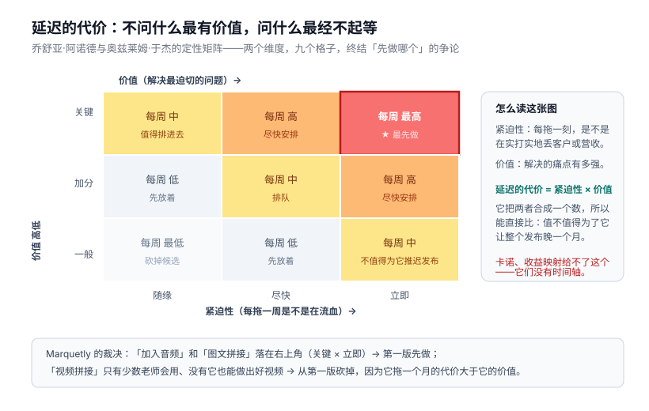你要从这两个维度评估每个功能或功能组件：**紧迫性高，意味着你每拖一刻不把这个功能发布给客户，就在错失达成目标的机会**——比如你正每周流失客户或营收，因为某个需求没被满足；**价值高，则关乎为客户解决最迫切的问题、满足最强烈的渴望。**Marquetly 的裁决是：紧迫性最高、价值也最高的功能是**加入音频、以及把内容跟图片拼接在一起**（这是方案里两个关键组件，排在最前面）；其余功能大多落在矩阵偏高的区域，唯独视频拼接例外——它只有少数老师会用，而且没有它一样能做出很棒的视频，所以紧迫性和价值都低一些，没被排进第一次发布。

**完成的真正定义。**敏捷里的「完成的定义」按 Scrum 联盟的说法，是一份「要产出软件所需的一系列有价值活动的清单」；团队制定它时关注点通常落在把发布产品所需的全部功能构建完。**这个概念有用，能确保团队做完了该做的事，但它对「一个功能算完成」设下了一个错误的预期。**

> **只有当某功能达成目标之后，我们才算完成对它的开发或迭代。**

可很多团队往往发布完功能的第一版就跑去忙下一个，从不衡量它为用户带来的成果——杰夫·戈特赫尔夫有句话点得很准：**「第二版是软件开发里最大的谎言。」**这种心态总会把人领进构建陷阱。相反，团队应该像 Marquetly 那样做：**发布之前先定好成功指标，然后一边衡量、一边迭代，直到达成**；**第一版应该被当作一个假设来看待，就像其他任何工作一样**；而且，如果我们发布了功能、它却没达成目标，**我们就要敢于把它撤下来，换别的办法再试**。

无论你是在构建一个新功能，还是在优化一个既有功能，流程都是一样的；如果围绕的只是一个比新产品小得多的功能，问题探索的周期可以短一些、实验也不必那么周全——**但无论如何你都要诊断问题、想办法理解怎么解决它。**

Marquetly 的落地过程：团队定下第一版的成功指标——一个月内目前正在建课或开课的老师中有 75% 采纳这套软件；课程发布率从 25% 提升到至少 60%；创建一门新课的时间从三个月缩短到不到一个月。里奇负责把数据统计搭好，以便边做边持续跟进。发布一周内他们就看到功能采用率开始上升，也不时联系老师了解使用感受。**一个月后克丽丝塔把数据拉出来对比：采纳率只有 60%，没达到 75%；但采纳的那些老师发布率达到 75%，已经超过了此前的课程发布率。**她的反应是关键——**「我们需要弄明白到底是什么东西挡在老师前面，让他们不肯用这套东西。我们去找上个月没用它的那些老师聊聊，问问为什么。」**作者走过去跟她说：「我很喜欢你还在像产品卡塔教你的那样诊断问题。」克丽丝塔的回答是：「我现在就是这么思考的！我连那块板子都不需要了。**我永远在找那个问题，以及我需要学习的东西。**」团队持续迭代，直到达成目标；几个月后结果是 75% 的发布率、更满意的老师、越来越多的第二门课。

作者在这一章的最后点出全书的一个关键前提：**流程和框架只能带你走这么远。**克丽丝塔的团队之所以能成功，只因为环境允许他们成功——他们可以跟客户交谈；团队围绕成果运转；而后领导层给了他们空间，让他们自己去摸索如何达成那些成果。**「文化、政策和结构，才是真正能让一家公司在产品管理上脱颖而出的东西。」**

---

# 第五部分 产品主导型组织

## 以成果为导向的沟通

这一部分要回答的问题很直接：前四部分把角色、战略、流程都修好了，**为什么很多公司走到最后一步还是撞墙**？

先看 Marquetly 的变化。在接下来的季度业务评审会上，凯伦终于能开口谈团队取得的成绩了：「这个季度，我们成功发布了视频剪辑软件，把 150 门新课程引入网站，全都踩在用户关心的关键领域上。这些课程上线以来，获客率从 15% 升到了 25%，留存也涨到了 60%。我们离目标已经很近了。」一年前，这家公司还是卡在构建陷阱里的典型：以项目为导向，CEO 拍板什么就拉团队去做什么，组织里没有产品经理，团队从不和客户交谈，考核奖励全看能不能把做好的软件发出去。这些特征正在淡去。CEO 克里斯私下说，他本来不知道会看到什么，但确实看到了进展，而且**那些评审进展的会议帮了忙**——「我觉得这类会议得开得更频繁些，好让我们能清楚地看到公司的成果和各项活动。」

作者说，她见过太多公司转型失败，**主要原因就是领导层没有真正买账、不愿意转向以成果为导向**。领导们嘴上说想要结果，可真到算账的时候，还是拿发布的功能数衡量成功。为什么？**因为无论领导层面还是团队层面，看到东西动起来都让人很有满足感**——人们想感觉自己真的做成了事，把完成的工作一项项打勾感觉确实很好，**但这不是衡量成功的唯一标准**。所以需要别的办法，帮助我们在不同层级沟通和谈论进展。

**组织中的可见性绝对关键。**领导越能看清团队在哪儿，就越愿意退后一步、放手让团队执行。这正好回到战略差距那一章：**你越试图隐藏进展，认知差距就越大**，领导会索要更多信息、收紧你探索的自由；反过来，只要你保持透明，就能获得更多自由、走向自治。很多公司退回老习惯，是因为没想清楚该怎么用成果的形式在全公司持续沟通进展——**领导一旦看不到向目标推进的进展，很快就会回到老路上去。**

所以需要一套**和战略框架匹配的沟通节奏**。战略的四个层级（愿景、战略意图、产品举措、选项）各有时间跨度，对进展的沟通也应该相应分层。作者合作过的大多数公司都有几个核心会议来评估进展、从产品层面做战略决策：

- **季度业务评审**：由高管和公司最高层组成的高级领导团队，讨论财务性质的战略意图和成果的进展，包括回顾本季度营收、客户流失以及开发或运营相关的成本。**首席产品官和产品副总裁们负责说明产品举措的成果如何推动了战略意图**，就像凯伦做的那样。旧的战略意图行将完成时，新的战略意图也可以在这个会议上提出。**但这里不是给新产品举措排优先级、细聊它们的地方**——那是产品举措评审该干的事。
- **产品举措评审**：另一个季度会议，可以和季度业务评审错开、排在中间那些月份。这个会议面向产品开发这一侧——CPO、CTO、设计负责人、产品副总裁和产品经理。在这里，**对照产品举措来评审各选项的进展，并相应调整战略**；产品经理谈论初步实验、调研或首批发布的结果，以及它们与整体目标的关系。新产品举措也可以在这个会议上提出，征求意见和认同，并申请产品开发领导团队的拨款——**产品团队可以申请更多资金，用来做第一版或者优化现有方案。**
- **发布评审**：让团队有机会展示自己辛苦做出的东西、聊聊成功指标。这个会议应该每月一次，赶在功能发布之前，向大家展示即将上线的内容。会议期间**只沟通确定会发布的东西——不是正在进行的实验或调研**。虽然并非必需，但大多数高管喜欢参加这个会，看看有什么要发给客户；这里也是团队对内沟通路线图的地方，让市场、销售和高管团队心里有数。

需要强调的是，**决策并不都发生在这几个会议上**——这些会应该用来展示进展、抛出需要调查的警示信号，**真正的决策通常是在会后做出的**：当某件需要行动的事情冒出来时。

**路线图与销售团队**是沟通里绕不开的一块。一说到「路线图」，产品经理们就本能地皱眉。公司之所以在路线图上栽跟头，是因为过去做的是甘特图——那种图基本就是在说「我们 1 月 18 日交付这个功能，3 月 20 日交付那个功能」，而且不少路线图被当作承诺许给了客户、就此锁死无法更改；等你意识到自己承诺过度、交付不足时，麻烦就来了。

**不要把路线图当成甘特图，应该把它看作对战略和产品当前阶段的说明**：它把战略目标、工作主题，以及随之涌现的产品交付物结合在一起。要做到这一点，路线图得不断更新，尤其是在团队层面——这正是这种路线图被称为**「活路线图」**的原因。路线图也不是放之四海皆准的：**对内，你要跟团队聊不确定性；对外，你要跟销售团队说那些他们能拿去和客户沟通的功能——这两种场景，沟通方式截然不同，你的沟通应该按听众来设计。**

她推荐了 C. Todd Lombardo 和布鲁斯·麦卡锡合著的《Product Roadmaps Relaunched》作为深入资源，并给出路线图的几个关键组成部分：**主题、假设、目标与成功指标、开发阶段、重要里程碑**。

其中「开发阶段」值得全公司统一术语，让每个人都知道正在进行的是哪种活动：

| 阶段 | 含义 |
|---|---|
| **实验** | 理解问题、判断它值不值得解决。团队在做问题探索和方案探索，**不写任何生产代码** |
| **Alpha** | 判断方案对客户是否有吸引力。最小功能集或一次完整的方案实验，但**用生产代码构建、对一小部分用户开放**——这些用户明白自己拿到的是早期版本，如果它解决不了问题，功能可能会变、也可能被砍掉 |
| **Beta** | 从技术角度判断方案是否可扩展（并非必需，但是降低风险的好时机）。面向的客户比 Alpha 阶段更多，但由于还在测试，仍只覆盖总人群中的一小部分。此时已证明方案对客户有吸引力，所以不太可能被砍掉——除非它在技术上不稳定 |
| **全面可用（GA）** | 方案已向所有客户全面开放。**销售团队可以公开谈论 GA 产品，尽可能多地卖给目标市场** |

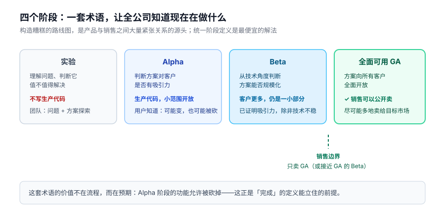

统一术语不只帮助和领导的沟通，也有益于业务的其他部分。**构造糟糕的路线图，是产品与销售之间大量紧张关系的源头**，所以要和销售团队打造**协作约定**：**凡是发布为 GA 的——或者 Beta 走得比较靠前的——都可以加进他们的销售路线图。**

要把这一切组织起来需要大量工作，**这正是你需要一支产品运营团队的原因**。

当公司只有寥寥几个产品团队时，掌握各方进展相当容易——领导可以直接走到产品经理身边了解目标的进展，流程通常由团队自己定，协调不是大问题。但随着团队扩张，跟踪进展、目标和流程就成了挑战，这正是克里斯说的那种「看不到进展」的挫败感：**部署战略与目标、判断实验是否成功、汇报进展，这些事单靠产品领导们来做，工作量太大了**，他们需要专注于把产品做起来，运营工作成了越来越大的干扰。

Marquetly 的解法是落地一支产品运营团队，由一位向 CPO 汇报的**幕僚长**负责。她组建了一个很小的团队（两个人），帮她梳理运营和汇报：他们统筹战略节奏，找到数据分析伙伴来搭建追踪，把向目标推进的进展收集、整理成给高管的报告。**这让产品人员得以专注于自己擅长的事，而产品运营通过把这些报告呈上来，帮他们做出有依据的决策。**

在更大的组织里，你需要同样的东西，只是规模更大——这支团队仍向 CPO 汇报，但需要一位经验丰富的负责人（通常是 VP 级）来统领。它负责梳理产品团队取得成功所需的一切运营和流程工作：

- 打造自动、精简的方式，跨团队收集向目标和成果推进的数据；
- 汇报整个产品组织的目标、成果、路线图、进展、容量和成本，**把这些活动翻译成对高管的财务影响**；
- 搭建并维护产品分析平台，汇报整个组织的产品参与度指标；
- **标准化跨团队的产品流程**，比如战略节奏、实验追踪与反馈、产品功能文档、数据收集、目标设定、路线图的创建与维护，以及销售赋能；
- 组织并主持战略制定、战略部署和发布等关键产品会议；
- 为产品团队开展辅导与培训。

这支团队的意义**不在于规定团队成员该怎么协作做产品，而在于为工作的输入和输出制定标准**：比如他们不为团队创建产品路线图，而是打造一套系统和模板，让团队输入自己的目标、主题、进展和细节，再在全组织分享；他们不规定团队能不能跟用户交谈，而是创建系统，帮助团队搞清楚实验该瞄准哪些用户。人员构成上，最好由项目经理和产品人员混合组成，再配几位开发者，这样需要时可以对接第三方，或者为特定目的打造定制工具。

作者合作过一家有 **350 多个 Scrum 团队**的公司，在那里落地了产品运营团队。在那之前，他们在发布、测试上毫无标准化可言，更别提把目标呈现出来了，CPO 很受挫——感觉没有正确的信息就没法对产品组合做决策。团队刚拉起时，作者对新任的产品运营副总裁说：**「你的成功，就是把你的团队自动化掉。」**这位副总裁懂这个意思——**这不是一支注定要变大的团队，而是一台致力于自动化、精简和优化的效率引擎**；虽然它大概永远不会解散（这个领域有太多工作要做），但绝不应该追求超出需要的规模。

这一章最后留了一句警告：**光有这些，不会自动让整个公司长出产品思维。**汇报成果可以开始改变行为，但作者经常看到公司走到这一步就撞了墙——**因为它们常常改了流程，却还在用老一套方式奖励人。**

## 奖励与激励

接上一章：**转型公司身上最常见的最大问题之一，就是不审视自己现有的奖励结构、不确认它是否在激励正确的行为。**

作者合作过一家公司，所有人的奖金都按公司记分卡发放。每年公司进入年度规划，确定想完成什么、写进记分卡，再分派给人——**记分卡上大多是「要交付的东西」，而不是「要达成的目标」**。她最初采访产品领导们、问他们如何被衡量成功时，他们都笑了：

> 「你想知道我们十二月在干什么吗？我们停下手头的一切，盯着记分卡。如果上面有些条目没交付——因为那些事一年之后再看，真没那么重要——我们就开始随便造点什么，只要能满足那些要求。梅丽莎，说真的，只要能赶在时限内做出来、勾掉那个框，不管多烂的东西我们都发。一进一月，我们就把所有时间花在拆解这些乱七八糟的代码上。不过，嘿，三月份我们都能拿到奖金。」

说白了，**每个人每年都要浪费一个月，就为了达成这些目标、拿到奖金——而奖金占他们收入的不小一部分。灾难。**

作者说她听过太多次产品经理说「目标是什么不重要，我们只要把这个功能交付掉」，而且说这话的还是**优秀**的产品经理——他们想做出好产品，**只是不相信在当下的环境里做得到**。**是公司政策把他们逼进构建陷阱的，哪怕他们知道那样做产品是错的。**把生计绑在「是否发布了产品」上，而不是绑在为客户学习、为客户解决问题上——这正是把人推进构建陷阱的东西；它也意味着人们不敢尝试任何新东西，这种心态扼杀创新。既然我们在这些转型中要求人们按新方式工作，为什么还要用过时的方法评判他们的成败？

虽然很容易觉得，既然激励规则通常由高管层和组织领导定，那大部分事情都超出了产品经理的掌控——但作者认为这可能不是全部的真相。**她的建议是：去推回去。**她知道这很吓人，但也可能很有效。一位参加过她工作坊的产品经理走过来告诉她，自己觉得正在做错误的东西：「我想跟老板谈谈这件事，但我害怕。我说我负责的产品不是该做的产品，基本上等于在把自己饭碗砸了。我的全部奖金都押在发布这个东西上。」作者和她一起过了一遍针对她组织政策的行动计划，她回去向老板陈述了自己的理由——**她解释自己分析了部门的战略，初步数据表明他们正在做的产品不是个好主意**。老板听了，表示同意，他们商量出如何在两个月内逐步停掉这款产品；最后，**老板把她调到一个更重要的产品上，还给了她团队里更高的资历——双赢。**

作者补充：尽管很多政策难以改变，但**就算你没有那个资历，你仍然可以尝试改变那些能把信息往上传递的人的想法**。这能开启正确的对话：跟你的老板谈成功到底意味着什么，**定义你的指标**，明确做到什么程度才算完成，用这个框架在评审中点燃对话——**而且，永远带着数据来。**

激励不只影响产品团队，也影响组织的其他部分，销售就是显眼的一个。大多数销售团队对「卖」负责——签下合同、带来营收；许多团队为了完成提成指标而过度承诺，而提成通常占他们收入的大头。作者待过的一些团队，**销售部门把路线图过度承诺到开发落后了两年**，客户怨声载道、流失率很高；也见过销售团队为了凑数瞄准了错误的客户，而那些客户很快就离开了。**仍然希望激励销售团队继续卖，但调整他们的薪酬构成、让他们的生计不要太依赖提成比例，有助于缓解这种风险；把留存数据挂进他们的成功指标，也有助于确保他们瞄准正确的人。**

给领导者的结论：**是时候重新审视你激励人的方式了。**你应该奖励那些推动业务前进的人——**达成成果、了解用户、找到正确的商业机会**。说到底，其余的不过是虚荣指标。

## 心理安全感与学习

除了阻碍人们创新的奖励结构，**组织文化也起着重要作用**。你可能没有只凭产出评判团队是否成功，但他们可能仍然不愿意尝试新东西——**因为组织里可能没有足够的安全感，容不下失败和学习。**

Marquetly 之所以成功，是因为团队做实验的时候，CEO 和领导们**忍住没插手**——哪怕那让他们有点坐立不安。产品经理需要组织给予一定程度的信任，才有空间去探索不同的选项；要真正突破边界，团队就得尝试一些看起来相当疯狂的东西——那可能不是你最初想到的方案，团队一开始也可能没有全部答案，**但如果他们不被允许探索这些离经叛道的路径，就永远不会撼动现状。现状是安全的，可现状也让你无法创新。**

**但这并不意味着我们应该轰轰烈烈地失败。**随着精益创业兴起，我们开始关注成果——没错——**但也开始庆祝失败**。作者把话说得很清楚：

> **如果失败了却没有学到东西，那不算成功。**

学习应该成为每个产品主导型组织的核心，应该成为驱动整个组织的力量。与其把所有时间和金钱花在一场众目睽睽的大失败上，**不如更早、以更小的方式失败**，从中学会什么能成功——这正是产品管理里要有问题探索和方案探索的原因。

**但有时候，我们会以最壮观的方式失败。我们如何应对这些局面，真正决定了公司的文化。**她特别讲了 Netflix 试图拆分成两家公司的故事：2011 年，Netflix 想把 DVD 业务拆出去成立 Qwikster，这在市场上完全是一场灾难——人们非常愤怒，纷纷取消订阅，写下尖刻的文章，许多文章痛批这场惨败会终结这家公司。Netflix 迅速回应，撤回了这一变更；很多人以为它撑不过这次失败，可看看这家公司现在什么样——**CEO 公开道歉，解释当时的决定并非其战略的核心，并表示公司要回归本源：通过卓越的按需娱乐来满足客户。**公司自己重新站了起来，继续前行，**从未用那次经历去扼杀创新**；几年之后，Netflix 开始自制剧集——一场巨大的实验，**这个信号响亮而清晰：Netflix 是一个安全、创新、敢于突破边界的地方。**

很多公司嘴上说希望员工有创新精神、希望做出疯狂的新产品，**但你必须先让所有人明白：在这里，失败是安全的，才会有创新**。如果公司没有把安全感内建到文化里，产品经理就不会自在地尝试新东西——谁都不会。

企业都喜欢谈风险管理。讽刺的是，**实验才是最极致的风险管理策略**——因为尽早实验，你可以避免一个日后要花几十亿美元才能发现的失败。Netflix 本可以用 Qwikster 试试水，却把全部力气押在了一个未经验证的想法上；这家公司足够幸运，能立刻得到反馈、及时掉头，**但并不是每家公司都这么走运。**

**太多公司在慢慢失败。**它们发布产品，却从不衡量这些产品有没有起到作用，就任由它们躺在那里、在无尽的功能海洋里积灰，永远不知道它们是否在创造价值——**这是更危险、更昂贵的失败方式。花 10 年失败——慢慢烧光现金、一事无成——比沿途允许一些小的失败要麻烦得多。**反过来，如果你采纳优秀的产品思维、给人们失败的自由，你实际上是在允许他们**快速、安静、低成本地失败**，因为他们早早就开始测试了。**这才是你该鼓励的失败，也是我们能够从中恢复的失败。**

理想情况下，**产品经理应该是风险的化解者**，会说：「嘿，我觉得我们最贵的做法，就是在不知道这是不是该做的产品时，闷头把它造出来。我怎么测试它、确认这确实是我们想要的？在投钱之前，我怎么才能更有信心我们走在正确的路上？」**给人们留出这种空间的领导，会看到最好的结果，也能避开构建陷阱。**

**划定行动的边界，同样是领导者的职责。**领导可以这样说：「行，你们去做实验，但这场实验只能花 10 万美元，我们不想投入更多。等你们搞清楚状况再回来找我们，到时候我们再考虑追加投入。」划边界的方法有很多，作者经常推荐的一种是**把用户群分成不同的群体做 Alpha 和 Beta 测试**——不要把产品直接发布给所有人，而是从一小群有代表性的用户开始，从他们身上学习，等信心更足了再扩展到更多人。**这样做能省掉正式发布所需的大量宣传，如果产品不行，也能把回滚控制在范围内。**

**第一场实验对所有人——领导也好、产品经理也好——都是最吓人的**，所以作者建议产品经理**主动去谈边界问题**，让它不那么吓人：跟老板说清楚你的实验可能带来什么影响、你打算怎么化解风险、怎么省钱。

她讲了自己的第一场实验。那时她在一家名人电商公司，CEO 有个想法：把名人卖家们的个人魅力融进产品的营销，第一个具体方案是给首页套一个类似 Twitter 的界面，让名人们可以在上面随心所欲地发消息。她决定跑一场实验看它能不能提升销量：**花两天搭了个简单的测试，看看这些消息在那些页面上是否有效，用一小部分用户测了这项功能——样本量足够产生真实数据。周末的时候发现，销量完全没有提升。**于是他们掉头换了个办法，用邮件和粉丝沟通——**结果销量涨了三倍。**她算了一下把最初的想法完整做出来要花多少钱，再和第二个方案的成本对比，然后回去找 CEO 说：**「我们省下了 25 万美元，还靠另一种做法把销量提高了三倍。」**CEO 高兴坏了。她说：**通过一次次小规模地演示这种工作方式的重要性，我赢得了组织的认同，也拿到了我需要的安全感。**她的实验并非次次命中，但当她讲清楚这个方法如何帮助降低了最终所选方案的风险，组织就信任她继续走下去。

这一章最后给了三个视角：**如果你是产品经理**，想想怎么调整你向老板传递的信息，用这种方式赢得信任；**如果你是管理者**，对「新工作方式同样有益」保持开放，准备好帮你的产品经理划定边界，而不是对他们说不；**如果你是高管**，想想怎么为人们创造安全的空间去学习。

## 预算

组织之所以养成「重产出、轻成果」的思维，**预算方式是一大推手**。

一位全球金融服务公司的 CTO 来找作者请教。他在组织里一路升迁，渐渐意识到公司遇到的许多问题，根源都在预算的做法上：

> 「每年，我们都进入一个年度规划周期。管理层让所有副总裁报出各自打算交付什么，再让产品经理写商业论证，从中挑选来拨款。**这些商业论证几乎没有数据支撑，估算也相当离谱。**公司把所有这些论证拼成一份年度大路线图，分发给每个团队，然后给项目拨款。**到了年底，哪个团队没交付路线图上承诺的东西，第二年就休想拿到同样多的钱。**」
>
> 「你意识到这意味着什么了吗，梅丽莎？**如果哪个团队找到了更便宜的构建方式——或者发现这产品压根不该做——他们还是照样做，因为不把钱花完就会被惩罚。**」

作者的反应是：「这，简，直，疯，了。」而且因为预算是按年做的，**团队整年基本丧失了调头的可能——组织就这样亲手掐断了自己快速学习、快速迭代的能力。**

**更明智的做法，是像风险投资人那样看待产品开发的资金。**创业公司必须向投资人宣讲自己的愿景，以及自己收集的数据——用数据证明这个愿景在市场上可行、能盈利。它们对 VC 说：「我们现在在这里，下一个目标在那里，请给我们这么多钱，好让我们走到那一步。」VC 的投资帮公司抵达下一层级，直到它们实现盈利；**但如果公司因为这样那样的原因到不了下一层级，投资就会叫停，转而去投另一家能给 VC 带来回报的公司。**

产品主导型公司**按产品组合的分布与工作所处的阶段来投资和编制预算**：一方面，把适当的资金分配到各产品线，用于那些属于**「已知的已知」、可以开建**的东西；另一方面，**预留一笔钱，专门投资于探索能推动业务模式前进的新机会**。随着机会被逐步验证，公司再不断追加投入，让它长大。举个例子：一个团队想开辟一条新产品线、给公司创造新的营收流，它可能先申请 **5 万美元**起步，探索这个新领域，看看自己是不是真撞对了门道；等证明了市场确实存在、拿出数据表明这事能成，团队可以再要 **25 万美元**，去做更深入的探索或启动产品开发；探索、理解、弄清什么行得通之后，接下来的六个月里，它们可能做出一个小规模版本放到用户面前；**要是用户接纳了这款产品，团队就能回头申请一笔大得多的钱——几百万美元级别——用来扩张，把这条产品线做大。**

对 Marquetly 来说，这是最大的转变：**公司必须摆脱一年做一次预算的老办法，改为把钱分配到整个产品组合上，然后通过产品举措评审，依据达成成果的确定性高低，来决定该给什么拨款。**

当然，并非所有投资都从小额起步——取决于机会的大小和你手上数据的多少，一开始你可能就想多投一点。**但核心理念不变：所有预算都应该服务于把产品推向下一个阶段。**这既能帮团队保持聚焦，又能确保你不至于乱花钱。

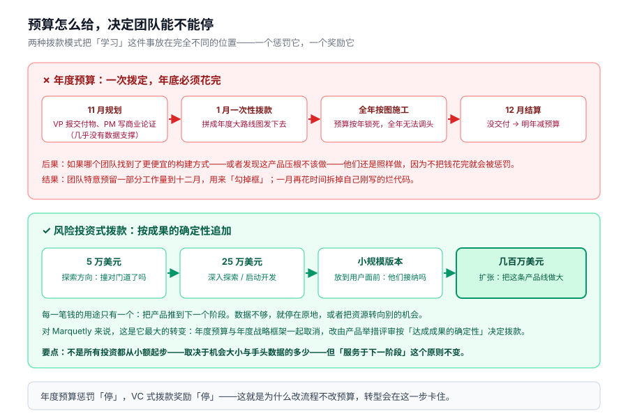

## 以客户为中心

沟通、奖励、激励、预算、政策、心理安全感，这些都做对了，对组织当然重要，**但要想真正成为产品主导型公司，还差一样东西：一种以客户为中心的文化。**

今天许多顶级公司——亚马逊、奈飞、Zappos、Dollar Shave Club、迪士尼——都是靠把目光锁在客户身上才走到今天的位置。**你从高管们谈论客户、对待客户的方式里，就能看到这种态度。**贝索斯那句关于亚马逊何以成功的名言广为人知：「最重要的一件事，就是痴迷地关注客户。我们的目标是成为地球上最以客户为中心的公司。」这套理念定义了亚马逊的一举一动，也给它带来了丰厚的回报——凭借免费两日达和触手可及的大量娱乐内容，Prime 会员规模从 2012 年的 2500 万，涨到 2018 年的**超过 1 亿**。

**以客户为中心的内核，是站在客户的鞋里想问题，问自己：「做什么能让客户满意，同时推动我们的业务往前走？」**回到本书开头讲的价值交换：**以客户为中心，你才能弄清楚客户这一侧的价值该由什么样的产品和服务来实现。**

作者采访的另一家公司是约翰迪尔，一家位于爱荷华州的农业科技公司。它的产品经理凯文·赛德尔告诉她：「**公司明白，招进来的软件工程师都不是农业专家。开发者全来自城市，根本不知道种玉米还分不同品种。所以公司鼓励我们走出去，亲眼看看农民在真实世界里怎么劳作。**」

约翰迪尔在离办公室几英里远的地方建了一座**运转完全的农场**——真实在经营、配备各种设备，人们可以在决定购买之前先来试手；工程师和产品经理也会到那里去学习农业知识；公司里还有些人把当农民当作业余爱好，**许多软件团队每逢周五就去帮他们翻土耕作**。而作者认为对这套工作方式真正的考验，是在艰难时刻：赛德尔说，**即便公司经济不景气的时候，他去拜访客户也从未被拦过。**

以客户为中心，说到底就是认准一件事：**要做出一流的产品，你能做的最重要的事，就是深刻地理解你的客户。**这也是产品主导型组织的内核所在。

这一章的最后一段，是全书分量最重的判断之一：**你可能做到了以成果而非产出为导向，把人放对了位置，照章办事建起了像样的战略部署流程，组织结构与政策也都妥当——可依然逃不出构建陷阱。因为逃离构建陷阱靠的不是照章办事，而是一场彻头彻尾的组织变革。**

## Marquetly：产品主导型公司

Marquetly 又花了好几年，才彻底逃离构建陷阱。公司里许多人长期抱着产出思维工作，起初并不相信这套新做法；**但随着接下来几年成果陆续落地，没人能跟数字抬杠。**最终 Marquetly 达成了它的战略意图，企业市场和个人市场的营收双双增长，**被一家更大的教育公司以巨额价格收购。**

机制上，公司**以滚动的方式持续给战略排优先级，直到达成目标**：年度预算和年度战略制定的硬性时间框消失了，取而代之的是投资思维——每年为增长战略备好预算，同时**只给那些经过产品团队实验和研究验证的举措拨款**。Marquetly 因此砍掉了大量早期想法，这反而让它能聚焦于真正重要的东西。

作者认为，Marquetly 的成功源于**有一位明白变革要从自己开始的领导者**。克里斯清楚，如果他不带头拥抱以成果为导向的思维、以客户为中心的理念和对不确定性的从容，组织里不会有第二个人去做——他早就对作者说过：**「如果我自己都不愿意改变，凭什么要求组织里的其他人改变？」**适应新方式起初并不容易，但他坚持了下来，因为他相信产品主导能带来的结果。作者点出一个常见的大错：**转型路上，公司最爱犯的错之一，就是领导层觉得该改变的是别人，而不是自己**——她见过不少轰轰烈烈的转型，**因为被层层「下放」而失败**。克里斯听进去了。

他身边聚集了一批出色的产品领导者，比如首席产品官詹，然后**放手信任团队去达成成果**；公司引进更多资深产品人来带教年轻的产品人；**克丽丝塔和她的团队成了最早的标杆案例，这个故事在公司里流传，也会讲给每一位新员工听，让他们知道：在这里，跳出框框思考是被允许的。**克丽丝塔本人晋升得相当快——公司被收购后，她被提拔为产品副总裁，在那家更大的教育公司里负责探索新的业务线；把她的实验思维带进一家体量大得多的公司并不容易，**但更高的职位也带来了更多机会与话语权，去改变人们对「做产品」这件事的认知。**

全书的总结落在三件事上：**Marquetly 团队之所以能逃出构建陷阱，靠的是建立起以客户为中心的产品管理组织，用正确的战略为它托底，再以心理安全感和鼓励学习的政策为实验流程保驾护航。正因为盯着成果而不是产出，它才真正拿到了那些成果。**

> **逃离构建陷阱是可能的，只是需要时间和努力。它不是一年半载就能轻松办到的事。你要改变的不仅是做事的方式，更是整个组织思考的方式。**这需要组织里每一个人都参与进来——从 C 字头的最高管理层，到团队里的产品经理。

## 后记：做产品经理这些年学到的最重要的一件事

作者最近被问到：「做产品经理这些年，你学到的最重要的一件事是什么？」她一时答不上来——**因为她学到的不是一件事，而是很多件事，分别对应她职业生涯的不同阶段。**

- **刚当上产品经理时，她学的是谦逊。**她意识到，**自己的角色不是大创意的制造机，而是烂创意的终结者**；要做出好产品，她必须保持谦逊、赢得团队的支持与认同。和团队一起做实验，让她见识了数据的力量——**数据每次都能打败任何意见。**
- **升到更高级别的岗位后，她学到：一个好的战略框架能让公司成，也能让公司败。**如果你不用成果来衡量人的成功，就永远得不到那些成果。她亲眼见过几家公司，被糟糕的战略框架压垮。
- **做了顾问之后，她见识到组织里「人」的力量。人总是会挡在好产品前面**——哪怕一个想法对公司再好，只要它不合高级干系人的个人算盘，就可能被掐死。要降低这种风险，你得深刻理解是什么在驱动人们，并且懂得如何用能打动他们的信息和数据，去回应他们的个人动机。
- 顾问生涯还让她懂得：**扼杀一名优秀员工心气最快的方式，就是把他放进一个无法成功的环境**——大多数人就是在那时候离开的。即便是优秀的产品经理，也会厌倦每天醒来就去「打仗」：**他们花了太多时间试图改变政策、好让自己能做成事，而不是专心打造自己能做到的最好产品。**
- 实话讲，**外面大多数组织并不是产品主导型的。然而，产品主导恰恰是制胜战略。**看看当今最优秀的那几家公司——亚马逊、奈飞、谷歌——**它们并不会被动地响应每一个客户请求，也不会盲目遵循敏捷流程、能建什么就建什么、能建多快就建多快；相反，它们带着明确的意图开发产品，那就是为客户创造价值。**敏捷、以客户为中心，这些东西早已融入它们的文化。**它们明白，构建一款产品最根本的标准，是它能为用户解决一个问题。它们不会为了打勾而做东西，它们做东西是为了推动业务前进。**
- 十年前她刚踏上这条路时，环顾四周几乎找不到同行；如今聪明而有才华的产品经理比比皆是，都在寻找合适的组织。她由衷希望更多组织能逃离构建陷阱，让这些产品经理如鱼得水。

## 附录：判断一家公司是否为产品主导型的六个问题

作者每次受邀评估一家公司是否逃出了构建陷阱，都会问这六个问题。她也建议产品经理在面试时用它们来打探：**这会不会是一个适合自己发挥的环境。**

**一、你们最近构建的功能或产品创意，是谁想出来的？**
健康的回答应该带着困惑的表情：「什么叫谁想出来的？当然是我们团队啊。不是吗？不都是这么运作的吗？」——**这是健康的产品管理组织的标志：管理层定目标，团队有空间自己摸索怎么达成。**管理层偶尔提出重要的举措或方案构想可以，但那应当是**例外，而不是常态**。危险信号是：**团队连自己在建的东西都没有主人翁意识，甚至说不清为什么要建它**——这说明创意的提出者，从没把「为什么」和「是什么」连起来想过。

**二、你们最近砍掉的产品是什么？**
「我们从来不砍东西」通常意味着问题已经不小。常见原因有三个：① **组织已经向客户承诺了这个想法**——营销部门常有人向客户打包票说某个功能正在开发中，公司于是觉得自己有义务把它做到底，至于客户到底有没有提这个需求、它能不能达成组织的任何目标，都不重要了；② **预算动弹不得**——在一些大型组织里预算年初就定死了，团队必须把钱花完，否则第二年就拿不到同等规模的预算，「这个逻辑令人费解，但它真实存在」；③ **不敢向管理层说『不』**——不去测试、不去质疑潜在的功能，说明团队缺乏授权，**如果团队觉得对管理层说出「嗨，我们测过那个东西了，它不灵，我们认为不值得花钱去做」是不安全的，那么一个能成就产品管理的环境，就基本无从谈起**。

**三、你上次和客户聊天是什么时候？**
最怕听到的回答是：「哦，这个嘛，管理层不太让我们跟客户聊，怕我们把客户烦着了。」**公司若与客户之间没有健康的对话，就无从真正了解客户的想要与需要。**一个为成功而生的组织，不仅允许产品经理接触客户，还会鼓励他们这么做，并把这件事视为工作的重要一环。事实上，**被面试的人应该反过来试探你**：你是不是习惯跟客户打交道？会不会打算永远安稳地待在办公室里写用户故事？

**四、你的目标是什么？**
这是作者在面试过程中问任何产品经理的第一个问题。**如果对方说不清一个明确的目标，说明这家组织的产品管理水平堪忧；如果目标说得出来、却偏产出而不重成果，同样说明产品团队不健康。**以产出为中心的团队，用是否按时交付产品来度量成功，至于这些产品到底为业务带来了什么，它们很少在意。产品经理的使命，是先为客户创造价值、从而为业务创造价值；**目标应当是成果导向的、可执行的，并且要在整个组织里清楚地传达。**

**五、你们现在在做什么？**
真正成功的产品经理，**谈起产品开发团队正在解决的问题时，会比谈起正在交付的方案更有激情**——作者说这是最重要的成功信号之一，它和关于目标的那个问题相辅相成。她想听到的是：他们正在为用户、为业务解决哪些大问题；当然他们也会聊方案，但更多是放在「这个方案能帮忙解决什么问题」的语境里。**如果整个组织都鼓励这种思维方式，你在各个层级都能听到同样的回响。**

**六、你们的产品经理是什么样的人？**
产品管理职能不受待见，原因不外乎两种。**第一种：产品经理被看作太强势**——被当成独裁者，把需求扔给团队，而不是让团队参与决策；团队渐渐心生怨气，觉得自己被当成资源而非同事。**优秀的产品经理懂得，赢得整个团队的认同至关重要**：创意不该只由产品经理一个人出，他要做的是激发团队的全力。判断团队是否健康有一个标志：**开发人员和设计人员会说「我爱我的产品经理。她方向清晰、沟通顺畅，帮我们始终聚焦在目标和问题上」。****第二种：产品经理被看作太软弱**——因为他们被干系人和管理层压得抬不起头；当产品经理被当成项目经理用，他们就毫无决策权，干系人和管理层只是借他们的手把自己的想法推过去；他们不敢说「不」，因为可能招来强烈的反弹。**产品人心中的理想组织，是把产品经理视为领导者**：他们帮助塑造公司的方向以及公司为客户提供的服务，是掌舵前行的伙伴，受到尊重。

---

## 关键概念一览

| 概念 | 释义 |
|---|---|
| 构建陷阱 | 组织深陷其中、用产出而非成果衡量成功的状态 |
| 价值交换系统 | 客户问题被解决 → 价值回流公司；产品与服务只是载体 |
| 产出 / 成果 | 你生产出来的东西 / 客户问题真正被解决之后出现的东西 |
| 产品死亡循环 | 没人用 → 问客户缺什么功能 → 建出来 → 还是没人用 |
| 战略 = 可部署的决策框架 | 使行动达成期望结果，受当前能力约束，与现有情境连贯对齐 |
| 三个战略差距 | 知识差距、对齐差距、效果差距；错误解法都是「更多控制」 |
| 战略意图 | 基于现状通往愿景的少数几个结果导向目标，小公司 1 个、大公司最多 3 个 |
| 产品举措 | 把业务目标翻译成「用产品解决哪个用户问题」 |
| 选项 / 赌注 | 团队为解决问题会去探索的可能方案 |
| 产品愿景 | 为什么建、对客户的价值主张；从验证过的实验中总结出来，写能力不写功能 |
| 产品组合 | 多产品公司按价值类型包裹产品的结构；CPO 管方向与投资平衡 |
| 产品卡塔 | 理解方向 → 分析当前状态 → 设定下一目标 → 选择步骤 → 实验 → 复盘的循环 |
| 团队目标 / 选项目标 | 拆细到每次发布后可度量的指标，用来看选项是否奏效 |
| 生成性研究 / 评估性研究 | 找到要解决的问题 / 检验方案是否好用 |
| 虚荣指标 / 可行动指标 | 只涨不跌的展示数字 / 加上时间维度后能改变行为的数字 |
| 先行指标 / 滞后指标 | 激活、参与、愉悦度等 / 留存等需要时间才能验证的指标 |
| 相互制衡对 | 成对设定、互相牵制的指标体系，防止单指标被做文章 |
| 海盗指标（AARRR） | 获客 → 激活 → 留存 → 推荐 → 营收 |
| HEART 框架 | 愉悦度、参与度、采纳度、留存、任务成功率 |
| 礼宾式实验 | 人工把最终结果交付给客户，客户知道是手工操作 |
| 绿野仙踪式实验 | 前端像成品，后端全靠人工 |
| 概念测试 | 用最轻量的方式展示概念、收集反馈；严格版需要定「请求」作为通过标准 |
| MVP 的本义 | 学习所需的最少努力（作者已弃用这个词，改称方案实验） |
| 北极星文档 | 讲清产品解决什么问题、怎么解决、哪些要素关键、带来什么成果；不是行动计划 |
| 故事地图 | 帮团队拆解工作、围绕「要交付价值必须做成什么」对齐（杰夫·帕顿） |
| 延迟的代价 | 描述时间对成果有何影响的数值，把紧迫性与价值合在一起 |
| 完成的定义 | 功能达成目标才算完成，而不是发布即完成 |
| 活路线图 | 对战略和产品当前阶段的说明，按听众分层，随进展更新 |
| 实验 / Alpha / Beta / GA | 四阶段统一术语；销售只能卖 GA 或走得比较靠前的 Beta |
| 产品运营 | 向 CPO 汇报的效率引擎，为工作的输入输出制定标准，目标是把自己自动化掉 |
| 心理安全感 | 组织容得下失败与学习；没学到东西的失败不算成功 |
| 小失败 vs 慢失败 | 快速、安静、低成本地失败 vs 十年慢慢烧光现金 |
| VC 式预算 | 像风险投资一样分阶段拨款，每笔钱服务于把产品推到下一阶段 |
| 六个问题 | 自测与面试反测：谁想出的 / 砍了什么 / 上次聊客户 / 目标 / 在做啥 / 产品经理是什么人 |

---

## 书摘

> 「他不需要一份战略。他需要的是一份计划。」

> 「战略是一个可部署的决策框架，使行动达成期望结果，受当前能力约束，与现有情境连贯对齐。」——斯蒂芬·邦吉

> 「毫无约束的团队，是组织里最害怕、最不敢行动的团队。」——Jabe Bloom

> 「别把时间耗在过度设计上，也别为那些并非价值主张核心的东西去搞独创的、创新的方案。」——布莱恩·卡尔马

> 「眼下你能做的最好的事，就是杀掉那些糟糕的想法！功能越少越好。」

> 「解决自己的问题并不是客户的职责。你的职责，是问出对的问题。」

> 「没人想听别人说自己孩子丑。」——乔什·韦克斯勒

> 「两家不同的客户都告诉我，第一次发布时做出来的东西就是 MVP。」

> 「第二版是软件开发里最大的谎言。」——杰夫·戈特赫尔夫

> 「如果他们用不来这些工具，那是你的问题，不是他们的。」

> 「你想知道我们十二月在干什么吗？……只要能赶在时限内做出来、勾掉那个框，不管多烂的东西我们都发。」

> 「如果哪个团队找到了更便宜的构建方式——或者发现这产品压根不该做——他们还是照样做，因为不把钱花完就会被惩罚。」

> 「如果失败了却没有学到东西，那不算成功。」

> 「企业都喜欢谈风险管理。讽刺的是，实验才是最极致的风险管理策略。」

> 「你的成功，就是把你的团队自动化掉。」

> 「不是你没时间创新，是你没有为创新腾出时间。」

> 「如果我自己都不愿意改变，凭什么要求组织里的其他人改变？」

> 「扼杀一名优秀员工心气最快的方式，就是把他放进一个无法成功的环境。」

> 「产品经理的角色不是大创意的制造机，而是烂创意的终结者。」

---

## 评价：这本书的价值与局限

**它最难得的地方，是把「产品管理」从一门个人手艺重新定义成一套组织能力。**市面上讲产品方法论的书大多停在工具箱层面（怎么写用户故事、怎么排优先级、怎么做访谈），这本书反过来指出：如果组织的衡量标准、激励结构、预算节奏和心理安全感不改，工具层面的努力都会被系统性地抵消掉。这解释了那个让很多产品人困惑的现象——明明学了正确的方法，回到公司却做不出来。它的四层结构（角色、战略、流程、组织）是一份相当清晰的诊断清单，可以拿来自查在哪一层断掉了。

**它最有实操价值的部分是流程那一部分。**产品卡塔把「发现该建什么」变成了一套可重复的循环；对 MVP 的批评、对「何时不必做实验」的说明、三类实验（礼宾式、绿野仙踪式、概念测试）的适用边界，都写得很可操作。延迟的代价那一节，尤其适合已经在做实验、却总在「先做哪个」上吵架的团队。

**需要注意它的时代背景。**这本书出版于 2018 年，Spotify 的组织模式当时被广泛视为标杆（书里引用了它的 DIBBs 和团队自治），但后来 Spotify 自己公开表示，那套模式在他们的实践中并没有按外界想象的方式运行。书里的 Spotify 案例，取其思想（把举措当赌注、按时间尺度分层讲故事）即可，不宜照抄其组织形态。

**案例公司 Marquetly 是虚构的，而且过于顺利。**数据干净（一次弹窗调查就拿到 55% 的清晰信号）、决策果断（发现方向对了就直接收购一家公司）、老板开明（CEO 从善如流）。教学价值很高，但现实中的信号往往更脏、集成可能变成灾难、而那个要「未来三个月规格文档」的 CTO 可能正是 CEO 本人。把它当成一套理想化的参照系，而不是实施路线图。

**转型的政治难度被处理得偏轻。**作者在后记里承认「人总是会挡在好产品前面」，但第五部分给出的应对方式（谈一谈、带着数据去）对真正的高层政治显得理想主义。那位顶撞老板的产品经理拿到了双赢结局，这是幸存者偏差的写法——同样的举动也可能让人被调离。书中也几乎没有回答「如果最高层就是不愿意变，中层和产品经理该怎么办」这个现实中最常见的问题。

**它假设你的组织已有基本的数据能力。**指标那一章的前提是你能拉出漏斗转化率、事件计时和群组留存。对数据基础设施薄弱的团队，埋点和指标平台得先当作第零步来做，否则那一整章的框架落不了地。

**不过，它对行业的几处判断在今天看是很前瞻的**：对 SAFe 那种把技术工作装进整齐盒子、却没有人真正做验证的批评；对「产品负责人」这个头衔的否定（它容易让人停在战术层）；对 MVP 一词的弃用。这几条在出版时颇有争议，现在基本已经被行业经验验证。

---

## 延伸阅读

这本书管「为什么」和「组织架构」，下面几本管「具体怎么干某一段」，可以配合着读：

- **《The Mom Test》（罗布·菲茨帕特里克）**：问题探索那一部分讲了为什么要先找对问题，这本书给的是具体怎么问——问过去、问具体行为、少谈自己的点子，一次访谈才不浪费。
- **《精益数据分析》（Lean Analytics）**：同一个血统（海盗指标的创始人戴夫·麦克卢尔也是 500 Startups 的创始人），讲的是怎么为你的业务类型选出真正该盯的那个指标，可以作为「设定成功指标」那一章的选型学补充。
- **《持续发现习惯》（Teresa Torres）**：把书里「要持续和客户对话」的态度变成可执行的日常节奏——每周访谈、机会解决方案树，相当于产品卡塔的肌肉记忆训练。
- **《Product Analytics》**：指标概念之下的数据层实操——埋点、事件设计、分析平台搭建。
- **《The Principles of Product Development Flow》（唐·赖纳特森）**：延迟的代价这个概念的理论源头，讲的是产品开发流程的排队论与经济学，偏硬核，适合想深挖优先级数学的人。

**阅读顺序建议**：先读这本书立骨架（它回答「为什么必须改组织」），再按需要补上面某一本的具体方法。反过来读容易陷入工具细节，看不到工具失效的组织原因。

---

## 结语

如果只能从这本书带走一句话，我会带走它对「价值」的定义和由此推出的那一问：**任何「我们发了 X」的汇报，都追问一句「客户的什么问题因此被解决了多少」。**这一个问题本身就是构建陷阱的探测器——个人层面、团队层面、公司层面都适用。

如果还能带走第二件东西，那就是它给组织做体检的方式。别去看一家公司用什么流程词汇（敏捷、OKR、双周迭代，这些可以全是包装），而是看三件事：**它奖励什么**（结果还是交付）、**它砍不砍东西**（有没有说「不」的安全感）、**它让不让人跟客户说话**。附录那六个问题，就是这三件事的展开版，既可以用来自测，也可以拿来反测一个你正在考虑加入的组织。
