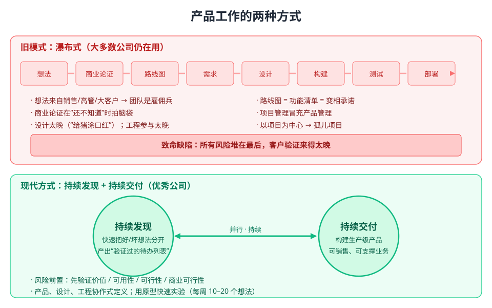
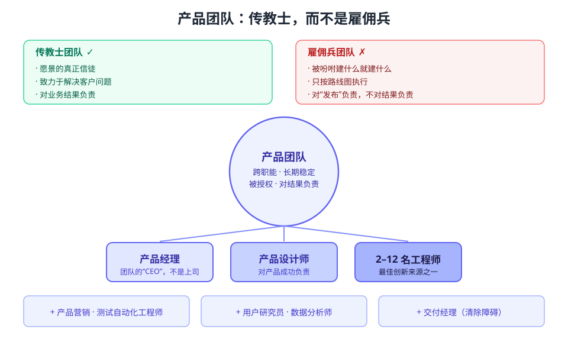
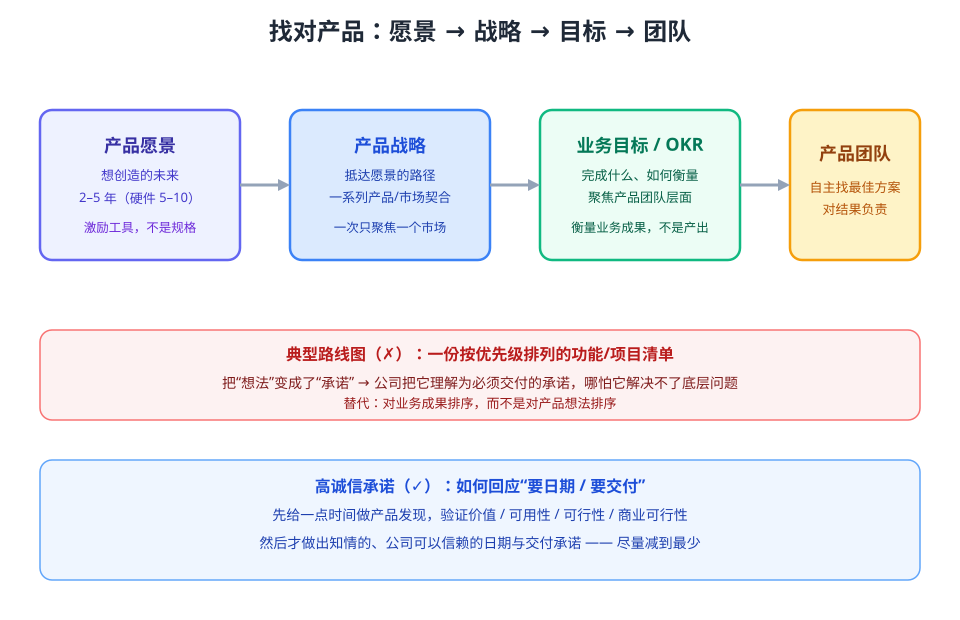
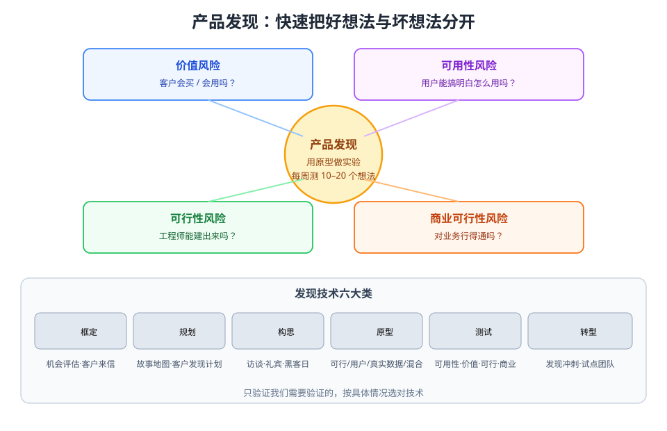
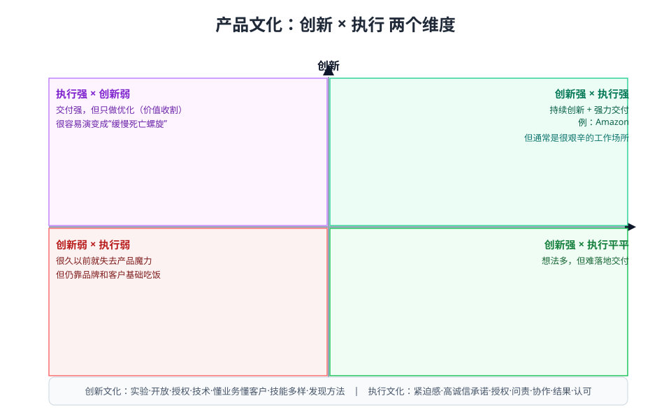

# 《INSPIRED》如何创造客户喜爱的科技产品（第二版）· 阅读笔记

> 本书即常说的「启示录」，作者 Marty Cagan（SVPG 创始人），2018 年 Wiley 出版。
> 一份**可分享**的主题式阅读笔记——把全书的核心思想融合重组，不是按章节的目录复述。

---

## 这本书讲什么

这本书谈的是「产品」这门生意——**如何组建强大的产品团队，做出客户真正喜爱、又能支撑业务的科技产品**。它专门写给技术产品经理，以及所有对「如何造出好产品」负有责任的人：创始人、CEO、产品负责人、工程师、设计师。

作者 30 多年在惠普、Netscape、eBay 做产品与领导的经验浓缩成一句话：**绝大多数产品失败，不是运气问题，而是工作方式问题。** 大多数公司至今还在用几十年前那种低效的方式发现和交付产品——这正是本书要纠正的。

全书真正的主题，作者自己说得最清楚：**没有「产品成功的配方」。** 不存在一套规定性流程或框架，造出好产品靠的是——建立正确的**产品文化**，并掌握一整套**产品发现与交付**的方法，这样你才能针对手头的问题，用对工具。

---

## 一、为什么大多数产品会失败

要理解好公司怎么做，先看清坏公司为什么失败。大多数公司走的是这条老路：

> 想法 → 商业论证 → 路线图 → 需求 → 设计 → 构建 → 测试 → 部署

看起来像敏捷，骨子里是**瀑布**。问题不在于流程本身，而在于：**所有风险都被堆到最后，客户验证来得太晚。** 等到产品上线，才发现没人要、不好用、建不起来、或对业务行不通。

这条路有一连串几乎必然的错误：

- 想法来自销售、高管、大客户——**不是最优秀产品想法的来源**；团队只是奉命执行的「雇佣兵」，没有授权。
- 在**根本还不知道**会赚多少钱、要花多少钱的时候，就被要求做商业论证、排优先级——纯属拍脑袋。
- 路线图本质是一份**按优先级排列的功能清单**，把「想法」包装成了「承诺」。
- 产品管理退化成了项目管理（收集需求、写文档给工程师用）。
- 设计介入太晚，只能「给猪涂口红」。
- **工程师参与太晚**——「如果你只用工程师来写代码，你就只发挥出了他们大约一半的价值。」而工程师往往是最佳创新的第一来源。
- 以项目为中心，导致「孤儿项目」——发布了，却没解决任何问题。

支撑这一切的是关于产品的**两条令人不安的真相**，任何团队都逃不掉：

1. **你的想法里，至少有一半行不通**（真正优秀的团队会假设至少 3/4 达不到预期）——因为价值不存在、太复杂、或建不起。
2. 即便是真有潜力的想法，通常也要**多次迭代**，才能产生足够的业务价值——这叫「变现时间」。

优秀的团队和普通团队的区别，**不在于他们不踩这些坑，而在于他们如何应对**：他们拥抱真相、快速试错，而不是否认它、埋头把路线图走完。

---

## 二、现代产品工作的三条底层原则

领先团队早已超越「精益与敏捷」的流行做法，回归它们背后的核心。贯穿全书的是这三条原则：

1. **风险要前置处理，而不是留在最后。** 在决定构建任何东西之前，先处理四类风险：
   - **价值风险**：客户会不会买、会不会用？
   - **可用性风险**：用户能不能搞明白怎么用？
   - **可行性风险**：工程师能不能用现有时间、技能、技术建出来？
   - **商业可行性风险**：方案对业务（销售、市场、财务、法务等）是否行得通？
2. **产品要协作式地定义和设计，而不是顺序式地传递。** 产品、设计、工程并肩工作、有来有往，而不是各自接棒、互相背负前任的决策。
3. **一切关乎解决问题，而不是实现功能。** 传统路线图念念不忘「产出」；强大团队盯着「业务结果」——方案必须真的解决了底层问题。

---

## 三、两个贯穿全书的核心概念：发现与交付

所有产品团队都有两项基本活动，而且通常**持续、并行**地进行：

- **持续发现**——决定该构建什么。它是产品管理、UX 设计与工程三方的紧密协作；目的就是在写一行生产代码之前，快速把好想法和坏想法分开。产出的不是功能清单，而是一份**经过验证的产品待办列表**。强团队每周能测 10–20 个想法。
- **持续交付**——把产品送到市场。必要的规模、性能、可靠性、安全、隐私、本地化都要到位，产品要能支撑一门生意、能放心销售。

**原型是发现的默认工具**：比构建产品少一个数量级的时间与精力。它不是准备上黄金时段的东西，全都关乎「快速、廉价地学习」。

由此澄清一个被严重误读的概念——**MVP**。MVP 里的 P 虽然是「产品」，但它**应该是原型，而不是产品**。为了学习而去构建一份达到产品品质的交付物，哪怕功能极少，也是巨大的浪费——这与精益背道而驰。很多团队花几个月建 MVP，而同样的认知本可以几天、甚至几小时拿到。

还有两个贯穿全书的目标与概念：

- **产品/市场契合**（马克·安德森普及）：能满足特定市场客户需求的、尽可能小的实际产品。创业公司的一切，都是在「钱花完之前」冲到这个契合。
- **产品愿景**：产品更长远的目标（通常未来 2–10 年），是产品组织兑现公司使命的方式。

---

## 四、产品团队：找对人

**一切都在于产品团队。** 一个典型的产品团队 = 1 名产品经理 + 1 名产品设计师 + 2–12 名工程师（外加可选的产品营销、测试自动化、用户研究、数据分析、交付经理）。

### 传教士，而不是雇佣兵

产品团队最重要的目标，被约翰·杜尔（John Doerr）概括得最贴切：**「我们需要的是传教士团队，而不是雇佣兵团队。」** 雇佣兵被吩咐建什么就建什么；传教士是愿景的真正信徒，致力于解决客户的问题，并对结果负责。

由此延伸出团队的一系列原则：

- 跨职能、长期稳定、对产品**全权负责**（所有功能、bug、性能、优化都属于他们）。
- 刻意扁平——团队与汇报关系无关，**产品经理不是任何人的上司**。
- 尽量**同地办公**（近到能互相看到屏幕），正式员工而非外包。
- 拥有相当程度的**自主权**：被授权用自己认为最合适的方式，去解决分配的问题。

### 产品经理：团队的「CEO」，但不是上司

产品经理是本书的主角。它**不是一份朝九晚五的工作**，要求也极高——产品经理必须是公司最顶尖的人才之一。

产品经理只有一种工作方式通向成功：**做好自己的本职工作**。不是当「待办列表管理员」（把问题层层上报 CEO），也不是搞「委员会式设计」（把利益相关者叫进会议室决出胜负）。

PM 要为团队贡献四样东西：

1. **深入了解客户**——成为公认的客户专家（问题、痛点、渴望、购买决策）。
2. **深入了解数据**——既懂定性也懂定量，对数据和分析自如（这无法外包）。
3. **深入了解你的业务**——知道各利益相关者是谁、受什么约束，并让他们相信你会交付与约束相符的方案。
4. **深入了解市场与行业**——竞争者、技术趋势、客户行为；为市场的明天而造，而不是昨天。

再加上：**聪明、有创造力、坚持不懈**，以及教不出来的、对产品与解决客户问题的**热情**。

有个容易被误解的点：**产品经理必须同时担任产品负责人（Product Owner）**。把两者拆给两个人，团队会很快丧失创新能力。另外，每个 PM 都该补两门课：**编程入门**（不是 HTML）和**商业会计/财务入门**。

### 其他关键角色

- **产品设计师**：衡量设计师的不是设计产出，而是**产品的成功**。UX 远大于 UI。设计要成为团队的一等成员、与 PM 并肩，而不是内部代理机构。
- **工程师**：PM 与工程师的关系是这份工作里最重要的。每天都要直接沟通；给工程师自由去想办法；把客户痛点坦诚分享给他们。别忘了——工程师往往是最好的创新来源。
- **产品营销经理**：把市场带到团队面前——定位、信息传达、上市计划。
- **支持性角色**：用户研究员（定性）、数据分析师（定量）、测试自动化工程师（取代手动 QA）。关键是**学习必须是共同的学习**——不能外包给别人然后看报告了事。
- **交付经理**：特殊的项目经理，专门清除障碍，把 PM 从项目管理中解放出来。

### 领导力：保持「完整的产品视角」

成长的一大挑战，是知道整个产品如何拼合在一起。三个关键角色缺一不可：

- **产品管理负责人**（产品副总裁）：团队建设、产品愿景、执行力、产品文化四项核心能力；与 CEO 互补。
- **设计负责人**：对完整用户体验负责。
- **技术负责人（CTO）**：六项职责——组织、领导力、交付、架构、发现、布道（注意 CIO ≠ CTO）。

这三人最好坐在一起。当公司大到有几十支团队时，协调、减少依赖、保持授权，就成了规模化的关键。

---

## 五、找对产品：愿景、战略与目标

有了强大的团队，下一个问题是：**团队该做什么？**

### 路线图的问题与替代

典型的产品路线图（按优先级排列的功能与项目清单）是产品组织中**大部分浪费与失败努力的根源**——它把想法清单变成了公司上下的「承诺」。而替代方案只需满足路线图原本服务的两个真实需求：先做价值最高的、以及能做日期承诺。

替代方案的核心是**为团队提供业务背景**，而不是派发功能：

- **产品愿景 + 产品战略**：组织想走向哪里，以及抵达那里的路径。
- **业务目标**：告诉团队「你要完成什么、如何衡量」，让团队自己找出最佳方案。
- **高诚信承诺**：在需要承诺日期/交付物时——先给一点时间做发现、验证价值与可行，然后才做出知情的、公司可以信赖的承诺。这类承诺被尽量减到最少。

一句话：**对业务成果排序，而不是对产品想法排序。** 关注结果，而不是产出。

### 愿景、战略与原则

- **产品愿景**（2–5 年，硬件 5–10 年）：想创造的未来，是激励工具、不是规格说明。它是优秀团队最好的招聘工具。
- **产品战略**：实现愿景的一系列产品/版本，通常围绕一系列**产品/市场契合**，**一次只聚焦一个目标市场**。市场优先级看三件事：市场规模（TAM）、市场进入渠道（GTM）、上市时间（TTM）。
- **产品原则**：你想创造的产品的本质（不是功能清单）。如 eBay 早期那条：「当买家的需求与卖家的需求冲突时，优先买家的需求。」

愿景的十条原则里，最值得记住的几条：**爱上问题，而不是爱上解决方案**；对愿景执着、对细节灵活；滑向冰球将要去的地方；以及——**最冒险的战略就是停止冒险**。

### OKR：把目标落到实处

OKR（目标与关键结果）是管理、聚焦、协同的工具。要点：**目标定性、关键结果定量**；关键结果衡量**业务成果**而非产出；数量精简（1–3 目标×1–3 个 KR）；组织年度、团队季度；每周跟踪。

最大的坑：**别让职能/个人的 OKR 稀释团队焦点**。OKR 必须聚焦在**产品团队层面**，从团队向上汇总到组织。规模化后，领导层责任更重——分配目标、协调平台团队、对账差距、管理承诺清单。

### 产品布道

「产品布道就是贩卖梦想」（盖伊·川崎）。PM 必须擅长布道，否则产品努力很可能在见到天日之前就被带偏。要点包括：用原型（而不是用户故事）让人看清森林和树木；分享痛点与愿景；慷慨分享认知与功劳；做精彩的演示（演示不是培训，是说服工具）；由衷地兴奋——**热情是会传染的**。

---

## 六、找对流程：产品发现的一整套技术

发现是本书篇幅最大、也最强调的部分——它是产品经理的首要职责，也是初创公司最重要的核心能力。发现技术大致分六类：**框定、规划、构思、原型、测试、转型**。

### 框定：先想清楚问题

绝大多数产品工作，先回答四个问题（**机会评估**）就够：

1. 这项工作要实现什么业务目标？
2. 你怎么知道自己成功了（关键结果）？
3. 这为我们的客户解决什么问题？
4. 我们聚焦哪类客户（目标市场）？

更大规模的工作，用**客户来信**——以一位满意的目标客户写给 CEO 的口吻，描述产品会如何改变他的生活（比 Amazon 的假想新闻稿更有共情）。面对全新产品/新业务，用**创业画布**——但要记住，**最大风险是「价值/方案风险」**：先为客户发现一个有吸引力的方案，而不是过早纠结商业模式细节。

### 规划：故事地图与客户发现计划

- **故事地图**（Jeff Patton）：把主要用户活动横向按时间排列、纵向细化任务，一眼看清全局、划出发布界线——最通用有用的技术之一。
- **客户发现计划**（作者最推崇）：为**单一目标市场**培养 **6 位参考客户**。参考客户 = 真实、生产环境、付费、愿意公开推荐的人。它是能给销售的最好工具，也是产品/市场契合最实用的定义。平台产品改为培养「参考应用」，消费类产品聚焦 10–50 位消费者。**在拥有那 6 位参考客户之前，别急着推向市场。**

### 构思：想法的来源

- **客户访谈**：PM 最强大最重要的技能。建立固定节奏（每周至少 2–3 小时），带 PM/设计师/工程师三人，开放式提问。四个问题：你的客户是不是你以为的那些人？他们真有你以为的问题吗？今天怎么解决？要切换过来需要什么条件？
- **礼宾测试**：替客户做他们的工作——手动、亲自，学会做他们的活，从而给出更好的方案。
- **客户「误用」的力量**：允许甚至鼓励客户用产品解决计划之外的问题（eBay 靠「Everything Else」成了最大二手车商之一）；**公共 API** 把能力开放给开发者，是最好的创新来源之一。
- **黑客日**：定向/非定向，既产生想法、又建立传教士文化。

### 原型：快速廉价的实验

- **可行性原型**：工程师写的代码，只写「刚好够化解可行性风险」的量（常 1–2 天、可丢弃）。
- **用户原型**：模拟。从低保真线框到高保真（看起来极真实）。**注意：它不适合证明价值**——人们会说喜欢，却去做别的事。
- **真实数据原型**：收集真实使用数据/证据，成本约为完整产品化的 5–10%。局限：须工程师做、不是可发布产品，**PM 不能说「够好了」**。
- **混合原型**：如**绿野仙踪**——前端高保真、幕后真人手动执行，不可扩展但极快学习（例：自动化聊天机器人先由真人代答）。

原型的首要目的：**以比构建产品少一个数量级的成本学到东西**。造原型这个行为本身，就常会暴露问题。

### 测试：验证价值、可用性、可行性与商业可行

- **可用性测试**：构建前用原型测。要点——让用户保持「使用模式」而非「批评模式」；**多观察他们做了什么，少听他们说了什么**；学会沉默；像鹦鹉一样复述对方的话；修复「心智模型」的错位。
- **价值测试**：价值不在，可用性/可靠性再好也没用。定性地防「对方只是客气」——用**金钱**（问愿不愿买/签购买意向）、**声誉**（推荐打分/分享/留邮箱）、**时间**（愿不愿花时间）、**账户权限**（愿不愿当场转换）来证明价值。**PM 必须亲自参加每一次定性价值测试，不能外包。**
- **需求测试**：假门需求测试、落地页需求测试——快速收集需求证据 + 一份愿交谈的用户名单。对企业公司同样适用——**「如果你停止创新，你就会死去」**，但要负责任地做（保护营收品牌、保护员工客户；用 A/B、仅限邀请、温和部署）。
- **定量价值测试**：A/B 测试（发现型 A/B 常给当前产品 99%、真实数据原型 ≤1%）、仅限邀请测试、客户发现计划。数据五用途：理解行为、衡量进展、证明想法、为决策提供信息、激发产品工作。记住——**数据能照亮「发生了什么」，却解释不了「为什么」**，需要定性补足。**别盲目飞行**：给产品埋点。
- **可行性测试**：工程师回答「做这个的最好方式是什么、需要多久」，而不是「你能不能做」；给他们时间去调查。
- **商业可行性测试**：方案还须对业务有效（这才是「产品的 CEO」的真正含义）——逐领域测：营销、销售、客户成功、财务、法务、业务拓展、安全、CEO/COO/GM。
- ⚠️ 分清**用户测试 / 产品演示 / 走查**三种展示原型的方式，用途完全不同，别用错。

### 转型：让组织真的改变

改变组织很难，因为是文化改变。可用的技术：

- **发现冲刺**：一周时间盒的密集发现，解决重大问题或风险（可参考 GV 的《Sprint》）；也介绍**发现教练**——区别于只懂交付的敏捷教练。
- **试点团队**：让改变先在 1–2 个季度的小团队落地，用业务成果衡量，再推广——别一口气铺开让落后者抵制。
- **让组织告别路线图**：未来 6–12 个月继续用现有路线图，但每次讨论都强调「功能背后的业务成果」，逐步把组织焦点从「日期上的功能」转向「业务成果」。
- **管理利益相关者**：利益相关者 = 有否决权、能阻止上线的人。PM 要理解并带入他们的约束，并让他们相信你同样会解决他们的关切。成功策略：一对一交流、发现阶段就预审、**用证据把「意见之争」变成「数据之争」**、用高保真原型而非 PPT 求签字、别搞集体评审（那是委员会式设计）。
- 警惕**「从好到坏的退化」**：规模化时误引入「大而不强」公司的人，会把坏做法带进来——靠强产品文化和入职时挑明来防范。

---

## 七、找对文化：好团队与产品文化

说了那么多方法，这本书归根结底讲的是**文化**。它从两个维度看：能否**持续创新**（发现），以及能否**强力执行**（交付）。

### 好团队与坏团队

好团队有令人信服的产品愿景并以传教士般的热情追求它；坏团队是雇佣兵。两者几乎在每个环节都不同——好的从愿景、客户挣扎、数据、新技术中获取灵感；坏的从销售和客户那里收集需求。好的让产品/设计/工程并肩、每周接触客户、快速迭代、痴迷参考客户、为业务成果庆祝；坏的排路线图、只赶日期、痴迷竞争对手、为「终于发布」庆祝。**如果你发现好几条都刺中自己，就该为团队提高标准了。**

### 创新力流失的十大原因

规模化过程中，组织不可避免地失去以下一项或多项：

1. 缺以客户为中心的文化
2. 缺令人信服的产品愿景
3. 缺聚焦的产品战略
4. 缺强大的产品经理
5. 缺稳定的产品团队
6. 工程师不参与发现
7. 缺公司的勇气（**最冒险的战略就是停止冒险**）
8. 缺被充分授权的产品团队
9. 缺产品思维（IT 思维 vs 产品思维）
10. 缺用于创新的时间（被「维持运转」类工作耗尽）

本质是：**持续创新的文化**，而非流程。

### 速度流失的十大原因

技术债；缺强大 PM；缺交付管理；发布周期过于稀疏（至少每两周一次，优秀团队每天多次）；缺愿景与战略；缺同地办公的稳定团队；工程师参与发现太晚；没发挥设计作用；不断变化的优先级；追求共识的文化。

### 建立强大的产品文化

- **创新文化**：实验、开放、授权、技术、懂业务懂客户、技能多样性、发现方法。
- **执行文化**：紧迫感、高诚信承诺、授权、问责、协作、结果、认可。

极少数公司（如 Amazon）在创新和执行两方面都强——但通常都是相当艰辛的工作场所。按这两个维度评估自己，想清楚团队该处于什么位置。

---

## 金句速览

**关于产品的本质**

- 「一流公司生产产品的方式，与大多数公司之间存在着天壤之别。」
- 「无论你有多聪明，都根本逃不开这两条令人不安的真相。真正的差别在于你如何应对它们。」
- 「客户不知道什么是可能的；我们中没有人知道自己真正想要什么，直到我们真的看到它。」
- 「最重要的事情是知道你不能知道什么。」（马克·安德森）
- 「如果你停止创新，你就会死去。」
- 「最冒险的战略就是停止冒险。」
- 「最优秀的团队会假设至少四分之三的想法达不到他们的期望。」
- 「成功的产品不仅被客户喜爱，而且对你的业务切实有效。」

**关于团队与角色**

- 「我们需要的是传教士团队，而不是雇佣兵团队。」（约翰·杜尔）
- 「当一款产品成功时，那是因为团队中的每个人都做了他们该做的事。但当一款产品失败时，那就是产品经理的责任。」
- 「如果你只用工程师来写代码，那你就只发挥出了他们大约一半的价值。」
- 「衡量产品设计师的不是他们设计工作的产出，而是产品的成功。」
- 「一旦出现问题，半夜被叫起来处理的就是他们。」（把自由还给工程师）
- 「无论你的头衔或级别是什么，只要你渴望伟大，就别害怕去领导。」

**关于方法与心态**

- 「爱上问题，而不是爱上解决方案。」
- 「对愿景要执着，对细节要灵活。」（贝佐斯）
- 「客户永远是美好而奇妙地不满足的……你取悦客户的渴望，会驱使你为他们去发明。」（贝佐斯）
- 「数据能照亮正在发生什么，却无法解释为什么。」——需要定性技术解释定量结果
- 「数据往往让我们措手不及——正是这些意外带来了真正的进展。」
- 「客户很少会因为我们的竞争者而离开我们。他们离开，是因为我们不再照顾他们了。」
- 「速度来自正确的方法，而不是强制加班。」
- 「计划好扔掉一个；反正你无论如何都会扔掉。」（弗雷德·布鲁克斯）

---

*本笔记基于本项目 `books/inspired/inspired-zh.epub`（中文第二版）整理，术语与人名沿用该译本译法。*
