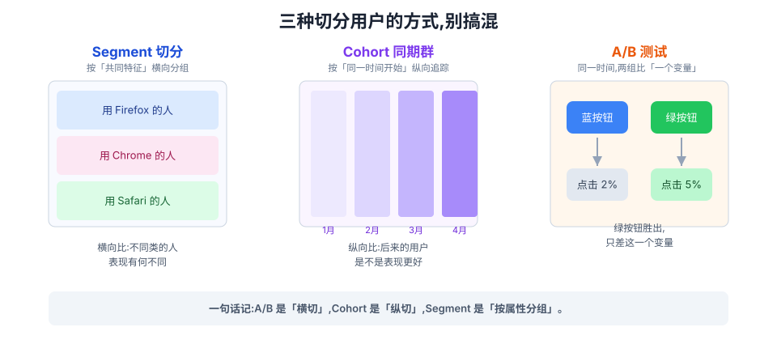
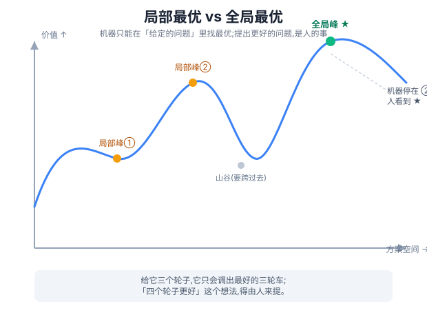
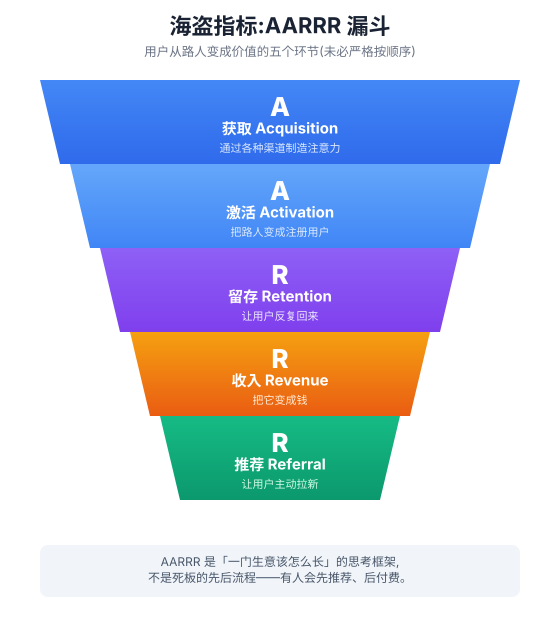
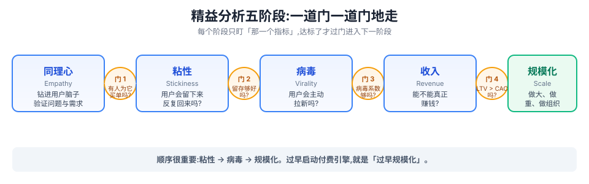

# 《Lean Analytics》读书笔记

> 书名:Lean Analytics — Use Data to Build a Better Startup Faster
> 作者:Alistair Croll & Benjamin Yoskovitz(O'Reilly, 2013)

## 关于这份笔记

《Lean Analytics》是一本讲「如何用数据驱动创业决策」的书。全书共三十多章,前半是方法论(什么是好指标、有哪些分析框架、怎么聚焦),中间按六个商业模式逐一展开,后半是创业各阶段的指标重点与基准值,最后延伸到企业内部创业。

这份笔记**只覆盖其中 11 章**——我挑选的标准是:最能构成一条完整的认知主线,并且对「一个产品该在什么阶段看什么数据」有直接指导意义的章节。被略过的章节(如双边市场、SaaS、免费 App、媒体、UGC 等具体商业模式的专章)不影响理解主线,需要时可按相同思路自行回查原书。

选入的主题及顺序:

| 主题 | 原书对应章节 | 为何选它 |
|---|---|---|
| 怎么记分 | How to Keep Score | 什么是好指标——全书的地基 |
| 数据驱动 vs 数据参考 | Data-Driven vs Data-Informed | 数据是辅助判断,不是替代判断 |
| 分析框架 | Analytics Frameworks | 建立「怎么看待数据」的整体地图 |
| 唯一重要指标的纪律 | The Discipline of OMTM | 怎么从几十个指标里聚焦一个 |
| 电商 | E-commerce | 一个具体商业模式的完整案例 |
| 你处于哪个阶段 | What Stage Are You At? | 为什么不同阶段指标重点不同 |
| 第二阶段:粘性 | Stage Two: Stickiness | 留存与持续价值的验证 |
| 第四阶段:收入 | Stage Four: Revenue | 收入类指标怎么理解 |
| 模型 × 阶段决定指标 | Model + Stage Drives the Metric | 把「模式 × 阶段 × 指标」串起来 |
| 我够好了吗 | Am I Good Enough? | 指标好坏怎么看、基准值是什么 |
| 电商的基准线 | E-commerce: Lines in the Sand | 电商指标的行业基准 |
| 没有基准线怎么办 | When You Don't Have a Baseline | 没有基准线时怎么判断 |

> 约定:下文出现的英文术语(OMTM、CAC、CLV、Cohort 等)首次出现时给中文注释,后文沿用,因为它们在行业里比直译更通用。
>
> 关于配图:文中几处关键概念配有 SVG 示意图(`assets/` 目录下 4 张)。在支持 SVG 的 Markdown 阅读器里会直接显示;若你的阅读器不渲染 SVG,可改用浏览器打开对应的 `.svg` 文件,或参考旁边的文字说明——图只是辅助,不依赖图也完全能读懂正文。

---

## 全书一句话

**搞清楚「你是什么类型的生意」+「你现在处于哪个阶段」,你就知道你此刻该盯的那一个最重要指标(One Metric That Matters,即 OMTM)是什么。** 反复用数据去验证假设、快速迭代,在钱烧光之前找到对的「产品 × 市场」,把楼盖在真实需求、清晰方案、满意客户之上。

整本书其实就围绕这一句话展开,下面每章都是在给这句话做注脚。

---

## 怎么记分(How to Keep Score)

### 什么才算「好指标」

一个指标好不好的唯一试金石,是**它能否驱动你想要的变化**。具体有四个标准:

1. **可比较(comparative)** ——「比上周转化率提高了」比一句干巴巴的「转化率 2%」更有用,因为前者告诉你方向。
2. **可理解(understandable)** ——如果团队记不住、没法围绕它讨论,这个数字就很难变成组织层面真正的改变。
3. **是比例或速率(ratio/rate),而非绝对值** ——会计师看健康度靠的是各种比率,原因有三:
   - 比例**更好行动**:开车时「里程」只是信息,「速度(里程÷时间)」才是你能据此决策的东西;
   - 比例**天然可比较**:当下速度 ÷ 平均速度,一眼看出你在加速还是减速;
   - 比例**能调和天生对立的力量**:比如「路程 ÷ 罚单数」——开得快跑得远,但也更容易吃罚单,这个比值能帮你判断该不该超速。
4. **能改变你的行为** —— 这是**最重要**的一条。看到这个数之后,你会**做出不一样的决策**吗?答不上来,就说明它对你没价值。

> 一个反例:卖车的销售反复叮嘱你「回访问卷一定要打 5 分」,却不肯多花点心思在「提供好体验」上——而评分本该衡量的是体验。指标一旦和它要推动的行为脱节,就会变成自我欺骗。

### 五组必须分清的指标概念

| 对比 | 含义 |
|---|---|
| **定性 vs 定量** | 定性回答「为什么」(访谈、观察),主观但揭示动机;定量回答「什么、多少」(数字),精确但缺洞察。**创业早期更需要定性**——你没法靠数字问出用户到底有什么痛点。 |
| **虚荣 vs 可行动** | 虚荣指标让你感觉良好,但不改变行为(如「累计注册数」);可行动指标帮你选一条路(如「活跃用户占比」)。**看到任何指标先问一句:我会据此做什么不同的?** |
| **探索 vs 汇报** | 汇报性指标是日常经营追踪(已知的未知);探索性指标是去挖尚未发现的洞察(未知的未知)。**「未知的未知」才是创业公司真正的金矿。** |
| **领先 vs 滞后** | 领先指标预测未来(销售漏斗里的线索数),你还有时间行动;滞后指标解释过去(流失率)。**早期只能先测滞后指标,攒够数据做同期群分析后才能做领先指标。** |
| **相关 vs 因果** | 相关能用来**预测**,因果才能用来**改变**。相关是好事,因果更好;拿不到因果时退而求相关,但要始终朝因果努力。 |

> 经典警示:冬天用冬胎和事故率下降「相关」,但不代表夏天也该逼人用冬胎(软胎在热路面刹不住,反而出事)。看到相关性就下结论,会做出糟糕决策。

### 八个经典虚荣指标(能躲就躲)

1. **点击数(hits)** ——一个页面几十个元素,这个数会虚高,该数人而不是数点击;
2. **页面浏览量** ——除非你的商业模式直接靠 PV(如展示广告);
3. **访问数(visits)** ——分不清是 1 人来 100 次,还是 100 人来 1 次;
4. **独立访客(unique visitors)** ——只说明多少人瞄了一眼首页,不说明他们做了什么;
5. **粉丝/好友/点赞数** ——除非你能叫他们为你做事,否则只是人气竞赛;
6. **停留时长 / 浏览页数** ——用户在你的投诉页停留很久,反而是坏事;
7. **收集到的邮箱数** ——得看有多少人真的打开、并照你说的去做;
8. **下载数** ——要看后续的激活、注册等真正产生价值的动作。

### Segment / Cohort / A/B / Multivariate

这是全书后半反复用到的四个分析工具,值得先分清:

- **Segment(切分)**:按某个共同特征把人分组(用 Firefox 的人、头等舱乘客),然后**横向**比较不同组之间的差异。发现「澳大利亚来的用户参与度特别高」,就去探为什么。
- **Cohort(同期群)**:按「同一时间开始使用」分组,然后**纵向**追踪这一组的整个生命周期。它回答的核心问题是:「和早期用户比,后来的用户表现是不是更好?」
  - 举个书里的例子:连续 5 个月,每客户平均收入几乎不变($5→$4.5→$4.33→$4.25→$4.5),看起来停滞不前。但按 cohort 拆开看,1 月来的客户首月花 $5,5 月来的客户首月花 $9——**业务其实在飞速增长,只是被早期的低数字稀释了**。cohort 分析还顺手暴露了另一个关键信息:收入在首月之后下滑得有多快。
- **A/B Test**:同一时间,给两组人不同的体验,只比一个变量(比如按钮文案)。书里案例:众筹售票网站 Picatic 把按钮从「Get started free」改成「Try it out free」,点击率 10 天暴涨 376%。
- **Multivariate(多变量分析)**:当流量不够一个一个测时,一次测多个变量,再用统计方法找出哪个因素与指标改善强相关。

> 一句话区分:A/B 是「横切」,Cohort 是「纵切」,Segment 是「按属性分组」。测试是精益分析的核心动作。



---

## 数据驱动 vs 数据参考(Data-Driven vs Data-Informed)

**核心命题:数据不该取代判断,而该辅助判断。** 要做一个「data-informed(数据作为参考)」的人,而不是「data-driven(被数据牵着鼻子走)」的奴隶。

- 批评 Lean Startup「太数据驱动」的人,大多只是懒,想找借口不做苦活;但他们有时说得对——**只顾优化局部、不看全局,是致命的**。
- 案例:Orbitz 靠数据发现「Mac 用户更愿意订更贵的酒店」,这确实是个增收机会;但同一个算法若不加约束地乱优化,就会引发 PR 灾难(后来 Orbitz 确实因为给 Mac 用户推更贵的房被骂)。
- 案例:Omniture 的优化软件放着不管,很快就会学到一个"最优解"——穿得少的女性的图片点击率最高。但那是拿品牌的长期受损换短期点击。所以他们的做法是:**机器做验证,人来提供灵感**。
- **局部最优 vs 全局颠覆**:数学只能在你给定的那个"问题空间"里找最优。给它三个轮子,它只能优化出最好的三轮车,却说不出「四个轮子更好」。**人负责提出新假设(四个轮子),机器负责在旧假设里做优化(三轮车调到最好)。**
- 一句话总结:定量数据**擅长验证假设,极不擅长产生新假设**——产生新假设需要人的内省和直觉。



### 像数据科学家一样思考:10 个常见坑(来自 LinkedIn 的 Monica Rogati)

1. **假设数据是干净的** ——清洗数据常常是最大工作量,而清洗本身就会暴露问题;
2. **不归一化** ——数「飞到某城办婚礼的人」却不除以「到该城的总旅客数」,你得到的只是「热门机场排行榜」而非「婚礼热门城市」;
3. **排除异常值** ——那 21 个一天用你产品 1000 次的人,不是铁粉就是爬虫,直接无视是错的;
4. **纳入异常值** ——但做通用模型(如推荐系统)时又要排除他们,否则推荐页里全是死忠粉爱的那几样;
5. **无视季节性** ——「实习生」是年度增长最快的工作?醒醒,现在是六月;
6. **报增长时不看基数** ——刚起步时,多一个注册就等于用户数翻倍,这个「100% 增长」没意义;
7. **数据呕吐** —— dashboard 堆满数字,却不知道该看哪个;
8. **狼来了指标** ——告警阈值太敏感,天天响,最后没人当回事;
9. **「此处未采集」综合征** ——不把自己的数据和外部的数据 mashup,会错过很多洞察;
10. **盯着噪声** ——人类天生会从随机波动里「看出」不存在的模式。

### Lean Startup 与大愿景

- 很多人拿 Lean Startup 当「不开愿景就开公司」的借口。但**大愿景很重要**:没有愿景,你很容易被客户、投资人、对手、媒体的意见牵着走。
- 二者的关系其实是:**把 Lean Startup 当成「通向并实现愿景的过程」**,它帮你一次次校准方向,而不是取消方向。
- 一句金句:**「你此刻不是在建产品,而是在建一个『弄清到底该建什么产品』的工具。」**
- **Be Lean, don't be small.**(要精益,不要小家子气)想当省内第一,为什么不想想世界第一?盟军也得先选滩头登陆(诺曼底),但那不等于没有大愿景,只是找了个好起点。

---

## 分析框架(Analytics Frameworks)

这一章给了一张「一个产品该怎么看数据」的地图。作者先评述了几套现成框架,最后收敛到自己的「精益分析五阶段」。

### 1. Dave McClure 的海盗指标(AARRR)

用五个字母概括用户从路人变成价值的全过程:

| 字母 | 环节 | 作用 | 相关指标 |
|---|---|---|---|
| **A**cquisition | 获取 | 通过渠道制造注意力 | 流量、提及、CPC、搜索结果、获客成本、打开率 |
| **A**ctivation | 激活 | 把路过访客变成注册用户 | 注册、完成 onboarding、至少用过一次、订阅 |
| **R**etention | 留存 | 让用户反复回来 | 参与度、距上次访问时长、日/月活、流失 |
| **R**evenue | 收入 | 商业结果(模式不同而不同) | CLV、转化率、购物车大小、点击收入 |
| **R**eferral | 推荐 | 病毒/口碑邀请 | 邀请数、病毒系数、病毒周期 |

> 五个环节不必严格按顺序(有人先推荐后花钱),它是「一门生意该怎么长」的思考框架,而非流程。



### 2. Eric Ries 的三个增长引擎

| 引擎 | 焦点 | 关键指标 |
|---|---|---|
| **粘性引擎 Sticky** | 让用户回来、持续用 | 留存率、流失率、使用频率、距上次访问时长 |
| **病毒引擎 Viral** | 传播、滚雪球 | 病毒系数(每用户带来几个新用户)、病毒周期 |
| **付费引擎 Paid** | 赚钱再投入获客 | CLV、CAC、客户回本时间 |

> 三个引擎最终都要用,但**一次只聚焦一个**。付费引擎在粘性和病毒没跑通之前就急着开,这正是「过早规模化」的典型。

### 3. Ash Maurya 的 Lean Canvas

传统商业计划是「写完就扔进抽屉的宏大假话」;Lean Canvas 是**一份持续迭代的活文件**。每个格子当「通过/不通过」来对待:实验失败就继续实验,别急着推进到下一格。每个格子都有对应的可跟踪指标(问题→有多少人有这个需求;方案→试用 MVP 的人数、流失、最常用/最被弃用的功能;收入→CLV、ARPU、转化率……)。

### 4. Sean Ellis 的创业增长金字塔

核心观点:**先确认产品/市场契合(Product/Market Fit, PMF),再谈规模化增长。** 怎么判断到没到 PMF?Sean 的招牌问题是:

> **「如果这个产品/服务明天没法再用了,你会有多失望?」**

如果 **40% 以上**的用户回答「非常失望」,说明你找到了 PMF,可以开始扩张了。

### 5. 长漏斗(The Long Funnel)

早年电商漏斗很简单:首页 → 商品 → 付款 → 确认。现在漏斗远远伸出了网站大门:社交网络、分享平台、联盟、比价网站,线上线下一起来影响同一次购买,用户也可能试探性访问好几次才成交。做法是在最初信号处埋好追踪,一路跟着用户走到成交。作者自己发书时就用这个方法,发现「A 作者的粉丝比 B 作者的粉丝更愿意填调查问卷」——这种洞察能帮你在下次推广时选对合作方。

### 6. 作者自己的:精益分析五阶段 + 门(Gates)

**同理心(Empathy)→ 粘性(Stickiness)→ 病毒(Virality)→ 收入(Revenue)→ 规模化(Scale)**,每两阶段之间有一道「门」,用某个指标是否达标来判断能不能过门。整本书后半就按这五阶段组织。先别被这么多框架压垮——下一章的 OMTM 就是用来帮你聚焦的。

---

## 唯一重要指标的纪律(One Metric That Matters)

**核心:创业成功的秘密就是「聚焦」。** 创始人像喜鹊,总想去追最新最闪的东西,把「转型(pivot)」用成了「慢性多动症」的借口。

- 聚焦 ≠ 短视。不是说一辈子只盯一个数,而是说:**任何一个时刻,只有一个数是你该凌驾于一切之上的**——这就是 OMTM(One Metric That Matters)。
- OMTM **随阶段而变**:还在验证问题时,盯 CLV(客户终身价值)没意义;接近 PMF 时,它可能就变成那个最重要的数。
- 操作原则:**什么都采集,但只聚焦重要的。** 今天的工具(Geckoboard、Mixpanel、Kissmetrics…)让「采集一切」变得很容易,别让「能采很多」反过来分散你的注意力。

### 案例:Moz 少盯指标、反而更聚焦

Moz(原 SEOmoz,一家 SaaS 公司)全公司高度透明,每周每个团队都汇报 KPI。但它凌驾于一切之上的、唯一那一个指标是 **Net Adds(净新增)**:

> **Net Adds = 新增付费订阅(试用转化 + 直接付费) − 取消数**

这一个数,既能帮你快速发现「高取消日」去排查,又能反映试用转化率的走势。耐人寻味的是,投资人 Brad Feld 反而建议 Moz **少盯几个 KPI**:「你作为一家公司,没法同时影响几十个 KPI。」数据太多反而是反效果,还会浪费大量时间去汇报那些不导向行动的数字。**砍到只剩几个核心 KPI,焦点才真正清晰。**

---

## 电商(E-commerce)

用一个具体商业模式,演示前面那套「想清楚你是谁」的方法。

### 先搞清楚:你是哪种电商(决定一切战略)

用**年复购率**(去年买过的人今年还会买的比例)判断自己处于哪种模式:

| 模式 | 年复购率 | 90 天复购率 | 正确策略 | 例子 |
|---|---|---|---|---|
| **获取型** Acquisition | <40% | 1–15% | 拼命拉新;忠诚计划是坏投资 | 潜水/攀岩装备 |
| **混合型** Hybrid | 40–60% | 15–30% | 拉新 + 提频,老客平均一年买 2–2.5 次 | Zappos |
| **忠诚型** Loyalty | ≥60% | >30% | 深耕忠诚客户、提高复购频次 | Amazon |

> Kevin Hillstrom 的提醒:模式本身无所谓好坏,**但经营者必须清楚自己在哪种模式**。太多人在获取型业务里硬要「提升忠诚度」——普通人一年就买两条牛仔裤,你没法逼他多买。而且年复购率**很难被搬动超过 10%**(30% 的最多晃到 27–33%)。**别试图把你的客户变成他们本来不是的样子。**

### 最该盯的几个电商指标

- **转化率**:早期它甚至比总收入更重要——因为它证明「真的有人会买」,还顺带给你买家的邮箱和行为数据。
- **年购买次数**:转化率高不代表一切;卖棺材的一辈子一单,卖菜的顾客一周好几单,两者的健康标准完全不同。
- **购物车大小(客单)**:转化率方程的另一半。**成功的电商关键是做大客单**——把获客成本(CAC)当成固定成本,订单越大,毛利越大。
- **放弃率**:转化率的反面,要**按漏斗的每一步拆开**看卡在哪儿(有时只是某个表单字段把买家劝退了)。
- **获客成本(CAC)**:赚的钱要大于「找买家 + 送货」的总成本。顺带一提,Google 免费提供分析工具,本质上就是希望你更容易买它的广告、并测量效果。
- **每客户收入 / CLV**:所有电商都该看,它等于 **转化率 × 复购次数 × 客单**三者的乘积,是衡量电商健康度的一个综合指标。
- **关键词 / 站内搜索**:搜索越来越是「找到商品」的默认方式;站内搜索大约占导航的 5–15%,有人搜了却找不到(或搜完就按返回)是个危险信号。
- **推荐接受率**:推荐引擎只问一个问题——它帮我**多赚了多少**。
- **邮件点击率**:Fred Wilson 把邮件称作「秘密武器」;但每封邮件都要闯好几道关才能让人行动,发不好时取消订阅的损失可能超过收益。
- **线下环节**:送货时效、库存(缺货商品要藏起来或往后排;库存结构与销量结构要配平)这些物理世界的事,直接影响复购。

### 案例:WineExpress 每访客收入 +41%

它在「Wine of the Day」页面做 A/B 测试,胜出版本让**每访客收入**提升了 41%——虽然转化率也涨了,但真正的关键在于**客单大幅提高**。教训很明确:

> **页面优化别只盯着转化率。你要优化的是每访客收入(RPV)或客户终身价值(CLV),那才是真正驱动商业模式的数。**(很多电商过度盯着「转化率」这一个数,反而忽略了客单。)

---

## 你现在处于哪个阶段(What Stage Are You At?)

- **不能什么都一起测,得按正确顺序测你的假设——所以首先得搞清楚自己在哪个阶段。**
- **商业模式 > 商业计划**:商业计划是写给银行的,商业模式是写给创始人自己的。而创始人最容易犯的错,恰恰是**在判断「自己处于哪个阶段」时自我欺骗**——总觉得自己比实际走得更远。
- 五个阶段(与「分析框架」一章呼应):同理心 → 粘性 → 病毒 → 收入 → 规模化。**除非有充分理由,否则就按这个顺序来。**



书里用「开餐厅」和「卖企业软件」两个例子,展示了这五阶段如何落地:

- **餐厅**:先调研周边食客口味 → 试菜单、反复微调直到满座回头 → 上忠诚计划、上 Yelp → 抠毛利、减少白送 → 投入营销、开第二家或加盟。
- **企业软件**:从行业经验里找到一个未被满足的需求 → 签几份「更像咨询合同」的早期订单来打磨产品 → 拿好评做口碑、上直销 → 扩 pipeline、自动化、降成本 → 签大经销商、全球铺开。

> 最后的提醒:**过早聚焦/优化那些「其实不重要」的东西,是杀死创业公司的稳办法。**

---

## 第二阶段:粘性(Stickiness)

当产品进入「有用户进来了」的阶段,核心问题只剩一个:**它粘不粘——用户来了之后会不会留下、会不会反复回来。**

- **关键词:留存(retention)+ 参与度(engagement)。** 具体看:日活/周活/月活(DAU/WAU/MAU)、一个用户多久之后变不活跃、发封邮件能不能把沉默用户唤醒、活跃用户到底在用什么功能、又在无视什么功能。**一定要按 cohort 切**(2 月注册的用户,是不是比 1 月注册的待得更久)。
- **别在这个阶段期待快速增长**:你此刻不是比「扔得快」,而是测「粘得住」。**今天留不住 100 个用户,以后更不可能留住 100 万个。**
- 进入下一阶段前,必须先回答两个问题:①用户是否按你预期的方式在使用?(如果不是,也许该换场景或换市场,PayPal、Autodesk 都是这么转型的)②用户有没有得到足够价值?(光「喜欢」不够,如果不付费、不点广告、不拉朋友,你就没有生意。)
- **迭代是进化,pivot(转型)是革命**;别因为迭代枯燥就反复 pivot。一个新功能如果没有明显拉升你的 OMTM,就砍掉。
- 案例 qidiq:砍掉注册这道摩擦,答题率从 10–25% 飙到 70–90%,还因此果断放弃了那个「更炫」的移动 App。
- **过早病毒化是个坑**:用户多 ≠ traction(真正的增长拉力),除非这些用户真的在参与、在留存。书里一句狠话:**「你永远不会有第二次『第一次注册』的机会。」**
- **动手建任何一个功能前,先问自己 7 个问题**:①为什么它会更好(要能写出假设:「功能 X 会把留存提高 Y%」)?②它的效果能量化吗?③要花多久?④会让产品变复杂吗(方案里「而且」越多越危险,一个需求做到极致好,胜过五个需求各满足一点)?⑤风险有多大?⑥有多创新(把按钮从红改蓝救不了生意,还容易被抄)?⑦用户说他们想要什么(记住,行动胜于言语)?
- 案例 Rally:一家成熟的软件公司,把每个功能都做成「可开关 + 可测量」,再把愿景层层拆到功能级,靠实验而不是拍脑袋做产品决策。
- **用户的反馈也会说谎**:理财 App Mint 收到一星差评「警告!这产品会收集你的银行信息!」——可这正是它的功能。差评背后真正的信息是:你的产品描述和市场沟通没讲清楚。Laura Klein 给的处理建议:①提前规划好要测什么;②别逮谁都聊,按用户画像分组;③边收集边复盘,别攒到最后。
- **MVV(最小可行愿景)**:光有 MVP 不够,还得有一个大到能打动投资人、且讲得清「怎么从现在走到未来」的愿景。
- **Problem-Solution Canvas(问题-方案画布)**:每周锁定当前最重要的 Top 3 问题 + 假设的解决方案 + 度量标准 + 一条「目标线」。案例 VNN 用它把整个董事会拉到了同一页面上。

---

## 第四阶段:收入(Revenue)

当产品能留存、能传播,就该回答那个更商业的问题了:**这门生意到底能不能赚钱。** 注意,这一阶段的重心从「证明产品对」转向「证明这是门可持续的生意」,**指标也从使用模式转向了商业比率**。

- **别只看原始收入总额**(它可能在一路「向右上」增长,却在恶化),要看**每客户收入**这个比例——它才能告诉你真实健康度。
- 案例「便士机器」:一个虚构的完美融资路演,演示了「像投资人一样思考」——赚钱逻辑要一眼能懂、关键问题(能做多大/毛利多少/壁垒在哪)要有答案、让听众参与进来、这个阶段不需要技术细节、也不要自己先报估值。**你的路演一旦偏离了这种「简单」,就是该回去重新收敛的信号。**
- **魔法数字(Magic Number)** = (本季经常性收入 − 上季经常性收入) ÷ 上季销售营销费用。结果 <0.75 说明商业模式有缺陷;>1 说明你正在用利润为自己的增长供血。
- 「more」的选择:营销说白了是「更多东西卖给更多人、卖更多钱、更频繁、更高效」。收入阶段要搞清楚你自己的生意该抓哪个 more——这取决于你是靠单笔物理成本、病毒系数、回头客、一次性大额交易,还是订阅制。
- **LTV > CAC**(客户终身价值 > 获客成本)。经验法则是 **CAC < CLV 的 1/3**。为什么不是「刚好打平」?因为 CLV 你算不准、CAC 你也算不准,中间还有个「你先垫钱、客户后付费」的时间差——**现金流管理不善是创业公司的头号杀手**。
- 案例 Parse.ly:指标再好、增长再快,**只要没测过「能不能变现」,就等于没验证过最危险的那一环**。它最终放弃了看起来一切都很健康的消费级产品,转型为企业服务。
- **Market/Product Fit(颠倒过来的 PMF)**:生意不顺时,别急着加功能——也许产品没问题,**是目标市场错了**,换个市场比重新造产品更省力。方法是:复盘旧假设 → 用淘汰法缩小范围 → 深入访谈每个候选市场(每个聊 10–15 人)→ 找相似性、往细分领域走 → 就卖你现有的产品(它本身就是个 MVP,微调即可)。
- 打平(breakeven)的几条线:可变成本打平 / 客户回本时间 / EBITDA / 冬眠线(俗称「拉面盈利」,缩到最小也能活下去)。

---

## 模型 × 阶段,决定该盯的指标

**这是全书的方法论收口。** 核心理念一句话:

> 知道「你是什么类型的生意」+「你处于哪个阶段」,你就知道此刻该盯、该优化的那一个指标是什么。反复执行这个过程,就能躲开早期深坑、避免过早增长。

前面几章已经零散地讲了「阶段」和各阶段的指标,这一章用一张大表把它们和「商业模式」钉在一起。原书的这张对照表是全书最核心的一张:**六种商业模式 × 五个阶段 = 每个格子里的关键指标。** 我把它的主干提炼如下:

| 阶段 | 电商 | 双边市场 | SaaS / 免费 App | 媒体 / UGC |
|---|---|---|---|---|
| **同理心** | 客户怎么意识到需求、痛点、画像 | 买卖双方今天怎么交易、卡在哪 | 有没有「现在就很痛」的需求、采购流程 | 能否围绕主题攒注意力、社区在哪聚 |
| **粘性** | 转化、客单、获客成本、90 天回头率 | 上架速度、搜索、价格弹性、欺诈率 | 参与、流失、漏斗、功能利用率 | 流量/回访/按主题切分、创作、参与漏斗 |
| **病毒** | 获客成本、分享量、再激活 | 卖家获取、账号创建、分享 | 内在病毒性、CAC | 内容、SEM/SEO、邀请、站内外分享 |
| **收入** | 客单价、每客户收入、CAC/LTV | 交易、佣金、增值服务 | 向上销售、CAC、LTV | 成本/互动、联盟、点击率、曝光 |
| **规模化** | 联盟/渠道/白标/退货/渠道冲突 | 垂直扩展、捆绑第三方 | API 流量、魔法数字、生态、合规 | 分发/授权/合作、数据/广告/API |

> 怎么用这张表:先认自己的模式(是哪一列),再认自己的阶段(是哪一行),行列交叉就是你现在该盯的数;盯它爬过当前的「门」,再进入下一格。它也自然引出了下一个问题——「这些指标,多少才算正常?」

---

## 我够好了吗(Am I Good Enough?)

**回答全书被问到最多的问题:「什么才叫正常?我该继续死磕这个指标,还是该换一个?」**

- 为什么执着于定义「正常」?两个理由:①你得知道自己**在不在球场上**(离大家差多远);②你得知道自己**在打什么球**(同一个指标的标准会随商业模式从新奇走向主流而漂移)。
- 案例 WP Engine:托管服务每月 2% 的取消率一度让创始人很慌,一查才发现 **2% 已经是托管行业流失率的下限(最好的情况)**。知道这一点,才能把资源花到别处,而不是硬推一个根本推不动的指标。
- **「平均水平」远不够好**:数据里「平均」创业公司的月流失率是 12–19%,而够粘的线是 <5%(理想 2%);消费类应用的获客成本(CAC)与客户终身价值(CLV)之比接近 1:1,而健康的该 <1/3。

### 通用基准速查表

这是这章最实用的部分,可直接拿去对照:

| 指标 | 基准值 |
|---|---|
| 增长率 | 周增 **5%**(按用户或收入);10% 算出色 |
| 参与度 | **30/10/10**:月活 30% / 日活 10% / 同时在线峰值 ≈ 日活的 10% |
| 流失率 | 目标 **<5%/月**,理想 **2%** |
| 获客成本 | **< CLV 的 1/3** |
| 病毒系数 | **>0.75 不错,>1 会持续增长** |
| 邮件 | 打开率 **20–30%**,点击率 **>5%** |
| 可用性 | 用户依赖的付费服务 **≥99.5%** |
| 页面参与 | 平均 **约 1 分钟**(落地页 61 秒 / 非落地页 76 秒) |
| 页面加载 | 首次访问 **<5 秒**;>10 秒开始吃亏(15–18 秒是硬门槛) |
| 定价 | 找到收入「甜蜜点」后,**再往下压约 10%** 以促进增长 |

补几条容易被忽略的要点:

- **增长别不惜代价**:顺序是「粘性 → 病毒 → 规模化」,过早启动付费引擎就是过早规模化。
- **价格弹性**:涨价会少卖、降价会多卖。定价过高会输掉整个市场(FireWire 想收专利费,结果 USB 赢了),过低会让产品「掉价」,过高又会拖累病毒传播。Neil Davidson 一句点醒:**「价格取决于客户愿意付多少,而不取决于你造它花了多少。」** 而现实扎心:多数公司只去对比对手的定价,只有 21% 真的做了客户开发来定价、18% 做过价格敏感度测试。
- **病毒性其实是两个指标**:病毒系数(每用户带来几个新用户)+ 病毒周期(多久带来)。别小看低系数——系数 0.4 也能把 $10 的获客成本实际拉到 $6.06。要区分「内在病毒性」(用产品自然会拉人,如 Skype)和「人造病毒性」(拉 5 个人才能用);人造病毒性要当成获客来对待,Dropbox 的高明在于把「人造」伪装成了「内在」。

---

## 电商的基准线(E-commerce: Lines in the Sand)

这一章给前面「电商」那章的指标配上具体的行业基准值,偏参考性质。

- **别把「移动」当成一个笼统的东西**:要按 **桌面 / 平板 / 手机**三个组分开分析(创作靠电脑、互动靠手机、消费靠平板;用户在平板上买的媒体内容比 PC 还多)。
- **转化率**:顶尖目录站(如 Schwan's 40.6%)、礼品站(如 ProFlowers 15.8%)数字很吓人,但那是靠线下心智、强意图撑起来的。**对电商创业公司而言,预期转化率就是 1–3% 封顶,别把 8–10% 写进自己的模型里**。从 2% 推到 10% 靠的是铁粉 + 海量 SKU + 复购。分行业:目录 5.8%、软件 3.9%、时尚 2.3%、消费电子只有 0.5%。**起步约 2% 是正常的,10% 就是极出色。**
- **购物车放弃率**:平均约 **65%**(也有研究说 77%)。放弃原因:44% 运费太高、41% 还没准备好下单、25% 觉得太贵。一个经典案例:KP Elements 把「$30 商品 + $5 运费」改成「$35 包邮」,转化率 5%→10%——**总价一模一样,但「免费配送」让转化翻了一倍**。别只盯着价格,还有「何时送到」这种常被忽略的变量。
- **搜索有效性**:别只「mobile first」,要 **「search first」**。79% 的网购者会花至少一半时间研究产品,44% 从搜索引擎开始;移动端的搜索尤其奔着购买去(9/10 的移动搜索会导向行动,过半导向购买)。

---

## 没有基准线,怎么办(What to Do When You Don't Have a Baseline)

前面几章给了不少基准值,但现实是:**很多指标压根就没有公认的「正常值」,或者你所在的小众领域查不到。** 这章给了应对办法。

- 别卡在「找标准答案」上。你可以**自己给自己画一条基准线**。
- 金句(全书最重要的一句):**「别把线挪到你的能力所在,要把你的能力往上提到线那里。」**——不要因为够不到就偷偷调低目标来自欺,要做的是努力把水平提到线上。
- 方法依据:**任何优化都有边际收益递减**。把网站从 10 秒优化到 1 秒不难,从 1 秒到 100 毫秒难得多,到 10 毫秒近乎不可能。这其实是好事:**把你某段时间的优化结果画成图,当你看到曲线开始变平(出现渐近线),那个拐点本身就是你的基准线——也顺带告诉你,该换个指标去优化了。**
- 例:一个注册页 30 天内把转化率从 0.3% 优化到 8.2%,但趋势线显示天花板约在 9%。如果你的商业模式本来就假设 7% 的人会订阅,那现在就该收手,转去解决「访客量」的问题。
- 一句话:**不知道「世界通用的正常值」没关系,至少你能测出「你自己的生意目前能达到的正常值」。**

---

## 组织内部创业(Lean from Within: Intrapreneurs)

精益分析不只属于创业公司,大公司里的人想推动新东西,也能用同一套方法,但要加一些「内部生存术」。

- **Skunk Works(臭鼬工厂)** 一词源自 Lockheed:大公司里一个独立、自治、被豁免常规流程与预算、专为「跳出框框」而设的小团队。Google X Lab 是同一种思路。
- 大组织的惰性源远流长(可以追溯到 1850 年代铁路管理为追求「安全与可预测」而发明的分层结构)——而**创业者要的是冒险,所以这套结构对你反而是一种阻力**,你得学会像臭鼬工厂一样把自己隔离起来。
- 内部创业者要做的几件关键事:拿到并**公开宣示一位高管 sponsor**;坚持直接接触真实客户;组建小而敢行动的团队;租别买、多用云(operating cost 而非 capital cost);数据别藏着掖着;**吃自己的狗粮、面对面接触用户**;开工前先对齐目标和成功标准;尽量减少外人(尤其是唱反调的)对团队的干扰。
- 内部创业的五阶段 = 创业五阶段 + **第 0 步:先拿高管 buy-in**(书里比作「婚前协议」,婚前签更顺)。
- 同理心阶段要**测「问题」而非测「现有需求」**:颠覆性产品,用户说不出他要什么,但会说得出他为什么想要(Swiffer 的发明者说,别给用户他现在需要的东西,给他未来会渴望的东西;Netflix 的用户没说过「我要流媒体」,但宽带渗透和观影习惯已经替他们说明了需求)。
- **跳过商业计划书,直接做分析**:要卖的是「商业模式」而非「计划书」;利用按需制造、外包等手段把创新成本后移,先要个小预算、把分析做进产品、更早更便宜地发布,再用真实数据说话。
- 收入阶段定价会受渠道/分销商牵制(微软推 SaaS 版 Office,就撞上了靠软件授权吃饭的渠道阻力)。
- 规模化阶段要面对 **「交接(handoff)」**:最终把产品交给常规部门——你其实有两个客户:外部买产品的,和内部要造/卖/支持它的。
- 案例 EMI(音乐厂牌):坐拥海量数据却不知怎么用,反而**自己动手建了一个小而具体的调研工具**(100 万+次访谈),先用小而清晰的数据让高管们用起来,再逐步带动更大的数据文化。两句值得记的话:
  - **「Good data beats big data.」**(好的数据胜过大的数据)
  - 别把推数据遇到的阻力当成「抵抗」——很多阻力来自「真心在乎业务、想保护它免受坏数据」的人,理解了这一点,沟通方式就完全不同。

---

## 结语:超越创业公司(Beyond Startups)

- 创业成功的标志,是变成一门**可持续、可重复、能产生回报**的生意。那时融资的目的从「消除不确定性」变成「执行一个已被验证的模型」,数据的角色也从「优化」变成「核算」。
- 一个耐人寻味的反转:全书开头说「不能测量就不能管理」,结尾却引用 Lloyd S. Nelson 的话——**「管理最需要的那些数字,往往是未知或不可知的,但成功的管理仍必须把它们考虑进去。」** 这有点像 Rumsfeld 的「未知的未知」:**搞清楚你其实不知道什么,正是大公司管理者的一项关键工作。**
- 想在公司里植入数据文化,六条实操建议:
  1. **从小处开始,先做成一件事,展示价值** ——别一上来就碰最要命、政治最深的那个问题,挑一个被忽视、但能实实在在增值的边角指标做出来。
  2. **目标要人人清楚** ——没有「划线」的目标注定失败,所有相关方都要对齐。
  3. **拿高管 buy-in** ——比如要改进免费试用转化率,先让营销负责人上车。
  4. **让数据简单易消化** ——别用「数字消防水龙头」浇人,回到 OMTM 原则逐步引导。
  5. **保证透明** ——数据和得出数据的方法都要共享,才能打破数据孤岛和成见。
  6. **别消灭直觉** ——Lean Analytics 不是要杀掉「gut feeling」,而是要**证明你的直觉是对还是错**。正如 Accenture 的 Swaminathan 所说:「科学是冷静、纯经验的,但科学家不是。」
- 全书的收尾一句话,值得单独放这:

> **「今天的领导者,不再拥有一切答案;今天的领导者,知道该问什么好问题。」**

---

## 附:一张图把这本书串起来

如果只能记住一条主线,它是:

```
认指标好坏
   → 数据是辅助不是替代
   → 建分析框架地图
   → 一次只盯一个数 OMTM
   → 分模式落地(以电商为例)
   → 分阶段推进(同理心→粘性→病毒→收入→规模化)
   → 对齐行业基准
   → 超出创业公司
```

而这整条线,贯穿始终的其实是同一句心法:

> **Don't move the line to your ability. Move your ability to the line.**
> (别把目标降到你的水平,把你的水平提到目标上。)
