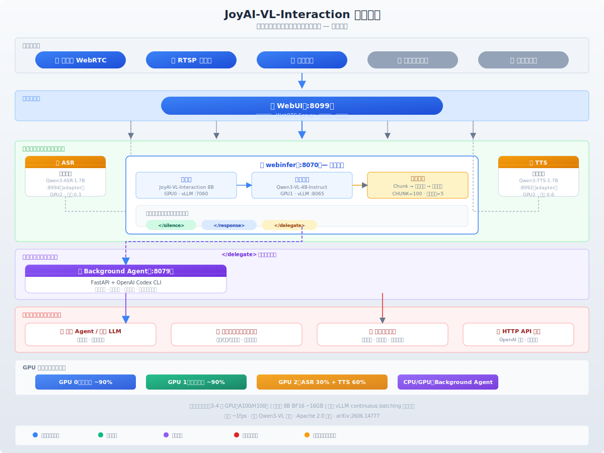

# JoyAI-VL-Interaction 技术调研报告

> 京东开源实时视频视觉语言交互系统 — 全栈分析  
> 调研日期：2026-06-22  
> 项目地址：https://github.com/jd-opensource/JoyAI-VL-Interaction  
> 论文：https://arxiv.org/abs/2606.14777

---

## 目录

1. [项目概述](#1-项目概述)
2. [核心创新分析](#2-核心创新分析)
3. [系统架构详解](#3-系统架构详解)
4. [生产部署方案](#4-生产部署方案)
5. [AI 医生场景分析](#5-ai-医生场景分析)
6. [与现有方案的对比](#6-与现有方案的对比)
7. [局限与风险](#7-局限与风险)
8. [参考资料](#8-参考资料)

---

## 1. 项目概述

**JoyAI-VL-Interaction** 是京东 Joy Future Academy 推出的**全球首个全栈开源的实时视频视觉语言交互模型与系统**。

### 一句话理解

传统多模态大模型是**"回合制"**的——用户上传图片/视频、提问，模型回答。  
JoyAI-VL-Interaction 是**"流式"**的——模型持续观看视频流，每秒钟**自主决定**是沉默、回应、还是将复杂任务委托给后台。

### 开源范围

| 内容 | 说明 |
|---|---|
| 模型权重 | 8B 参数，基于 Qwen3-VL 底座，BF16 约 16GB |
| 训练配方 | SFT + RL 完整流程 |
| 交互数据集 | 400 万条时间对齐的交互数据 |
| 完整可部署系统 | 5 个服务 + 一键启动脚本 |
| vLLM 集成 | vLLM-Omni day-0 原生支持 |

### 评测结果

在 58 个真实场景的人机盲评中：

| 对比对象 | 总体胜率 | 监控预警胜率 |
|---|---|---|
| vs 豆包视频通话助手 | **77.6%** | **100%** |
| vs Gemini 视频通话助手 | **87.9%** | **100%** |

---

## 2. 核心创新分析

> **重要的不是用了什么模型，而是怎么用模型。**

项目所有基础模型均来自 Qwen 系列——主模型是 Qwen3-VL，摘要模型是 Qwen3-VL-4B，ASR/TTS 分别是 Qwen3-ASR 和 Qwen3-TTS。**真正的创新不在模型架构，而在范式层。**

### 2.1 范式创新：从"回合制"到"流式交互"

这是最核心的突破。

| 维度 | 传统 VLM | JoyAI-VL-Interaction |
|---|---|---|
| 交互模式 | 用户提问 → 模型回答 | 模型持续观看 → 自主决定何时说话 |
| 触发方式 | 外部输入触发 | **模型内部决策**（speak/silence/delegate） |
| 时间感知 | 无（只看单帧或离线视频） | 有（感知时间流逝，支持定时响应） |
| 主动能力 | 无（被动等待） | 有（视觉事件触发主动提醒） |

这个转变**不是靠改模型架构**（Qwen3-VL 本身是标准 VLM），而是靠**训练配方**：

- 用 **400 万条逐秒标注**的交互数据做 SFT（监督微调）
- 再用 **RL（强化学习）** 优化交互节奏
- 模型学会了三种输出格式：`</silence>`、`</response>`、`</delegate>`

> 原文：*"The decision of when to act is **learned inside the model** (from second-by-second time-aligned data + RL), **not bolted on by an external turn-detector or polling loop**."*

### 2.2 时序对齐数据集的构建

这是最硬核的工程创新——市面上此前不存在这样的数据。

每条训练数据包含：

```json
{
  "video_name": "example.mp4",
  "task_type": "monitoring",
  "question": [
    {"content": "有人摔倒时提醒我", "time": "0"}
  ],
  "response": [
    {"content": "</silence>", "time": "0"},
    {"content": "</silence>", "time": "1"},
    ...
    {"content": "</response> 检测到有人摔倒！", "time": "45"}
  ]
}
```

核心特征：
- **逐秒标注**：每秒钟标注模型应该输出什么
- **场景覆盖**：监控预警、实时翻译、实时计数、直播解说、APP 引导等
- **可扩展**：文章指出 400 万条远未饱和，数据量增加仍有明确收益

### 2.3 涌现能力

项目最令人兴奋的发现——模型展现出了**没有显式训练过的能力**：

> *"capabilities we never trained for emerge, such as **guiding a shopper through changing app screens** or **improvising a lecture from a slide deck**."*

这表明模型学到的不只是"看到 X 就说 Y"的简单映射，而是理解了**交互节奏**——什么时候该跟进、什么时候该沉默、什么时候换话题。这是一种 significant 的涌现现象。

### 2.4 系统工程创新

一个交互模型本身不足以构成产品。围绕模型构建的完整系统是第二大贡献：

| 创新点 | 说明 |
|---|---|
| **三层记忆压缩** | 原始帧 → Chunk 摘要（文本）→ 长期记忆（精简文本），解决无限视频流的内存膨胀 |
| **异步摘要生成** | 摘要模型在后台异步跑，主模型推理不阻塞 |
| **可插拔架构** | ASR/TTS/后台 Agent/WebUI 全部可替换 |
| **标准基础设施** | 基于 vLLM，OpenAI 兼容 API，部署门槛极低 |
| **AdaCodec**（TODO） | 预测式视频编码，可预测帧只花少量 token |

### 2.5 全栈开源的策略意义

项目不是只开源模型权重，而是：

```
模型 + 训练配方 + 数据集 + 完整可部署系统 + vLLM 集成 = 完整闭环
```

这意味着学术界和工业界可以：
- **复现**结果（数据 + 配方都有了）
- **修改**行为（在自己的场景上 fine-tune）
- **直接部署**（系统开箱即用）
- **扩展**能力（替换任一组件）

---

## 3. 系统架构详解

### 3.1 整体架构



> *上图使用 SVG 绘制，可在支持 SVG 的 Markdown 渲染器中直接查看。*

### 3.2 五大服务组件

#### 3.2.1 webinfer — 推理核心（必选）

| 项目 | 说明 |
|---|---|
| 端口 | HTTP :8070（adapter），:7060（主模型），:8065（摘要模型） |
| 主模型 | JoyAI-VL-Interaction 8B（= Qwen3-VL 微调版） |
| 摘要模型 | Qwen3-VL-4B-Instruct |
| 职责 | 帧缓存管理、记忆系统、主模型调用、输出归一化 |

**关键配置：**

```bash
CHUNK=100                # 每个内存块的帧数（~100秒）
COMPRESS_EVERY_N_CHUNKS=5 # 每5个chunk压缩一次为长期记忆
FRAME_SECONDS=1.0        # 帧间隔（~1fps）
FORCE_SILENCE_BEFORE_QUERY=true # 无用户输入时默认静默
MAIN_MAX_TOKENS=256      # 主模型最大输出token
MAIN_TEMPERATURE=0.8     # 采样温度
```

**记忆压缩流程：**

```
时间轴 ──────────────────────────────────►

每帧: 🖼 🖼 🖼 🖼 🖼 🖼 🖼 🖼 ...（~1fps）
        │
        └─→ 进入当前 Chunk（最多 100 帧）
        
Chunk 满后：
┌──────────────────────────┐
│ 原始 100 帧（图片，丢弃）   │
│ 摘要模型压缩为：            │
│ "前30秒用户在阅读...        │ ← 纯文本，几百 token
│ 第45秒起身接水..."          │
└──────────────────────────┘
         │
         ▼
    mid_term_summaries[]（文本摘要列表）
         │
每5个chunk: ──→ 长期记忆（更精简的文本）
```

#### 3.2.2 WebUI — 交互前端（必选）

| 项目 | 说明 |
|---|---|
| 端口 | HTTPS :8099 |
| 职责 | 浏览器前端 + WebRTC 服务器 |
| 输入 | 摄像头画面 / RTSP 直播流 / 屏幕共享 |
| 内部 | 将 WebRTC 流转为 JPEG 帧（~1fps）发送给 webinfer |

WebUI 不仅仅是前端，它承担了**服务桥接**的角色——连接 ASR、TTS、background-agent 到推理流程。

#### 3.2.3 ASR — 语音识别（可选）

| 项目 | 说明 |
|---|---|
| 端口 | :8994（adapter），:8993（vLLM 后端） |
| 模型 | Qwen3-ASR-1.7B |
| GPU 显存 | 0.3（与 TTS 共享 GPU 2） |

#### 3.2.4 TTS — 语音合成（可选）

| 项目 | 说明 |
|---|---|
| 端口 | :8992（adapter），:8991（vLLM-Omni 后端） |
| 模型 | Qwen3-TTS-12Hz-1.7B-CustomVoice |
| 默认音色 | vivian |
| GPU 显存 | 0.6（与 ASR 共享 GPU 2） |

#### 3.2.5 Background Agent — 后台委托（可选）

| 项目 | 说明 |
|---|---|
| 端口 | HTTP :8079 |
| 底层 | **OpenAI Codex CLI**（开源 AI Agent 工具） |
| 配置 | `codex-home/config.toml` 可指定任意模型 |
| 能力 | 代码执行 + 联网搜索 + 工具调用 |
| 关键参数 | `CODEX_API_MAX_SUBAGENTS=6`，超时 600s |

**重要：Agent 使用了 `--dangerously-bypass-approvals-and-sandbox` 和 `--search`**，这意味着它可执行任意 code 和联网搜索。生产部署时应注意安全隔离。

### 3.3 GPU 资源分配（默认）

| GPU | 服务 | 显存占用 |
|---|---|---|
| GPU 0 | 主模型（:7060） | ~90%（~16GB 用于 8B BF16） |
| GPU 1 | 摘要模型（:8065） | ~90%（4B 模型约 8GB） |
| GPU 2 | ASR（:8993 30%）+ TTS（:8991 60%） | ~90% 合计 |
| CPU | Background Agent（Codex） | 无 GPU 需求 |

### 3.4 核心数据流

```
1. 视频采集
   摄像头/RTSP → WebUI（WebRTC）→ JPEG 帧（~1fps）

2. 推理请求
   WebUI → webinfer adapter（:8070）
   Headers: x-streaming-session: <sessionId>
   Body: OpenAI 兼容 chat.completions

3. 上下文组装
   adapter 构建最终 prompt：
     [Video History] ← 文本摘要（已丢弃的旧帧）
     [当前 Chunk 帧] ← 图片（最新 N 帧）
     [Q&A History]  ← 历史问答记录
     [User Query]   ← 当前问题

4. 模型推理（每秒一次）
   vLLM（:7060）返回三种信号之一：
   → </silence>         保持沉默，继续观察
   → </response> ...    主动或被动回应
   → </delegate> task   委托给后台 Agent

5. 记忆压缩（异步）
   每 CHUNK 帧 → 摘要模型生成中期摘要（文本）
   每 COMPRESS_EVERY_N_CHUNKS → 合并为长期记忆
```

### 3.5 三种输出信号的语义

| 信号 | 含义 | 触发条件 |
|---|---|---|
| `</silence>` | 保持沉默 | 画面无显著变化、无用户提问、无事件触发 |
| `</response>` | 主动/被动回应 | 检测到视觉事件、回答用户问题 |
| `</delegate>` | 委托后台 | 问题需要复杂推理/代码/专业知识 |

**响应延迟**：< 1 秒（亚秒级）

---

## 4. 生产部署方案

### 4.1 三种部署模式

#### 模式 A：最小部署（2 服务）

```
webinfer（主模型 + 摘要模型） + WebUI
→ 仅视频理解 + 文本对话，无语音、无后台委托
→ 最低 3 块 GPU
→ 适合：原型验证、概念测试
```

#### 模式 B：完整部署（5 服务）

```
webinfer + WebUI + ASR + TTS + background-agent
→ 全功能：视频 + 语音 + 后台委托
→ 3-4 块 GPU
→ 适合：公开演示、小规模使用
```

#### 模式 C：生产规模部署

```
webinfer（多实例） + 定制前端（替换 WebUI） + background-agent
+ ── 规则引擎（独立兜底触发 delegate）
+ ── 专业 Agent（替换 Codex 默认模型，接业务系统）
+ ── vLLM continuous batching 提升并发
→ 适合：大规模并发业务
```

### 4.2 集成点

#### 集成点 1：webinfer HTTP API（核心）

```
POST http://127.0.0.1:8070/v1/chat/completions
Headers: x-streaming-session: <sessionId>

{
  "model": "JoyAI-VL-Interaction-Preview",
  "messages": [
    {
      "role": "user",
      "content": [
        {"type": "image_url", "image_url": {"url": "data:image/jpeg;base64,..."}},
        {"type": "text", "text": "请描述当前画面"}
      ]
    }
  ]
}
```

- **OpenAI 兼容**，现有 SDK 可直接调用
- 通过 `x-streaming-session` 管理会话状态和记忆
- 支持 `POST /v1/streaming/reset` 重置会话

#### 集成点 2：Background Agent（后台委托）

模型输出 `</delegate>` 后，请求发至 background-agent（:8079）：

```
POST /v1/solve
{
  "session_id": "...",
  "task_id": "...",
  "question": "患者面部不对称，可能的诊断？",
  "frames": [{"image_url": "data:...", "timestamp": 123.0}],
  "max_subagents": 6,
  "timeout_seconds": 600
}
```

可配置 `codex-home/config.toml` 指定使用医学专用模型或接入自定义工具。

#### 集成点 3：规则引擎（独立兜底）

建议作为 sidecar 部署，**不依赖模型判断**：

```
摄像头画面
  ├─→ JoyAI-VL-Interaction（主模型）
  │
  └─→ 规则引擎（轻量检测）
        ├── MediaPipe Face Mesh → 面部不对称检测
        ├── YOLO + Pose → 跌倒/异常姿态检测
        ├── OpenCV 帧差 → 突发运动检测
        └── 关键词匹配 → "救命""医生"

    任一规则触发 → 强制注入 delegate 信号
                  → 直接调 background-agent API
```

### 4.3 并发能力估算

瓶颈在 **GPU 推理**，不在 API：

| 硬件 | 单节点并发路数 | 策略 |
|---|---|---|
| 1× A100 80GB | 2-3 路 | 主模型 + 摘要模型 + 排队 |
| 1× H100 80GB | 3-4 路 | H100 推理速度更快 |
| 8× A100 集群 | ~20 路 | 每卡 2-3 路，负载均衡 |
| 大规模集群 | 100+ 路 | 多节点 + vLLM continuous batching |

优化方向：
- 帧率降到 0.5fps（大部分场景足够）
- Continuous batching 合并多路请求
- 摘要模型共享（低频调用）
- 帧传输用 RTSP 直连，不走 HTTP base64

### 4.4 一键部署命令

```bash
# 1. 拉取代码
git clone https://github.com/jd-opensource/JoyAI-VL-Interaction.git
cd JoyAI-VL-Interaction

# 2. 安装依赖
./install/install.sh --with-all

# 3. 下载模型权重
./install/download-models.sh --all

# 4. 启动（最小部署）
./services/scripts/run.sh minimal

# 5. 健康检查
curl http://127.0.0.1:8070/health
curl https://127.0.0.1:8099  # 浏览器打开
```

---

## 5. AI 医生场景分析

### 5.1 架构建议

```
                          摄像头画面（患者）
                              │
                     ┌────────┴────────┐
                     │                 │
              ┌──────▼──────┐  ┌──────▼──────┐
              │ JoyAI-VL-   │  │  规则引擎    │
              │ Interaction │  │  (独立兜底)   │
              │    8B       │  │              │
              │ 实时视觉理解  │  │ 面部/姿态/   │
              │ 交互节奏控制  │  │ 动作/关键词   │
              └──────┬──────┘  └──────┬──────┘
                     │                │
                     ▼                │
              ┌──────────────┐        │
              │ delegate?    │◄───────┘
              │ 模型自主判断  │   规则触发也 delegate
              └──────┬───────┘
                     │ delegate  /  response（直接回答）
                     ▼
              ┌──────────────┐
              │ Background   │
              │ Agent        │
              │ (Codex)      │
              │ 可配医学 LLM  │
              └──────┬───────┘
                     │ 委托
                     ▼
              ┌──────────────────┐
              │ 医学系统           │
              │ ├── 医学专用 LLM  │
              │ ├── 临床知识库 RAG│
              │ ├── 病历查询 API  │
              │ └── 人工医生工作台  │
              └──────────────────┘
                     │ 结果返回
                     ▼
              JoyAI-VL-Interaction 继续值守
              + 播报诊断/建议给用户
```

### 5.2 分层安全设计

| 层级 | 组件 | 风险等级 | 延迟 |
|---|---|---|---|
| L1 | JoyAI-VL-Interaction（视觉感知） | 低 | < 1s |
| L2 | 规则引擎（独立触发） | 低 | < 100ms |
| L3 | Background Agent（医学推理） | 中 | ~10-60s |
| L4 | 医学 LLM / 知识库（专业判断） | 高 | ~10-30s |
| L5 | 人工医生复核（最终确认） | 最高 | ~分钟级 |

### 5.3 典型场景梳理

| 场景 | JoyAI-VL-Interaction 做什么 | 后台 Agent 做什么 |
|---|---|---|
| **跌倒检测** | 实时识别跌倒动作，主动告警 | 评估跌倒风险等级，联系家属/急救 |
| **面部不对称** | 追踪口角/眼睑变化趋势 | 结合病史，给出面神经炎/卒中评估 |
| **步态分析** | 量化步幅/承重/对称性 | 调用骨科知识库，给出康复建议 |
| **康复指导** | 实时检测动作角度，纠正姿势 | 生成个性化康复方案 |
| **药物管理** | 识别药片种类/数量，确认服下 | 核对用药方案，查询相互作用 |
| **日常监测** | 持续观察，仅在异常时主动报告 | 汇总趋势，生成周报给医生 |

### 5.4 需要解决的挑战

| 挑战 | 说明 |
|---|---|
| **医学准确性** | 容错率极低，需要严格的临床验证流程 |
| **隐私合规** | 视频流持续分析涉及 HIPAA/GDPR/个人信息保护法 |
| **离线可用性** | 医疗场景需要断网/弱网下的降级方案 |
| **监管准入** | 作为医疗器械需 NMPA/FDA 认证，路线漫长 |
| **幻觉控制** | 模型可能误报或漏报，需要多层验证 |

---

## 6. 与现有方案的对比

### 6.1 对比：JoyAI-VL-Interaction vs 豆包/Gemini（官方评测）

| 维度 | AI-VL 胜率（vs 豆包） | AI-VL 胜率（vs Gemini） |
|---|---|---|
| 监控与告警 | 100% | 100% |
| 实时翻译 | 80% | 100% |
| 实时计数 | 70% | 100% |
| 时间感知 | 80% | 50% |
| 直播解说与引导 | 55.6% | 100% |
| 长程视觉记忆 | 77.8% | 77.8% |
| **总体** | **77.6%** | **87.9%** |

**注意**：官方指出 JoyAI-VL-Interaction 是 8B 模型，而豆包和 Gemini 背后是远更大的模型。能在"实时在场"这个维度上以 8B 胜出，恰恰说明了交互模型范式的优势。

### 6.2 对比：与其他视频理解方案

| 维度 | 传统视频 VLM | JoyAI-VL-Interaction |
|---|---|---|
| 输入方式 | 上传完整视频 | 实时流式（摄像头/RTSP） |
| 交互模式 | 问答式（一问一答） | 流式（持续在场） |
| 主动性 | 无 | 有（视觉事件自动触发） |
| 时间感知 | 无 | 有（感知时间流逝） |
| 后台委托 | 无 | 有（delegate 机制） |
| 记忆管理 | 无（上下文窗口有限） | 三层压缩（chunk → 摘要 → 长期） |
| 开源程度 | 通常只开源模型 | 全栈开源（模型+数据+配方+系统） |

---

## 7. 局限与风险

### 7.1 项目自身的局限

> 官方坦诚说明：JoyAI-VL-Interaction 是一个紧凑的 8B 模型，在开放式聊天、个性化风格和日常请求长尾上，无法匹敌大模型产品。

- **规模差异**：豆包和 Gemini 背后是远更大的模型
- **通用知识不足**：8B 模型的知识覆盖有限
- **AdaCodec 尚未发布**：当前版本没有预测式视频编码的 token 优化
- **数据集仍较小**：400 万条远未饱和

### 7.2 生产部署风险

| 风险 | 应对 |
|---|---|
| **模型幻觉** | 规则引擎兜底 + 后台 Agent 交叉验证 |
| **GPU 瓶颈** | vLLM continuous batching + 多卡负载均衡 |
| **长视频流退化** | 三层记忆压缩 + 会话超时断开机制 |
| **后台 Agent 安全** | Codex 使用了 `--dangerously-bypass-approvals`，需网络隔离 |
| **隐私合规** | 视频帧本地处理优先，敏感数据不上传 |
| **医学场景监管** | 明确 AI 角色为"辅助"，人工医生终审 |

---

## 8. 参考资料

| 资源 | 链接 |
|---|---|
| GitHub 仓库 | https://github.com/jd-opensource/JoyAI-VL-Interaction |
| HuggingFace 模型 | https://huggingface.co/jdopensource/JoyAI-VL-Interaction-Preview |
| 数据集 | https://huggingface.co/datasets/jdopensource/JoyAI-VL-Interaction |
| 论文 | https://arxiv.org/abs/2606.14777 |
| 项目博客 | https://joyai-vl-video-future-academy-jd.github.io/JoyAI-VL-Interaction/ |
| vLLM-Omni 集成 | https://github.com/vllm-project/vllm-omni |
| OpenAI Codex CLI | https://github.com/openai/codex |

---

> **报告小结**：JoyAI-VL-Interaction 的核心价值不在于模型大小或架构创新，而在于**它开辟了一条从"回合制"到"流式交互"的技术路线**，并用全栈开源让这条路变得可走。对于需要"实时在场 AI"的场景（安防、医疗、直播、客服、智能硬件），它提供了一个开箱即用的起点。但要从 demo 到生产级产品，还需要在医学专业能力、并发规模、安全合规等方面做大量工程工作。
