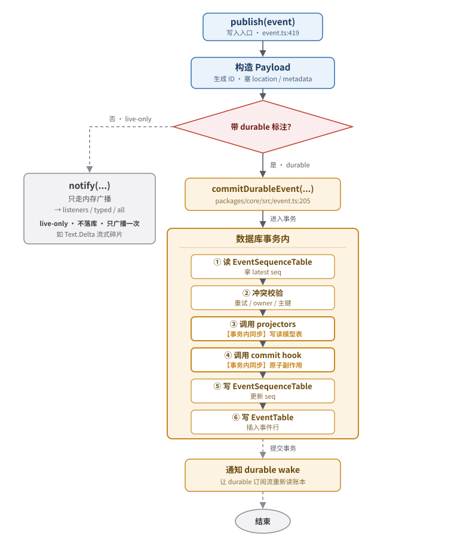

# 01 · 事件账本与 EventV2 总线

> 本文是 V2 Session 架构系列的第一篇，专讲中间那一区——**账本**。读完你应该能回答：账本里到底存了什么？写一条事件经历了几步？订阅一条事件有几种姿势？为什么有些事件不落库？崩溃后怎么恢复？
>
> 本文假设你读过 [README](./)，熟悉其中的术语：**账本（Event Log）**、**事件溯源**、**投影（projector）**、**发布-订阅（Pub/Sub）**。

---

## 一、心智模型：账本不是数据库，是「流水 + 余额」

继续 README 那个银行的类比，把它再往前推一步。

一个银行账户系统里有两样东西：

- **流水（transactions）**：每一笔交易记一条，**只增不改**。十年前存的那 100 块，流水上今天还在。
- **余额（balance）**：当前账户还有多少钱。**余额不直接存**，而是「从流水算出来的当前值」。为了查询快，会单独维护一张「当前余额表」，但那张表坏了不慌——重放流水就能重建。

V2 的账本就是这两样东西的复刻：

| 银行 | V2 账本 |
|---|---|
| 一个账户 | 一个 **aggregate**（聚合），现在就是 `sessionID` |
| 一笔交易流水 | 一条 **事件**（`EventTable` 里的一行） |
| 账户当前余额 | `EventSequenceTable` 里那个 `seq`（这个 aggregate 当前记到第几条了） |
| 账户的「归属行」 | `EventSequenceTable.owner_id`（这个 aggregate 现在归谁管） |
| 记一笔交易 | `publish(...)` |
| 查某账户所有流水 | `durable({ aggregateID, after })` |
| 重放流水重建余额 | `replay` / `project` |

### 关键性质：append-only + 单调递增 + 按 aggregate 分桶

- **append-only**：事件一旦写入就永远不修改、不删除（除非整个 aggregate 被 `remove`，那是销户）。所谓「事实不可篡改」。
- **单调递增**：同一个 aggregate 内，每条事件拿到一个 `seq`，从 0 开始严格 +1。`(aggregate_id, seq)` 是联合唯一键（`packages/core/src/event/sql.ts:22`）。`seq` 是这个 aggregate 内部的「逻辑时间」。
- **按 aggregate 分桶**：不同 session 的事件各记各的，`seq` 互不影响。这让账本能水平扩展——加 session 不影响现有 session 的编号空间。

> **为什么用「账本」而不是直接叫「数据库表」？** 因为「账本」这个词强调了三个约束：append-only、派生性（余额从流水算）、可重放（重放流水重建一切）。这三个约束是整个 V2 架构能成立的地基。后面所有机制（ projector 的原子性、replay 的幂等、claim 的分布式锁）都是从这三个约束派生出来的。

---

## 二、数据结构：两张表，分工明确

账本在物理上就是 SQLite 的两张表，定义在 `packages/core/src/event/sql.ts`。

### 2.1 EventSequenceTable ——「余额表」

```ts
// packages/core/src/event/sql.ts:4-8
sqliteTable("event_sequence", {
  aggregate_id: text().notNull().primaryKey(),  // aggregate 标识（= sessionID）
  seq: integer().notNull(),                     // 这个 aggregate 当前最大 seq
  owner_id: text(),                             // 这个 aggregate 归谁所有（可空）
})
```

一行 = 一个 aggregate 的「当前状态」。**只有三列**，但每一列都有大用处：

| 字段 | 含义 | 谁来写 |
|---|---|---|
| `aggregate_id` | aggregate 的主键。现在就是 `sessionID` | 第一次写事件时自动建 |
| `seq` | 这个 aggregate 已经记到第几条了（最新一条的 seq） | 每次写事件都更新 |
| `owner_id` | 这个 aggregate 归哪个节点管。`NULL` = 无人认领 | `claim()` 显式设置，replay 时隐式认领 |

**为什么需要单独一张「余额表」？** 不能每次都 `SELECT MAX(seq) FROM event WHERE aggregate_id = ?` 吗？能，但慢——尤其在并发写时还要加锁。维护一张「当前余额表」让「读最新 seq」变成 O(1) 的主键查询（`packages/core/src/event.ts:243-248`）。这是用空间换时间的标准手法。

### 2.2 EventTable ——「流水表」

```ts
// packages/core/src/event/sql.ts:10-25
sqliteTable("event", {
  id: text().primaryKey(),                                          // 事件唯一 ID（evt_xxx）
  aggregate_id: text().notNull().references(...{ onDelete: "cascade" }),
  seq: integer().notNull(),
  type: text().notNull(),                                           // 形如 "session.next.prompted.1"
  data: text({ mode: "json" }).$type<Record<string, unknown>>(),    // 事件数据（JSON 字符串）
}, (table) => [
  uniqueIndex("event_aggregate_seq_idx").on(table.aggregate_id, table.seq),
  index("event_aggregate_type_seq_idx").on(table.aggregate_id, table.type, table.seq),
])
```

一行 = 一条已经发生的、不可篡改的事实。要点：

- **`id` 全局唯一**（`evt_` 前缀，`packages/schema/src/event.ts:9-12`）。为什么事件需要自己的 ID，光有 `(aggregate_id, seq)` 不够？因为要支持**幂等重试**——同一次写入带同一个 ID，重复来不会被记两次（见 `packages/core/src/event.ts:303-315` 的去重检查）。
- **`type` 带版本号后缀**：存的不是 `"session.next.prompted"`，而是 `"session.next.prompted.1"`（`packages/core/src/event.ts:343`，由 `versionedType()` 拼接，`packages/schema/src/event.ts:94-96`）。这是为了将来事件 schema 升版（`Step.Ended` 已经是 `.2`，见 `packages/schema/src/session-event.ts:44-49`）。
- **`data` 是 JSON 字符串**：事件的全部业务数据。读取时按事件 schema 反序列化。
- **两个索引**：联合唯一索引保证 `(aggregate_id, seq)` 不重复；三元索引让「按类型查某个 aggregate 的事件」走索引。

### 2.3 两张表的关系

```
EventSequenceTable（每个 aggregate 一行）       EventTable（每条事件一行）
┌────────────────┬──────┬──────────┐         ┌─────────┬──────────────┬──────┬────────────────────────┬──────┐
│ aggregate_id   │ seq  │ owner_id │         │ id      │ aggregate_id │ seq  │ type                   │ data │
├────────────────┼──────┼──────────┤         ├─────────┼──────────────┼──────┼────────────────────────┼──────┤
│ session_abc    │  7   │ node-1   │ ────┐   │ evt_01  │ session_abc  │  0   │ session.next.prompt…1  │ ...  │
│ session_def    │  2   │ NULL     │     │   │ evt_02  │ session_abc  │  1   │ session.next.step.st…1 │ ...  │
└────────────────┴──────┴──────────┘     │   │ ...     │ ...          │ ...  │ ...                    │ ...  │
                                          └──▶│ evt_08  │ session_abc  │  7   │ session.next.tool.su…1 │ ...  │
                                              │ evt_20  │ session_def  │  0   │ session.next.prompt…1  │ ...  │
                                              └─────────┴──────────────┴──────┴────────────────────────┴──────┘
```

外键 `onDelete: "cascade"`：删 `EventSequenceTable` 一行，对应 `EventTable` 的所有事件自动跟着删。`remove(aggregateID)` 就是靠这个（`packages/core/src/event.ts:514-523`）——销户，流水也一起清掉。

---

## 三、事件的「三重身份」：durable、live-only、typed

在讲 publish 流程之前，必须先讲清楚一个核心区分：**不是所有事件都会落库**。

每条事件定义（`Event.define`）可以带一个 `durable` 标注（`packages/schema/src/event.ts:42-69`）：

```ts
Event.define({
  type: "session.next.prompted",
  durable: { aggregate: "sessionID", version: 1 },   // ← 标注了 durable
  schema: { ... }
})

Event.define({
  type: "session.next.text.delta",
  schema: { ... }                                    // ← 没标 durable，是 live-only
})
```

`durable` 标注告诉账本两件事：
1. **这个事件要落库**（写 `EventTable` 和 `EventSequenceTable`）。
2. **按哪个字段聚合**（`aggregate: "sessionID"` 表示用 data 里的 `sessionID` 字段当 aggregate_id）。

### 三种事件类型对照

| 类别 | 例子 | 是否落库 | 是否进 wake 通知 | 用途 |
|---|---|---|---|---|
| **durable 事件** | `PromptAdmitted`、`Tool.Called`、`Step.Ended` | 是 | 是 | 真正的「事实」，崩溃后能恢复 |
| **live-only 事件** | `Text.Delta`、`Reasoning.Delta`、`Tool.Input.Delta`、`Compaction.Delta` | 否 | 否 | 流式碎片，瞬态的、可丢的 |
| （隐含）**typed 事件** | 所有有定义的事件 | 看是否 durable | — | 都能被 `subscribe(type)` 订阅 |

### 为什么 `Text.Delta` 不落库？

模型流式吐字，一个字一个 delta，一次回答可能几百上千条。如果全落库：

- **写放大严重**：每条 delta 都要走一次事务、写两表、通知所有订阅者。
- **重放代价高**：崩溃恢复时要重放几万条 delta 才能算出「最终文本」。
- **没必要**：delta 本身没价值——有价值的是「最终完整文本」，那才是事实。`Text.Ended` 才是 durable 的，存完整文本（`packages/schema/src/session-event.ts:221-231`）。

所以代码里专门有注释：

```ts
// packages/schema/src/session-event.ts:209
// Stream fragments are live-only; Text.Ended is the replayable full-value boundary.
```

**durable 事件是「事实边界」，live-only 事件是「事实的流式预告」。** 预告可以丢，事实不能丢。

### DurableDefinitions vs Definitions

`packages/schema/src/session-event.ts` 维护两张清单：

- **`DurableDefinitions`**（:448-477）：只包含 durable 事件。**少了 4 种 Delta**。
- **`Definitions`**（:479-512）：全部事件，包括 Delta。

`durable-event-manifest.ts` 把 durable 清单拼成一个全局查表（`packages/schema/src/durable-event-manifest.ts:12-15`）：

```ts
export const Durable = Event.durable([
  ...SessionV1.Event.Definitions.filter((definition) => definition.durable !== undefined),
  ...SessionEvent.DurableDefinitions,
])
```

这个 `Durable` 表的 key 是 `versionedType`（如 `"session.next.prompted.1"`），值是对应的 Definition。`packages/core/src/event.ts:51` 的 `Durable.get(event.type)` 就是从这张表查 definition——**只有 durable 的事件能从存储里反序列化出来**。

---

## 四、publish 流程（重头戏）

这是账本最复杂的一段。看懂它，账本就懂了一大半。

### 4.1 入口：publish → publishEvent → commitDurableEvent



文字版（终端友好）：

```
publish(definition, data, options?)           ← packages/core/src/event.ts:419
   │
   │  构造 Payload（生成 ID、塞 location/metadata）
   ▼
publishEvent(definition, payload, commit?)    ← packages/core/src/event.ts:369
   │
   ├─ 没有 durable 标注？
   │     └─ notify(payload, isolateListeners=false)  ← 只走内存广播，不落库
   │
   └─ 有 durable 标注？
         └─ commitDurableEvent(...)                  ← packages/core/src/event.ts:205
              │
              ├─ 进入事务
              │    ├─ 读 EventSequenceTable 拿 latest seq
              │    ├─ 冲突校验（重试 / owner / 主键）
              │    ├─ 调用 projectors  ←【事务内同步】
              │    ├─ 调用 commit hook ←【事务内同步】
              │    ├─ 写 EventSequenceTable
              │    └─ 写 EventTable
              ├─ 提交事务
              ├─ 通知 durable wake（让 durable 流重新读）
              ▼
         notify(payload, isolateListeners=true)  ← 内存广播给 listeners/typed/all
```

### 4.2 三层职责分明

- **`publish`（:419-439）**：只管「组装 payload」。生成事件 ID、把当前 `Location` 拼进去、把 metadata 拼进去。**完全不碰数据库**。
- **`publishEvent`（:369-396）**：分叉点。**判断是 durable 还是 live-only**。durable 走落库流程，live-only 直接跳到 `notify`。
- **`commitDurableEvent`（:205-367）**：真正干活的人。所有数据库操作、冲突校验、projector 调用都在这里。

### 4.3 事务内的执行步骤

这是核心。整个 `commitDurableEvent` 用 `Effect.uninterruptible(...)` 包了一层（`packages/core/src/event.ts:237`），意思是**这一段不能被打断**——为什么？因为 projector 已经写了表、但 event 还没插进去，这时被 interrupt 就会留下脏状态。所以「从开始写 projector 到事务提交」必须原子。

事务内的执行顺序（行号都指向 `packages/core/src/event.ts`）：

| 步骤 | 行号 | 干什么 | 失败会怎样 |
|---|---|---|---|
| ① 读当前 seq | :243-249 | `SELECT seq, owner_id FROM event_sequence WHERE aggregate_id = ?` | 没行就当 `latest = -1` |
| ② strictOwner 校验 | :254-261 | 若 `strictOwner` 且 owner 已属别人 → die | 抛 `InvalidDurableEventError` |
| ③ exact-retry 校验 | :262-290 | 若 `input.seq <= latest`：查那条事件，比对 id/type/data | 完全一致 = 幂等返回；不一致 = die「diverged」 |
| ④ owner 静默跳过 | :291-293 | 若 owner 已属别人 → 直接 `return`（**不报错**） | 静默吞掉 |
| ⑤ 计算 seq | :294-302 | `seq = input.seq ?? latest + 1`；replay 模式下校验 seq 连续 | 不连续 = die |
| ⑥ event.id 去重 | :303-315 | `SELECT ... WHERE id = ?`，已有 → die | 抛「Event already exists」 |
| ⑦ 组装 committed | :316-319 | 给 payload 补上 `durable: { aggregateID, seq, version }` | — |
| ⑧ **调用 projectors** | :320-322 | `for (const projector of list) yield* projector(committed)` | projector 失败 → 事务回滚 |
| ⑨ **调用 commit hook** | :323 | `yield* commit(seq)` | hook 失败 → 事务回滚 |
| ⑩ 写 EventSequenceTable | :324-335 | `INSERT ... ON CONFLICT DO UPDATE set seq` | — |
| ⑪ 写 EventTable | :336-348 | `INSERT INTO event ...` | — |
| ⑫ 返回 `{aggregateID, seq}` | :349 | 提交事务 | — |

### 4.4 为什么 projector 在事务内调用（关键）

这是整个设计最巧的一点，必须讲透。

projector 是「写读模型表」的角色（见 README 术语表）。比如 `PromptAdmitted` 事件来了，projector 要往 `session_message` 表写一行「用户问了一句」。

如果 projector 在事务**外**调用，会出现这种竞态：

```
T1: 事务提交（事件已落库）   ──┐
T2: 通知订阅者                │  ← 这之间崩溃
T3: 调 projector（写读模型）  ──┘
```

崩溃后重启：账本里**有**这条事件，但读模型表里**没有**。读模型坏了。

如果 projector 在事务**内**调用（实际做法），事务的原子性保证了：

- **要么**：事件 + projector 写的读模型 **一起成功**。
- **要么**：一起回滚，账本里也没这条事件。

**账本和读模型永远一致。** 这是「账本是唯一真理」的工程保证——不是嘴上说说，是用数据库事务钉死的。

代价：projector 出错会让事件写不进去。所以 projector 必须简单可靠，**不能有副作用、不能做网络请求**（`packages/core/src/event.ts:320-322` 是直接 `yield*`，没 try-catch）。

### 4.5 事务外的两件事

事务提交后，`commitDurableEvent` 在 uninterruptible 包内还做一件事（:354-360）：

```ts
yield* Effect.forEach(
  pubsub.durable.get(committed.aggregateID) ?? [],
  (wake) => PubSub.publish(wake, undefined),
  { discard: true },
)
```

这是**给这个 aggregate 的所有 wake 订阅者发一个「嘿，有新事件了」信号**。`wake` 是个 `PubSub<void>`——不传数据，只传信号。收到信号的人会自己去数据库读最新事件（见第六节 durable stream）。

> 为什么不直接把事件 publish 到 wake 通道？两个理由：(1) 信号通道避免了「事务还没提交，事件就被订阅者拿到」的脏读；(2) durable 流的订阅者用同一份代码处理「历史读」和「实时读」，统一走 `readAfter`，更简单。

然后 `publishEvent` 调 `notify(event, isolateListeners=true)`（:389）：把事件 publish 到 typed/all 两个 PubSub，并调 listeners 数组里的每个 listener。`isolateListeners=true` 意味着每个 listener 被包在 `observe` 里（:398-404）——**单个 listener 报错不影响别人**，只是 log 一下。

---

## 五、订阅账本的三种姿势

账本对外暴露三种「读」接口（`packages/core/src/event.ts:126-148` 的 `Interface`）：

| 接口 | 看到什么 | 何时开始 | 用途 |
|---|---|---|---|
| `subscribe(definition)` | 只看某一类事件 | **订阅之后**才有 | 推送链路（订阅 `Tool.Called` 推给前端） |
| `all()` | 看所有事件（包括 live-only） | **订阅之后**才有 | 调试、全局日志 |
| `durable({ aggregateID, after })` | 看某 aggregate 的全部 durable 历史 + 之后的新事件 | **从 `after+1` 开始** | 重连、崩溃恢复、加载历史 |

前两个是「实时流」——你订阅之前发生的事，它不补给你。第三个是「历史 + 实时」——会先把 `after` 之后的历史事件吐给你，再无缝接上实时。

### 5.1 内存里的广播网（三个 PubSub）

要理解三个订阅接口的差别，先看账本进程内维护的广播结构（`packages/core/src/event.ts:174-178`）：

```ts
const pubsub = {
  all: yield* PubSub.unbounded<Payload>(),            // 全局广播
  durable: new Map<string, Set<PubSub.PubSub<void>>>(), // 按 aggregateID 的 wake 信号
  typed: new Map<string, PubSub.PubSub<Payload>>(),   // 按事件类型的广播
}
```

```
                    事件落库完成
                         │
                         ▼
                   notify(event)
                    ┌────┴────┐
            ┌───────┤  分发   ├────────┐
            ▼       └─────────┘        ▼
     pubsub.typed[type]           pubsub.all
     （按类型分发）              （全量分发）
            │                          │
            ▼                          ▼
     subscribe(Dog) 的订阅者       all() 的订阅者
                                             ▲
                                             │
              事务提交后单独发：              │
              pubsub.durable[aggregateID] ───┘
              发送一个 void wake 信号
              → durable stream 收到，自己去 SELECT
```

- **typed**：按事件 `type` 分桶。`subscribe(Dog)` 拿到的就是这个桶的 PubSub。
- **all**：所有事件都进。`all()` 拿到的就是这个。
- **durable**：按 `aggregateID` 分桶，但**装的是 wake 信号**（`PubSub<void>`）。不是事件流，是「提醒流」。订阅它的人自己再去数据库读。

### 5.2 `subscribe(definition)`：按类型订阅实时流

最简单的一种（`packages/core/src/event.ts:534-537`）：

```ts
const subscribe = <D>(definition: D) =>
  Stream.unwrap(getOrCreate(definition).pipe(
    Effect.map((pubsub) => Stream.fromPubSub(pubsub))
  ))
```

懒创建一个该类型的 PubSub（:184-191 `getOrCreate`），然后从它产出一个 Stream。**没历史，订阅之前的拿不到**。

### 5.3 `all()`：订阅所有事件

更简单（:539）：

```ts
const streamAll = () => Stream.fromPubSub(pubsub.all)
```

直接从全局 PubSub 拿。一个 `all()` 流能看到所有事件，**包括 live-only 的 Delta**——这是 SSE 推送链路依赖的特性：前端要看到流式吐字，Delta 必须能被订阅到，即使它不落库。

### 5.4 `durable({ aggregateID, after })`：历史 + 实时无缝衔接

这是最精巧的一个。需求场景：「我重启了，要恢复某个 session 的完整历史，然后接上实时」。如果只读历史，会错过读期间的新事件；如果只订阅实时，看不到之前的事件。

V2 的做法（`packages/core/src/event.ts:585-604`）：

```ts
const durable = (input) =>
  Stream.unwrap(Effect.gen(function* () {
    // ① 先订阅 wake 信号（关键：在读历史之前！）
    const wakes = yield* subscribeDurable(input.aggregateID)
    let sequence = input.after ?? -1

    // ② readAfter：从 sequence 之后读所有 durable 事件
    const read = Effect.suspend(() => readAfter(input.aggregateID, sequence))
      .pipe(Effect.tap((events) => Effect.sync(() => {
        sequence = events.at(-1)?.durable?.seq ?? sequence   // 推进水位
      })))

    // ③ 先读一批历史
    const historical = yield* read

    // ④ live：每次 wake 触发一次 read
    const live = Stream.fromSubscription(wakes).pipe(
      Stream.mapEffect(() => read),    // 收到信号 → 重读
      Stream.flattenIterable,          // 把多事件拍平
    )

    // ⑤ 历史 + 实时 拼起来
    return Stream.concat(Stream.fromIterable(historical), live)
  }))
```

**「先订阅 wake，再读历史」这个顺序是避免漏事件的关键。** 看两种错误顺序会怎样：

```
❌ 错误顺序 A：先读历史，后订阅
   T1: SELECT 历史到 seq=5
   T2: 有人写入 seq=6（落库了，但你还没订阅 wake）
   T3: 你订阅 wake
   → seq=6 永远拿不到
```

```
❌ 错误顺序 B：先读历史，后订阅，但读后立刻再 SELECT
   T1: SELECT 历史到 seq=5
   T2: 有人写入 seq=6
   T3: 你订阅 wake
   T4: 你再 SELECT 一次 → 拿到 seq=6
   → 但如果 T2 写在 T3 之后，wake 已经发出去但你订阅晚，又错过
```

```
✅ 正确顺序：先订阅 wake，再读历史
   T1: 订阅 wake（之后任何写入都会叫醒你）
   T2: SELECT 历史到 seq=5
   T3: 有人写入 seq=6 → 你被叫醒
   T4: wake 触发 → 你 readAfter(sequence=5) → 拿到 seq=6
   → 不会漏
```

代价：可能**重复读**——读历史的同时又有 wake 来，会再读一次。但因为每次都从 `sequence` 之后读，且每次读都推进 `sequence`（:591-595），重复读不会产生重复事件——下一次 read 自动从上次读到的地方之后开始。

> 这个模式有个通用名字：**「snapshot + tail」**——先存个快照，再 tail 实时流。是事件溯源系统的标准做法。

---

## 六、project vs subscribe：同步注册 vs 异步流

这两个名字容易混。差别其实很明确（接口定义在 `packages/core/src/event.ts:137`）：

| | `project(definition, projector)` | `subscribe(definition)` |
|---|---|---|
| 接收 | 一个回调函数 | 返回一个 Stream |
| 执行时机 | **事务内同步**（事件落库前） | **事件落库后异步** |
| 数据来源 | durable 事件（live-only 进不来） | 所有该类型事件 |
| 失败影响 | **回滚事务**（事件也写不进去） | 只 log，不影响写入 |
| 注册时机 | 启动时注册一次 | 用的时候订阅 |
| 典型用途 | projector（写读模型表） | SSE 推送、日志 |

`project` 的实现就是个简单数组操作（:615-620）：

```ts
const project = (definition, projector) =>
  Effect.sync(() => {
    const list = projectors.get(definition.type) ?? []
    list.push((event) => projector(event))
    projectors.set(definition.type, list)
  })
```

注册时只是把回调 push 进一个 Map。真正调用在 `commitDurableEvent` 事务内（:320-322），事务原子性保护它。

**一句话总结**：`project` 是「账本内部的同伙」——和写入一起、原子地、改读模型表；`subscribe` 是「账本外部的客户」——异步拿到已经发生的、不可回滚的事件流。

---

## 七、replay / replayAll：把历史演一遍

### 7.1 为什么需要 replay

两种场景：

1. **崩溃恢复**：进程挂了，但数据库还在。重启时把某个 session 的所有 durable 事件按顺序 replay 一遍，projector 自动把读模型表重建出来。
2. **跨节点迁移**：一个 session 要从节点 A 迁到节点 B。B 把 A 那边的事件流水拿过来，replay 一遍，重建状态。

replay 的关键约束：**必须幂等**。同一批事件 replay 多次，结果应该完全一样。

### 7.2 SerializedEvent：replay 的输入

replay 不接收 `Payload`，而是接收一个更朴素的 `SerializedEvent`（`packages/core/src/event.ts:34-40`）：

```ts
type SerializedEvent = {
  readonly id: ID
  readonly type: string         // 注意是 versionedType，如 "session.next.prompted.1"
  readonly seq: number          // 这个事件在 aggregate 里的序号
  readonly aggregateID: string
  readonly data: Record<string, unknown>
}
```

这个结构是「可直接序列化、可跨网络传输」的。replay 内部用 `Durable.get(event.type)` 把它转回带 schema 的 Payload（:50-61 `decodeSerializedEvent`，:446-456）。

### 7.3 幂等的两种情况

replay 走的还是 `commitDurableEvent`，但传了 `input`（`packages/core/src/event.ts:457-462`）：

```ts
const committed = yield* commitDurableEvent(definition, payload, {
  seq: event.seq,
  aggregateID: event.aggregateID,
  ownerID: options?.ownerID,
  strictOwner: options?.strictOwner,
})
```

进入事务后会遇到两种幂等情况（:262-290）：

**情况 A：完全一致的重复（exact-retry）**

```ts
// packages/core/src/event.ts:262-283
if (input && input.seq <= latest) {
  const stored = SELECT FROM event WHERE aggregate_id = ? AND seq = input.seq
  if (
    stored?.id === event.id &&                                              // ID 相同
    stored.type === versionedType(definition.type, durable.version) &&       // 类型相同
    isDeepStrictEqual(stored.data, encoded)                                 // 数据深相等
  ) {
    // 静默返回，幂等成功
    return
  }
  // 否则 die「diverged」——同一个 seq 上居然是不一样的事件！
}
```

**三次全等才算「同一次重试」**：id、type+version、data。任何一个不符，就 die `Replay diverged`——这说明历史不一致了，是严重 bug，必须报错而不是覆盖。

**情况 B：seq 还没到（前驱缺失）**

```ts
// packages/core/src/event.ts:294-302
const seq = input?.seq ?? latest + 1
if (input && seq !== latest + 1) {
  yield* Effect.die("Sequence mismatch ...")
}
```

要 replay 的事件 seq 是 5，但 aggregate 当前只到 3——中间 4 去哪了？die。replay 必须按顺序、连续。

### 7.4 replayAll：批量 replay

`replayAll(events)`（:480-512）做了两道前置校验：

1. **同 aggregate**：所有事件必须属于同一个 aggregate（:487-494）。
2. **连续递增**：事件的 seq 必须从 `start` 开始连续 +1（:495-506）。

然后逐条调用 `replay`。返回 aggregateID（:510）。

### 7.5 owner 校验的两种模式

replay 时可以传 owner 相关选项（`packages/core/src/event.ts:443`）：

| 模式 | 行号 | 触发条件 | 行为 |
|---|---|---|---|
| **静默跳过**（默认） | :291-293 | `ownerID` 不符（aggregate 已属别人） | `return`（不报错，事件被吞） |
| **严格失败**（`strictOwner: true`） | :254-261 | `strictOwner` 且 owner 不符 | `die InvalidDurableEventError` |
| **自动认领** | :274-281 / :327-332 | replay 带 ownerID 且 aggregate 当前 `owner_id` 为 NULL | 写入时把 owner_id 设上 |

为什么默认静默跳过？**为了支持多节点协调**：节点 A 重放事件时，发现这个 aggregate 已经被节点 B 抢走了，那 A 就闭嘴——B 会自己处理。报错反而麻烦。

---

## 八、owner claim：给分布式留的锁

`claim(aggregateID, ownerID)` 实现非常简单（`packages/core/src/event.ts:525-532`）：

```ts
function claim(aggregateID, ownerID) {
  return db
    .update(EventSequenceTable)
    .set({ owner_id: ownerID })
    .where(eq(EventSequenceTable.aggregate_id, aggregateID))
    .run()
    .pipe(Effect.orDie)
}
```

**就是无条件覆盖 owner_id。**

注意：`claim` 是**单机 SQLite 内的乐观「软锁」**，不是分布式锁。它现在的作用是：

- 给某个 aggregate 打上「归某节点管」的标记。
- 配合 replay 的 owner 校验，让**别的节点重放该 aggregate 时被静默拒绝**。
- 单机情况下没什么用（只有一个节点）。但**未来扩展到多机时**，这套标记就是分布式协调的入口——加一层「跨进程的 claim 实现」（比如用 Redis 或 Raft），就能让两个节点不会同时 drain 同一个 session。

这也是 README 第八节说的「EventV2 已有 owner claim，是分布式锁的雏形」的具体落点。

---

## 九、commit hook：原子副作用钩子

`PublishOptions.commit` 是一个常被忽略但很重要的特性（`packages/core/src/event.ts:118-124`）：

```ts
interface PublishOptions {
  readonly id?: ID
  readonly metadata?: Record<string, unknown>
  readonly location?: Location.Ref
  /** Local operational projection committed atomically with a new durable event. Not replayed or serialized. */
  readonly commit?: (seq: number) => Effect.Effect<void>
}
```

它让你在 publish 一个 durable 事件时，**附带做一件别的事**，而且**这件事和事件落库是同一个事务**。

调用点在 `commitDurableEvent` 事务内（:323）：

```ts
for (const projector of list) {
  yield* projector(committed)
}
if (commit) yield* commit(seq)         // ← 项目就在这里
yield* db.insert(EventSequenceTable)...
yield* db.insert(EventTable)...
```

关键约束（注释里写得很清楚）：

1. **必须是 durable 事件才能用**（:371-377）：live-only 事件不进事务，没法挂 commit hook。
2. **不会在 replay 时被调用**——replay 走的是另一条路径，不会触发 commit hook。注释里的 "Not replayed or serialized" 就是这意思。
3. **失败会回滚整个事务**——和 projector 一样，必须简单可靠。
4. **能拿到 `seq`**——有些副作用需要知道这条事件将分配到哪个 seq（比如往收件箱写一条引用这个 seq 的记录）。

典型用途：**「准入」（admit）逻辑**——记一条 `PromptAdmitted` 事件的同时，往 `session_input` 收件箱塞一条记录。事件和收件箱记录要么一起成功、要么一起失败，不会出现「事件有了但收件箱没塞」（用户输入丢了）或「收件箱塞了但事件没记」（账本上找不到）的脏状态。

---

## 十、完整数据流：一条事件的一生

把前面所有片段串起来，看一条 `PromptAdmitted` 事件从生到灭经历了什么：

```
                    调用方：admit("session_abc", {...})
                                    │
                                    ▼
              publish(PromptAdmitted, data, { commit: writeInbox })
                                    │
                     packages/core/src/event.ts:419
                     · 生成 event ID（evt_xxx）
                     · 拼 location（当前工作目录）
                                    │
                                    ▼
              publishEvent(definition, payload, commit)
                                    │
                     packages/core/src/event.ts:369
                     · definition.durable 存在 → 走 commitDurableEvent
                                    │
                                    ▼
         ┌────────── commitDurableEvent（事务 + uninterruptible）──────────┐
         │                                                                  │
         │  1. SELECT seq, owner_id FROM event_sequence WHERE id=abc       │
         │     → 假设返回 latest=5                                          │
         │                                                                  │
         │  2. 三类校验（replay 路径才走，普通 publish 跳过）                 │
         │                                                                  │
         │  3. seq = latest + 1 = 6                                         │
         │                                                                  │
         │  4. SELECT FROM event WHERE id=evt_xxx → 没记录，继续            │
         │                                                                  │
         │  5. committed = { ...payload, durable: {abc, 6, version:1} }     │
         │                                                                  │
         │  6. for projector of projectors[PromptAdmitted.type]:            │
         │       yield* projector(committed)                                │
         │     → 比如往 session_message 表插一行                            │
         │                                                                  │
         │  7. yield* commit(seq=6)                                         │
         │     → 往 session_input 收件箱插一行                              │
         │                                                                  │
         │  8. INSERT/UPDATE event_sequence SET seq=6 WHERE id=abc          │
         │                                                                  │
         │  9. INSERT INTO event (id=evt_xxx, aggregate=abc, seq=6,         │
         │                         type="session.next.prompt.admitted.1",    │
         │                         data={...})                              │
         │                                                                  │
         │  ★ 提交事务（任何上面一步失败，全部回滚）                          │
         └──────────────────────────────────────────────────────────────────┘
                                    │
                                    ▼
              给 pubsub.durable[abc] 的所有 wake 订阅者发信号
              （durable stream 的订阅者会被叫醒，去 SELECT 历史增量）
                                    │
                                    ▼
              notify(event, isolateListeners=true)
              · pubsub.typed["session.next.prompt.admitted"] ← publish
              · pubsub.all ← publish
              · 调用 listeners[]（每个被 observe 隔离，错不影响别人）
                                    │
                                    ▼
              三类订阅者各取所需：
              · subscribe(PromptAdmitted) 的 Stream 吐出事件 → SSE 推给前端
              · all() 的 Stream 吐出事件 → 调试日志记录
              · durable({abc, after=5}) 的 Stream 在收到 wake 后，
                通过 readAfter(abc, 5) 读出这条事件，吐给订阅者
```

---

## 十一、小结与设计要点回顾

### 11.1 三条不变量

账本的设计严格守住了三条不变量，所有机制都是围绕这三条做的：

1. **账本是唯一事实**：所有状态从事件派生。读模型表是缓存（projector 重建），live-only Delta 是预告（不可恢复）。
2. **写入原子**：事件落库 + projector + commit hook 在**同一个事务**里，要么一起成功要么一起回滚。
3. **重放幂等**：相同的事件 replay 多次，结果一致。靠 exact-retry 校验（id+type+data 三全等）和 seq 连续性校验保证。

### 11.2 接口速查表

| 接口 | 行号 | 一句话 | 写/读 |
|---|---|---|---|
| `publish(definition, data, options?)` | :419 | 写一条事件 | 写 |
| `subscribe(definition)` | :534 | 订阅某类型的新事件（实时流） | 读 |
| `all()` | :539 | 订阅所有新事件（含 Delta） | 读 |
| `durable({aggregateID, after})` | :585 | 订阅某 aggregate 的历史 + 实时 | 读 |
| `project(definition, projector)` | :615 | 注册投影器（事务内同步执行） | 写（读模型表） |
| `replay(event, options?)` | :441 | 重放一条历史事件（幂等） | 写（重建状态） |
| `replayAll(events, options?)` | :480 | 重放一批事件（同 aggregate、连续 seq） | 写（重建状态） |
| `claim(aggregateID, ownerID)` | :525 | 认领 aggregate 的所有权 | 写 |
| `remove(aggregateID)` | :514 | 销户：删 aggregate 所有数据 | 写 |
| `listen(listener)` | :606 | （deprecated）注册全局 listener | 读 |

### 11.3 后续阅读

- 想看「projector 怎么用这套接口写读模型表」→ `packages/core/src/session/projector.ts`
- 想看「admit 怎么用 commit hook 原子地写收件箱」→ `packages/core/src/session/admit.ts`（或同等位置）
- 想看「调度层怎么通过 claim 协调多 session」→ 见本系列后续文档（02-scheduling.md，规划中）
- 想看「收件箱（session_input）和账本的关系」→ 见本系列后续文档（03-inbox.md，规划中）

### 11.4 留给分布式的路

账本本身的设计已经为多机部署留好了钩子：

- **`owner_id` + `claim()`**：分布式锁的雏形。多机时换成跨进程实现即可。
- **replay 的 owner 校验**：保证「同一个 aggregate 同一时刻只有一个 owner 在写历史」。
- **wake 是 advisory 信号**：跨机发提醒天然会丢，但 durable 流靠「先订阅再读」+ 重读水位，最终一致。
- **`aggregate_id` 是字符串主键**：未来可以是任意路由 key，不局限于 `sessionID`。

**单机现状已能跑通；扩展到多机时，账本本身不需要改，需要换的只是 `claim()` 的实现和调度策略。**
