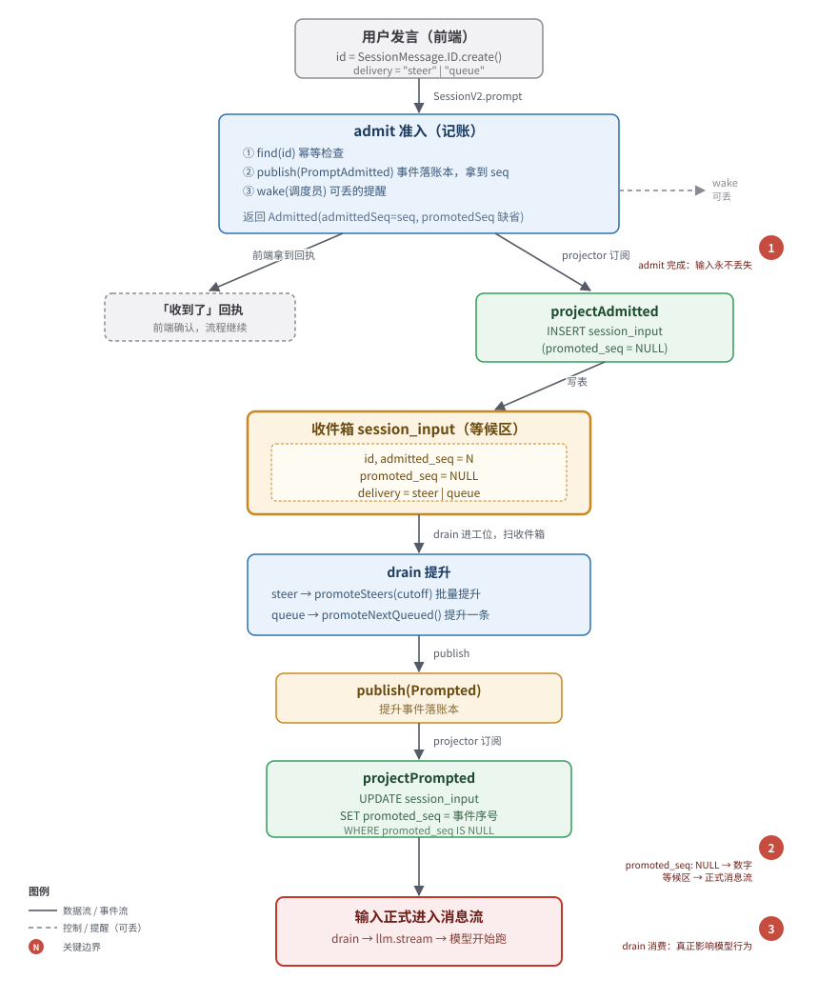

# 02 · 准入与收件箱（Admission & Inbox）

> 用户输入进入系统的第一站。本文讲清楚一句话怎么「先可靠记账、再择机执行」，以及 steer / queue 两种投递语义如何决定它什么时候变成正式消息。
>
> 阅读前请先看 [README](./) 的「核心概念（术语表）」和「五、一次完整请求的数据流」。本文沿用其中的术语和类比。

---

## 一、心智模型：银行柜台的「取号 + 叫号」

把用户发一句话想象成走进银行办业务：

1. 你一进门，**先到取号机拿一张号**——机器只做一件事：把你的请求可靠地记下来（打时间戳、发号），**立刻给你回执**。至于什么时候轮到你、由哪个柜员办，它不管。
2. 你的号进了**等候区**（收件箱），等系统来「叫号」。
3. 柜员（drain）空到能办你了，按规则把你从等候区「叫」出来，你的请求才真正开始被处理（跑模型）。

V2 里这三步分别叫：

| 银行类比 | V2 概念 | 可靠性要求 |
|---|---|---|
| 取号机记一笔 | **admit（准入）** | 必须立刻、可靠完成 |
| 等候区 | **收件箱（`session_input` 表）** | 已记账、还没被叫到的暂存区 |
| 柜员叫号办理 | **提升（promotion）→ drain 执行** | 慢、可失败、可重试 |

### 为什么 admit 和 execute 必须分离

这是 V2 三条铁律里的第二条——**记账和执行分离**（[README · 七](./)）。原因在于两者的可靠性级别完全不同：

- **admit**：用户在前端点了发送，眼巴巴等「收到了」的回执。这一步**必须秒回、必须可靠**。它只做一件事——往账本记一条 `PromptAdmitted` 事件。事件落库了，输入就永远不会丢。
- **execute（跑模型）**：慢（几十秒到几分钟）、可能失败（限流、网络）、可能要迁移（换机器跑）。它不该挡在用户的回执路上。

把两者捏在一起（V1 的做法）的代价是：跑模型崩了，用户那句话也跟着丢了。V2 把它们拆开——**admit 先把账记牢，execute 慢慢来，崩了重启接着扫账本就行**。

---

## 二、核心概念

### admit（准入）

「记账」动作。输入参数：`id`（消息 ID）、`sessionID`、`prompt`（提示内容）、`delivery`（投递语义）。输出：一条 `Admitted` 记录。**它不跑模型，只往账本 publish 一条事件**，事件被 projector 投影后落进收件箱。

> [packages/core/src/session/input.ts:41](https://github.com/anomalyco/opencode/blob/3f9dad3fd0d4ce01ccb443896bce93d9e7f390eb/packages/core/src/session/input.ts)

### 收件箱（session_input 表）

「已准入、但还没被提升为正式消息」的用户输入暂存区。物理上就是一张 `session_input` 表（见 [第四节](#四session_input-表结构)）。一条记录有两个关键的序号：

- `admitted_seq`：准入时拿到的「账本序号」（取号机发的号）
- `promoted_seq`：被提升为正式消息后拿到的序号；**`null` 表示还在等候区没被叫到**

### 提升（promotion）

把收件箱里一条等候中的输入「叫出来」，变成正式的 `Prompted` 事件。一旦 `Prompted` 落账，projector 就会把这条输入的 `promoted_seq` 填上，它从此脱离等候区，进入正式消息流，drain 才会把它喂给模型。

### steer / queue（投递语义）

这是 V2 的核心创新之一——**同样是「叫号」，叫的时机不同**。详见 [第三节](#三投递语义steer-vs-queue重点)。

---

## 三、投递语义：steer vs queue（重点）

延续 README 的类比：**steer 像趁同事打字时插话纠正方向，queue 像排队取号一个个来**。

### steer（实时引导）

> 「模型正在跑，但我现在就想让它知道这件事。」

- **提升时机**：在下一个**安全 provider-turn 边界**（模型告一段落、准备开始下一轮之前）批量提升。
- **当前 drain 必须继续**：插话不会让 drain 停，反而让它接着跑（因为有了新输入要处理）。
- **批量提升**：一次可以把截止线（cutoff）之前所有未提升的 steer 全部叫出来。
- **重置 step 计数**：每提升一批 steer，agent 的 provider-turn 配额（step 计数）重置为 1，相当于「这是一段新的对话回合」。

**使用场景**：用户看到模型跑偏了，中途追一句「别这么做，改用 X 方案」；或者补充一个新需求「顺便把测试也写了」。

### queue（排队）

> 「这事儿不急，等你把手头的活儿彻底干完再说。」

- **提升时机**：等 session **本来就要 idle 了**（内层 turn 循环结束、没有新的 steer）才提升。
- **每次只提升一条**：叫出一个，跑完一轮，重新评估是否还要继续，**再决定要不要叫下一条**。
- **不抢 steer 的位置**：drain 进工位时，先看有没有 steer（`hasPending "steer"`），有就先处理 steer；steer 清完了才看 queue。

**使用场景**：用户连续发了好几条独立指令，每条都该作为独立的一轮来处理，不想互相插队。

### 为什么需要两套语义

| 维度 | steer | queue |
|---|---|---|
| 时机 | turn 之间，实时插队 | 整轮 idle 之后，排队 |
| 一次叫几条 | 一批（cutoff 之前的全部） | 一条 |
| 对 drain 的影响 | 让 drain 继续 | 让 drain 重新启动一轮 |
| step 计数 | 重置 | 重置 |
| 典型场景 | 纠偏、补充、追问 | 多条独立任务、不想被打断 |

两者并存，让用户既能**实时干预**正在跑的会话，又能**有序堆积**不急的任务。这正是 V2 把「会话」当工作流引擎来设计的体现——投递语义是工作流的一等公民，不是临时拼凑的 flag。

---

## 四、session_input 表结构

收件箱的物理形态，定义在 [packages/core/src/session/sql.ts:140](https://github.com/anomalyco/opencode/blob/3f9dad3fd0d4ce01ccb443896bce93d9e7f390eb/packages/core/src/session/sql.ts)：

| 字段 | 类型 | 含义 |
|---|---|---|
| `id` | text, 主键 | 消息 ID（`SessionMessage.ID`），全局唯一 |
| `session_id` | text, 外键 → session | 归属哪个 session |
| `prompt` | json | 提示内容（`Prompt` 结构） |
| `delivery` | text | `"steer"` 或 `"queue"` |
| `admitted_seq` | integer, 非空 | **准入时的账本序号**（取号机发的号） |
| `promoted_seq` | integer, 可空 | **提升为正式消息后的序号**；`null` = 还在等候区 |
| `time_created` | integer | 准入时间戳 |

两个序号是理解收件箱的钥匙：

- **`admitted_seq`**：admit 发的 `PromptAdmitted` 事件在账本里的序号。它**唯一**（表上有 `uniqueIndex`），代表「这条输入是账本第 N 条事件时进来的」。
- **`promoted_seq`**：被提升时发的 `Prompted` 事件的账本序号。`null` 表示还没被叫到；填上数字表示已经正式进入消息流。

表上的索引（[sql.ts:156-165](https://github.com/anomalyco/opencode/blob/3f9dad3fd0d4ce01ccb443896bce93d9e7f390eb/packages/core/src/session/sql.ts)）专为「扫等候区」优化：

- `session_input_session_pending_delivery_seq_idx`：(session_id, promoted_seq, delivery, admitted_seq)——drain 查「某个 session、某种投递、还没提升的、按准入顺序」就靠它。
- `session_input_session_admitted_seq_idx`：unique，保证同 session 内准入序号不重复。
- `session_input_session_promoted_seq_idx`：unique，保证同 session 内提升序号不重复。

---

## 五、admit 流程详解

入口是 `SessionInput.admit`（[input.ts:41](https://github.com/anomalyco/opencode/blob/3f9dad3fd0d4ce01ccb443896bce93d9e7f390eb/packages/core/src/session/input.ts)），被 `SessionV2.prompt` 调用（[session.ts:368](https://github.com/anomalyco/opencode/blob/3f9dad3fd0d4ce01ccb443896bce93d9e7f390eb/packages/core/src/session.ts)）。流程：

```
admit(id, sessionID, prompt, delivery)
  │
  ├─ 1. find(id)  ← 幂等检查：这个 id 准入过吗？
  │     ├─ 已存在 → 直接返回已有的 Admitted（幂等）
  │     └─ 不存在 → 继续
  │
  ├─ 2. publish(PromptAdmitted, {...})  ← 往账本记一条事件
  │     │
  │     └─ 账本回带 durable.seq（账本序号）
  │
  └─ 3. 用 durable.seq 组装 Admitted 返回
```

### 关键设计 1：幂等先行

[input.ts:51-52](https://github.com/anomalyco/opencode/blob/3f9dad3fd0d4ce01ccb443896bce93d9e7f390eb/packages/core/src/session/input.ts) 第一步先 `find(db, input.id)`。如果这个消息 ID 已经准入过，**直接返回已有记录，不再发事件**。这让 admit 天然支持重试——网络抖动、客户端重发同一个 id，结果完全一致。

### 关键设计 2：publish 事件，而不是直接插表

注意 admit **不直接写 `session_input` 表**，而是 publish 一条 `PromptAdmitted` 事件（[input.ts:54-61](https://github.com/anomalyco/opencode/blob/3f9dad3fd0d4ce01ccb443896bce93d9e7f390eb/packages/core/src/session/input.ts)）。为什么？

> **事件是真理，投影落表。**

这是事件溯源的核心原则（[README · 二](./)）。直接插表会把「记账」和「落库」耦合——表坏了或 schema 变了，记账就失败。而 publish 事件后：

- 事件落账本 = 记账成功（不可篡改的事实）
- projector 订阅 `PromptAdmitted`，异步把事件投影成 `session_input` 表的一行（见 [第七节](#七投影projectadmitted--projectprompted)）
- 表坏了？重跑 projector 就重建了，账本毫发无伤

### 关键设计 3：从事件拿序号

admit 返回的 `Admitted.admittedSeq` **来自 publish 的回执**（`event.durable.seq`，[input.ts:68](https://github.com/anomalyco/opencode/blob/3f9dad3fd0d4ce01ccb443896bce93d9e7f390eb/packages/core/src/session/input.ts)），而不是自己算。这保证「准入序号 = 事件在账本里的序号」，全局单调递增、不可伪造。

### 关键设计 4：catchDefect 兜底

[input.ts:77-79](https://github.com/anomalyco/opencode/blob/3f9dad3fd0d4ce01ccb443896bce93d9e7f390eb/packages/core/src/session/input.ts) 包了一层 `catchDefect`：如果 publish 过程中出了不可恢复的缺陷，回头再 `find` 一次——也许事件其实发出去了、projector 已经落表了，那就返回已落库的记录，而不是把调用方一起拖死。

---

## 六、提升机制（重点）

提升 = 把收件箱里等候的输入「叫出来」，发一条 `Prompted` 事件。一旦 `Prompted` 落账，projector 就把这条输入的 `promoted_seq` 填上，它就正式进入消息流。

有两个提升函数，对应两种投递语义。

### promoteSteers：批量提升 steer

[packages/core/src/session/input.ts:245](https://github.com/anomalyco/opencode/blob/3f9dad3fd0d4ce01ccb443896bce93d9e7f390eb/packages/core/src/session/input.ts)

```ts
promoteSteers(db, events, sessionID, cutoff)
  → SELECT * FROM session_input
     WHERE session_id = ? AND promoted_seq IS NULL
       AND delivery = 'steer'
       AND admitted_seq <= cutoff       ← 关键：cutoff 之前的一批全要
     ORDER BY admitted_seq ASC
  → 对每条 publish 一条 Prompted 事件
  → 返回提升的条数
```

**cutoff 是什么？** 调用方（runner）在提升前先读 `EventV2.latestSequence(db, session.id)`（[runner/llm.ts:188](https://github.com/anomalyco/opencode/blob/3f9dad3fd0d4ce01ccb443896bce93d9e7f390eb/packages/core/src/session/runner/llm.ts)），拿到「此刻账本的最新序号」作为 cutoff。意思是：**「截止现在账本上已知的所有 steer，一次性全部叫出来」**。

为什么 steer 用 cutoff 批量提升？因为 steer 的语义是「实时插队」——既然要插，就把这一刻所有想插的话一次性插完，避免每来一条 steer 就打断一次模型。一批 steer 只重置一次 step 计数（[runner/llm.ts:195](https://github.com/anomalyco/opencode/blob/3f9dad3fd0d4ce01ccb443896bce93d9e7f390eb/packages/core/src/session/runner/llm.ts)）。

### promoteNextQueued：只提升一条 queue

[packages/core/src/session/input.ts:268](https://github.com/anomalyco/opencode/blob/3f9dad3fd0d4ce01ccb443896bce93d9e7f390eb/packages/core/src/session/input.ts)

```ts
promoteNextQueued(db, events, sessionID)
  → SELECT * FROM session_input
     WHERE session_id = ? AND promoted_seq IS NULL
       AND delivery = 'queue'
     ORDER BY admitted_seq ASC
     LIMIT 1                          ← 关键：只取最早一条
  → publish 一条 Prompted
  → 返回 true/false（有没有可提升的）
```

为什么 queue 只取一条？因为 queue 的语义是「等 idle 了再处理」。叫出一条、跑完一轮后，drain 会**重新评估**是否还要继续（[runner/llm.ts:403-404](https://github.com/anomalyco/opencode/blob/3f9dad3fd0d4ce01ccb443896bce93d9e7f390eb/packages/core/src/session/runner/llm.ts)），再决定叫不叫下一条。这样保证每条 queue 都被当作独立的回合对待，不会几条挤在一起跑。

### 提升在 drain 循环里的位置

drain 的提升逻辑在 `SessionRunner.run`（[runner/llm.ts:383](https://github.com/anomalyco/opencode/blob/3f9dad3fd0d4ce01ccb443896bce93d9e7f390eb/packages/core/src/session/runner/llm.ts)），完美对应 README 的 drain 循环（[README · 六](./)）：

```
进工位：
  hasSteer = hasPending("steer")
  hasQueue = hasSteer ? false : hasPending("queue")   ← steer 优先
  promotion = hasSteer ? "steer" : hasQueue ? "queue" : undefined

  外层 while (shouldRun):                  ← 处理 queue
    内层 while (needsContinuation):        ← 处理 steer / 一轮 turn
      runTurn(promotion, step)
      promotion = "steer"                  ← 后续轮次只看 steer
      if 不需继续: 再查一次 hasPending("steer")  ← 实时插队生效
    shouldRun = hasPending("queue")        ← 内层停了，看 queue
    promotion = shouldRun ? "queue" : undefined
```

要点：

- **steer 优先级永远高于 queue**。drain 进工位先扫 steer，有 steer 就不看 queue。
- **每个 turn 开头才提升**。`runTurnAttempt`（[runner/llm.ts:173](https://github.com/anomalyco/opencode/blob/3f9dad3fd0d4ce01ccb443896bce93d9e7f390eb/packages/core/src/session/runner/llm.ts)）里，promotion 为 steer 时调 `promoteSteers(cutoff)`；为 queue 时先 `promoteNextQueued()` 再补一次 `promoteSteers(cutoff)`（防止 queue 提升的瞬间又来了 steer）。
- **提升即重置 step**。只要这一轮提升了任何输入（`promoted > 0`），`currentStep = 1`（[runner/llm.ts:195](https://github.com/anomalyco/opencode/blob/3f9dad3fd0d4ce01ccb443896bce93d9e7f390eb/packages/core/src/session/runner/llm.ts)），agent 配额从头算。

---

## 七、投影：projectAdmitted / projectPrompted

这两个函数是 **projector 侧的投影逻辑**，被 `projector.ts` 注册的事件订阅回调调用（[projector.ts:350-376](https://github.com/anomalyco/opencode/blob/3f9dad3fd0d4ce01ccb443896bce93d9e7f390eb/packages/core/src/session/projector.ts)）。它们的职责是：**把账本上的事件，落成 `session_input` 表的行**。

### projectAdmitted：把准入事件落表

[packages/core/src/session/input.ts:83](https://github.com/anomalyco/opencode/blob/3f9dad3fd0d4ce01ccb443896bce93d9e7f390eb/packages/core/src/session/input.ts)

订阅 `PromptAdmitted` 事件（[projector.ts:364](https://github.com/anomalyco/opencode/blob/3f9dad3fd0d4ce01ccb443896bce93d9e7f390eb/packages/core/src/session/projector.ts)）。事件一来：

1. 先查 `session_message` 表里有没有这个 id——**如果有，说明这条输入已经被提升成正式消息了**，再准入就是冲突，`die(LifecycleConflict)`（[input.ts:94-100](https://github.com/anomalyco/opencode/blob/3f9dad3fd0d4ce01ccb443896bce93d9e7f390eb/packages/core/src/session/input.ts)）。
2. 否则往 `session_input` 插一行，`onConflictDoNothing`（[input.ts:101-114](https://github.com/anomalyco/opencode/blob/3f9dad3fd0d4ce01ccb443896bce93d9e7f390eb/packages/core/src/session/input.ts)）。
3. 如果因为冲突没插进去（`stored` 为假），同样 `die(LifecycleConflict)`。

注意：**`promoted_seq` 此刻是 `null`**——刚准入，还没被叫到。

### projectPrompted：填上 promoted_seq

[packages/core/src/session/input.ts:118](https://github.com/anomalyco/opencode/blob/3f9dad3fd0d4ce01ccb443896bce93d9e7f390eb/packages/core/src/session/input.ts)

订阅 `Prompted` 事件（[projector.ts:350](https://github.com/anomalyco/opencode/blob/3f9dad3fd0d4ce01ccb443896bce93d9e7f390eb/packages/core/src/session/projector.ts)）。事件一来，要把对应输入的 `promoted_seq` 填上事件序号。逻辑分三段：

```
1. UPDATE ... WHERE id=? AND promoted_seq IS NULL
   ├─ 更新成功 → 校验 matchesProjection，不匹配就 die(LifecycleConflict)
   └─ 没更新（行不存在或已提升）→ 进入第 2 步

2. find(id) 看行在不在
   ├─ 在 → 校验 matchesProjection 且 promotedSeq 一致
   │        ├─ 一致 → 幂等重放，正常返回
   │        └─ 不一致 → die(LifecycleConflict)
   └─ 不在 → 进入第 3 步

3. 直接 INSERT 一行（admitted_seq = promoted_seq = 事件序号）
   ← 这是「惰性合成」：账本重放时遇到 Prompted，
      但之前没看到对应的 PromptAdmitted（投影视图不完整），
      就合成一条「已准入且已提升」的记录，保证状态自洽。
```

第 3 步是关键设计——**「历史投影的 Prompted 惰性合成已提升的收件箱记录」**。重放账本时，可能只读到 `Prompted` 没读到前置的 `PromptAdmitted`（比如投影从某个 checkpoint 之后开始），这时直接合成一条「既准入又已提升」的行，让读模型保持一致。

---

## 八、幂等性与冲突

收件箱的可靠性，靠两层校验兜底。

### LifecycleConflict：生命周期冲突

[packages/core/src/session/input.ts:37](https://github.com/anomalyco/opencode/blob/3f9dad3fd0d4ce01ccb443896bce93d9e7f390eb/packages/core/src/session/input.ts)

一个带 `id` 的错误。在以下场景抛出：

- `projectAdmitted`：要准入的 id 已经是正式消息了（[input.ts:100](https://github.com/anomalyco/opencode/blob/3f9dad3fd0d4ce01ccb443896bce93d9e7f390eb/packages/core/src/session/input.ts)）
- `projectAdmitted`：insert 因为冲突没成功（[input.ts:115](https://github.com/anomalyco/opencode/blob/3f9dad3fd0d4ce01ccb443896bce93d9e7f390eb/packages/core/src/session/input.ts)）
- `projectPrompted`：update 后行内容与事件不匹配（[input.ts:144](https://github.com/anomalyco/opencode/blob/3f9dad3fd0d4ce01ccb443896bce93d9e7f390eb/packages/core/src/session/input.ts)）
- `projectPrompted`：find 到行但内容/序号对不上（[input.ts:151](https://github.com/anomalyco/opencode/blob/3f9dad3fd0d4ce01ccb443896bce93d9e7f390eb/packages/core/src/session/input.ts)）

它代表的语义是：**账本上的事件和收件箱表的状态对不上**——要么重放顺序异常，要么同一个 id 被用于了不同的内容。

### equivalent / matchesProjection：内容校验

- [`equivalent`](https://github.com/anomalyco/opencode/blob/3f9dad3fd0d4ce01ccb443896bce93d9e7f390eb/packages/core/src/session/input.ts)（[input.ts:191](https://github.com/anomalyco/opencode/blob/3f9dad3fd0d4ce01ccb443896bce93d9e7f390eb/packages/core/src/session/input.ts)）：比较 delivery + sessionID + prompt（prompt 用编码后的 JSON 字符串比较，[input.ts:200-202](https://github.com/anomalyco/opencode/blob/3f9dad3fd0d4ce01ccb443896bce93d9e7f390eb/packages/core/src/session/input.ts)）。
- [`matchesProjection`](https://github.com/anomalyco/opencode/blob/3f9dad3fd0d4ce01ccb443896bce93d9e7f390eb/packages/core/src/session/input.ts)（[input.ts:204](https://github.com/anomalyco/opencode/blob/3f9dad3fd0d4ce01ccb443896bce93d9e7f390eb/packages/core/src/session/input.ts)）：在 equivalent 基础上再比 timeCreated。

### 调用侧怎么用：SessionV2.prompt

[packages/core/src/session.ts:360](https://github.com/anomalyco/opencode/blob/3f9dad3fd0d4ce01ccb443896bce93d9e7f390eb/packages/core/src/session.ts) 是 admit 的真正入口：

```ts
prompt(input) {
  messageID = input.id ?? SessionMessage.ID.create()
  delivery  = input.delivery ?? "steer"          // 默认 steer
  admitted  = admit(db, events, { id, sessionID, prompt, delivery })
              ↑ catchDefect: LifecycleConflict → PromptConflictError
  if (!equivalent(admitted, expected))           // 复用同 id 重试：内容必须完全一致
    → PromptConflictError
  if (resume !== false) execution.wake(sessionID) // 默认顺手 wake 调度员
  return admitted
}
```

两条规则（对应 AGENTS.md 的 V2 Session Core 约定）：

1. **复用 messageID = 精确重试**：只有 session、prompt、delivery 三者完全一致才允许（靠 `equivalent` 校验），否则 `PromptConflictError`。
2. **admit 之后默认 wake**：`resume: false` 时只准入不唤醒（admit-only 模式）；否则顺手 `execution.wake`，提醒调度员来扫收件箱。两步可靠性不同——admit 必须可靠，wake 可丢（[README · 六](./)）。

### 为什么重放时要做这些校验

事件溯源系统重放账本时，projector 会按序号重新跑所有事件。如果中途状态对不上（比如两条事件用了同一个 id 但内容不同，或者顺序错乱），**必须立刻 die 出来**，而不是默默写一个脏状态。`LifecycleConflict` 就是这个「刹车」——它让重放要么得到完全一致的结果，要么明确失败，绝不会产生一个看起来对、实则错乱的收件箱。

---

## 九、生命周期状态图

一条用户输入从发出到被 drain 消费的全过程：



文字版（终端友好）：

```
┌─────────────┐
│  用户发言    │  id = SessionMessage.ID.create()
│  (前端)      │  delivery = "steer" | "queue"
└──────┬──────┘
       │ SessionV2.prompt
       ▼
┌─────────────────────────────────────────────────────┐
│ admit (记账)                                          │
│  1. find(id) 幂等检查                                  │
│  2. publish(PromptAdmitted)  ← 事件落账本，拿到 seq    │
│  3. wake(调度员)            ← 可丢的提醒               │
│  返回 Admitted(admittedSeq = seq, promotedSeq 缺省)   │
└──────┬──────────────────────────────┬────────────────┘
       │                              │
       │ 前端拿到「收到了」回执         │ projector 订阅事件
       │                              ▼
       │              ┌────────────────────────────────┐
       │              │ projectAdmitted                │
       │              │  INSERT session_input          │
       │              │  (promoted_seq = NULL)         │
       │              └────────────────────────────────┘
       │                              │
       ▼                              ▼
   ┌──────────────────────────────────────┐
   │       收件箱 session_input            │
   │   ┌──────────────────────────────┐   │
   │   │ id, admitted_seq=N,          │   │ ◄── 等候区
   │   │ promoted_seq=NULL,           │   │
   │   │ delivery=steer|queue         │   │
   │   └──────────────────────────────┘   │
   └──────────────────────────────────────┘
                    │
                    │ drain 进工位，扫收件箱
                    │  ├─ steer: promoteSteers(cutoff) 批量提升
                    │  └─ queue: promoteNextQueued() 提升一条
                    ▼
   ┌────────────────────────────────────────┐
   │ publish(Prompted)  ← 提升事件落账本      │
   └────────────────────────────────────────┘
                    │
                    │ projector 订阅事件
                    ▼
   ┌────────────────────────────────────────┐
   │ projectPrompted                        │
   │  UPDATE session_input                  │
   │  SET promoted_seq = 事件序号            │
   │  WHERE promoted_seq IS NULL            │
   └────────────────────────────────────────┘
                    │
                    ▼
   ┌────────────────────────────────────────┐
   │ 输入正式进入消息流                       │
   │  → drain 把它喂给 llm.stream            │
   │  → 模型开始跑                            │
   └────────────────────────────────────────┘
```

**三个关键边界**：

1. **admit 完成**：输入永不丢失（账本里有记录），前端拿到回执。
2. **promoted_seq 从 NULL 变数字**：输入从等候区进入正式消息流。
3. **drain 消费**：输入真正影响模型行为。

---

## 十、速查：函数清单

| 函数 | 位置 | 侧 | 职责 |
|---|---|---|---|
| `admit` | [input.ts:41](https://github.com/anomalyco/opencode/blob/3f9dad3fd0d4ce01ccb443896bce93d9e7f390eb/packages/core/src/session/input.ts) | 写入 | 记账：幂等检查 + publish `PromptAdmitted` |
| `find` | [input.ts:32](https://github.com/anomalyco/opencode/blob/3f9dad3fd0d4ce01ccb443896bce93d9e7f390eb/packages/core/src/session/input.ts) | 读写 | 按 id 查一条 Admitted（幂等用） |
| `hasPending` | [input.ts:170](https://github.com/anomalyco/opencode/blob/3f9dad3fd0d4ce01ccb443896bce93d9e7f390eb/packages/core/src/session/input.ts) | 读取 | 某 session 有没有某 delivery 的待提升输入 |
| `promoteSteers` | [input.ts:245](https://github.com/anomalyco/opencode/blob/3f9dad3fd0d4ce01ccb443896bce93d9e7f390eb/packages/core/src/session/input.ts) | 写入 | 批量提升 cutoff 之前的 steer |
| `promoteNextQueued` | [input.ts:268](https://github.com/anomalyco/opencode/blob/3f9dad3fd0d4ce01ccb443896bce93d9e7f390eb/packages/core/src/session/input.ts) | 写入 | 提升最早一条 queue |
| `projectAdmitted` | [input.ts:83](https://github.com/anomalyco/opencode/blob/3f9dad3fd0d4ce01ccb443896bce93d9e7f390eb/packages/core/src/session/input.ts) | 投影 | 把 `PromptAdmitted` 落成收件箱一行 |
| `projectPrompted` | [input.ts:118](https://github.com/anomalyco/opencode/blob/3f9dad3fd0d4ce01ccb443896bce93d9e7f390eb/packages/core/src/session/input.ts) | 投影 | 填上 `promoted_seq` |
| `equivalent` | [input.ts:191](https://github.com/anomalyco/opencode/blob/3f9dad3fd0d4ce01ccb443896bce93d9e7f390eb/packages/core/src/session/input.ts) | 校验 | 比对 delivery + session + prompt |
| `matchesProjection` | [input.ts:204](https://github.com/anomalyco/opencode/blob/3f9dad3fd0d4ce01ccb443896bce93d9e7f390eb/packages/core/src/session/input.ts) | 校验 | equivalent + timeCreated |
| `LifecycleConflict` | [input.ts:37](https://github.com/anomalyco/opencode/blob/3f9dad3fd0d4ce01ccb443896bce93d9e7f390eb/packages/core/src/session/input.ts) | 错误 | 事件与表状态不一致 |

---

## 附：与上下游的关系

| 上游 | 关系 |
|---|---|
| **前端** | 调 `SessionV2.prompt`，传入 prompt 和可选的 delivery（默认 steer） |
| **SessionV2.prompt**（[session.ts:360](https://github.com/anomalyco/opencode/blob/3f9dad3fd0d4ce01ccb443896bce93d9e7f390eb/packages/core/src/session.ts)） | admit 的直接调用方，负责 id 生成、delivery 默认值、冲突转译、wake |
| **EventV2 账本** | admit 往这里 publish `PromptAdmitted`；提升往这里 publish `Prompted` |

| 下游 | 关系 |
|---|---|
| **projector**（[projector.ts:350](https://github.com/anomalyco/opencode/blob/3f9dad3fd0d4ce01ccb443896bce93d9e7f390eb/packages/core/src/session/projector.ts)） | 订阅 `PromptAdmitted` / `Prompted`，调 projectAdmitted / projectPrompted 落表 |
| **SessionRunner.run**（[runner/llm.ts:383](https://github.com/anomalyco/opencode/blob/3f9dad3fd0d4ce01ccb443896bce93d9e7f390eb/packages/core/src/session/runner/llm.ts)） | drain 的执行者，用 `hasPending` 扫收件箱、用 `promoteSteers` / `promoteNextQueued` 提升输入 |
| **调度员（SessionExecution）** | 被 admit 后的 wake 唤醒，派 drain 进工位扫收件箱（详见后续调度层文档） |
