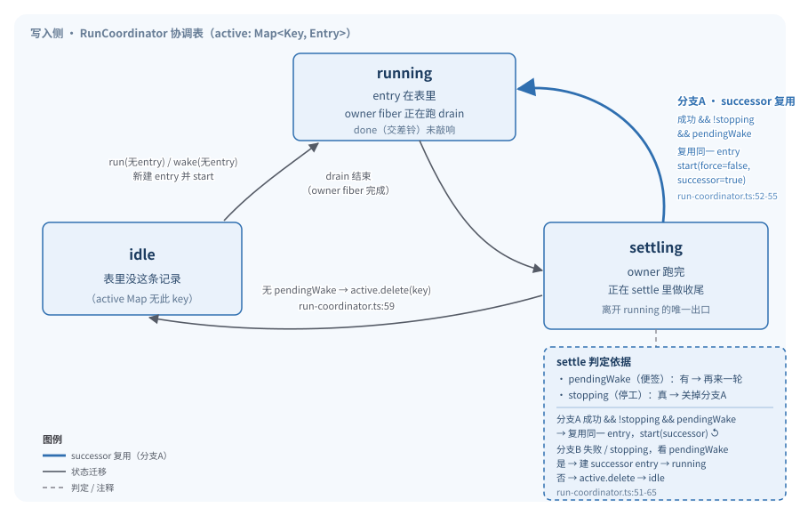

# 三、调度层（SessionExecution / RunCoordinator）

> 本文是对 README「六、调度层详解」的深入展开。README 讲了「是什么」，这里讲「怎么做到的、为什么这么设计」。

---

## 1. 概念模型：工位调度员

延续 README 的类比：把整个写入侧想象成一间车间，里面有一排**工位**，每个工位对应一个 session。账本和收件箱在车间外面（数据层），具体干活的人是 drain / runner（执行层）。**调度层就是车间门口那个调度员**——它自己不干活，只负责三件事：

1. **派活**（resume）：有人点名要某个工位开工，调度员要么新派一个人去，要么让他加入已经在干的那个人、一起等结果。
2. **提醒**（wake）：有人喊一嗓子「这个工位又来新活了」。调度员最多在当前工人桌上贴张便签，**喊完就走，不等**。
3. **叫停**（interrupt）：把某个工位上正在干的人停下来，**等他收拾干净**才交差。

调度员手里只有一张表：`工位 → 这工位现在谁在干`。它**不认识** runner、不认识 Location、不碰账本。它是个纯粹的「并发控制器」。

### 为什么是进程级单例，而不是 per-layer / per-location

车间里只能有一个调度员，否则两张表会对不上：A 表说工位空着、B 表说工位有人，结果派了两个人去同一个工位抢活。所以协调表必须**全局唯一**。

在代码里这一点体现在节点的注册方式：

- `execution.ts:23` 用 `LayerNode.unbound(Service, Node.tags.values.global)` 把 `SessionExecution.Service` 注册成**不绑 Layer 的全局节点**；
- `execution/local.ts:40` 的本地实现用 `makeGlobalNode(...)`（即 `app-node.ts:11` 的 `tags.make("global")`）注册，整个进程一份。

AGENTS.md 把这条约束总结为：**「Keep `SessionExecution` process-global and Session-ID based… no layer should take a Session ID.」** 这条留到第 9 节展开，它是为分布式留的关键缝。

### 两个角色：接口与实现

调度层对内对外分成两层：

| 角色 | 文件 | 职责 |
|---|---|---|
| **SessionExecution**（对外接口） | `execution.ts` | 定义 `Interface`（`active`/`resume`/`wake`/`interrupt` 四个动作）、`Service` 标签、`noopLayer`。不知道任何实现 |
| **RunCoordinator**（协调器，内部实现） | `run-coordinator.ts` | 那张 `Map<Key, Entry>` 表的全部逻辑。和 session 完全解耦，是个泛型 `<Key, E>` 工具 |
| **local.ts**（本地路由） | `execution/local.ts` | 把 `SessionExecution` 的四个动作接到 `RunCoordinator` 上，并在 drain 启动时按 **Location** 把活儿路由到正确的 runner |

注意协调器是**泛型**的（`run-coordinator.ts:24` 的 `make<Key, E>`）——它根本不知道「session」是什么，只认一个 key。session 语义是 `local.ts` 这一层加上去的（key = `SessionSchema.ID`，`local.ts:16`）。这种分层让协调器可测试、可复用，也让「换一个分布式协调器实现」成为可能（第 9 节）。

---

## 2. 根本原则：一个工位一个工人

调度员要保证的全部并发性质只有两条：

- **同一个 session，任意时刻最多只有一个 drain 在跑**（同 session 串行）；
- **不同 session 之间可以并行**（跨 session 并行）。

实现就是一张表（`run-coordinator.ts:28`）：

```ts
const active = new Map<Key, Entry<E>>()
```

**表的 key 是 session，value 是这条 session 当前的工作（Entry）**。所有动作的入口都先 `active.get(key)` 查表：

- 查到 → 说明这工位已经有人了，**绝不再开新人**：resume 选择「加入等待」（`run`，第 70-72 行），wake 选择「贴便签」（`wake`，第 83-86 行）。
- 查不到 → 说明工位空着，建一个新 Entry 放进表，派一个新 owner fiber 去跑 drain。

跨 session 的并行是免费的——Map 的不同 key 互不干扰，每个 key 各自的 owner fiber 各跑各的。

---

## 3. 三个动作的语义与可靠性差异

这是调度层最精巧的地方，先给结论，再讲为什么。

| 动作 | 入口语义 | 是否等结果 | 触发 drain 时的 `force` | 可靠性 |
|---|---|---|---|---|
| **resume**（`run`） | 「我要这个 session 跑起来，并且我要拿到结果」 | **是**，await `done` | `true`（`run-coordinator.ts:77`） | 重活，必须可靠 |
| **wake**（`wake`） | 「账本上多了条记录，提个醒」 | **否**，sync 立即返回 | `false`（`run-coordinator.ts:91`） | 轻活，可丢 |
| **interrupt**（`interrupt`） | 「把这个 session 当前的活停下来」 | 是，等清理完 | — | — |

### resume vs wake：为什么要有两套可靠性

**resume 是给「人在前端点了发送、需要确认跑起来了」的场景用的。** 它必须等：要么自己新派一个 drain 跑完，要么加入已有的 drain 等它跑完。而且它启动 drain 时 `force=true`——即使此刻收件箱恰好是空的，也**至少强制跑一个 provider turn**（见 `runner/llm.ts:389` 的 `if (!input.force && !hasSteer && !hasQueue) return`）。这保证了「点了发送」一定有可见的一次执行，不会因为「刚好被别人抢先排干了」而无声无息地空转。

**wake 是给「admit 刚往账本记了一条、顺手提醒一下」的场景用的。** 它的语义是「提个醒就完事」，**真正要不要干由干活的人自己扫账本决定**。所以：

- 已有人在干 → 只贴一张便签 `pendingWake = true`（`run-coordinator.ts:85`），不开新人，不等，立即返回。
- 没人在干 → 建个 entry、派个 drain（`force=false`），同样立即返回。

`force=false` 意味着这个 drain **会先扫收件箱，没活就立刻退出**（`llm.ts:389`）。于是 wake 天然是「可丢」的：

> 即使 wake 丢了一次、或者它派的 drain 扑了个空，都无所谓——**账本上的事实还在**，下一次任意一次 resume / wake / successor 都会重新扫收件箱，把该干的活捞起来。

这就是 README 第五节说的「先记账（admit，必须可靠）→ 再 wake（提醒，可丢失）」的全部原因：可靠性和执行解耦，记账担起可靠，执行担起吞吐。

### interrupt：协作式中断 + 等收尾

`interrupt`（`run-coordinator.ts:94-101`）做两件事：先立 `stopping=true` 并清掉 `pendingWake`，再 `Fiber.interrupt(owner)` 打断当前 owner fiber。它是**协作式**的——不直接砍进程，而是发中断信号，runner 内部会把「记了 `Tool.Called` 但没出结果」的脏工具调用统一收尾成失败（见 README 第六节）。闲着的时候（`entry?.owner === undefined`）interrupt 是 no-op。

---

## 4. Entry：调度员手里每条记录的样子

表里每个 value 是一个 `Entry`（`run-coordinator.ts:17-22`）：

```ts
type Entry<E> = {
  readonly done: Deferred.Deferred<void, E>
  owner?: Fiber.Fiber<void, never>
  pendingWake: boolean
  stopping: boolean
}
```

> **名词解释（Effect 术语）**
> - **Deferred**：Effect 里的一次性同步原语。一个格子，可以 `await`（没写入就一直阻塞）、可以 `done`（写入一个值/一个失败，唤醒所有等待者）。可以理解成一个 Promise 的 Effect 版，但能承载失败通道。`Deferred.makeUnsafe` 是不走 Effect 上下文、直接造一个的快捷构造。
> - **Fiber**：Effect 的轻量「绿色线程」，一段正在跑的 Effect。可以 `interrupt`（打断）、可以 `await`（等它结束）。`owner` 字段就是「这工位当前这个 drain 跑在哪个 fiber 上」。

四个字段的含义：

| 字段 | 类型 | 作用 |
|---|---|---|
| `done` | `Deferred<void, E>` | **这条 entry 的「交差铃」**。drain 跑完（无论成败）时由 `settle` 敲响它。所有 `resume` 的调用者都在 `await` 它（`run` 第 72、78 行），所以它决定了「加入等待的人什么时候能返回」 |
| `owner` | `Fiber<void, never>` \| undefined | 当前在跑 drain 的那个 fiber。`interrupt` 就是打断它（第 100 行）。注意错误通道是 `never`——owner fiber 自身永不「失败」，成败都被包成 `Exit` 交给 `settle` 处理（见第 5 节 `Effect.exit`） |
| `pendingWake` | `boolean` | **「便签」**。drain 跑的过程中又来了 wake，就把它置 `true`。多次 wake 只会把它置 `true`（幂等），这就是「合并唤醒」的物理载体。drain 跑完时 `settle` 会看它决定要不要再来一轮 |
| `stopping` | `boolean` | **「正在停工，别再派新活了」**。`interrupt` 置 `true`，防止「刚要停又被打断/又被 wake 塞便签」。settle 里但凡 `stopping` 为真，就不会再起 successor |

---

## 5. 核心方法逐一拆解

### 5.0 一张图：Entry 的状态流转



文字版（终端友好）：

```
                          run(无entry)/wake(无entry)
  ┌────────────┐     ──────────────────────────────►    ┌─────────────────┐
  │            │                                        │    running       │
  │  idle      │                                        │  entry 在表里    │
  │ (表里没这条)│   ◄──── settle: 无 pendingWake ───────  │  owner 跑 drain  │
  │            │           → active.delete(key)         │  done 未敲响     │
  └────────────┘             (run-coordinator.ts:59)    └────────┬────────┘
                                                           │ drain 结束
                                                           ▼
                                                   ┌───────────────┐
   ┌──── settle 分支A ────────────┐                │   settling    │
   │ 成功 && !stopping             │   ◄──────────│  (在 settle 里) │
   │ && pendingWake                 │               └──────┬────────┘
   │ → 复用 entry,start(force=false, │                      │
   │    successor=true) → 回 running │              ┌───────┴────────┐
   └────────────────────────────────┘              │ settle 分支B    │
          (run-coordinator.ts:52-55)                 │ 失败/stopping   │
                                                      │ pendingWake?    │
                                                      │ 是→建 successor │
                                                      │   entry→running │
                                                      │ 否→删表→idle    │
                                                      └────────────────┘
                                                  (run-coordinator.ts:51-65)
```

读这张图的关键：**settle 是 entry 离开 running 后的唯一出口**，它根据「成功/失败 × stopping × pendingWake」三种组合决定下一站。

### 5.1 `start`：派一个 owner fiber 去跑 drain

```ts
// run-coordinator.ts:37-49
const start = (key, entry, force, successor = false) => {
  const ready = Deferred.makeUnsafe<void>()
  const owner = fork(
    (successor ? Effect.yieldNow : Deferred.await(ready)).pipe(
      Effect.andThen(Effect.suspend(() => options.drain(key, force))),
      Effect.onExit((exit) => Effect.sync(() => settle(key, entry, exit))),
      Effect.exit,
      Effect.asVoid,
    ),
  )
  entry.owner = owner
  if (!successor) Deferred.doneUnsafe(ready, Effect.void)
}
```

一个 owner fiber 的生命周期是：**等一下 → 跑 `drain(key, force)` → 不管成败都触发 `settle`**。

- **`fork`**（第 29 行的 `FiberSet.makeRuntime` 产出的派生函数）：在当前 scope 下派生一个后台 fiber。这些 owner fiber 都挂在 coordinator 的 scope 上，scope 关闭时统一收尾。
- **`force`** 透传给 `drain`，决定了这次 drain 是「强制跑一轮」（resume，`force=true`）还是「有活才跑」（wake / successor，`force=false`）。
- **`successor`（第二个布尔参数）**：表示这次 start 是「settle 衔接出来的后续轮次」，而不是「首次派活」。区别只在开头的等待：首次派活 `await(ready)` 然后立即 `done(ready)`（等于马上开跑）；successor 用 `Effect.yieldNow` 先让出一拍再开跑。这一拍的作用是让 `settle`（本身是在 owner fiber 的 `onExit` 回调里同步跑的）把当前收尾栈 unwind 干净，新 drain 再真正介入，避免收尾逻辑和新 drain 抢占。
- **`Effect.suspend(() => drain(...))`**：`suspend` 把 effect 包进一个惰性 thunk——**每次 fiber 真正执行到这儿时才求值一次**，而不是构造 `start` 时就固定下来。这里用它是为了让 `drain` 在 owner fiber 实际跑起来时（尤其是 successor 那一拍 `yieldNow` 之后）才被求值，保证 `settle` 闭包捕获到的是「当下」的 drain。
- **`Effect.exit` + `Effect.asVoid`**：`Effect.exit` 把「可能失败的 effect」变成「一定成功、返回 `Exit`（成功/失败的盒子）的 effect」；`asVoid` 再把返回值丢掉。合起来的效果是：**owner fiber 自己永远不抛错**，drain 的成败被原封不动地包成 `Exit` 交给 `onExit → settle`。这就是 `Entry.owner` 类型是 `Fiber<void, never>`（没有错误通道）的原因。

### 5.2 `settle`：owner 跑完后的收尾

`settle` 是整个协调器最微妙的方法（`run-coordinator.ts:51-65`）。它在 owner fiber 的 `onExit` 里被调用，拿到 drain 的 `exit`，决定「这个工位接下来怎么办」。

```ts
const settle = (key, entry, exit) => {
  // 分支A：成功、没在停工、又贴了便签 → 复用同一条 entry，衔接一轮 successor
  if (Exit.isSuccess(exit) && !entry.stopping && entry.pendingWake) {
    entry.pendingWake = false
    start(key, entry, false, true)   // 注意：复用 entry，不删表、不敲 done
    return
  }

  // 分支B：其余情况
  const successor = entry.pendingWake ? makeEntry() : undefined
  if (successor === undefined) active.delete(key)   // 没便签 → 工位彻底空出
  else {
    active.set(key, successor)                        // 有便签但本轮回完了 → 换个新 entry 继续
    start(key, successor, false, true)
  }
  Deferred.doneUnsafe(entry.done, exit)              // 敲响旧 entry 的交差铃（成败透传）
}
```

两个分支的差别值得细看，因为它决定了「等结果的人会看到什么」：

- **分支A（复用 entry）**：drain 成功跑完、没在停工、但 `pendingWake` 为真。说明「这一轮干完了，但期间又来了新提醒」。此时**不敲 `done`、不换 entry**，直接在同一条 entry 上 `start` 一个 successor drain 继续跑。这意味着：所有 `resume` 的调用者（在 `await entry.done`）会**继续等下去**，直到 successor 也跑完、且没有新的 pendingWake，才最终拿到结果。这就是「resume 等他彻底干完」的精确含义——**等的是「合并唤醒全部消化完」的那一轮**。

- **分支B（换 entry 或删表）**：要么是失败/停工、要么是成功但没便签。
  - 成功且无便签 → `active.delete(key)`，工位彻底空闲，敲 `done`（成功），等待者拿到成功返回。
  - 失败/停工但还有 `pendingWake` → 造一个**全新的** successor entry 放进表、继续跑（`force=false`），同时敲响**旧** entry 的 `done`（带上这次失败的 exit）。这里的差别很关键：失败结果**立即**交给当时在等的 resume 调用者，而 successor 是一个独立的新轮次，新的调用者会去 await 那个新 entry。换句话说，「失败不让后来想 join 的人无限等」，失败的账算在当下这批等待者头上。

`interrupt` 在置 `stopping=true` 的同时清掉了 `pendingWake`（第 99 行）。这两手配合的效果要分两层看：

- **`stopping=true` 关掉了分支A**：即使 `pendingWake` 为真，分支A 的条件 `!entry.stopping` 也不成立，**被打断的这条 entry 永远不会复用自身衔接 successor**。
- **清掉 `pendingWake` 关掉了「已积压提醒」的延续**：被打断的 drain 结算时（`Fiber.interrupt` 让 exit 为失败），分支B 看到 `pendingWake=false`，于是 `active.delete(key)`，工位彻底空出。

一句话：**interrupt 保证的是「当前这条执行链被干净地停掉」**。需要注意一个细节——`wake`（第 85 行）置 `pendingWake=true` 时**并不检查 `stopping`**，所以 interrupt 之后、settle 之前若又来了一次 wake，它会重新把便签贴上；这条 entry 的分支A 仍被 `stopping` 挡住（走分支B），于是会**另起一个全新 entry** 跑 successor。这不是「被积压的便签复活了旧链」，而是「打断之后又来了全新的 durable 活儿，理应重新排干」——因为账本上确实新增了待办，调度员没有理由拒绝处理。

### 5.3 `run`：派活，要么新派要么加入

```ts
// run-coordinator.ts:67-79
const run = (key) =>
  Effect.uninterruptibleMask((restore) => {
    const entry = active.get(key)
    if (entry !== undefined) {                          // 工位有人
      if (entry.stopping)                               // 正在停工 → 等它停完，再重新派
        return restore(Deferred.await(entry.done).pipe(Effect.andThen(run(key))))
      return restore(Deferred.await(entry.done))        // 正常 → 加入等待（join）
    }
    const next = makeEntry()                            // 工位空 → 建新 entry
    active.set(key, next)
    start(key, next, true)                              // force=true
    return restore(Deferred.await(next.done))
  })
```

> **名词解释**：`uninterruptibleMask((restore) => ...)` 是 Effect 的「不可中断屏蔽」。它把整段标记成不可中断（外部 interrupt 打不进来），但你可以用 `restore` 把其中某一段「恢复成可中断」。这里用它的目的：让「查表 + 建表 + start」这一串是**原子**的（不会被别人中途插进来改表），但「等 `done`」这段恢复成可中断（让调用者自己能被取消）。这是消除竞态的标准手段。

`run` 的判定逻辑：

```
   run(key)  ── uninterruptibleMask ──┐
                                       ▼
                              active.get(key)?
                            ┌──────────┴──────────┐
                          有                     无
                            │                     │
                       stopping?             建 entry → 表
                       ┌──┴──┐               start(force=true)
                      是     否                  │
                       │     │                  │
                  await done  await done ◄──────┘
                       │     │            (等 done)
                       ▼     ▼
                  再 run(key)  返回       返回
```

三种情况：

1. **工位空**：建 entry，`start(force=true)`，自己 `await done`——你是这轮 drain 的「主发起人」。
2. **工位有人、正常运转**：直接 `await entry.done`——「加入」当前这轮。若这轮 drain 进了分支A 的 successor，你会一路等到 successor 也结算完（见 5.2）。
3. **工位有人、正在停工**：先 `await done`（等停工结束），再**递归 `run(key)`**。因为停工结算后表项会被删掉，递归回去就走「工位空」的分支，重新发起一轮。这保证 resume 不会被「恰好正在 interrupt」挡住。

### 5.4 `wake`：贴便签，纯 sync 不等

```ts
// run-coordinator.ts:81-92
const wake = (key) =>
  Effect.sync(() => {                    // 注意：纯同步，没有任何 await
    const entry = active.get(key)
    if (entry !== undefined) {
      entry.pendingWake = true           // 有人 → 贴便签（幂等：贴一万次还是一个 true）
      return
    }
    const next = makeEntry()             // 没人 → 建 entry 派个 drain
    active.set(key, next)
    start(key, next, false)              // force=false：有活才跑
  })
```

整个 `wake` 是 `Effect.sync`——**不阻塞、不等任何东西、立即可返回**。两条分支：

1. **工位有人**：置 `pendingWake = true`。这就是「便签」。多次 wake 幂等：便签只表达「至少有一条新活」，不需要记条数。
2. **工位空**：建 entry、`start(force=false)` 派个 drain。这个 drain 会先扫收件箱（`llm.ts:389`），有 steer/queue 才真跑，没活就立刻退出。

正因为 wake 是 sync、不等、`force=false`，它「可丢」的性质才成立——丢了不会丢数据（账本在），扑空了也无所谓（只是没跑一轮）。

### 5.5 `interrupt`：叫停，等收尾

```ts
// run-coordinator.ts:94-101
const interrupt = (key) =>
  Effect.suspend(() => {
    const entry = active.get(key)
    if (entry?.owner === undefined) return Effect.void   // 闲着 → no-op
    entry.stopping = true                                 // 立标志：别再派 successor
    entry.pendingWake = false                             // 清便签：积压的提醒作废
    return Fiber.interrupt(entry.owner)                   // 打断 owner fiber
  })
```

`stopping=true` + `pendingWake=false` 这一对是「干净停止」的关键：它让随后触发的 `settle` 必走分支B 且 `pendingWake` 为假，于是**删表、不起 successor**（见 5.2）。`Fiber.interrupt` 会把中断信号送给 owner fiber，runner 内部协作式收尾后 owner 才真正结束，`settle` 才会敲 `done`。所以「interrupt 等 cleanup」这件事，是靠 owner fiber 跑完它的 `onExit`/收尾逻辑、自然走到 `settle` 来兑现的。

---

## 6. successor 机制：为什么是「合并唤醒」而不是「重复启动」

这一节单独把 successor 拎出来讲，因为它是「同 session 串行 + 提醒不丢 + 不重复跑」三者同时成立的核心。

设想一个高压场景：drain 正在跑，期间 admit 连着记了 10 条新输入、wake 被调了 10 次。会发生什么？

```
drain 跑着……
  wake#1 → active.get 有 → pendingWake = true   （第 1 张便签）
  wake#2 → pendingWake = true                   （还是 true，幂等，等于没多干事）
  wake#3..#10 → pendingWake = true              （同上）
drain 跑完 → settle: 成功 && !stopping && pendingWake
           → 分支A：pendingWake 清回 false，复用 entry，start(successor)
successor drain 启动 → 进收件箱扫，把那 10 条 steer/queue 全捞出来逐个干
```

要点：

1. **10 次 wake 只产生 1 个 successor。** 因为便签是个 `boolean`，不计数。无论被 wake 多少次，drain 结算时最多触发一次「再来一轮」。
2. **successor 不会和原 drain 重叠。** successor 是在原 drain **完全结束之后**、于 `settle` 里才 `start` 的。任意时刻一个 session 的 owner fiber 只有一个（`entry.owner` 是单值）。这就是「一个工位一个工人」的物理保证。
3. **successor 也是「合并」的。** 它跑的 drain `force=false`，进去扫一遍收件箱——10 条输入作为一批一起被处理，而不是 10 个 drain 各跑各的。drain 的外层循环本来就是「排干整个收件箱」，所以一次 successor 就能把积压全清掉。

所以「successor」不是「重复启动」，而是**「把积压的提醒折叠成一次额外的排干」**。如果折叠之后又来了新提醒，便签再次置位，settle 会再起一个 successor——串行衔接，永不通胀，也永不丢活（账本是兜底）。

唯一会让 successor 消失的条件是 `stopping=true`（interrupt 清了便签）或 drain 失败（走分支B，失败结果交给当下等待者，新 successor 用新 entry 独立跑）。

---

## 7. Location 路由：从 sessionID 到正确的 runner

协调器只认 key（= sessionID），完全不知道「这活儿在哪儿跑」。把 key 翻译成「在哪个 Location、用哪个 runner 的服务层」是 `local.ts` 的活，而且**只在 drain 真正启动的那一刻才做**。

```ts
// execution/local.ts:16-29
const coordinator = yield* SessionRunCoordinator.make<SessionSchema.ID, SessionRunner.RunError>({
  drain: Effect.fnUntraced(function* (sessionID, force) {
    const session = yield* store.get(sessionID)                       // ① 拿 session 记录
    if (!session) return yield* Effect.die(`Session not found: ${sessionID}`)
    return yield* SessionRunner.Service.use((runner) =>
      runner.run({ sessionID, force }),                               // ② 调 runner
    ).pipe(
      Effect.provide(locations.get(session.location)),                // ③ 提供该 Location 的服务层
      Effect.tapCause((cause) =>
        Cause.hasInterruptsOnly(cause)
          ? Effect.void
          : Effect.logError("Failed to drain Session", cause)
              .pipe(Effect.annotateLogs({ sessionID })),
      ),
    )
  }),
})
```

路由四步：

> **名词解释**：`Effect.fnUntraced(function* (...) {...})` 是定义一个 Effect 函数的语法糖——和普通 `function*` 生成器写 effect 一样，但**关闭了 Effect 的运行时调用追踪**（不打点、不记栈），用于像 drain 这样的热路径以省开销。`Effect.tapCause` 则是「effect 跑出失败 cause 时附带执行一段副作用（这里用来打日志）」，不影响原本的成败。

1. **`store.get(sessionID)`**（`store.ts:35-38`）——从账本派生的 session 表里取这条 session 的信息，关键是拿到 `session.location`。
2. **`SessionRunner.Service.use(runner => runner.run(...))`**——从上下文里取出 runner 服务、执行一个 provider turn 序列。
3. **`Effect.provide(locations.get(session.location))`**——核心一步。`locations` 是 `LocationServiceMap`（`location-service-map.ts:7-14`），它是一个 `LayerMap<Location.Ref, LocationServices, LocationError>`：**Location 引用 → 那个 Location 的全套服务层（文件系统、工具执行、权限等）**。`locations.get(session.location)` 取出目标 Location 的那一层，`Effect.provide` 把它喂给 runner。于是这一轮 drain 里，runner 访问的文件系统、能用的工具，全部**限定在那个 Location 的环境里**。
4. **`Effect.tapCause`**——drain 失败时的日志策略：如果 cause 全是中断（`Cause.hasInterruptsOnly`，即被 interrupt 打断的），静默吞掉；其余情况打一条 `logError` 并标注 sessionID。这样 interrupt 的「预期内停止」不会污染日志。

### 为什么用 `Effect.provide(locations.get(...))`、而且每轮 drain 都做一次

- **协调器是按 sessionID 建表的，不是按 Location。** 一个进程内的协调器要同时管多个 Location 上的 session，构造时无法预先知道某条 session 归属哪个 Location。
- **Location 是 session 的属性、可能变化/被外部决定。** 唯一可靠的获知时机是「drain 启动、`store.get` 之时」。这就是 AGENTS.md 那句「discovers placement through `SessionStore` plus `LocationServiceMap.get(session.location)` **only when a drain starts**」的字面实现。
- **`provide` 是 Effect 的依赖注入。** runner 内部依赖的是「抽象的 Location 服务」（文件系统、工具、权限），`provide` 决定它具体落到哪一套实现上。每次 drain 动态 provide，意味着同一份 runner 代码能在不同 Location 上复用，Location 切换对 runner 透明。

### 三个 Service 的接线（local.ts:31-37）

```ts
return SessionExecution.Service.of({
  active: coordinator.active,
  interrupt: coordinator.interrupt,
  resume: coordinator.run,     // 注意：SessionExecution.resume → 协调器的 run
  wake: coordinator.wake,
})
```

对外接口和协调器方法只是**改名映射**：`SessionExecution.resume`（语义：要结果、可靠）对应协调器 `run`；`wake`/`interrupt`/`active` 名字一致。这一层没有任何逻辑，纯粹是把泛型协调器「特化」成 session 语义并接上 Location 路由。

---

## 8. noopLayer：只记账、不执行

`execution.ts:26-33` 提供了一个全 no-op 的 `SessionExecution` 实现：

```ts
export const noopLayer = Layer.succeed(
  SessionExecution.Service,
  Service.of({
    active: Effect.succeed(new Set()),
    resume: () => Effect.void,
    wake: () => Effect.void,
    interrupt: () => Effect.void,
  }),
)
```

注释写的是「Low-level compatibility layer for callers that only need durable Session recording」。

**用途**：有些场景只想要「durable 的 session 记录」（账本里有这条 session、能查、能投影），但**根本不打算执行**（不跑模型、不 drain）。比如导入历史 session、只读工具、测试夹具。这些场景下把 `SessionExecution` 提供成 `noopLayer`，所有动作都是空操作——admit 仍会可靠记账，但不会触发任何执行。

这体现了第 7 节那条「记账和执行分离」铁律的极致：**「有 session」和「执行 session」是两个可以独立打开/关闭的能力**，靠不同的 Service 实现来切换。

---

## 9. 为分布式留的路

调度层现在完全是单机进程内的：一张 `Map` 活在内存里，owner fiber 是本进程的绿色线程。但几个设计选择故意把它做成了「可替换的单点」：

1. **协调器是进程级全局单例、且按 sessionID 建表，不绑 Layer。** (`execution.ts:23`、`local.ts:40` 的 `global` 节点。) 这意味着「跨进程协调」实现可以整个替换掉 `local.ts`，对调用方（admit / 前端 / SDK）完全无感——`SessionExecution` 接口不变。AGENTS.md 原文：「**多机时把这一份换成『跨进程协调』实现，调用方无感。**」

2. **协调器是泛型 `<Key, E>`，session 语义在 local.ts 才注入。** 协调器逻辑（串行/并行/合并唤醒/收尾）和「session 是什么」完全解耦。理论上换个 key 语义、换个 drain 实现，协调器原样可用——分布式实现也只需要保证同样的不变量（同 key 串行、跨 key 并行、advisory wake）。

3. **Location 路由是「派活时才决定」的可插拔策略。** 协调器不认识 runner，只通过 `sessionID → store.get → session.location → LocationServiceMap.get` 这条链子在 drain 启动时发现「活该在哪跑」。`local.ts:10` 注释直说：「Current-process routing for implicit-local Locations. **Future remote placement belongs here.**」现在全是 implicit-local，未来在这同一个 drain 闭包里换成「把请求转发到远程节点的 runner」即可，协调器、账本、投影都不用动。

4. **wake 是 advisory（建议性）的。** 跨机发提醒天然会丢（网络分区、节点宕机），但 wake 的语义本就允许丢——账本才是事实来源，下一次任意节点扫到这条 session 的待办都会重新捞起。这种「最终一致」的提醒语义，正是分布式调度该有的样子，不需要在单机→分布式的迁移中重新设计。

5. **EventV2 的 owner claim 已经是分布式锁的雏形。** （呼应 README 第八节。）给某 session 的账本打「归某节点所有」的标记，未来配合跨进程协调器，就能防止两个节点同时 drain 同一个 session——单机阶段那张 `Map` 保证的「一个工位一个工人」，在多机阶段由 owner claim + 协调器共同保证。

> **一句话总结现状与未来**：单机已能跑、逻辑正确；扩到多机时，要换的只是 `local.ts` 这一层（协调器表 + Location 路由），drain / runner / 账本 / 投影 / 推送链路一律不动。

---

## 附：关键代码索引

| 关注点 | 位置 |
|---|---|
| 协调器接口（`active`/`run`/`wake`/`interrupt`） | `run-coordinator.ts:6-15` |
| Entry 结构（done/owner/pendingWake/stopping） | `run-coordinator.ts:17-22` |
| `active` 表 + `fork` 构造 | `run-coordinator.ts:28-29` |
| `start`（派 owner fiber、successor 模式） | `run-coordinator.ts:37-49` |
| `settle`（分支A 复用 / 分支B 换 entry 或删表） | `run-coordinator.ts:51-65` |
| `run`（resume：uninterruptibleMask + join/重派） | `run-coordinator.ts:67-79` |
| `wake`（advisory：贴便签或 force=false 派活） | `run-coordinator.ts:81-92` |
| `interrupt`（stopping + 清便签 + Fiber.interrupt） | `run-coordinator.ts:94-101` |
| SessionExecution 对外接口 | `execution.ts:9-18` |
| Service 标签 + 全局节点 | `execution.ts:21-23` |
| noopLayer（只记账不执行） | `execution.ts:26-33` |
| 本地实现：协调器构造 + drain 闭包 | `execution/local.ts:11-38` |
| Location 路由（store.get → locations.get → provide） | `execution/local.ts:17-26` |
| 接口↔协调器的改名映射 | `execution/local.ts:31-37` |
| SessionStore.get | `store.ts:35-38` |
| LocationServiceMap（Location → 服务层） | `location-service-map.ts:7-14` |
| runner 的 force 判定（有活才跑） | `runner/llm.ts:389` |
