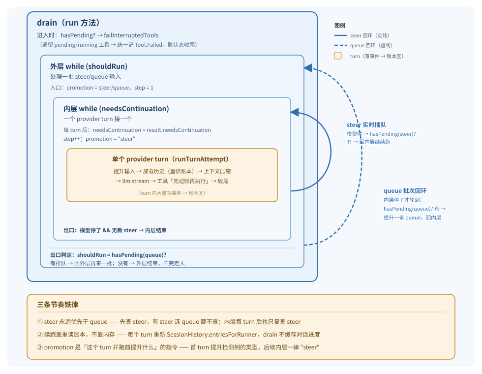

# 04 · 执行器 SessionRunner

> 调度员把人派到工位上，这个人就是 **SessionRunner**。它负责把收件箱排干（drain 循环）、一轮轮调模型（provider turn）、执行工具，并把每个动作都写回账本。这是 V2 里最长、最复杂的组件。

读完这篇，你应该能回答：runner 和 drain 是什么关系？一个 provider turn 内部从 `llm.stream` 到工具 settle 到底发生了什么？为什么工具要「先记账再执行」？上下文超长时它怎么自救？

---

## 一、概念模型：runner 就是「工人」，drain 是它的「工作循环」

### 一句话定位

> **SessionRunner 是被调度员派到某个 Location 工位上的工人；它的全部工作就是一个 drain 循环——把收件箱排干，排干就走人。**

代码上，「runner」和「drain」**不是两个组件，而是同一个东西的两层抽象**：

- `SessionRunner.Service.run(input)`（`packages/core/src/session/runner/llm.ts:383`）**就是** drain 循环。
- drain 循环内部反复调用 `runTurnAttempt`（`llm.ts:173`）跑一个个 provider turn。

README 的组件表把「drain 循环」和「SessionRunner」列成两行，是**概念上的分工**（外层排干 vs 单 turn 执行），代码上它们同属 `runner/llm.ts` 一个文件、一个 Service。这一点和 README 的措辞略有出入，后文会标出。

### 为什么它最长最复杂

一个 runner 同时要处理：

1. **两层嵌套循环**：外层吃 steer/queue 输入，内层一轮轮跑模型。
2. **流式 I/O**：`llm.stream` 是一条异步流，要把流事件边收边记账。
3. **并发工具执行**：一轮里模型可能并发抛出多个工具调用，要并发跑、统一等齐。
4. **崩溃可恢复**：每个动作都要落账，中断时要给遗留工具收尾。
5. **上下文自愈**：超长时自动压缩历史，压缩完重跑这个 turn。

下面分层拆开。

---

## 二、组件契约：Service 接口

runner 对外只暴露一个方法（`packages/core/src/session/runner/index.ts:20`）：

```ts
export interface Interface {
  readonly run: (input: {
    readonly sessionID: SessionSchema.ID
    readonly force: boolean
  }) => Effect.Effect<void, RunError>
}
```

- **`sessionID`**：要排干的工位（Session）。
- **`force`**：即使收件箱空，也强制跑一个 provider attempt。这是 `resume`（派活）和 `wake`（提醒）的差异在 runner 这一侧的落点——`resume` 走 `force: true`，即使没新输入也跑一次；`wake` 走 `force: false`，没活就直接退出。
- **返回 `void`**：drain 跑完即返回，没有「一次对话的结果」这种概念——结果早就在账本里了。

`RunError`（`index.ts:11`）是 runner 可能抛出的类型化错误集合：`LLMError`、模型解析错误、消息解码错误、系统上下文初始化被阻塞、工具输出存储错误。注意：**中断（interrupt）不是 error**，它走 Effect 的中断通道，由调度层处理。

`Service` 用 Effect 的 `Context.Service` 模式定义（`index.ts:28`），是一个带标识符 `@opencode/v2/SessionRunner` 的依赖注入服务。

> **术语**：`Context.Service` 是 Effect 的依赖注入模式——定义一个带唯一 ID 的服务接口，其他代码通过 `yield* Foo.Service` 拿到实现，实现由 `Layer` 在启动时绑定。

---

## 三、drain 外层循环：`run` 方法

`run`（`llm.ts:383-406`）是 runner 的入口，也就是 README 说的「drain 循环」。它不长，但浓缩了所有调度节奏。

### 执行流程

```
run(sessionID, force):
  1. hasPending(steer)?  ──有 steer 就别查 queue 了（steer 优先）
     否则 hasPending(queue)?
  2. 没 steer、没 queue、且非 force  →  直接 return（空手走人）
  3. failInterruptedTools(sessionID)  ──清理上次中断遗留的 pending/running 工具
  4. 选定第一个要提升的投递类型 promotion = steer ? "steer" : queue ? "queue" : undefined
  5. 进入两层 while 循环 ↓
```

### 两层循环的嵌套结构



文字版（终端友好）：

```
┌─ 外层 while (shouldRun)        ←  处理 steer/queue 的「一批输入」
│   promotion = 检测到的投递类型（steer / queue）
│   step = 1,  needsContinuation = true
│
│   ┌─ 内层 while (needsContinuation)   ←  一个 provider turn 接一个
│   │   runTurnAttempt(sessionID, promotion, step)
│   │   needsContinuation = result.needsContinuation
│   │   step = result.step + 1
│   │   promotion = "steer"          ←  本批后续每个 turn 都顺便提升新 steer
│   │   if 模型停了:
│   │       needsContinuation = hasPending(steer)?  ← 实时插队
│   └─ （模型停 + 没 steer → 内层结束）
│
│   shouldRun = hasPending(queue)?      ←  内层停了再看排队
│   promotion = shouldRun ? "queue" : undefined
└─ （没 queue → 外层结束，干完走人）
```

**对应代码**（`llm.ts:393-405`）：

```ts
while (shouldRun) {
  let needsContinuation = true
  let step = 1
  while (needsContinuation) {
    const result = yield* runTurn(input.sessionID, promotion, step)
    needsContinuation = result.needsContinuation
    step = result.step + 1
    promotion = "steer"
    if (!needsContinuation) needsContinuation = yield* SessionInput.hasPending(db, input.sessionID, "steer")
  }
  shouldRun = yield* SessionInput.hasPending(db, input.sessionID, "queue")
  promotion = shouldRun ? "queue" : undefined
}
```

### 关键节奏点

1. **steer 永远优先于 queue**（`llm.ts:387-388`）：先查 steer，有 steer 就连 queue 都不查。内层每个 turn 后也只复查 steer；queue 只在内层彻底停了才轮到。
2. **`promotion` 是「这一 turn 开跑前要提升什么」的指令**：第一个 turn 提升检测到的类型（steer 或 queue）；后续内层 turn 一律设成 `"steer"`（顺便捞新到的 steer）；外层新一轮第一条 queue 提升时设成 `"queue"`（同时也会捞 steer，见下文）。
3. **`failInterruptedTools`（`llm.ts:119-139`）**：drain 一开始就扫一遍投影历史，把所有 `pending`/`running` 状态的工具统一记一条 `Tool.Failed`。因为账本上若有 `Tool.Called` 却没结果，是脏状态——上次 drain 一定是被中断了。这是「协作式中断 + 状态收尾」在 runner 这一侧的体现。
4. **续跑靠重读账本，不靠内存**：每个 turn 都重新加载历史（见下文），drain 本身不缓存「对话进度」。

---

## 四、一个 turn 的完整流程：`runTurnAttempt`

这是 runner 的心脏（`llm.ts:173-348`）。每个 provider turn 走一遍这套流程。下面**逐段**拆开。

### 时序总览

```
 runTurnAttempt(sessionID, promotion, step, recoverOverflow?)
 │
 ├─ ① 校验 location（session 还在本机吗？）
 ├─ ② 选 agent + 初始化系统上下文（SessionContextEpoch）
 ├─ ③ 提升输入（promoteSteers / promoteNextQueued），提升则 step 重置为 1
 ├─ ④ 解析 model（SessionRunnerModel.resolve）
 ├─ ⑤ 加载历史（SessionHistory.entriesForRunner，从 baselineSeq 之后）
 ├─ ⑥ 构建 LLM request（system + messages + tools）
 ├─ ⑦ compactIfNeeded：超长 → 抛 ContinueAfterCompaction（自动压缩）
 ├─ ⑧ 捕快照 + 建 publisher
 ├─ ⑨ llm.stream(request) + Stream.runForEach  ─── 流式收事件 ───┐
 │       每个事件经 publisher 写账本                              │
 │       tool-call → 先记账 → FiberSet 并发启动本地工具           │
 ├─ ⑩ 流结束：                                                    │
 │       溢出压缩 recoverOverflow → 抛 ContinueAfterOverflowCompaction
 │       中断/失败 → failUnsettledTools / failAssistant           │
 │       awaitToolFibers：等所有工具 settle                        │
 ├─ ⑪ stepSettlement：写 Step.Ended（含 token、快照、文件 diff）    │
 └─ 返回 { needsContinuation, step }                              │
                                                                 │
 └───────────────────────────────────────────────────────────────┘
```

### ① location 校验（`llm.ts:179-181`）

```ts
const session = yield* getSession(sessionID)
if (session.location.directory !== location.directory || session.location.workspaceID !== location.workspaceID)
  return yield* Effect.interrupt
```

session 的 location 必须和本 runner 所在 location 一致，否则直接 `Effect.interrupt` 自我中断。这是防止「session 已经被迁到别的工位，本地的陈旧 runner 还在傻跑」。

> **术语**：`Effect.interrupt` 是 Effect 的中断信号——不报错，只是告诉运行时「我停了」。中断会向上传播，被调度层捕获。

### ② 选 agent + 系统上下文（`llm.ts:182-184`）

```ts
const agent = yield* agents.select(session.agent)
const initialized = yield* SessionContextEpoch.initialize(db, loadSystemContext(agent), session.id)
```

- `loadSystemContext`（`llm.ts:168-171`）并行加载三个东西：系统上下文注册表、技能指引（skill guidance）、引用指引（reference guidance），然后用 `SystemContext.combine` 合并。
- `SessionContextEpoch.initialize`（`context-epoch.ts:23`）只做**首次**初始化——如果这个 session 还没建立过上下文基线，就建一次；否则返回 `undefined`。基线是一次性算好的「系统提示 + 各类上下文」，存进 `SessionContextEpochTable`，后续 turn 复用。

### ③ 提升输入（`llm.ts:187-196`）

这是 steer/queue 语义在 runner 内部的落点：

```ts
if (promotion) {
  const cutoff = yield* EventV2.latestSequence(db, session.id)
  let promoted = 0
  if (promotion === "steer") promoted = yield* SessionInput.promoteSteers(db, events, session.id, cutoff)
  if (promotion === "queue") {
    promoted += Number(yield* SessionInput.promoteNextQueued(db, events, session.id))
    promoted += yield* SessionInput.promoteSteers(db, events, session.id, cutoff)
  }
  if (promoted > 0) currentStep = 1
}
```

要点：

- **`cutoff`** 是本 turn 开跑瞬间的账本序号。`promoteSteers` 只提升 `admitted_seq <= cutoff` 的 steer（`input.ts:245-266`），避免把「本 turn 流式过程中刚到的 steer」也算进来——那些留给下一 turn。
- **steer**：提升**所有**未提升的 steer（一批一起进）。
- **queue**：只提升**最早的一条** queued（`promoteNextQueued`，`input.ts:268`），同时顺手把 steer 也提了（steer 优先级始终更高）。
- **`if (promoted > 0) currentStep = 1`**：这就是 AGENTS.md 说的「**promoting any new user input resets the selected agent's provider-turn allowance; a batch of steers resets it once**」。一批 steer 一次性重置，不会每条重置一次。
- **提升 = 记 `Prompted` 事件**（`input.ts:225`）。提升后这些输入就从收件箱「晋升」成正式的 user message，会被投影进历史，下一轮加载历史时就看得见了。

### ④ 解析模型（`llm.ts:199`）

```ts
const model = yield* models.resolve(session)
```

`SessionRunnerModel.resolve`（`model.ts:188-213`）做的事：从 catalog 里找 session 指定的 provider/model（或默认模型），解析集成凭证，套上 variant，最终拼出一个 `@opencode-ai/llm` 的 `Model` 对象（带 route、auth、context 限制等）。失败抛 `ModelNotSelectedError` / `ModelUnavailableError` / `VariantUnavailableError` / `UnsupportedApiError`。

### ⑤ 加载历史（`llm.ts:200`）

```ts
const entries = yield* SessionHistory.entriesForRunner(db, session.id, system.baselineSeq)
const context = entries.map((entry) => entry.message)
```

这是「续跑前重读账本」铁律的落点。`entriesForRunner`（`history.ts:90-99`）做的事：

1. 取最近一条 `compaction` 消息的 seq（`latestCompaction`）。
2. 从 `messageRows` 查：compaction 之前的（含 compaction 那条）+ compaction 之后所有消息，但**系统消息只取 `baselineSeq` 之后的**（`history.ts:36-46`）。
3. 解码成 `SessionMessage.Message`，带 `seq` 返回。

**`baselineSeq` 的含义**（`context-epoch.ts`）：系统上下文基线建立那一刻的账本序号。基线之前产生的系统消息（`system` 类型）已经被「烘」进基线文本了，不再单独发给模型；基线之后的系统消息才作为独立消息保留。这就是为什么查历史时要按 `baselineSeq` 过滤 system 消息。

### ⑥ 构建 LLM request（`llm.ts:197-214`）

```ts
const system =
  initialized ?? (yield* SessionContextEpoch.prepare(db, events, loadSystemContext(agent), session.id))
...
const request = LLM.request({
  model,
  providerOptions: { openai: { promptCacheKey } },
  system: [agent.info?.system, system.baseline].filter(...).map(SystemPart.make),
  messages: [...toLLMMessages(context, model), ...(isLastStep ? [Message.assistant(MAX_STEPS_PROMPT)] : [])],
  tools: toolMaterialization?.definitions ?? [],
  toolChoice: isLastStep ? "none" : undefined,
})
```

- **system**：若 ② 里 `initialize` 已经建好基线就直接用；否则调 `prepare`（`context-epoch.ts:31`）做一次完整的对账——可能 reconcile 现有快照、可能 replace、可能 publish 一条 `ContextUpdated`。agent 自带的 system prompt 和基线文本拼在一起。
- **messages**：`toLLMMessages(context, model)`（`to-llm-message.ts:170`）把 V2 的 `SessionMessage` 翻译成 `@opencode-ai/llm` 的 `Message`。翻译规则里有几个细节：
  - **同模型才复用 reasoning 和 provider metadata**（`to-llm-message.ts:71-73`）。换模型后，reasoning 降级成普通 text，metadata 丢弃——因为不同 provider 的私有字段不通用。
  - **provider 托管的工具调用**（`provider.executed === true`）会把 call + result 合在 assistant 消息里；本地工具则拆成 assistant 的 call + 单独的 tool result 消息（`to-llm-message.ts:89-94, 101-107`）。
  - **compaction 消息**翻译成一条 user 消息，用 `<conversation-checkpoint>` 包裹摘要（`to-llm-message.ts:147-165`）。
- **`promptCacheKey`**：用 session ID 派生，帮 provider 命中 prompt 缓存。

### ⑦ 上下文压缩：自动压缩（`llm.ts:215-216`）

```ts
if (yield* compaction.compactIfNeeded({ sessionID: session.id, entries, model, request }))
  return yield* Effect.die(continueAfterCompaction(currentStep))
```

`compactIfNeeded`（`compaction.ts:225-236`）估算 `request` 的 token 数，若超过 `context - max(output, buffer)`，就调 `compactAfterOverflow` 跑一次摘要压缩。压缩成功就返回 `true`，这里用 **`Effect.die`** 抛一个 `TurnTransitionError`（`ContinueAfterCompaction`），**中止本 turn，让外层重跑**。

> **为什么用 `die` 而不是 `fail`？** 因为这是一个「控制流信号」，不是「错误」。普通 `fail` 会进入类型化错误通道，需要每个调用层都声明；`die` 抛的是 defect（非类型化异常），绕过错误通道，只被 `catchDefect` 捕获。这里用 defect 做「重跑本 turn」的跨层跳转，调用栈更干净。详见第六节。

### ⑧ 快照 + publisher（`llm.ts:217-230`）

```ts
const startSnapshot = yield* snapshots.capture()
const publisher = createLLMEventPublisher(events, { sessionID, agent, model, snapshot: startSnapshot })
const withPublication = Semaphore.makeUnsafe(1).withPermit
const publish = (event, outputPaths = []) => withPublication(publisher.publish(event, outputPaths))
```

- **`startSnapshot`**：本 turn 开始时的文件系统快照，用于结束时算 diff。
- **`publisher`**：把 LLM 流事件翻译成账本事件的「翻译官」（第五节详述）。
- **`Semaphore.makeUnsafe(1).withPermit`**：一个许可的信号量。`publish` 都要拿这个许可，保证**流事件处理和工具结果回写串行化**，避免流式并发写账本时乱序。

> **术语**：`Semaphore` 是信号量，`withPermit` 拿一个许可跑一段 Effect，跑完归还。这里许可数 = 1，相当于一把互斥锁。

### ⑨ 流式消费 + 工具启动（`llm.ts:232-275`）

这是「一个 turn 一次 `llm.stream`」铁律的落点：

```ts
const providerStream = llm.stream(request).pipe(
  Stream.runForEach((event) => Effect.gen(function* () {
    ...逐事件处理...
  })),
  Effect.ensuring(withPublication(publisher.flush())),
)
```

> **术语**：`Stream.runForEach` 是 Effect 的流式消费——每个元素跑一个 Effect，全部跑完流才结束。`Effect.ensuring` 给一段 Effect 加上「无论成败最后一定跑这段」的收尾（类似 try/finally）。

`runForEach` 内部对每个 LLM 事件的处理（`llm.ts:234-272`）：

1. **溢出短路**：若已经有 `overflowFailure` 或 provider 出过错，后续事件直接丢弃。
2. **识别溢出失败**：若收到 context-overflow 的 providerError 且 assistant 还没开始，先**暂存**（`overflowFailure = event`），不立即发布——留到 ⑩ 判断能不能靠压缩自救。
3. **`publish(event)`**：把事件交给 publisher 写账本（text-delta / reasoning-delta / tool-input / tool-call 等）。
4. **工具咬合**（关键，见第五节）：

```ts
if (event.type !== "tool-call" || event.providerExecuted) return
if (!toolMaterialization) {
  yield* withPublication(publisher.failUnsettledTools("Tools are disabled after the maximum agent steps"))
  return
}
needsContinuation = true
const assistantMessageID = yield* publisher.assistantMessageID(event.id)
yield* Effect.uninterruptibleMask((restore) =>
  restore(toolMaterialization.settle({ sessionID, agent, assistantMessageID, call: event }))
    .pipe(Effect.flatMap((settlement) => publish(LLMEvent.toolResult({...}), settlement.outputPaths ?? []))),
).pipe(FiberSet.run(toolFibers))
```

- **provider 托管的工具**（`event.providerExecuted`）跳过——结果由 provider 在流里返回，runner 不本地执行。
- **最后一步禁用工具**：`toolMaterialization` 为空时直接把该工具标失败。
- **`needsContinuation = true`**：只要有本地工具调用，这一 turn 结束后必须续下一 turn。
- **本地工具用 `FiberSet.run` 并发启动**（详见第五节）。

### ⑩ 流结束后的收尾（`llm.ts:277-347`）

整个收尾包在 `Effect.uninterruptibleMask` 里——**流结束后到工具 settle 完这段不可中断**，保证账本收尾完整。

> **术语**：`uninterruptibleMask` 把一段 Effect 标记为不可中断，它给一个 `restore` 函数，**被 restore 包裹的子段恢复可中断性**。这里用来：「整体不可中断地收尾，但等工具 fiber 时允许被 restore（这样外部中断能传进去）」。

收尾按顺序处理：

1. **溢出自救**（`llm.ts:283-288`）：若 assistant 没开始、是 overflow 失败、且 `recoverOverflow` 压缩成功 → 抛 `ContinueAfterOverflowCompaction`，让外层重跑。
2. **LLM 失败兜底**（`llm.ts:290-294`）：流式失败且 publisher 还没记 provider 错误 → `failUnsettledTools` + `failAssistant`。
3. **中断处理**（`llm.ts:295-310`）：流或工具 fiber 含中断 → `FiberSet.clear` + `failUnsettledTools`，必要时 `failAssistant("Provider turn interrupted")`。
4. **用户拒绝处理**（`llm.ts:297-301`）：若工具失败原因是 `PermissionV2.DeclinedError` 或 `QuestionV2.RejectedError`（`isUserDeclined`，`llm.ts:145-150`），清理后 `Effect.interrupt`——V1 兼容：用户拒绝直接停 loop，不变成给模型的 tool 输出。
5. **`awaitToolFibers`**（`llm.ts:296`）：等所有并发工具 fiber 结束。
6. **`Step.Ended`**（`llm.ts:316-337`）：若 publisher 收到了 stepSettlement 且没 provider 错误，算 `startSnapshot`→`endSnapshot` 的文件 diff，写一条 `Step.Ended`（含 finish reason、tokens、快照、文件列表）。

### ⑪ 返回（`llm.ts:345`）

```ts
return { needsContinuation: !publisher.hasProviderError() && needsContinuation, step: currentStep }
```

`needsContinuation` 由内层循环判断续不续；`step` 由外层 +1。

---

## 五、工具执行的咬合：「先记账再执行」

这是 V2 的第二条铁律在 runner 的落点，也是最精巧的部分。

### 为什么「先记账再执行」

模型说「我要调 `Read` 工具」时，runner **先把 `Tool.Called` 写进账本，再启动工具**。原因：

1. **崩溃可恢复**：记账后、执行前崩了，重启时 `failInterruptedTools` 会把它标成失败——不会出现「工具副作用已经发生，但账本没记录」的幽灵状态。
2. **可审计**：账本是唯一真理，工具调用必须先在真理上有据可查。
3. **可中断**：外部中断时，账本上有 `Tool.Called` 但没结果，收尾逻辑（`failUnsettledTools`）能干净收场。

### 咬合时序

```
 模型流式吐出一个 tool-call 事件
   │
   ├─ publisher.publish(tool-call)  →  写 Tool.Called 到账本（先记账！）
   ├─ needsContinuation = true
   │
   ├─ Effect.uninterruptibleMask:
   │     restore(settle(tool))         ←  执行工具（授权 → 跑 → 出结果）
   │       └─ 成功 → publish(toolResult)  ←  写 Tool.Success
   │     .pipe(FiberSet.run(toolFibers))  ←  丢进 fiber 集合，不等它，继续收下一个流事件
   │
   └─ （流继续，可能并发吐更多 tool-call，每个都这样处理）
         ↓
 流结束 → awaitToolFibers  ←  等所有 fiber settle
```

### 三个关键 Effect 工具

**`FiberSet`**（`llm.ts:184, 271`）：

> **术语**：`FiberSet` 是 Effect 提供的「fiber 集合」——你可以往里 `run` 多个并发 fiber（轻量线程），之后用 `join` / `awaitEmpty` 统一等齐，用 `clear` 取消全部。它自带资源管理，scope 结束自动清理。

这里每个本地工具调用都被 `FiberSet.run(toolFibers)` 丢进同一个集合，**eager 启动、并发跑**。runner 不阻塞等单个工具，而是继续消费流里的下一个事件——这样一轮里模型吐出的多个工具能真正并发执行。

**`Effect.uninterruptibleMask + restore`**（`llm.ts:250-271`）：

```ts
yield* Effect.uninterruptibleMask((restore) =>
  restore(toolMaterialization.settle({...})).pipe(
    Effect.flatMap((settlement) => publish(LLMEvent.toolResult({...}), ...)),
  ),
).pipe(FiberSet.run(toolFibers))
```

注意结构：**`uninterruptibleMask` 包住的是「settle + publish 结果」这一整段，但 settle 本身被 `restore` 恢复成可中断**。含义：

- 工具执行本身（`settle`）**可以**被外部中断打断。
- 但「执行完 → 立刻把结果写回账本」这一步**不可中断**——不会出现「工具跑完了，结果却没记账」的窗口。
- 整段又被 `FiberSet.run` 丢进并发集合，不阻塞流。

**`awaitToolFibers`**（`llm.ts:141-142`）：

```ts
const awaitToolFibers = (fibers) => Effect.raceFirst(FiberSet.join(fibers), FiberSet.awaitEmpty(fibers))
```

`raceFirst` 取**先完成**的那个：`join` 等 fiber 全部结束（含失败），`awaitEmpty` 等集合变空。两者其实都会等到所有 fiber 走完，race 是为了语义清晰。

### 失败收尾：`failUnsettledTools`

`publisher.failUnsettledTools(message)`（`publish-llm-event.ts:213-232`）遍历所有「已 Called 但未 settle」的工具，给每个记一条 `Tool.Failed`。它有三种调用场景（`llm.ts`）：

- 流正常结束但模型没给某个工具的 result（`llm.ts:341`，`hostedOnly=true` 只收尾托管工具）。
- 中断 / provider 失败（`llm.ts:299, 307, 314, 339`）。
- `failInterruptedTools`（drain 开头的遗留工具清理，走的是另一条直接 publish 的路径，`llm.ts:126`）。

---

## 六、续跑机制：`TurnTransition`

压缩是一个「改写历史」的操作——压缩完，之前的 request 失效了，必须**用压缩后的新历史重建 request、重跑这个 turn**。runner 用一个叫 `TurnTransition` 的 defect 机制实现这种「重跑」。

### 两种 transition（`llm.ts:152-156`）

```ts
type TurnTransition =
  | { readonly _tag: "ContinueAfterCompaction"; readonly step: number }
  | { readonly _tag: "ContinueAfterOverflowCompaction"; readonly step: number }
```

| 类型 | 触发点 | 含义 |
|---|---|---|
| `ContinueAfterCompaction` | `llm.ts:215`（⑦ 自动压缩） | turn 开跑前发现超长，**主动**压缩后重跑 |
| `ContinueAfterOverflowCompaction` | `llm.ts:286`（⑩ 溢出压缩） | turn 已经流式失败了（provider 报 overflow），**被动**压缩后重试 |

两者都靠 `Effect.die(new TurnTransitionError(...))` 抛出（`llm.ts:158-166`）。

### 捕获与重跑（`llm.ts:355-381`）

```ts
const runTurn: RunTurn = Effect.fnUntraced(function* (sessionID, promotion, step) {
  return yield* runTurnAttempt(sessionID, promotion, step, compaction.compactAfterOverflow).pipe(
    Effect.catchDefect(function* (defect) {
      if (!(defect instanceof TurnTransitionError)) return yield* Effect.die(defect)  // 真 defect，重新抛
      yield* Effect.yieldNow
      if (defect.transition._tag === "ContinueAfterOverflowCompaction")
        return yield* runAfterOverflowCompaction(sessionID, undefined, defect.transition.step)
      return yield* runTurn(sessionID, undefined, defect.transition.step)  // 递归重跑
    }),
  )
})
```

- **`Effect.catchDefect`** 捕获 `die` 抛出的 defect。
- 真 defect（非 TurnTransition）原样重抛（`Effect.die`），不吞错。
- `ContinueAfterCompaction` → 递归调 `runTurn`（还能再触发自动压缩或溢出压缩）。
- `ContinueAfterOverflowCompaction` → 调专用的 `runAfterOverflowCompaction`（`llm.ts:355-367`），它**不再带 `recoverOverflow`**，即溢出压缩后的重试**不允许再次溢出压缩**（`llm.ts:360-361` 显式 die）。防止「压缩→重跑→又溢出→又压缩」无限循环。

> **`Effect.yieldNow`**：主动让出一次执行权，避免递归重压调用栈，也给别人（如中断信号）插队机会。

### 自动压缩 vs 溢出压缩的区别

|  | 自动压缩 (`compactIfNeeded`) | 溢出压缩 (`compactAfterOverflow`) |
|---|---|---|
| 触发时机 | turn 开跑**前**，估算 token 超限 | turn 流式**失败后**，provider 明确报 overflow |
| 配置门控 | 受 `config.compaction.auto` 开关控制（`compaction.ts:226`） | 不受开关控制，只在 overflow 时被动触发 |
| 调用入口 | `runTurnAttempt` 直接调 | 通过 `recoverOverflow` 参数传入，仅失败收尾时调 |
| 重跑限制 | 可继续触发任意一种压缩 | 重跑时**禁用**溢出压缩（防递归） |

压缩本身（`compaction.ts:172-224`）做的事：用 `select` 把历史切成 `head`（要被摘要的旧部分）+ `recent`（保留的近期部分），调 `llm.stream` 跑一个摘要模型，生成新的 `compaction` 消息记进账本（`Compaction.Started` + `Compaction.Ended`）。下一次 `entriesForRunner` 加载历史时，`latestCompaction` 会拿到这条，旧消息就被摘要替代了。

---

## 七、provider turn 的三条铁律

这三条在 AGENTS.md 和 README 里反复强调，runner 是它们的执行者：

1. **一个 turn 恰好一次 `llm.stream(request)`**（`llm.ts:232`）。整个 `runForEach` 是这一次调用的消费；工具结果不是「在内存里 loop 喂回模型」，而是写账本后由**下一个 turn** 重新加载历史再调一次 `llm.stream`。
2. **续 turn 前重读 history**（`llm.ts:200`）。每个 `runTurnAttempt` 开头都重新 `SessionHistory.entriesForRunner`，不依赖内存里的「上轮状态」。
3. **不走内存 tool loop**。工具结果通过 `publish(toolResult)` 写账本 → 下个 turn 从账本投影读回来。这条和 1、2 是一体的：工具循环靠「turn 间重读账本」实现，而不是单个 turn 内部 loop。

`needsContinuation`（`llm.ts:248`）就是这套设计的信号量：只要有本地工具被调用，本 turn 结束时返回 `needsContinuation = true`，外层内层循环就会再开一个新 turn——新 turn 重新 `llm.stream`，把工具结果作为历史喂进去。

---

## 八、事件发布器：`createLLMEventPublisher`

`runTurnAttempt` 里 `llm.stream` 的每个事件都不直接写账本，而是先经过 `publisher`（`publish-llm-event.ts:54-423`）。它是「LLM 流方言 → 账本事件」的翻译官。

### 职责

- 把 `text-delta` / `reasoning-delta` / `tool-input` / `tool-call` / `tool-result` / `step-finish` / `provider-error` 等 LLM 流事件，翻译成对应的 `SessionEvent`（`Text.Delta`、`Tool.Called`、`Tool.Success`、`Step.Started`、`Step.Ended` 等）写账本。
- 维护一个 turn 内的**状态机**，保证事件有序、不重复、不遗漏。

### 状态机

publisher 内部维护（`publish-llm-event.ts:55-72`）：

| 状态 | 含义 |
|---|---|
| `assistantMessageID` | 本 turn 的 assistant 消息 ID，首个需要它的（text/tool/reasoning）事件触发 `startAssistant`，幂等 |
| `assistantActive` | assistant 步骤是否进行中（step-finish 后置 false） |
| `assistantFailed` | 是否已写过 `Step.Failed`（防重复） |
| `providerFailed` | provider 是否报过错（短路后续事件） |
| `stepSettlement` | step-finish 携带的 `{finish, tokens}`，用于结尾写 `Step.Ended` |
| `tools: Map<callID, {...}>` | 每个工具的状态：`inputEnded` / `called` / `settled` / `providerExecuted` / `providerMetadata` |

### 工具状态机（`publish-llm-event.ts:165-194, 313-394`）

一个工具调用经历：

```
tool-input-start  →  建 tool 条目（inputEnded=false, called=false, settled=false）+ Tool.Input.Started
  tool-input-delta →  累积输入片段 + Tool.Input.Delta
tool-input-end    →  inputEnded=true + Tool.Input.Ended
tool-call         →  called=true（记 providerExecuted/metadata）+ Tool.Called   ← 关键：先记账
  [本地执行 / provider 返回]
tool-result       →  settled=true + Tool.Success（或 error → Tool.Failed）
tool-error        →  settled=true + Tool.Failed
```

每一步都有**防御性校验**：input end before start、duplicate tool call、tool result before call、name changed 等都直接 `Effect.die`——流协议错了就硬失败，不写脏数据。

### fragment 累积（`publish-llm-event.ts:91-119`）

`text` / `reasoning` / `toolInput` 三类增量事件都用同一个 `fragments` 工厂：内部维护 `Map<id, string[]>`，`start` 建桶、`append` 追加、`end` 拼接后发一条 `Ended` 事件、`flush` 把所有未关的桶强制收尾。这样即使流中途断了，`flush` 也能把半截 text 落账。

### 三个 fail 方法

- **`failAssistant(message)`**（`publish-llm-event.ts:199-211`）：先 flush 所有 fragment，确保有 assistant 消息，写 `Step.Failed`，幂等。
- **`failUnsettledTools(message, hostedOnly)`**（`213-232`）：遍历所有未 settle 的工具写 `Tool.Failed`；`hostedOnly=true` 时只处理 provider 托管工具（用于「流正常结束但 provider 没给 result」的场景）。
- **`flush()`**（`195-197`）：强制收尾所有未关的 fragment 桶。

### 对外查询方法

publisher 还暴露几个只读查询给 runner 决策（`publish-llm-event.ts:416-421`）：`hasActiveAssistant`、`hasAssistantStarted`、`hasProviderError`、`stepSettlement`、`startAssistant`、`assistantMessageID`。runner 用它们判断「要不要自救压缩」「要不要写 Step.Ended」「要不要 fail」。

---

## 九、step 限制：`isLastStep`

agent 配置里有个可选的 `steps`（`llm.ts:202`）。runner 用它限制一个 drain 周期里 agent 能跑多少个 turn：

```ts
const isLastStep = agent.info?.steps !== undefined && currentStep >= agent.info.steps
const toolMaterialization = isLastStep ? undefined : yield* tools.materialize(agent.info?.permissions)
...
messages: [...toLLMMessages(context, model), ...(isLastStep ? [Message.assistant(MAX_STEPS_PROMPT)] : [])],
tools: toolMaterialization?.definitions ?? [],
toolChoice: isLastStep ? "none" : undefined,
```

最后一步时：

1. **不 materialize 工具**（`toolMaterialization = undefined`），`tools` 为空、`toolChoice = "none"`——模型从协议层就无法调工具。
2. **注入 `MAX_STEPS_PROMPT`**（`max-steps.ts`）作为 assistant 消息，强制模型「只总结、不调工具」。
3. 万一模型还是吐了 tool-call（违规），`runForEach` 里会 `failUnsettledTools("Tools are disabled after the maximum agent steps")`（`llm.ts:244-247`）。

注意：`currentStep` 在**提升新输入时会重置为 1**（`llm.ts:195`）。所以 step 限制是「这批用户输入允许跑几轮」，新输入一来就重新计数——这正是 AGENTS.md 说的 provider-turn allowance 语义。

---

## 十、支撑组件速览

| 组件 | 文件 | 作用 |
|---|---|---|
| `SessionRunnerModel` | `runner/model.ts` | 解析 session → catalog model → `@opencode-ai/llm` 的 `Model`（带 route、auth、limit）。处理 variant、集成凭证、provider 路由 |
| `toLLMMessages` | `runner/to-llm-message.ts` | V2 `SessionMessage` → `@opencode-ai/llm` `Message`。同模型才复用 reasoning/metadata；托管工具 call+result 合并；compaction 包成 checkpoint |
| `SessionHistory.entriesForRunner` | `session/history.ts:90` | 从账本投影加载历史，按 `baselineSeq` 过滤 system 消息，按最新 compaction 截断旧消息 |
| `SessionContextEpoch` | `session/context-epoch.ts` | 系统上下文基线管理：`initialize`（首次）/ `prepare`（对账）。`baselineSeq` 决定哪些 system 消息被烘进基线 |
| `SessionCompaction` | `session/compaction.ts` | 上下文压缩：`compactIfNeeded`（主动）/ `compactAfterOverflow`（被动）。切 head/recent、跑摘要模型、写 `Compaction.Started/Ended` |
| `createLLMEventPublisher` | `runner/publish-llm-event.ts` | LLM 流事件 → 账本事件翻译官，维护 turn 内状态机（见第八节） |

---

## 十一、和 README 对照

| README 描述 | runner 代码落点 | 一致性 |
|---|---|---|
| 五-5「drain 进工位 → 扫收件箱 → 有 steer/queue → 进入 turn 循环」 | `run` 的 `hasPending` + 两层 while（`llm.ts:387-405`） | 一致 |
| 五-6「调 llm.stream → 记 Tool.Called（先记账再执行）→ 执行 → 记 Tool.Success → 续下一轮」 | `runForEach` 内 publish(tool-call) 在 settle 前（`llm.ts:243-271`） | 一致 |
| 五-6「中途收件箱来新 steer → 接着跑」 | 内层循环 `promotion = "steer"` + 复查 `hasPending(steer)`（`llm.ts:400-401`） | 一致 |
| 六「drain 循环逻辑」伪代码 | `run` 两层 while（`llm.ts:393-405`） | 一致 |
| 六「续跑靠重新读账本，不靠内存状态」 | 每 turn `SessionHistory.entriesForRunner`（`llm.ts:200`） | 一致 |
| 六「steer 优先级高于 queue」 | `hasPending(steer)` 先查，有则不查 queue（`llm.ts:387-388`） | 一致 |
| 六「interrupt 后把没完成的工具标失败」 | `failInterruptedTools`（`llm.ts:119-139`）+ `failUnsettledTools`（收尾） | 一致 |

### 一处建议 README 厘清的措辞

README 三、组件表把「drain 循环」和「SessionRunner」列成**两行独立组件**：

> | drain 循环 | 被派到工位上的人。排干收件箱：内层一轮轮跑模型，外层处理排队的输入 |
> | SessionRunner | 一个 provider turn 的具体执行：调 llm.stream、调工具、把每个动作回写账本 |

这作为**概念分工**是对的，但代码上两者同属 `runner/llm.ts` 一个文件、一个 `Service`：`SessionRunner.run` **就是** drain 循环，`runTurnAttempt` 才是「一个 provider turn 的执行」。如果读者顺着组件表去找代码，会以为有两个组件；建议 README 加一句「代码上同属 `SessionRunner.Service`，drain 是它的 `run` 方法」。

---

## 附：两层循环 + turn 时序速查图

```
┌─────────────────────────── drain（run）───────────────────────────┐
│ hasPending? → failInterruptedTools                                 │
│ ┌─── 外层 while(shouldRun) ──── 处理一批 steer/queue 输入 ──────┐  │
│ │ promotion = steer/queue  step=1                               │  │
│ │ ┌── 内层 while(needsContinuation) ── 一个 provider turn ───┐ │  │
│ │ │   runTurnAttempt(promotion, step)                         │ │  │
│ │ │     ├ location 校验                                       │ │  │
│ │ │     ├ 提升输入（promoted>0 → step=1）                     │ │  │
│ │ │     ├ 加载历史（entriesForRunner）                        │ │  │
│ │ │     ├ compactIfNeeded → die(ContinueAfterCompaction) ─┐   │ │  │
│ │ │     ├ llm.stream ──┐                                  │   │ │  │
│ │ │     │              │ ⑨ 流式：                        │   │ │  │
│ │ │     │              │   publish(tool-call) 先记账     │   │ │  │
│ │ │     │              │   FiberSet.run(settle) 并发执行 │   │ │  │
│ │ │     │              │   publish(toolResult) 记结果    │   │ │  │
│ │ │     │              │ ⑩ 收尾：                        │   │ │  │
│ │ │     │              │   recoverOverflow → die(Over)─┐ │   │ │  │
│ │ │     │              │   awaitToolFibers            │ │   │ │  │
│ │ │     │              │   failUnsettledTools         │ │   │ │  │
│ │ │     │              │   Step.Ended                 │ │   │ │  │
│ │ │     │              │ ⑪ return {needsContinuation} │ │   │ │  │
│ │ │     │              └──────────────────────────────┘ │   │ │  │
│ │ │     │  promotion="steer"                            │   │ │  │
│ │ │     └─ 模型停 && 无新 steer → 内层结束              │   │ │  │
│ │ └─── hasPending(queue)? → 外层继续/结束 ───────────────┘   │ │  │
│ └──────────────────────────────────────────────────────────┘   │ │  │
└─────────────────────────────────────────────────────────────────┘ │  │
        catchDefect(TurnTransition) ←────────────────────────────────┘  │
        → 递归 runTurn / runAfterOverflowCompaction ───────────────────┘
```
