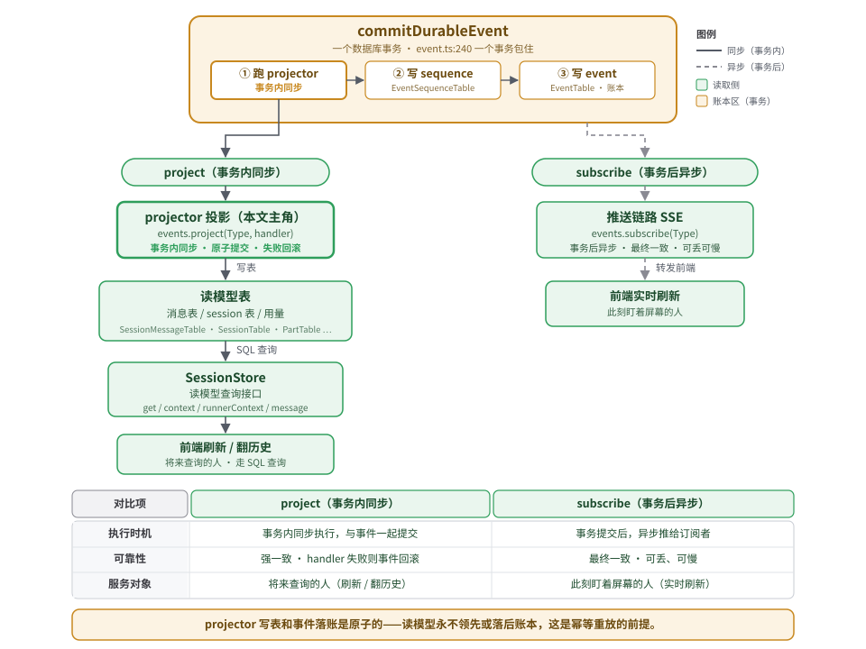

# 05 · 投影（projector）：把账本读成「现在的样子」

> 本文对应 README「四、架构图」右下角那块：`projector (订阅事件→写表)`。它和推送链路（右上角）共同构成读取侧。推送链路负责「此刻盯着屏幕的人」，projector 负责「将来查询的人」。

---

## 一、概念模型：projector 是「维护余额的人」

延续 README 的银行类比：账本是流水，余额是从流水算出来的。**projector 就是那个每来一条流水、就把余额重算一遍的角色。**

它维护的不是「余额」一个数，而是几张**读模型表**——消息表、session 表、用量统计。这些表你平时查询、刷新页面看到的历史，全是 projector 写出来的。

三个性质（与 README 术语表「投影」一致）：

| 性质 | 含义 | 在代码里的体现 |
|---|---|---|
| **派生的** | 输出完全由账本决定，同一份事件重放得到一模一样的结果 | projector.ts 里每个 handler 都是纯的「读旧值 + 写新值」，无外部状态 |
| **可丢弃的** | 读模型表坏了不慌，删掉重放账本即可重建 | projector 用 `events.project(...)` 注册，replay 时会原样再跑一遍 |
| **可进化的** | 改读模型形状不用动账本，写新 projector 重放即可 | `sessionRow` 函数把 `SessionInfo` 拆成扁平字段，改字段不碰事件 schema |

**一句话总结账本与读模型的关系：账本是真理，读模型是缓存。缓存丢了能重建，真理丢了才真出事。**

---

## 二、注册机制：project ≠ subscribe

projector 通过 `EventV2` 总线订阅事件。总线提供两种订阅方式，projector 用的是 `project`：

| 接口 | 语义 | 执行时机 | 可靠性 | 谁用 |
|---|---|---|---|---|
| `events.project(Type, handler)` | 注册投影 | **在账本提交事务内、同步执行**，与事件原子提交 | 强：handler 失败则事件回滚 | projector |
| `events.subscribe(Type)` | 返回事件流 | 事务提交**后**异步推给订阅者 | 最终一致：可丢、可慢 | 推送链路 SSE |

关键代码在 `packages/core/src/event.ts`。`commitDurableEvent` 把事件写进账本时，在**同一个数据库事务**里先跑完所有 projector，再 `insert` 事件：

```ts
// event.ts:240 一个事务包住：跑 projector → 写 sequence → 写 event
db.transaction(() => Effect.gen(function* () {
  ...
  for (const projector of list) {          // event.ts:320 事务内同步跑投影
    yield* projector(committed)
  }
  if (commit) yield* commit(seq)            // event.ts:323 同事务的本地副作用
  yield* db.insert(EventSequenceTable)...  // event.ts:324 写账本
  yield* db.insert(EventTable)...          // event.ts:336 写事件
}))
```

而 `project` 的注册本身只是往一个 `Map<type, Subscriber[]>` 里 push（`event.ts:615`）。

**所以 projector 的写表操作和事件落账是原子的**——要么事件和读模型一起更新成功，要么一起回滚。这保证了「读模型永远不会领先或落后账本」，是幂等重放的前提。

> 名词解释：`onConflictDoUpdate` / `onConflictDoNothing` 是 Drizzle（SQL 构造库）的 upsert 语义——主键冲突时「改为更新 / 啥也不做」。projector 大量用它实现幂等：同一条事件重放两次，结果还是一行。

> 名词解释：`DeepMutable<T>` 是把一个类型（含嵌套只读属性）整体变成可写版本的类型工具。`messageData`/`partData` 用它把 schema 编码出的只读对象转成表结构能接受的形状（`projector.ts:82`、`projector.ts:87`）。

---

## 三、投影的两类事件来源

projector.ts 的 `layer`（`projector.ts:211`）里挂了 30 多个 `events.project(...)`。这些事件分两套，因为系统正处在 **V1 → V2 迁移期**：

### A. V1 兼容事件（来自 `SessionV1.Event.*`）

| 事件 | 投影到 | 行号 |
|---|---|---|
| `SessionV1.Event.Created` | SessionTable insert | `projector.ts:215` |
| `SessionV1.Event.Updated` | SessionTable update | `projector.ts:235` |
| `SessionV1.Event.Deleted` | SessionTable delete | `projector.ts:259` |
| `SessionV1.Event.MessageUpdated` | MessageTable upsert | `projector.ts:262` |
| `SessionV1.Event.MessageRemoved` | MessageTable delete + 用量回扣 | `projector.ts:276` |
| `SessionV1.Event.PartUpdated` | PartTable upsert + 用量增量 | `projector.ts:312` |
| `SessionV1.Event.PartRemoved` | PartTable delete + 用量回扣 | `projector.ts:295` |

这些是旧 V1 系统仍在发的事件，投影到 V1 的 `MessageTable` / `PartTable`（见下文表结构）。

### B. V2 事件（来自 `SessionEvent.*`）

| 事件 | 投影到 | 行号 |
|---|---|---|
| `SessionEvent.Prompted` | SessionInputTable + SessionMessageTable | `projector.ts:350` |
| `SessionEvent.PromptAdmitted` | SessionInputTable | `projector.ts:364` |
| `SessionEvent.AgentSwitched` | SessionTable + SessionMessageTable | `projector.ts:331` |
| `SessionEvent.ModelSwitched` | SessionTable + SessionMessageTable | `projector.ts:339` |
| `SessionEvent.Moved` | SessionTable + 重置 context epoch | `projector.ts:243` |
| `SessionEvent.ContextUpdated` / `Synthetic` | SessionMessageTable | `projector.ts:377-378` |
| `SessionEvent.Shell.*` / `Step.*` / `Text.*` / `Tool.*` / `Reasoning.*` | SessionMessageTable（经 `run`） | `projector.ts:379-393` |
| `SessionEvent.Compaction.Ended` | SessionMessageTable | `projector.ts:395` |
| `SessionEvent.RevertEvent.Staged` / `Cleared` | SessionTable.revert 字段 | `projector.ts:396` / `407` |
| `SessionEvent.RevertEvent.Committed` | 删消息 + 删 input + 清 revert + 重置 epoch | `projector.ts:415` |

**为什么有两套？** V2 用新的 `SessionEvent.*` 协议记账（带 durable seq、可重放），但 V1 的事件总线、消息渲染、用量统计还在跑老协议。projector 同时订阅两套，把两套都翻译成读模型表，保证迁移期查询结果一致。等 V1 完全下线，A 类 handler 可以整段删掉——这就是「可进化」的体现。

---

## 四、session 表的投影

session 表（`SessionTable`，`sql.ts:22`）是每个会话的「档案卡 + 累计用量」。`sessionRow` 函数（`projector.ts:44`）负责把树状的 `SessionV1.SessionInfo` 拆成扁平字段：

```
info.cost              → SessionTable.cost
info.tokens.input      → tokens_input
info.tokens.output     → tokens_output
info.tokens.reasoning  → tokens_reasoning
info.tokens.cache.*    → tokens_cache_read / tokens_cache_write
info.time.*            → time_created / time_updated / time_compacting / time_archived
info.share?.url        → share_url
info.summary.*         → summary_additions / deletions / files / diffs
info.revert            → revert（JSON）
info.permission        → permission（JSON）
```

> 注意 `info.tokens` 是嵌套对象，表里拍平成 5 个 `tokens_*` 列。这是 SQL 习惯——查询单列比解 JSON 快。

三类事件对应三个动作：

- **Created**（`projector.ts:215`）：`insert ... onConflictDoNothing`。如果返回空（说明行已存在），直接 `Effect.die(SessionAlreadyProjected)`——创建事件重复投影视为致命错误，不静默吞掉。附带更新 `WorkspaceTable.time_used`（若 session 归属某 workspace）。
- **Updated**（`projector.ts:235`）：整行覆盖 `set(sessionRow(info))`。注意 V1 的 Updated 是「全量覆盖」，不是增量。
- **Deleted**（`projector.ts:259`）：`delete from SessionTable`。子表靠外键 `onDelete: cascade`（`sql.ts:74`、`sql.ts:126`）自动级联清空。

`Moved`（`projector.ts:243`）单独处理：只更新 `directory` / `path` / `workspace_id` 三个字段，然后调 `SessionContextEpoch.reset`（`context-epoch.ts:111`）清掉上下文快照——因为工作目录变了，之前缓存的系统上下文作废，下次跑模型要重算。

读回时用 `fromRow`（`info.ts:14`）做反向拼装，把扁平字段重新组合成 `SessionSchema.Info`（含嵌套的 `tokens`、`location`、`time`）。

---

## 五、用量累加 `applyUsage`（重点）

session 表里的 `cost` / `tokens_*` 不是「当前 turn 的用量」，而是**全 session 累计用量**。累计靠 `applyUsage`（`projector.ts:90`）做增量 SQL：

```ts
// projector.ts:96 增量加减：sign=1 加，sign=-1 减
db.update(SessionTable).set({
  cost:               sql`${SessionTable.cost} + ${value.cost * sign}`,
  tokens_input:       sql`${SessionTable.tokens_input} + ${value.tokens.input * sign}`,
  ...
}).where(eq(SessionTable.id, sessionID))
```

用量数据藏在 `step-finish` 类型的 part 里（`projector.ts:36` 的 `usage()` 函数从 part 里抠出 `cost`/`tokens`）。**增量更新的核心规则是「先减旧值、再加新值」**，保证 part 内容变化时累计值不偏：

| 触发事件 | 动作 | 行号 |
|---|---|---|
| `PartUpdated` | 先读旧 part 的 usage（如有）→ `-1` 减掉；再算新 part 的 usage（如有）→ `+1` 加上 | `projector.ts:325-328` |
| `MessageRemoved` | 遍历该 message 下所有 part，逐个 `-1` 减掉 usage | `projector.ts:284-287` |
| `PartRemoved` | 读这一 part 的 usage → `-1` 减掉 | `projector.ts:303-304` |

**为什么 PartUpdated 要先减后加？** 一个 step-finish part 在流式过程中可能被多次更新（模型逐步返回 token 数），每次更新都带「这一步的完整用量」。如果直接覆盖表里的 part 行而不调累计值，session 表的累计就会停在第一次的值；如果直接加新值，又会重复累加。正确做法是：把上一次的贡献撤掉、把这次的贡献加上——这是事件溯源里处理「可变投影」的标准手法。

---

## 六、消息投影：`run` + `SessionMessageUpdater`

V2 的会话内容事件（Shell/Step/Text/Tool/Reasoning）不直接写表，而是统一走 `run(db, event)`（`projector.ts:112`）。`run` 做三件事：

1. 构造一个 `Adapter`（`projector.ts:133`）——这是 projector 和消息状态之间的**读写接口**。
2. 调 `SessionMessageUpdater.update(adapter, event)`（`message-updater.ts:78`）。
3. updater 根据 `event.type` 决定是「追加新消息」还是「修改已有消息」，通过 adapter 落到 `SessionMessageTable`。

### Adapter 的几个方法

| 方法 | 作用 | 实现要点（`projector.ts`） |
|---|---|---|
| `getCurrentAssistant()` | 找当前最新的、**未完成**的 assistant 消息 | `:134` 按 `seq desc` 取第一条 assistant 行，且 `time.completed` 为空才返回 |
| `getAssistant(messageID)` | 按消息 ID 精确取 assistant | `:152` 主键 + session 双条件查询 |
| `getCurrentShell(callID)` | 按 `callID` 找最新的 shell 消息 | `:171` 取该 session 所有 shell 行按 `seq desc`，`find` 第一个 callID 匹配的 |
| `updateAssistant` / `updateShell` | 更新已有行 | `:185-186` 复用 `updateMessage`，按 id + session_id 更新 |
| `appendMessage` | 插入新行 | `:132` → `insertMessage`（`:193`），把 `event.durable.seq` 写进 `seq` 列 |

### 为什么「最新 turn 取代旧的未完成行」

看 `Step.Started` 的处理（`message-updater.ts:186`）：先 `getCurrentAssistant()`，如果有且未完成，**给它盖上 `time.completed`**（强制收尾），再 `appendMessage` 一条全新的 assistant。

`getCurrentAssistant` 的实现里有句关键注释（`projector.ts:136`）：

> A newer turn supersedes stale incomplete rows; never resume an older assistant projection.

意思是：如果上一轮 assistant 因为崩溃等原因没写 `Step.Ended`，留下一条「悬空」的未完成行，**新的一轮不会去续写它，而是把它标记完成、另起一行**。这样读模型里永远只有一条「进行中」的 assistant，历史里的半截 assistant 也被干净收尾，不会污染下一轮。

`seq` 列（`sql.ts:128`）是这个机制的基础——每条消息带账本序号，`order by seq desc` 就能稳定拿到「最新」的那条。

---

## 七、Prompted / PromptAdmitted 的投影

这两个事件既投影读模型、又投影收件箱，是 admit→drain 链条的读侧落点（详细机制见 02 文档）。

- **`PromptAdmitted`**（`projector.ts:364`）：调 `SessionInput.projectAdmitted`（`input.ts:83`），往 `SessionInputTable` 插一条，记下 `admitted_seq`。此时 `promoted_seq` 为空——「已收件、还没提升为正式消息」。
- **`Prompted`**（`projector.ts:350`）：两步。先 `SessionInput.projectPrompted`（`input.ts:118`）把对应 input 行的 `promoted_seq` 填上；再 `run(db, event)` 往 `SessionMessageTable` 插一条 `user` 消息（`message-updater.ts:126`）——至此用户输入在消息历史里可见。

projector 在这里只是「触发器」，真正的 inbox 状态机逻辑在 `SessionInput` 里，本文不展开。

---

## 八、Revert 的投影（重点，逻辑最复杂）

Revert（回滚）是 V2 里唯一会**删除已投影数据**的操作。它有三个事件，投影动作各异：

### 1. `RevertEvent.Staged`（`projector.ts:396`）——「准备回滚」

只更新 `SessionTable.revert` 字段为一个 JSON 对象（含目标 messageID、files 等）。**不动任何消息**。这是 UI 上显示「待提交的回滚」的状态来源。

### 2. `RevertEvent.Cleared`（`projector.ts:407`）——「取消回滚」

把 `revert` 字段置 `null`。同样不动消息。

### 3. `RevertEvent.Committed`（`projector.ts:415`）——「真正回滚」

这是读模型的「物理删除」时刻，四步走：

```ts
// projector.ts:417 ① 找边界消息的 seq
const boundary = yield* db.select({ seq }).from(SessionMessageTable)
  .where(eq(session_id) && eq(id, event.data.messageID)).get()
if (!boundary) Effect.die("Revert boundary message not found")

// projector.ts:429 ② 删掉 seq 大于边界的所有消息
db.delete(SessionMessageTable).where(session_id && gt(seq, boundary.seq))

// projector.ts:436 ③ 删掉边界之后准入/提升的 input
db.delete(SessionInputTable).where(
  session_id && (gt(admitted_seq, boundary.seq) || gt(promoted_seq, boundary.seq))
)

// projector.ts:446 ④ 清掉 revert 字段
db.update(SessionTable).set({ revert: null })

// projector.ts:452 ⑤ 重置 context epoch（工作目录内容可能已变）
SessionContextEpoch.reset(db, sessionID)
```

**回滚的语义**：以「边界消息」为界，把它之后产生的所有读模型产物——消息、用户输入、上下文快照——全部抹掉，让读模型回到边界那一刻的样子。注意它抹的是**读模型**，账本本身依然是 append-only（回滚这件事本身也是一条事件）。所以 revert 是「读模型层面的时间旅行」，不是「账本层面的撤销」。

> 重置 `SessionContextEpoch` 是因为 revert 通常伴随文件系统还原（`files` 字段），系统上下文快照失效，必须重新计算。和 `Moved` 事件的处理一致。

---

## 九、读模型表结构总览

projector 写的所有表都在 `packages/core/src/session/sql.ts`：

| 表 | 职责 | 关键列 | 定义 |
|---|---|---|---|
| `SessionTable` | 会话档案 + 累计用量 + revert 状态 | `cost`、`tokens_*`、`revert`（JSON）、`agent`、`model` | `sql.ts:22` |
| `SessionMessageTable` | **V2 消息**（user/assistant/shell/tool/system/compaction 等） | `seq`（账本序号）、`type`、`data`（JSON） | `sql.ts:119` |
| `MessageTable` | **V1 兼容消息**（旧协议） | `data`（JSON） | `sql.ts:68` |
| `PartTable` | **V1 兼容 part**（消息内的片段，含 step-finish 用量） | `message_id`、`data` | `sql.ts:82` |
| `SessionInputTable` | 收件箱（已准入的用户输入） | `admitted_seq`、`promoted_seq`、`delivery` | `sql.ts:140` |
| `SessionContextEpochTable` | 系统上下文快照 + baseline 序号 | `baseline_seq`、`snapshot` | `sql.ts:168` |

**`SessionMessageTable` vs `MessageTable`/`PartTable` 的关系**：

- V2 把一条 assistant 消息（含 text/tool/reasoning 多个 content 项）整体序列化成一个 JSON 存进 `SessionMessageTable.data`，查询时一条行 = 一条消息。
- V1 把消息和 part 分开存（`MessageTable` + `PartTable`，一对多），用量统计依赖 part 粒度。
- 两套并存是迁移期产物。V2 的 `run` 只写 `SessionMessageTable`；V1 的 handler 写 `MessageTable`/`PartTable` 并维护 `SessionTable` 的累计用量。

`SessionMessageTable.seq` 有唯一索引（`sql.ts:133` `session_message_session_seq_idx`），保证一个 session 内序号不重复——这是 revert 按 seq 删消息、history 按 seq 排序的基础。

---

## 十、SessionStore：读模型的查询接口

投影写表是为了被查。查询入口是 `SessionStore`（`store.ts:14` 的 `Interface`），四个方法：

| 方法 | 作用 | 实现 |
|---|---|---|
| `get(sessionID)` | 取 session 档案 | `store.ts:35` 读 `SessionTable` → `fromRow` |
| `context(sessionID)` | 取完整消息历史（前端翻历史用） | `store.ts:39` → `SessionHistory.load`（`history.ts:66`） |
| `runnerContext(sessionID, baselineSeq)` | 取 runner 用的历史（带 baselineSeq 过滤） | `store.ts:42` → `SessionHistory.loadForRunner`（`history.ts:82`） |
| `message(messageID)` | 取单条消息 | `store.ts:45` 读 `SessionMessageTable` |

### `runnerContext` 和 `baselineSeq` 是什么

`baselineSeq` 来自 `SessionContextEpochTable.baseline_seq`——它标记「系统上下文快照是在哪条事件之后建的」。runner 跑模型前调 `runnerContext(sessionID, baselineSeq)`，`SessionHistory.loadForRunner`（`history.ts:82`）→ `messageRows`（`history.ts:24`）会按它过滤：

```ts
// history.ts:44 baselineSeq 之后的 system 消息才纳入；非 system 消息不受限
baselineSeq === undefined ? undefined
  : or(ne(type, "system"), gt(seq, baselineSeq))
```

**用途**：系统上下文（system message）是「快照式」的——epoch 建立时已经把当时的系统上下文冻结进 `snapshot` 字段，runner 自己会注入。所以 history 里**只取 baselineSeq 之后的 system 消息**，避免把过期的系统消息重复喂给模型。非 system 消息（user/assistant/tool...）则全部保留，因为它们是对话本体。

`context`（无参版，给前端用）和 `runnerContext` 的区别就在这：前端要看到所有 system 消息（完整历史），runner 要剔除已被快照覆盖的 system 消息（避免重复）。两者都遵守「最近一次 compaction 之后」的窗口规则（`history.ts:36` 的 `gte(seq, compaction.seq)`）。

---

## 十一、全量事件投影对照表

下表把 `projector.ts` 里所有 `events.project(...)` 列全，是本文的速查索引。「影响的表」标注读模型落点：

### V1 兼容事件

| 事件 | 投影动作 | 影响的表 | 行号 |
|---|---|---|---|
| `SessionV1.Event.Created` | insert（冲突即 die）+ 更新 workspace 时间 | SessionTable, WorkspaceTable | `:215` |
| `SessionV1.Event.Updated` | 全量 update | SessionTable | `:235` |
| `SessionV1.Event.Deleted` | delete（级联清子表） | SessionTable | `:259` |
| `SessionV1.Event.MessageUpdated` | upsert | MessageTable | `:262` |
| `SessionV1.Event.MessageRemoved` | 删 part 用量回扣 + delete | MessageTable, SessionTable(用量) | `:276` |
| `SessionV1.Event.PartUpdated` | upsert + 用量「先减旧再加新」 | PartTable, SessionTable(用量) | `:312` |
| `SessionV1.Event.PartRemoved` | 用量回扣 + delete | PartTable, SessionTable(用量) | `:295` |

### V2 事件

| 事件 | 投影动作 | 影响的表 | 行号 |
|---|---|---|---|
| `SessionEvent.Moved` | 更新目录 + 重置 epoch | SessionTable, SessionContextEpochTable | `:243` |
| `SessionEvent.AgentSwitched` | 更新 agent + append 消息 | SessionTable, SessionMessageTable | `:331` |
| `SessionEvent.ModelSwitched` | 更新 model + append 消息 | SessionTable, SessionMessageTable | `:339` |
| `SessionEvent.PromptAdmitted` | insert input（记 admitted_seq） | SessionInputTable | `:364` |
| `SessionEvent.Prompted` | 填 promoted_seq + append user 消息 | SessionInputTable, SessionMessageTable | `:350` |
| `SessionEvent.ContextUpdated` | append system 消息 | SessionMessageTable | `:377` |
| `SessionEvent.Synthetic` | append synthetic 消息 | SessionMessageTable | `:378` |
| `SessionEvent.Shell.Started` / `Ended` | append / 更新 shell 消息 | SessionMessageTable | `:379-380` |
| `SessionEvent.Step.Started` / `Ended` / `Failed` | 收尾旧 assistant + append / 更新 | SessionMessageTable | `:381-383` |
| `SessionEvent.Text.Started` / `Ended` | append text content 到 assistant | SessionMessageTable | `:384-385` |
| `SessionEvent.Tool.Input.*` / `Called` / `Progress` / `Success` / `Failed` | 更新 assistant 内的 tool content | SessionMessageTable | `:386-391` |
| `SessionEvent.Reasoning.Started` / `Ended` | append reasoning content | SessionMessageTable | `:392-393` |
| `SessionEvent.Compaction.Ended` | append compaction 消息 | SessionMessageTable | `:395` |
| `SessionEvent.RevertEvent.Staged` | 写 revert 字段 | SessionTable | `:396` |
| `SessionEvent.RevertEvent.Cleared` | 清 revert 字段 | SessionTable | `:407` |
| `SessionEvent.RevertEvent.Committed` | 删消息 + 删 input + 清 revert + 重置 epoch | SessionMessageTable, SessionInputTable, SessionTable, SessionContextEpochTable | `:415` |

> 注：`SessionEvent.Retried`（`projector.ts:394`）的投影被注释掉了，目前不落读模型。

---

## 十二、一图回顾 projector 的位置



文字版（终端友好）：

```
                     事件账本 (EventV2 总线)
                            │
            ┌───────────────┼────────────────┐
            │ project (事务内同步)            │ subscribe (事务后异步)
            ▼                                ▼
     ┌─────────────┐                  ┌──────────────┐
     │  projector   │                  │  推送链路 SSE │
     │  (本文主角)   │                  │  (转发前端)   │
     └──────┬──────┘                  └──────────────┘
            │ 写表
            ▼
   读模型表 (SessionTable / SessionMessageTable / MessageTable / PartTable
            / SessionInputTable / SessionContextEpochTable)
            ▲
            │ SQL 查询
     ┌──────┴──────┐
     │ SessionStore │ ← get / context / runnerContext / message
     └─────────────┘
            ▲
            │
        前端 / runner（reload 历史）
```

projector 把「账本上的事件流」翻译成「表里的当前状态」。它和账本之间是**单向、派生、可重建**的关系——这正是 V2「账本是唯一真理，读模型是缓存」这条铁律在代码里的落点。
