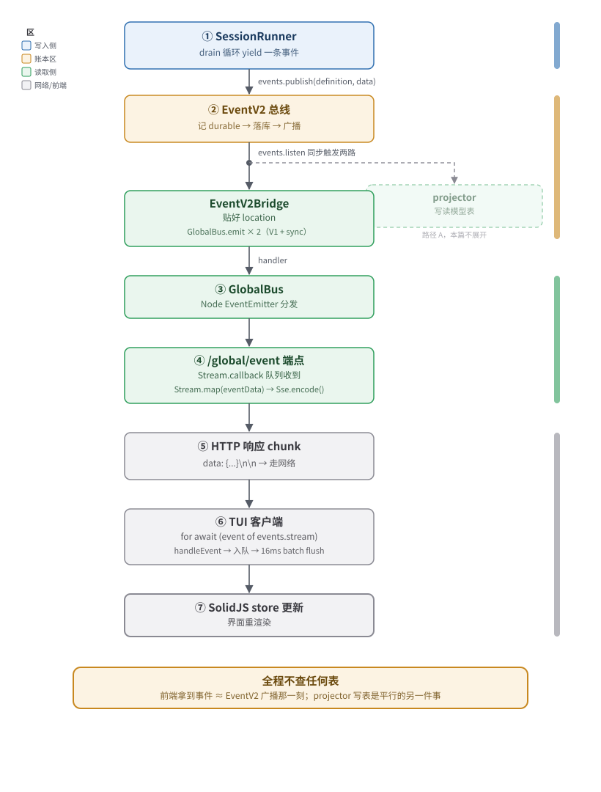

# 推送链路 SSE：把账本事件实时转发给前端

> 这是读取侧的另一条支线。和 projector（写读模型表）是**平行的两个消费者**，都订账本，互不通信。本篇讲清楚事件如何从服务端推到前端浏览器/TUI，让界面实时动起来。

---

## 一、概念模型：「存」与「看」是两件事

回到 README 第三节那张表，读取侧有两个组件：

| 组件 | 职责 | 服务对象 |
|---|---|---|
| **projector** | 订阅事件 → **写读模型表** | 将来要查询的人（刷新页面、翻历史） |
| **推送链路 SSE** | 订阅事件 → **顺着网络转发** | 此刻盯着屏幕的人（实时刷新） |

两者**都从账本订阅事件**，谁也不调谁。一个关键的推论：

> **实时更新不依赖 projector 把表写完。** 前端盯着屏幕看到的每一条新事件，是推送链路直接从事件流抄出来转发的，不是去查 projector 维护的表。projector 慢一拍、甚至挂了，实时推送照样工作。反过来，推送链路断了，刷新页面还能从读模型表里拿全历史。

这呼应了 README 第七节「三条铁律」的第 3 条：写入侧和读取侧互不认识，读取侧内部这两条支路也互不认识。

---

## 二、SSE 是什么（一句话版）

**Server-Sent Events**：服务器用一条**长连接的 HTTP 响应**，单向、持续地把一条条消息推给浏览器。协议很朴素——响应头是 `text/event-stream`，body 是一段段以 `data: ...\n\n` 分隔的文本块。客户端（浏览器 `EventSource`、或 `fetch` 流式读取）只要不关连接，就一直能收到。

跟 WebSocket 的区别：SSE 是**服务器→客户端单向**，走标准 HTTP，简单、能穿代理、能被中间件正常处理。V2 只需要把事件推给前端，不需要前端往回推（前端发请求走普通 POST），所以 SSE 足够。

---

## 三、服务端订阅链路：四个 SSE 端点

代码里**不止一个** SSE 端点，按"订阅范围"和"部署形态"分成四种。先把全貌列出来，再逐个讲。

| # | 端点路径 | 订阅源 | 范围 | 主要文件 |
|---|---|---|---|---|
| 1 | `/event`（实例路由） | `EventV2Bridge` → `events.listen` | 单实例、单 workspace | `packages/opencode/src/server/routes/instance/httpapi/handlers/event.ts` |
| 2 | `/global/event`（根路由） | `GlobalBus`（跨实例总线） | 全部实例 | `packages/opencode/src/server/routes/instance/httpapi/handlers/global.ts` |
| 3 | `/api/event`（独立 server） | `EventV2.Service` → `allBounded` | 全部事件（V2 原生 schema） | `packages/server/src/handlers/event.ts` |
| 4 | `/api/session/:sessionID/event` | `session.events` → `events.durable` | 单 session、可断点续传 | `packages/server/src/handlers/session.ts:358` |

> 注意：1 和 2 在 `packages/opencode`（产品主进程，TUI/App 走的就是这套）；3 和 4 在 `packages/server`（独立的 V2 协议服务器，给 SDK 用）。两边是两套并行实现，订阅的"事件流源头"也不一样——下面会展开。

### 3.1 实例级 SSE（`/event`）

这是 opencode 主进程里、绑定到某个工作目录（实例）的端点。定义在 `packages/opencode/src/server/routes/instance/httpapi/groups/event.ts:14`：

```ts
HttpApiEndpoint.get("subscribe", "/event", {
  query: WorkspaceRoutingQuery,
  success: Schema.String.pipe(HttpApiSchema.asText({ contentType: "text/event-stream" })),
})
```

处理逻辑在 `handlers/event.ts`。核心是 `eventResponse()`：

```ts
// packages/opencode/src/server/routes/instance/httpapi/handlers/event.ts:25
const queue = yield* Queue.unbounded<EventV2.Payload>()
const unsubscribe = yield* events.listen((event) =>
  Effect.sync(() => Queue.offerUnsafe(queue, event)),
)
yield* Effect.addFinalizer(() => unsubscribe)
const stream = Stream.fromQueue(queue).pipe(
  Stream.filter((event) =>
    event.location?.directory === instance.directory &&
    (event.location.workspaceID === undefined || event.location.workspaceID === workspaceID),
  ),
  Stream.map((event) => ({ id: event.id, type: event.type, properties: event.data })),
)
```

三步：

1. **注册监听器**：`events.listen(...)` 拿到一个无界队列，每来一条事件塞进队列。`events` 这里是 `EventV2Bridge.Service`（见第五节）。
2. **过滤**：只放行属于当前实例目录、当前 workspace 的事件。同一进程里可能开着多个项目目录，互不串台。
3. **整形 + 推流**：把 V2 事件 `{ id, type, data }` 改成 V1 风格的 `{ id, type, properties }`，然后走 SSE 编码。

**订阅范围：单实例的所有事件**（不分类型、不分 session，但按目录/workspace 隔离）。这里用的是 `listen`（全量监听），**不是** `durable`（不按 session 聚合、不保证顺序、不带 seq）。

补充细节，链路里还混了两个"伪事件"让前端更好处理：

- 开连接时**先推一条** `server.connected`（`handlers/event.ts:70`），告诉前端"接上了"。
- **每 10 秒**推一条 `server.heartbeat`（`handlers/event.ts:63`）保活，防止中间代理因为闲置超时把连接掐了。
- 监听 `GlobalBus` 上的 `server.instance.disposed`，一旦这个实例被销毁，立刻把这条事件转给前端，然后**主动关流**（`handlers/event.ts:42-62`）——避免前端傻等一个已经死掉的实例。

### 3.2 全局 SSE（`/global/event`）

这是**跨实例**的总线，TUI 和 App 实际连的就是这个（见第六节）。处理逻辑在 `handlers/global.ts:33`：

```ts
const events = Stream.callback<GlobalBusEvent>((queue) => {
  const handler = (event: GlobalBusEvent) => Queue.offerUnsafe(queue, event)
  return Effect.acquireRelease(
    Effect.sync(() => GlobalBus.on("event", handler)),
    () => Effect.sync(() => GlobalBus.off("event", handler)),
  )
})
```

注意它**不订阅 EventV2**，而是订阅 `GlobalBus`——一个 Node.js `EventEmitter`（`packages/opencode/src/bus/global.ts`）。`GlobalBus` 上的事件是 `EventV2Bridge` 桥过来的（第五节详述）。

> **为什么不直接订阅 EventV2？** 因为 opencode 主进程里可能并存多个实例（不同工作目录），全局 SSE 要把所有实例的事件汇到一条流里给前端"首页/会话列表"用。`GlobalBus` 就是这条汇聚管道——`EventV2Bridge` 是把 V2 事件灌进 `GlobalBus` 的那个人。

**订阅范围：进程内所有实例的全部事件**。每条事件包裹成 `{ payload: { id, type, properties } }`，同样有 `server.connected` 和 `server.heartbeat`。

### 3.3 独立服务器的 SSE（`/api/event`）

`packages/server` 是独立的 V2 协议服务器（给 SDK-next 用），跟 opencode 主进程是两套部署。它的 SSE 端点在 `packages/server/src/handlers/event.ts`，写法和前两个都不一样：

```ts
// packages/server/src/handlers/event.ts:30
const live = yield* EventV2.allBounded(events, subscriberCapacity)  // capacity = 256
return Stream.make(connected).pipe(Stream.concat(live))
// ...
).pipe(Stream.map(eventData), Stream.pipeThroughChannel(Sse.encode()))
```

两个关键差异：

- **直接订阅 `EventV2.Service`**，不经过任何 bridge 或 GlobalBus。
- 用的是 `EventV2.allBounded(events, 256)`（`packages/core/src/event.ts:152`）——一个带**背压保护**的订阅器：内部维护一个容量 256 的 `Queue.dropping`，订阅慢了超过容量会直接报 `SubscriberOverflowError` 而不是无限堆积。注释里特意写：「先装好监听器再让 readiness 可见」，避免连接建立瞬间漏掉事件。

推出去的事件是 **V2 原生 schema**（`OpenCodeEvent`，包含 `id/type/data/durable/location` 全字段），不像前两个降级成 V1 风格。

### 3.4 单 session 的可续传 SSE（`/api/session/:sessionID/event`）

这个端点比较特殊，是**唯一保证可靠、有序、可断点续传**的流。定义在 `packages/protocol/src/groups/session.ts:327`，实现在 `packages/server/src/handlers/session.ts:358`：

```ts
.handle("session.events", (ctx) =>
  Effect.succeed(
    session.events({ sessionID: ctx.params.sessionID, after: ctx.query.after }).pipe(Stream.orDie),
  ),
)
```

`session.events` 的实现（`packages/core/src/session.ts:346`）：

```ts
events: (input) =>
  Stream.unwrap(
    result.get(input.sessionID)
      .pipe(Effect.as(events.durable({ aggregateID: input.sessionID, after: input.after }))),
  ).pipe(Stream.filter((event): event is SessionEvent.DurableEvent => isDurableSessionEvent(event))),
```

核心是 `events.durable({ aggregateID: sessionID, after })`——**按 session 聚合、从指定 seq 之后开始**。`durable` 的语义（见 `packages/core/src/event.ts:134`）保证只发**已落库的、单调递增、按 seq 连续**的事件。

典型用法：客户端先从读模型表抓一个 snapshot（知道当前 seq = N），再开这个流带上 `after: N`，就能无缝接上——不会漏、不会重。OpenAPI 描述里写得很清楚（`packages/protocol/src/groups/session.ts:340`）：

> "Replay durable events after an aggregate sequence, then continue with new durable events."

---

## 四、订阅范围小结：到底订了什么

把上一节的"范围"维度抽象出来：

```
                        订阅范围
              ┌───────────────────────────────────────┐
              │  全部     │  单实例    │  单 session  │
   ───────────┼──────────┼───────────┼──────────────┤
   按 seq 续传 │           │           │  ④ durable   │
   ───────────┼──────────┼───────────┼──────────────┤
   仅实时监听 │ ③ allBounded │ ① listen │              │
              │  (server)  │ + dir 过滤│              │
              │            │ ② GlobalBus（跨实例）    │
              └───────────────────────────────────────┘
```

- **①②③ 是"实时推"**：监听器一装上，新事件就转发。**不保证可靠**——连接断了重连，期间的事件就丢了（前端靠重新查读模型表补齐）。
- **④ 是"可靠推"**：带 seq，能从断点续传。是协议里**唯一**显式承诺可靠的 stream（OpenAPI 注释原话："The only event API that promises reliability"）。

这呼应了 README 的核心设计：**实时推送是缓存，丢了能补；账本才是真理。**

---

## 五、EventV2Bridge：V2 事件怎么变成前端能收的 V1 总线事件

这是整条链路里**最容易被忽略、但最关键**的一环。前面 ①② 两个端点都没直接订阅 EventV2——它们消费的是 `GlobalBus`。而 `GlobalBus` 是由 `EventV2Bridge` 喂的。

文件：`packages/opencode/src/event-v2-bridge.ts`

它做两件事：

### 5.1 给 publish 贴上 Location

`EventV2Bridge` 包了一层 `EventV2.Service`，重写了 `publish`（`event-v2-bridge.ts:19`）：如果调用者没显式带 `location`，就自动从当前上下文（`InstanceRef`/`WorkspaceRef`）推导出**这份活儿属于哪个目录、哪个 workspace、哪个 project**，贴到事件上。

> 这是 README 术语表里 **Location（位置）** 概念的落地点。V2 里每条事件都知道自己诞生在哪个物理环境，订阅端才能按目录隔离。

### 5.2 把 V2 事件桥到 GlobalBus

`event-v2-bridge.ts:35` 注册了一个 `events.listen`，对每条 V2 事件做**两次**转发到 `GlobalBus`：

```ts
const unsubscribe = yield* events.listen((event) =>
  Effect.gen(function* () {
    // 第一次：转成 V1 风格的 bus 事件
    GlobalBus.emit("event", {
      directory: event.location?.directory ?? ctx?.directory,
      project: ctx?.project.id,
      workspace: workspaceID,
      payload: { id: event.id, type: event.type, properties: event.data },
    })
    if (event.durable === undefined) return
    // 第二次：如果是持久化事件，再发一条 "sync" 包裹
    GlobalBus.emit("event", {
      // ...
      payload: {
        type: "sync",
        syncEvent: { id, type, seq, aggregateID, data },
      },
    })
  }),
)
```

为什么要发**两次**？这要从 opencode 的事件系统历史说起（详见 `packages/opencode/src/sync/README.md`）：

- **V1 时代的 `Bus`**：事件形状是 `{ type, properties }`，前端订阅处理就是按 `type` 分发。
- **V2 的 `EventV2` / sync 事件**：形状是 `{ id, type, data, seq, aggregateID }`，多了 `seq`（顺序号）和 `aggregateID`（聚合根，比如 sessionID），是为了**可重放、可同步**设计的。

为了**向后兼容**（`sync/README.md:36-47`），`EventV2Bridge` 把每条 V2 事件**同时**以两种形态广播出去：

- V1 风格那条：让现有的前端代码（按 `event.type` 路由处理）**不用改**就能继续工作。
- `sync` 包裹那条：给那些需要**记录/重放**的客户端用（比如多设备同步），它们要拿到 `seq` 和 `aggregateID` 才能存档。

> 所以前端**同时收到 V1 和 V2 两种事件**，是同一条 V2 事件的两种投影。老代码看 V1 那条；新代码（同步器）看 `sync` 那条。

---

## 六、前端消费：TUI / App 怎么接 SSE 流

以 TUI 为例，代码在 `packages/tui/src/context/sdk.tsx`。App（浏览器）的 SDK 客户端机制类似（`packages/client/src/generated/client.ts:192` 的 `sse` helper）。

TUI 有两种工作模式：

### 6.1 独立模式：走 HTTP SSE

TUI 作为独立进程连 opencode server，开一条真正的 HTTP SSE：

```ts
// packages/tui/src/context/sdk.tsx:82
function startSSE() {
  ;(async () => {
    while (true) {
      const events = await sdk.global.event({ signal, sseMaxRetryAttempts: 0 })
      for await (const event of events.stream) {
        handleEvent(event)
      }
      // 断了就指数退避重连
      const backoff = Math.min(retryDelay * 2 ** (attempt - 1), maxRetryDelay)
      await new Promise((resolve) => setTimeout(resolve, backoff))
    }
  })()
}
```

注意三个细节：

- 连的是 **`sdk.global.event()`**（即 `/global/event`，第 3.2 节那个）——所以 TUI 收的是**跨实例**的 GlobalBus 流。
- `for await ... of events.stream` 把 HTTP 响应当成**异步迭代器**消费（客户端 SDK 已经把 SSE 文本流解析回对象了，见 `packages/client/src/generated/client.ts:192` 的 `sse` 函数：按 `\n\n` 切块、剥 `data:` 前缀、`JSON.parse`）。
- 连接断了**自动重连**，指数退避（1s → 30s 上限）。**重连期间丢的事件，TUI 不主动补**——靠后续刷新查读模型表。

### 6.2 嵌入模式：走进程内 RPC

当 TUI 是 opencode CLI 内嵌启动的（不是独立连 server），不走来回 HTTP，直接用进程内 RPC：

```ts
// packages/opencode/src/cli/cmd/tui.ts:42
function createEventSource(client: RpcClient): EventSource {
  return {
    subscribe: async (handler) => client.on<GlobalEvent>("global.event", (e) => handler(e)),
  }
}
```

```ts
// packages/tui/src/context/sdk.tsx:119
if (props.events) {
  const unsub = await props.events.subscribe(handleEvent)
} else {
  startSSE()
}
```

两条路径**对 TUI 上层完全透明**——`handleEvent` 收到的对象长得一样。

### 6.3 批量刷新：16ms 合并

`sdk.tsx:54-80` 有个细节值得提：收到事件不立刻刷新 UI，而是塞队列、合并 16ms 内的事件**一次性**刷新（用 SolidJS 的 `batch()`）。一轮模型可能秒级产生几十条 `PartUpdated`，合并刷新避免界面卡顿。

---

## 七、和 projector 的对比（再强调一次）

把这两条读取支路并排放：

| 维度 | projector | 推送链路 SSE |
|---|---|---|
| **订阅谁** | EventV2（`events.project` / `subscribe`） | EventV2（③）或 GlobalBus（①②，由 bridge 喂） |
| **输出到哪** | 数据库读模型表 | 网络（HTTP 长连接） |
| **服务对象** | 将来的查询（刷新、翻历史） | 此刻盯着屏幕的前端 |
| **可靠性** | 事件 durable 落库时**原子触发**投影（`packages/core/src/event.ts` 里 `commitDurableEvent`），事务一致 | **不保证**，断了重连丢的事件靠查询补 |
| **演化独立性** | 改读模型表形状 → 重写 projector 重放 | 改事件 schema → 改 SSE 序列化 |
| **失败影响** | projector 挂了，查询拿不到新数据，但实时推送照常 | SSE 断了，实时刷新停，但 projector 照常写表，刷新还能拿全量 |

**核心结论（呼应 README 第七节铁律 3）**：

- 两者**都订账本，互不调用**。projector 不知道有 SSE，SSE 不知道有 projector。
- 实时更新这条链路**完全不依赖 projector**。哪怕 projector 完全停摆，前端只要连着 SSE，照样能看到每条新事件——只不过刷新页面会拿不到完整的派生状态。
- 反过来，SSE 整条挂了，projector 还在默默写表，用户刷新页面感觉不到异常（只是实时性没了）。

这种解耦让两条路径能**独立演化、独立扩展、独立失败**——正是 CQRS（命令查询职责分离）想要的效果。

---

## 八、一条事件从产生到前端屏幕的完整旅程



把前面所有片段串起来，以"TUI 正连着 `/global/event`"为场景：

文字版（终端友好）：

```
1. SessionRunner 在 drain 循环里 yield 一条事件
   ↓ events.publish(definition, data)
2. EventV2 总线：记 durable → 落库 → 广播
   ↓ events.listen 回调（同步触发两路订阅者）
   ├─→ projector 收到 → 写读模型表（路径 A，本篇不管）
   └─→ EventV2Bridge 收到 → 贴好 location
        ↓ GlobalBus.emit("event", ...)（发两次：V1 形态 + sync 形态）
3. GlobalBus（Node EventEmitter）分发
   ↓ handler
4. /global/event 端点的 Stream.callback 队列收到
   ↓ Stream.map(eventData) → Sse.encode()
5. HTTP 响应 chunk：`data: {...}\n\n`
   ↓ 网络
6. TUI 的 `for await (event of events.stream)` 收到（SDK 已 JSON.parse）
   ↓ handleEvent → 入队 → 16ms batch flush
7. SolidJS store 更新 → 界面重渲染
```

**全程不查任何表。** 这就是为什么"实时"——前端拿到事件的那一刻，几乎就是 EventV2 广播的那一刻，projector 写表是平行发生的另一件事。

---

## 九、待确认 / 后续可补充

写本文时**有把握**的部分：四个 SSE 端点的代码位置和订阅源（都已读到源码）、`EventV2Bridge` 的桥接逻辑、TUI 客户端消费方式。

**没完全展开**的部分：

- **App（浏览器，`packages/app`）**的 SSE 消费代码没逐行读，只确认它走的是同一个 SDK 客户端（`@opencode-ai/sdk/v2`）的 `global.event()`，机制应该和 TUI 一致。如果需要细节，可补一篇前端消费专篇。
- **SDK-next（`packages/sdk-next`）**的 `events.subscribe()`（`packages/sdk-next/test/embedded.test.ts:119`）走的是第 3.3 节的独立 server 端点，拿到的是 V2 原生 schema。这条给嵌入式 SDK 用户的链路本文只点到，没展开。
- `EventV2.allBounded` 容量溢出后的**具体恢复策略**（连接断开？客户端重连？）没在代码里看到明确处理，`SubscriberOverflowError` 抛出后由 Effect 的 fiber 错误传播处理，具体行为需要进一步跟。
