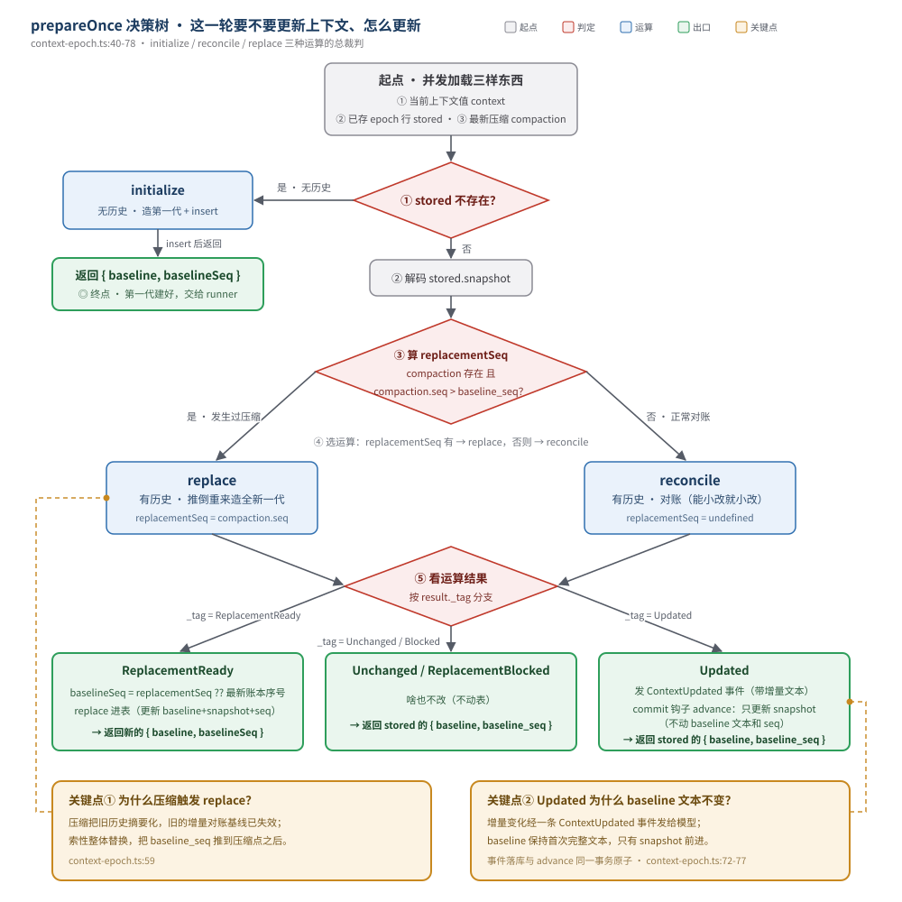

# 07 · 系统上下文代数 + 上下文纪元

> 本篇回答一个根本问题：**模型每次 turn 到底看到什么 system 提示？当这些上下文（环境、日期、目录…）发生变化时，系统怎么处理？**
>
> 它由两部分组成：
> - **SystemContext 代数**（`packages/core/src/system-context/`）——把「系统上下文」从一坨字符串，提升成一个可组合、可比较、可持久化的类型系统。
> - **SessionContextEpoch**（`packages/core/src/session/context-epoch.ts`）——记录「当前 session 用的是哪一代上下文」，并用 `baselineSeq` 决定 runner 从哪个序号开始加载历史。
>
> 与 [04-runner.md](./04-runner.html) 的关系：runner 是**消费者**（调 `loadSystemContext` → `epoch.initialize/prepare`），本篇讲的是**被消费的东西**。

---

## 一、概念模型：系统上下文不是字符串，是「类型化源的代数」

### 传统做法的问题

最朴素的做法是：把系统提示词拼成一个长字符串。

```
"你在 xxx 目录工作。今天是 2026-07-26。这是个 git 仓库。……"
```

这有三个毛病：

1. **不可比较**：下一轮这个目录变了、日期变了，你怎么知道「变没变、变了哪」？只能整段重发。
2. **不可独立刷新**：环境信息想单独更新一下，做不到，得整段重建。
3. **不可持久化**：你没法把「上一轮发的是什么」存下来做对比。

### V2 的做法：把每个来源建模成一个「类型化源」

V2 把系统上下文拆成一个个**独立的来源（source）**——环境是一个源、日期是一个源、目录结构是一个源……每个源都是一台「小仪器」，自己负责：

- **观察**自己当前的值（`load`）
- **第一次见面**时怎么自我介绍（`baseline`）
- **和上次相比**怎么描述变化（`update`）
- **自己消失了**怎么告别（`removed`）

这些源可以**任意组合**成一个上下文，组合后的整体又能被**观察一次**，产出一份**持久化的快照**（记录每个源此刻的值）和一段**给模型看的文本**。

这就是所谓的「代数」——**有定义良好的运算（组合、初始化、对账、替换），运算结果还能继续参与运算**。AGENTS.md 明确要求这套代数、注册表、内置源都放在 `src/system-context`。

> 一个贯穿全文的类比：把每个源想象成一个**传感器**。传感器有自己的读数（值）、首次校准报告（baseline）、读数变化通报（update）、下线通知（removed）。系统把所有传感器的报告汇总成一份「环境公报」发给模型，同时把每个传感器的当前读数存档（snapshot），下次好对比。

---

## 二、核心概念

> 本节集中定义术语，后文直接用。

### Source\<A\>（类型化源）

一个上下文来源的完整定义。`A` 是这个源观察到的值的类型。见 `index.ts:32-39`：

```ts
export interface Source<A> {
  readonly key: Key                                  // 稳定的名空间身份
  readonly codec: Schema.Codec<A, Schema.Json, ...>  // 值的编解码 + 等价比较
  readonly load: Effect.Effect<A | Unavailable>      // 观察当前值
  readonly baseline: (current: A) => string          // 首次见到时的完整文本
  readonly update: (previous: A, current: A) => string  // 相对上次的变化文本
  readonly removed?: (previous: A) => string         // 源消失时的告别文本
}
```

### Key（源的身份）

一个**带品牌（brand）的字符串**，正则校验成名空间形式（`index.ts:22`）：

```ts
export const Key = Schema.String.check(Schema.isPattern(/^[a-z0-9][a-z0-9._-]*\/[a-z0-9][a-z0-9._/-]*$/))
  .pipe(Schema.brand("SystemContext.Key"))
```

形如 `core/environment`、`core/date`。`/` 前面是命名空间，后面是名字。brand 保证你不能拿随便一个字符串冒充 Key。

> **新概念：brand（品牌类型）**。运行时还是普通字符串，但类型系统给它盖了个章，强制它只能通过 `Key.make(...)` 创建。防止把普通 string 误当成 Key 用。

### Snapshot（快照）

**持久化的比较状态**：记录每个源此刻的值（`index.ts:49-57`）。

```ts
export const SourceSnapshot = Schema.Struct({
  value: Schema.Json,                       // 这个源当前的值（编码成 JSON）
  removed: Schema.optional(Schema.NonEmptyString),  // 如果源消失了，告别文本
})
export const Snapshot = Schema.Record(Key, SourceSnapshot)  // key → 该源的快照
```

快照是**可存进数据库**的（全是 JSON）。下一次对账时，拿当前观察值和这份快照比，就知道变了没。

### Generation（一代上下文）

一次「初始化」的产物（`index.ts:59-62`）：

```ts
export interface Generation {
  readonly baseline: string        // 给模型看的完整文本
  readonly snapshot: Snapshot      // 配套的持久化快照
}
```

baseline 和 snapshot 是**成对诞生**的：文本是给模型当下看的，快照是给系统将来对比用的。

### unavailable（观察失败）

一个特殊符号（`index.ts:28`）：

```ts
export const unavailable = Symbol.for("@opencode/SystemContext.Unavailable")
```

`load` 返回它表示「**这次没观察到，但不是源被移除了**」。这是个关键区分，见第五节。

---

## 三、Source\<A\> 详解：一个源的一生

以真实的内置源 `core/date` 为例（`builtins.ts:33-39`）：

```ts
SystemContext.make({
  key: SystemContext.Key.make("core/date"),
  codec: Schema.toCodecJson(Schema.String),
  load: DateTime.nowAsDate.pipe(Effect.map((date) => date.toDateString())),
  baseline: (date) => `Today's date: ${date}`,
  update: (_previous, date) => `Today's date is now: ${date}`,
})
```

| 字段 | 这个源里的含义 |
|---|---|
| `key` | `core/date` |
| `codec` | 值是字符串，用 JSON 编解码 |
| `load` | 观察 = 取今天的日期字符串 |
| `baseline` | 第一次见：`"Today's date: Sat Jul 26 2026"` |
| `update` | 变了：`"Today's date is now: Sun Jul 27 2026"` |
| `removed` | 没定义（日期源不会消失） |

另一个内置源 `core/environment`（`builtins.ts:25-32`）观察工作目录、workspace 根、是否 git 仓库、平台：

```
<env>
  Working directory: /Users/xxx/project
  Workspace root folder: /Users/xxx/project
  Is directory a git repo: yes
  Platform: darwin
</env>
```

它的 `baseline` 是 `"Here is some useful information about the environment you are running in:\n<env>..."`，`update` 是 `"The environment you are running in is now:\n<env>..."`。

### 一个源的生命周期图

```
        load（观察当前值）
             │
     ┌───────┴────────┐
     │                 │
   有值 A          unavailable
     │                 │
     ▼                 ▼
  可用(Available)   不可用(Unavailable)
     │                 │
     ├─ baseline()     └─ 保留上次的 snapshot，
     │   首次完整文本      不构造残缺 baseline
     │
     └─ compare(previous)
         ├─ Unchanged    （和上次一样）
         ├─ Updated      （变了，render() 出 update 文本）
         └─ Incompatible （上次的值解不出来，需要整体替换）
```

---

## 四、make 与 combine：把源「装箱」再「拼车」

### make：把具体类型 A 藏起来

问题：`core/date` 的值是 `string`，`core/environment` 的值也是 `string`，但别的源可能是结构体。它们的 `A` 各不相同，怎么放进同一个列表统一处理？

`make`（`index.ts:135-173`）的办法是**把 A 关掉（close over）**，对外只暴露一个不透明的 `SystemContext`：

```ts
export function make<A>(source: Source<A>): SystemContext
```

它把 `Source<A>` 转成一个 `PackedSource`（`index.ts:99-102`），后者只有：

```ts
interface PackedSource {
  readonly key: Key
  readonly load: Effect.Effect<Loaded | Unavailable>  // 返回值类型被抹掉了
}
```

`Loaded`（`index.ts:104-107`）里是**闭包**，已经把 A 编码进 `baseline()` 和 `compare()` 两个函数里：

```ts
interface Loaded {
  readonly baseline: () => Rendered                    // 内部知道 A，但外面看不到
  readonly compare: (previous: Schema.Json) => Compared
}
```

> **新概念：opaque（不透明）/ 存在类型**。`SystemContext` 把每个源的具体值类型 A 封装起来，外面只能通过 `baseline()` / `compare()` 这些「已经消化了 A 的函数」来用它，永远摸不到 A 本身。这样异构的源（A 各不相同）就能装进同一个数组统一处理。这是「把数据换成行为」的经典手法。

`compare` 的内部逻辑（`index.ts:154-167`）：拿上次的 JSON 用 codec 解码，解不出来 → `Incompatible`；解出来用 codec 的等价性比，相等 → `Unchanged`，不等 → `Updated`（带一个能 render 出 update 文本的闭包）。

### combine：把多个上下文拼成一个

`combine`（`index.ts:176-180`）把多个 `SystemContext` 的源列表拼起来，**立刻拒绝重复的 key**：

```ts
export function combine(values: ReadonlyArray<SystemContext>): SystemContext {
  const sources = values.flatMap((value) => value[ContextTypeId])
  assertUniqueKeys(sources)   // 有重复 key 直接抛 DuplicateKeyError
  return context(sources)
}
```

为什么拒绝重复？因为每个 key 在快照里只有一份记录，重复会让对账逻辑无法判断「这个 key 到底听谁的」。

还有个 `empty`（`index.ts:132`）是「空上下文」，组合的单位元。

---

## 五、unavailable 的语义：观察失败 ≠ 移除

这是整个设计里最容易被忽略、但最关键的一点。

`load` 可能返回 `unavailable`，意思是「**这次我没读到，但源还在，下次可能就有了**」。比如某个传感器临时故障。

它的处理原则（贯穿 `initialize` / `reconcile` / `replace`）：

| 场景 | 处理 |
|---|---|
| **初始化**时某源 unavailable | **整体阻塞**（`InitializationBlocked`），绝不构造残缺的 baseline（`index.ts:198-206`） |
| **对账**时某源 unavailable，但快照里有它 | **保留上次的 snapshot**，不报错也不移除（`index.ts:251-253`） |
| **替换**时某源 unavailable，但快照里承认过它 | **阻塞替换**（`ReplacementBlocked`），等它恢复（`index.ts:288-289`） |

核心思想：**宁可等待，不可用残缺信息悄悄生成一份不完整的上下文。** 因为残缺的 baseline 一旦发给模型、一旦持久化，就会污染后续所有 turn。

对比「移除」：移除是源**主动从组合里去掉**（key 不在列表里了），这时才会调用 `removed(previous)` 生成告别文本。unavailable 是「人还在，只是暂时联系不上」，两者语义完全不同。

---

## 六、三种运算：initialize / reconcile / replace（代数的核心）

这三个函数就是 SystemContext 代数的「运算符」。它们都先 `observe`（并发加载所有源，`index.ts:182-195`），再做不同处理。

### initialize：开天辟地，造第一代

`initialize(value)`（`index.ts:198-206`）：

- 观察所有源。
- 有任何 unavailable → 抛 `InitializationBlocked`。
- 否则，对每个可用源调 `baseline()`，拼成完整 baseline 文本，收集所有 snapshot，打包成一个 `Generation`。

这是 session **第一次**建立上下文时用的。

### reconcile：对账，能小改就小改

`reconcile(value, previous)`（`index.ts:218-226`）：拿当前观察值和**上一代快照**比，尽量只发「变化部分」。

`reconcileObservation`（`index.ts:228-280`）的逻辑：

1. 对每个当前可用的源，和快照里同 key 的值比：
   - 解不出旧值 → `Incompatible` → **放弃对账，改走整体替换（Replace）**
   - 相等 → 不变，沿用旧 snapshot
   - 不等 → 记下，待会 render 出 update 文本
2. 对快照里有、但当前列表里没有的 key（源被移除了）：
   - 如果它没有 `removed` 文本 → 也得 Replace
   - 否则记下它的告别文本
3. 汇总：
   - 没有任何变化 → `Unchanged`
   - 有变化 → `Updated { text, snapshot }`，text 是「所有 update + 新源 baseline + 移除告别」拼起来的**增量文本**

> 注意：`Updated` 的 text 是**增量**（只含变化），不是完整 baseline。模型会看到「环境变了：现在是……」「日期变了：现在是……」这样的差量通报。

### replace：推倒重来，造全新一代

`replace(value, previous)`（`index.ts:283-291`）：

- 如果某个「被快照承认过」的源现在 unavailable → `ReplacementBlocked`（等它）。
- 否则 → `ReplacementReady`，带一个全新的 `Generation`（等于重新跑一遍 initialize 的渲染）。

什么时候用 replace 而不是 reconcile？见下一节 SessionContextEpoch——**当发生过压缩（compaction）时**，旧的增量对账已经没意义了，直接整体替换。

### 三种运算的关系

```
                  observe（并发加载所有源）
                          │
        ┌─────────────────┼─────────────────┐
        ▼                 ▼                  ▼
   initialize         reconcile          replace
   （无历史）        （有历史，对账）     （有历史，推倒重来）
        │                 │                  │
        ▼          ┌──────┴──────┐           ▼
   Generation   Unchanged    Updated    ReplacementReady
   （全新一代）  （没变）   （增量文本）   / ReplacementBlocked
                     │
                  Incompatible ────────► 转走 replace
```

---

## 七、SystemContextRegistry：源的登记处

光有代数还不够，得有人把源**登记**进来、需要时**汇总**。这就是注册表（`registry.ts`）。

```ts
export interface Entry {
  readonly key: SystemContext.Key
  readonly load: Effect.Effect<SystemContext.SystemContext>
}
export interface Interface {
  readonly register: (entry: Entry) => Effect.Effect<void, never, Scope.Scope>
  readonly load: () => Effect.Effect<SystemContext.SystemContext>
}
```

- **register**（`registry.ts:25-38`）：用 `acquireRelease` 做**作用域化注册**——注册时加进列表，所在 scope 关闭时自动移除。重复 key 会 die。
- **load**（`registry.ts:39-44`）：把所有登记的 entry **按 key 排序**（保证顺序稳定），**并发** load 每一个，再 `combine` 成一个总上下文。

注册表是 **Location-scoped** 的（`registry.ts:49` 的 `makeLocationNode`）——不同工作区可以有不同的源集合。

### 内置源 builtins

`builtins.ts` 在启动时往注册表登记一个 `core/builtins` entry，它内部 combine 了两个源：`core/environment` 和 `core/date`（见第三节）。这就是模型默认能看到的环境信息和日期。

其它子系统（技能指导、引用指导等）也通过注册表或直接 combine 进来。

---

## 八、SessionContextEpoch：连接代数和 runner 的桥梁

代数本身是「无状态」的——每次 observe 都是重新读传感器。但 session 需要**记住「我现在用的是哪一代上下文」**，否则每轮都得重发完整 baseline，也做不了增量对账。

`SessionContextEpoch`（`context-epoch.ts`）就是这份记忆。它对应一张表 `SessionContextEpochTable`，每个 session 一行：

| 字段 | 含义 |
|---|---|
| `session_id` | 哪个 session |
| `baseline` | 当前这代的完整 baseline 文本 |
| `snapshot` | 当前这代的快照（JSON） |
| `baseline_seq` | **关键**：这代 baseline 是在账本哪个序号生成的 |

### 三个对外操作

**initialize**（`context-epoch.ts:23-29, 80-89`）：

- 如果这个 session 已经有 epoch 行 → 返回 `undefined`（表示「已存在，不用我初始化」）。
- 否则观察上下文、`SystemContext.initialize` 造第一代、`insert` 进表，返回 `{ baseline, baselineSeq }`。

runner 在每个 turn 开头**先调它**（`llm.ts:183`）。第一轮会真正建表，后续轮返回 undefined。

**prepare**（`context-epoch.ts:31-78`）：initialize 返回 undefined 时调用，做「对账或替换」。这是最核心的逻辑，下一节细讲。

**reset**（`context-epoch.ts:111-120`）：**删掉这个 session 的 epoch 行**。在上下文发生「不可对账的剧变」时调用——目前是 `Moved`（session 换了目录）和 `RevertEvent.Committed`（回滚）两个事件触发（见 [05-projector.md](./05-projector.html)）。删掉后，下个 turn 的 initialize 会重新建第一代。

---

## 九、prepare 的决策树（重点）



`prepareOnce`（`context-epoch.ts:40-78`）是「这一轮要不要更新上下文、怎么更新」的总裁判。流程：

文字版（终端友好）：

```
并发加载三样东西：
  ① 当前上下文值（context）
  ② 已存的 epoch 行（stored）
  ③ 最新一次压缩（compaction）

① stored 不存在？
   └─ 是 → initialize 造第一代 + insert，返回 { baseline, baselineSeq }

② 解码 stored.snapshot

③ 算 replacementSeq：
   compaction 存在 且 compaction.seq > stored.baseline_seq？
   └─ 是 → replacementSeq = compaction.seq（发生过压缩，要整体替换）
   └─ 否 → undefined（正常对账）

④ 选运算：
   replacementSeq 有 → SystemContext.replace（推倒重来）
   否则            → SystemContext.reconcile（增量对账）

⑤ 看结果：
   Unchanged / ReplacementBlocked
     → 啥也不改，返回 stored 的 { baseline, baseline_seq }
   ReplacementReady
     → baselineSeq = replacementSeq ?? 最新账本序号
       replace 进表（更新 baseline + snapshot + baseline_seq）
       返回新的 { baseline, baselineSeq }
   Updated
     → 发 ContextUpdated 事件（带增量文本）
       commit 钩子里 advance（只更新 snapshot，不动 baseline 文本和 seq）
       返回 stored 的 { baseline, baseline_seq }
```

几个关键点：

1. **为什么压缩会触发 replace？**（`context-epoch.ts:59`）压缩把旧历史摘要化了，旧的增量对账基线已经失效，索性整体替换，把 `baseline_seq` 推到压缩点之后。
2. **Updated 为什么 baseline 文本不变？**（`context-epoch.ts:72-77`）因为增量变化是通过一条 **ContextUpdated 事件**发给模型的（模型会在对话里看到「环境变了……」），而不是改 baseline。baseline 保持首次的完整文本，只有 snapshot 前进（`advance`，`context-epoch.ts:161-174`），好让下次对账有正确的基线。
3. **commit 钩子**：`ContextUpdated` 事件落库和 `advance` 在**同一个事务**里原子完成（呼应 [01-event-log.md](./01-event-log.html) 的 commit hook 机制）——要么都成，要么都不成，不会出现「事件发了但快照没前进」。

---

## 十、baselineSeq：决定历史起点的核心机制

这是连接「上下文」和「历史加载」的枢纽，也是本篇最重要的概念。

### 它是什么

`baseline_seq` = **当前这代 baseline 是在账本哪个事件序号生成的**。`insert` 时取的就是当时的最新账本序号（`context-epoch.ts:122-139`）：

```ts
const baselineSeq = yield* EventV2.latestSequence(db, sessionID)
```

### 它为什么重要：决定哪些 system 消息还要发

runner 加载历史时把 baselineSeq 传进去（`llm.ts:200`）：

```ts
const entries = yield* SessionHistory.entriesForRunner(db, session.id, system.baselineSeq)
```

它的作用是：**baselineSeq 及之前的 `system` 类消息（上下文增量通报）不再单独加载**，因为它们已经被「烤进」当前 baseline 文本里了；baselineSeq 之后的增量通报才保留发给模型。

> **注意一个常见误解**：baselineSeq **不是**一刀切的「历史起点」。它只过滤 `system` 类消息。对话主体（user/assistant/tool…）的截断是另一套机制——**compaction**（见 [08](./08-compaction.html)、[09](./09-message-model.html) 第八节）。`history.ts` 里这两套过滤各管各的：
>
> | 消息类型 | 保留条件 | 谁在过滤 |
> |---|---|---|
> | 非 system | `seq >= compaction.seq`（无压缩则全留） | compaction |
> | system | `seq > baselineSeq` | baselineSeq |

### 为什么 baselineSeq 常和压缩点重合

虽然两套机制逻辑独立，但数值上经常一致——因为**压缩会触发上下文 replace，把 baselineSeq 推到压缩点**（`context-epoch.ts:59-69`）。逻辑是：

```
账本序号:  0 ─────── 100 ──────────── 200 ─────── 300
                      │                 │
              第一次建 baseline      压缩发生
              baseline_seq = 100    → 触发 replace
                                    → baseline_seq = 200（= compaction.seq）

system 消息: 加载 seq > 200 的（之前的已烤进新 baseline）
对话主体:    加载 seq >= 200 的（之前的已压进 compaction 摘要）
```

所以三者的关系是：**上下文纪元管 system 通报的取舍，compaction 管对话主体的截断，压缩把两者的序号对齐到一起。** 模型最终看到 = baseline（含环境）+ compaction 摘要（含旧对话）+ 两者之后的近期消息。

---

## 十一、和 runner 的完整配合

把整条链路串起来（`llm.ts:168-214`）：

```
① loadSystemContext(agent)
   = combine( 注册表.load()        ← 内置源 core/environment、core/date 等
             + skillGuidance.load()  ← 技能指导
             + referenceGuidance.load() ) ← 引用指导
   得到一个总的 SystemContext

② epoch.initialize(db, loadSystemContext(agent), session.id)
   第一轮：建表，返回 { baseline, baselineSeq }
   后续轮：返回 undefined

③ 若 ② 是 undefined → epoch.prepare(db, events, ..., session.id)
   对账/替换，返回 { baseline, baselineSeq }

④ entries = SessionHistory.entriesForRunner(db, session.id, baselineSeq)
   只取 baselineSeq 之后的消息

⑤ 构建请求：
   system = [ agent 自带的 system, baseline ].filter(非空)
   messages = toLLMMessages(entries 里的消息)
   → 发给模型
```

模型最终看到的 system 部分 = **agent 的角色设定 + 当前这代上下文的 baseline**。

---

## 十二、ContextUpdated 事件

上下文发生**增量变化**（reconcile 出 Updated）时，会发一条 `ContextUpdated` 事件（`context-epoch.ts:72-76`，定义在 `session-event.ts`）：

```ts
yield* events.publish(SessionEvent.ContextUpdated, {
  sessionID, messageID, timestamp, text: result.text  // 增量文本
}, { commit: () => advance(db, sessionID, result.snapshot) })
```

projector 收到后走 `run(db, event)`（见 [05-projector.md](./05-projector.html)），把这条增量文本投影成一条消息，让模型在后续对话里能看到「环境变了……」这类通报。

---

## 十三、一图回顾

```
            ┌─────────────────────────────────────────────┐
            │           SystemContext 代数                  │
            │                                               │
   传感器们  │   Source<A> ──make──► SystemContext           │
   (builtins│       │                    │ combine          │
   /技能/引用)│    load/baseline/         ▼                  │
            │    update/removed      组合的上下文            │
            │                            │                  │
            │              ┌─────────────┼──────────────┐  │
            │              ▼             ▼              ▼  │
            │         initialize    reconcile       replace │
            │         （第一代）    （增量对账）    （推倒重来）│
            │              │             │              │  │
            │              ▼             ▼              ▼  │
            │         Generation    Updated/       Replacement│
            │        {baseline,     Unchanged       Ready/   │
            │         snapshot}                    Blocked   │
            └──────────────────────┬──────────────────────┘
                                    │
                                    ▼
            ┌─────────────────────────────────────────────┐
            │        SessionContextEpoch（每 session 一行）  │
            │   baseline · snapshot · baseline_seq          │
            │                                               │
            │   initialize → 建第一代                        │
            │   prepare    → 对账/替换，可能发 ContextUpdated │
            │   reset      → 删行（Moved/Revert 时）         │
            └──────────────────────┬──────────────────────┘
                                    │ baselineSeq
                                    ▼
            ┌─────────────────────────────────────────────┐
            │  runner：只加载 baselineSeq 之后的历史          │
            │  模型看到 = baseline（浓缩旧事）+ 近期消息       │
            └─────────────────────────────────────────────┘
```

---

## 附：关键代码索引

| 主题 | 位置 |
|---|---|
| Source\<A\> 接口 | `packages/core/src/system-context/index.ts:32` |
| Key（branded） | `index.ts:22` |
| Snapshot / Generation | `index.ts:49-62` |
| make（装箱） | `index.ts:135` |
| combine（拼车 + 查重） | `index.ts:176` |
| observe（并发加载） | `index.ts:182` |
| initialize | `index.ts:198` |
| reconcile / reconcileObservation | `index.ts:218` / `228` |
| replace / replaceObservation | `index.ts:283` / `287` |
| unavailable 符号 | `index.ts:28` |
| Registry register/load | `packages/core/src/system-context/registry.ts:25` / `39` |
| 内置源 environment/date | `packages/core/src/system-context/builtins.ts:25-39` |
| Epoch initialize/prepare/reset | `packages/core/src/session/context-epoch.ts:23` / `31` / `111` |
| prepare 决策（replacementSeq） | `context-epoch.ts:59-77` |
| baselineSeq = latestSequence | `context-epoch.ts:127` |
| runner 调用点 | `packages/core/src/session/runner/llm.ts:168-200` |
