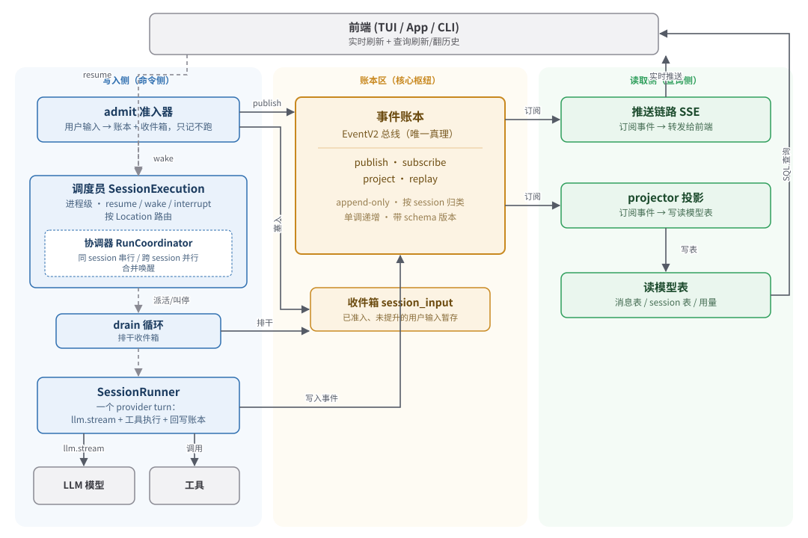

# opencode 核心架构（V2 Session）

> 本文是对 opencode 核心运行时架构的概念性梳理——以 **V2 Session**（项目 AGENTS.md 所称「V2 Session Core」）为主线，讲清楚「模型与协作」，不陷入代码实现细节。
>
> 本篇是**总览**。每个组件在对应的 `0X-*.md` 里有更深入的拆解（概念模型 → 执行流程 → 代码实现）。

### 文档基准

> 本文描述的是**下列 commit 时刻**的代码实现。代码此后若有变动，文档可能滞后——更新时请以此基准 `git diff` 核对差异，并在下表中顺延记录。

| 项 | 值 |
|---|---|
| 对照 commit | `3f9dad3fd0d4ce01ccb443896bce93d9e7f390eb`（短 `3f9dad3fd0`） |
| commit 日期 | 2026-07-28 |
| 所在分支 | `dev`（默认主线，发布 tag 亦由机器人从此切出） |
| git describe | `github-v1.2.25-1470-g3f9dad3fd0` |
| 文档撰写日期 | 2026-07-28 |
| 上次核对 | 2026-07-28：自初版基准 `4a81e8392b`(7-20) 起的 118 个提交均未改动会话核心（`packages/core/src/session/`、`event.ts`、`system-context/` 及推送链路生产代码），文档无需更新 |

> 注：`v2` 远程分支已从 dev 分叉、独立演进，概念相通但实现有重命名（如 dev 的「System Context / Context Epoch」在 v2 上重构为「Instructions」）。**本文档只对 dev 主线准确，勿拿来对照 `v2` 分支代码。**

### 文档导航

| 文档 | 组件 | 三大区位置 |
|---|---|---|
| [01-event-log.md](./01-event-log.html) | 事件账本与 EventV2 总线 | 中间 · 核心枢纽 |
| [02-admission-inbox.md](./02-admission-inbox.html) | 准入器 admit + 收件箱 session_input | 写入侧 · 入口 |
| [03-scheduler.md](./03-scheduler.html) | 调度层 SessionExecution + RunCoordinator | 写入侧 · 调度 |
| [04-runner.md](./04-runner.html) | 执行器 SessionRunner（含 drain 循环） | 写入侧 · 执行 |
| [05-projector.md](./05-projector.html) | 投影 projector | 读取侧 · 派生 |
| [06-push-stream.md](./06-push-stream.html) | 推送链路 SSE | 读取侧 · 实时 |

**深入篇**（回答「模型到底看到什么」「数据长什么样」）：

| 文档 | 组件 | 主题 |
|---|---|---|
| [07-system-context.md](./07-system-context.html) | 系统上下文代数 + 上下文纪元 | 模型的 system 提示怎么组装、上下文变了怎么处理 |
| [08-compaction.md](./08-compaction.html) | 上下文压缩 Compaction | 长对话上下文要爆了怎么压缩续命 |
| [09-message-model.md](./09-message-model.html) | 消息模型数据字典 | 消息/part 的数据结构、事件→消息映射、翻译给模型 |

---

## 一、心智模型：从「会话脚本」到「有账本的事务系统」

### V1：边想边干、边干边记

V1 的 session 像一个实习生：你给它一句话，它在内存里开始转——调模型、调工具、再调模型……整个过程是一条流水线，跑完了结果才落到数据库。中间崩溃，内存里的状态就丢了，重启后只能靠零散落库的结果拼凑。

**核心问题：「正在做什么」这件事，只活在内存里。**

### V2：账本驱动的小型工作流引擎

V2 把 agent session 当成一个「银行账户系统」来设计，核心是一个**账本（事件日志）**。

银行怎么记账？每笔交易先记一条流水，余额从流水算出来，不是直接存的。系统崩了，重放流水，余额自然恢复。V2 干的就是这件事：

- session 里发生的**每一件事**，都记成一条不可篡改的流水（事件）。
- 你看到的界面、消息列表、token 用量——**全是从流水算出来的派生物**。
- 崩溃了，重放流水即可恢复。

**本质：用「做正经业务系统」的方法（记账、解耦、可恢复）来重新设计 LLM agent。**

---

## 二、核心概念（术语表）

> 后文出现的所有专有名词，都在这里预先定义。

### 事件溯源（Event Sourcing）

一种设计模式：**状态不直接存储，而是通过重放一系列事件推导出来。** 事件是 append-only（只增不改）的流水账，是系统的唯一事实来源。

### 账本（Event Log）

V2 的核心存储。每条记录是一个带类型的「事件」（如「用户提问」「工具调用成功」「一步结束」），按 session 归类、单调递增编号、带 schema 版本。所有人往这写，所有人从这读。

### aggregate（聚合）

一组相关事件的归属主体。账本按 aggregate 分桶、按 aggregate 内部单调递增编号。**当前实现里 aggregate_id 就是 sessionID**——一个 session 的所有事件归在同一个聚合下，共享一套递增序号。这个抽象为未来「非 session 的事件聚合体」留了空间。

### durable 事件 / live-only 事件

事件有两种身份：

- **durable 事件**：要落库、可重放、带 aggregate 序号。如「用户提问」「工具调用成功」这类**语义边界**事件。
- **live-only 事件**：不落库、只在线上流一次。如流式过程中的 `Text.Delta`（文字碎片）、`Tool.Input.Delta`（入参碎片）——它们是流的中间碎片，最终值由对应的 `Ended` 事件落库。

这样设计是为了避免账本被高频碎片撑爆，同时保留实时流的低延迟。

### 投影（projector）

「维护余额」的角色。它**订阅**账本上的一类事件，每来一条就**更新对应的读模型表**。三个关键性质：

- **派生的**：输出完全由账本决定，重放得到一模一样的结果。
- **可丢弃的**：读模型坏了不慌，重跑 projector 就重建了。账本才是真理。
- **可进化的**：改读模型形状不用动账本，写新 projector 重放即可。

### 发布-订阅（Pub/Sub）

一种通信模式：有广播中心，谁关心某类事件就提前「订阅」，事件发生时广播中心「发布」给所有订阅者。**写事件的人不知道有谁订阅。**

### CQRS（命令查询职责分离）

把「改状态」（命令/写入）和「查状态」（查询/读取）设计成两条独立路径，各自优化。V2 是这个思路的极致版：左边记账+执行，右边派生+展示，互不认识。

### Location（位置）

「这份活儿在哪个物理环境里跑」。现在就是本机某个工作目录，未来可能是远程机器。是调度员派活时的**路由依据**——决定用哪个 runner、访问哪个文件系统。

### SSE（Server-Sent Events）

一种服务器单向、持续把数据推给浏览器的网络技术。V2 用它把事件实时转发给前端。理解成「服务器主动推」即可。

### drain（排干）

被派到工位上的人进入的循环，任务是把「收件箱」里待处理的用户输入全部干完，直到空了为止。

### steer / queue（投递语义）

用户输入的两种投递意图：

- **steer（实时引导）**：在模型告一段落的安全时机插入，影响接下来走向。像趁同事打字时插话纠正方向。
- **queue（排队）**：等本轮彻底干完、本要停了的时候再处理。像排队取号，一个个来。

---

## 三、三大区与组件清单

整个系统分成三个区：**中间是账本，左边写、右边读**。

### 中间：账本区（核心枢纽）

| 组件 | 职责 |
|---|---|
| **事件账本** | 唯一事实。append-only 流水，按 session 归类、单调递增、带版本 |
| **收件箱（session_input）** | 「已准入、还没被提升为正式消息」的用户输入暂存区 |
| **EventV2 总线** | 账本对外的统一接口：`publish`（写）、`subscribe`（订阅流）、`project`（注册投影）、`replay`（重放） |

### 左侧：写入侧（命令侧——「记 + 干」）

| 组件 | 职责 |
|---|---|
| **admit（准入器）** | 用户输入的第一落点。可靠地往账本记一条 `PromptAdmitted` + 往收件箱塞一条。**只记，不跑** |
| **调度员（SessionExecution）** | 进程级单例。对外三个动作 `resume`/`wake`/`interrupt`。按 Location 路由到对应 runner |
| **协调器（RunCoordinator）** | 调度员内部那张「工位→工作」表。保证**同 session 串行、跨 session 并行、合并唤醒** |
| **drain 循环** | 被派到工位上的人。排干收件箱：内层一轮轮跑模型，外层处理排队的输入 |
| **SessionRunner** | 一个 provider turn 的具体执行：调 `llm.stream`、调工具、把每个动作回写账本 |
| **工具执行 / 权限** | 工具的注册、授权、本地执行。runner 通过它落地工具调用 |

> 注：drain 循环和 SessionRunner 在代码上**同属一个 `SessionRunner.Service`**（`runner/llm.ts`）——`run` 方法就是 drain 外层循环，`runTurnAttempt` 是单个 turn。这里分开列是为了概念清晰。详见 [04-runner.md](./04-runner.html)。

### 右侧：读取侧（查询侧——「派生 + 推」）

| 组件 | 职责 |
|---|---|
| **projector（投影）** | 订阅事件，**写读模型表**。服务于「将来查询」 |
| **读模型表** | 从事件算出来的当前状态（消息表、session 表、用量…）。可丢弃可重建 |
| **推送链路（SSE）** | 订阅事件流，**顺着网络转发给前端**。服务于「此刻盯着屏幕的人」 |
| **前端** | 终极消费者。实时更新靠推送，刷新翻历史靠查询 |

---

## 四、架构图



文字版（终端友好）：

```
┌─────────────────────────────────────────────────────────────────────────┐
│                              前端 (TUI / App / CLI)                       │
│         实时刷新 ◄────────────────────── ◅ 查询刷新/翻历史                │
└──────────────┬──────────────────────────────────────────▲───────────────┘
               │ 实时推送                                  │ SQL 查询
       ┌───────┴────────┐                         ┌───────┴────────┐
       │  推送链路 SSE   │                         │   projector     │
       │ (订阅事件→转发) │                         │ (订阅事件→写表) │
       └───────┬────────┘                         └───────┬────────┘
               │ 订阅                                      │ 订阅
               │                                           │ 写
┌──────────────┴───────────────────────────────────────────┴───────────────┐
│                                                                            │
│                       事件账本  (唯一真理 / EventV2 总线)                   │
│                  publish · subscribe · project · replay                    │
│                                                                            │
└──────────────▲─────────────────────────────────────────────▲─────────────┘
               │ 写入                                         │ 写入
       ┌───────┴────────┐                         ┌──────────┴──────────┐
       │  SessionRunner │  ← 一个 provider turn   │      admit (准入)    │
       │  · llm.stream  │     的具体执行          │  用户输入→账本+收件箱 │
       │  · 工具执行     │                         └──────────┬──────────┘
       └───────▲────────┘                                    │ wake (提醒)
               │ 派活/叫停                                     │
       ┌───────┴─────────────────────────────────────────────┴──────────┐
       │           调度员 (SessionExecution, 进程级)                       │
       │           resume / wake / interrupt                              │
       │           按 Location 路由 → 对应 runner                          │
       │           └─ 协调器: 同 session 串行 / 跨 session 并行 / 合并唤醒    │
       │               └─ drain 循环: 排干收件箱                            │
       └────────────────────────────────▲─────────────────────────────────┘
                                          │ resume (要求开跑)
                                   用户/前端发起
```

> 注：上图把「推送链路」画成直接订阅账本，这是**概念模型**。产品主进程实际经 `EventV2Bridge` 把 V2 事件桥到 `GlobalBus` 再到 SSE 端点（V1 兼容，给老前端）；独立的 `packages/server` 才直接订 EventV2。两者概念上等价，详见 [06-push-stream.md](./06-push-stream.html)。

---

## 五、一次完整请求的数据流

用户在前端发了一句话，整个系统这样转：

1. **前端** → 调 `admit`
2. **admit** → 在账本记一条 `PromptAdmitted`，往**收件箱**塞一条 → 立刻给前端返回「收到了」
3. **admit** → 顺手 `wake`（提醒）调度员
4. **调度员** → 查协调器那张表：这个 session 有没有人在干？
   - 没有 → 新派一个 drain
   - 有 → 在那份工作旁贴个便签「干完再扫一眼」
5. **drain** 进工位 → 扫收件箱 → 有 steer/queue → 进入 turn 循环
6. **SessionRunner** 跑一轮模型：
   - 调 `llm.stream` → 模型说「我要调某工具」
   - 在账本记 `Tool.Called`（**先记账再执行**）
   - 执行工具 → 记 `Tool.Success`
   - 续下一轮，直到模型不再调工具
   - 中途收件箱来新 steer 了 → 接着跑
7. 每记一条事件，**账本广播**给所有订阅者：
   - **projector** 收到 → 更新读模型表
   - **推送链路** 收到 → 顺着 SSE 推给**前端**
8. **前端** 界面实时动了
9. drain 把收件箱排干（steer 和 queue 都处理完）→ 退出，工位空出来
10. 用户**刷新页面** → 这次走的是查询路径：前端从**读模型表**（projector 维护的）拉历史，跟账本无关

---

## 六、调度层详解

调度层是 V2 最精巧的部分。把它想象成一个**工位调度员**，管着一排工位（每个工位 = 一个 session）。

### 三个动作

| 动作 | 含义 | 可靠性 |
|---|---|---|
| **resume** | 主动派人去干活；已有人就加入等他干完。调用者**拿到结果** | 重活，要等 |
| **wake** | 喊一嗓子「有新活了」。已有人就贴便签（不开新人）；没人新派人。**立刻返回不等** | 轻活，可丢 |
| **interrupt** | 把工位上当前的人叫停，等清理干净才返回 | — |

闲着的时候 interrupt 是 no-op（没事干就没法停）。

### 根本原则：一个工位一个工人

同一个 session，**任意时刻最多只有一个工人在干活**；不同 session 之间可以并行。靠协调器内部一张 `工位 → 当前工作` 表实现：来活了先查表，有记录就别开新人。

### 「派活」和「提醒」为什么要分两套可靠性

- **resume（派活）**：给「用户在前端点了发送、需要知道有没有跑起来」这种场景用，必须等结果。
- **wake（提醒）**：它的语义是「账本上多了条记录，提个醒」，提完就完。**真正要不要干由干活的人自己扫账本决定**，提醒丢了无所谓——账本上的事实还在，下一轮自然会扫到。

> 所以 V2 里用户发 prompt 的流程是：**先记账（admit，必须可靠）→ 再 wake（提醒，可丢失）**。两步可靠性要求完全不同。

### drain 的循环逻辑

```
进入工位：
  1. 扫一眼收件箱：有没有 steer 或 queue 的待办？
     - 没有，且不是被强制叫来 → 直接走人
     - 有 → 开始干

  外层循环（处理一轮又一轮的用户输入）：
    内层循环（一次 provider turn 接一次）：
      - 跑一轮模型（调 llm.stream）
      - 模型调工具？→ 调，等结果，needsContinuation = true
      - 模型不调工具了 → 这轮停
      - 每跑完一轮，再扫：有没有新 steer 进来？
        有 → 接着跑（实时插队生效）
        没有 → 内层结束

    内层停了 → 扫：有没有 queue 排队的？
      有 → 提升一条，回到内层继续跑
      没有 → 外层结束，干完走人
```

要点：

- **drain 没有「身份」，也不是一次对话的边界**。它只是个排空收件箱的后台动作，跑完就没。
- **续跑靠重新读账本，不靠内存状态**。每个 provider turn 前都重新加载投影历史。
- **steer 优先级高于 queue**。实时插队随时插；排队只能等这一大轮结束了才轮到。

### 干净停止是怎么做到的

**interrupt** 找到当前工人（owner fiber），打断它，**等清理干净**才返回。同时立 `stopping` 标志，防止「刚要停又被 wake 塞便签」。

打断后，runner 内部会把「正在跑但没完成的工具调用」统一标记成失败——因为账本上记了 `Tool.Called` 却没结果，是脏状态，必须收尾。这就是「协作式中断 + 状态收尾」，不直接砍进程。

---

## 七、三条铁律（为什么这么分）

1. **账本是唯一真理。** 所有状态从事件派生；读模型表、前端展示都是缓存，丢了能重建。
2. **记账和执行分离。** admit 必须立刻可靠完成；执行（跑模型）是慢的、可失败的、可迁移的，两者用不同可靠性对待。
3. **写入侧和读取侧互不认识。** drain/projector/推送链路只通过账本通信，谁也不直接调谁。这让每条路径能独立演化、独立扩展。

---

## 八、为分布式留的路

现在调度员是**进程内**的（一张 `Map<sessionID, 工作>`，活在本机内存），但有几个设计选择是为多机部署埋的：

1. **调度员是进程级单例，不绑 Layer。** 多机时把这一份换成「跨进程协调」实现，调用方无感。
2. **调度员不直接认识 runner，按 Location 路由。** 「活儿该在哪个机房跑」是个可插拔策略，现在都是本地，以后可远程。
3. **EventV2 已有 owner claim。** 给某 session 的账本打「归某节点所有」标记，是分布式锁的雏形，防止两个节点同时 drain 同一个 session。
4. **wake 是 advisory 的。** 跨机发提醒天然会丢，但无所谓——账本还在，下次扫到就行。这种「最终一致」语义正是分布式调度该有的。

**现状：单机已能跑、逻辑正确；扩展到多机时，要换的只是「调度员内部那张表」和「派活的路由策略」，drain / runner / 账本 / 投影都不用动。**
