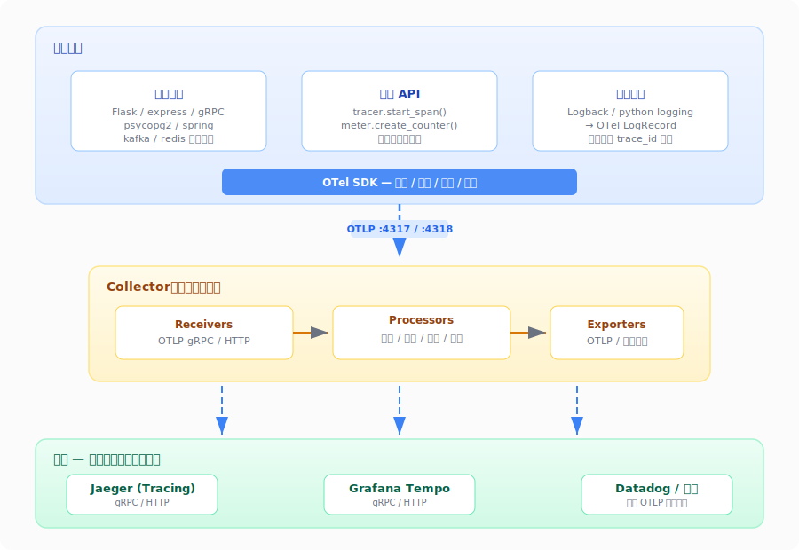
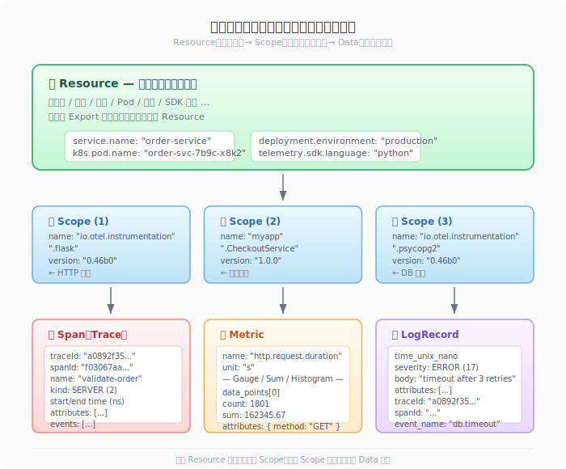

# OpenTelemetry 学习笔记

> 基于 OTel 规范 v1.10.0（2026-07 最新版）整理 | 分享给想快速了解 OTel 的同事

## 🚀 快速阅读指南

| 你想... | 读这些 | 预计 |
|---------|--------|------|
| 知道 OTel 是什么、解决什么问题 | 第 1-2 节 | 5 分钟 |
| 理解 Trace/Metric/Log 怎么串起来的 | 第 3-4 节 | 10 分钟 |
| 准备接入，了解有哪些概念和组件 | 第 5-8 节 | 15 分钟 |
| 做深度集成、排查协议层问题 | 第 10 节 | 30 分钟 |
| **想一次看完全景** | **附录** | 5 分钟 |

---

## 目录

0. [一句话理解整体架构](#0-一句话理解整体架构)
1. [为什么需要 OpenTelemetry](#1-为什么需要-opentelemetry)
2. [三大信号](#2-三大信号)
3. [Span 与 Trace](#3-span-与-trace)
4. [Context Propagation](#4-context-propagation)
5. [Resource 与 Scope](#5-resource-与-scope)
6. [Instrumentation](#6-instrumentation)
7. [Collector](#7-collector)
8. [Sampling](#8-sampling)
9. [Semantic Conventions](#9-semantic-conventions)
10. [OTLP 协议](#10-otlp-协议)
    - [10.1 协议总览](#101-协议总览)
    - [10.2 数据模型层：三层嵌套](#102-数据模型层三层嵌套)
    - [10.3 传输层：gRPC / HTTP](#103-传输层grpc--http)
    - [10.4 编码层：Binary / JSON](#104-编码层binary--json)
    - [10.5 交互语义](#105-交互语义)
    - [10.6 实现要点与设计哲学](#106-实现要点与设计哲学)
    - [10.7 一条数据的一生](#107-一条数据的一生)
- [附录：一次"下单"请求的全景](#附录一次下单请求的全景)

---

## 0. 一句话理解整体架构

在深入之前，先把最重要的图印在脑子里：



**核心思想**：SDK 和后端之间只有 OTLP 一个协议。你换后端不需要改应用代码。Collector 是可选的中间层，负责统一处理（过滤、聚合、采样、路由）后转发到后端。

---

## 1. 为什么需要 OpenTelemetry

在 OTel 之前，每个可观测性工具都有自己的 SDK 和数据格式（Jaeger Thrift、Datadog Proto、Prometheus Remote Write、Zipkin JSON），换后端就要改代码。OTel 提供一套**厂商中立、跨语言、统一**的遥测数据规范+工具链——今天用 Jaeger，明天换 Tempo，不动一行代码。2019 年由 OpenTracing + OpenCensus 合并而来。

---

## 2. 三大信号

| 信号 | 一句话 | 举例 |
|------|--------|------|
| **Trace** | 一次请求经过哪些服务 | 下单→网关→订单→支付→DB |
| **Metric** | 一段时间内的聚合数值 | QPS、P99 延迟 |
| **Log** | 某个时刻发生了什么 | `ERROR: 连接超时` |

三者通过 Context 关联：Trace 画因果链，Metric 给整体健康度，Log 给最细粒度细节。后端可以"从 Trace 跳到 Log"。

> Baggage 不是信号，是跨服务传递业务元数据的 Context 机制（如 `userId=alice`）。Profiling 和 Event 正在开发中。

---

## 3. Span 与 Trace

**Span** = 一个操作的记录。核心字段：`traceId` / `spanId` / `parentSpanId`、起止时间（纳秒）、操作名、`kind`（类型）、`attributes`（属性）、`events`（时间点标记）、`links`（跨 Trace 关联）、`status`（OK/ERROR/UNSET）。完整字段定义见[第 10.2.3 节](#1023-span--metric--logrecord-的完整线格式)。

**SpanKind** 五种类型，让后端自动画调用箭头：

| Kind | 含义 | 例子 |
|------|------|------|
| INTERNAL (1) | 应用内部逻辑 | 计算函数 |
| SERVER (2) | 服务端收到请求 | Flask handler |
| CLIENT (3) | 客户端发出请求 | HTTP 调用、DB 查询 |
| PRODUCER (4) | 往消息队列发消息 | Kafka producer |
| CONSUMER (5) | 从消息队列收消息 | Kafka consumer |

**Trace** = 一个请求的所有 Span 组成的**有向无环图（DAG）**。所有 Span 共享同一个 traceId，靠 parentSpanId 串联。后端可视化出来是水渍图（waterfall）。

---

## 4. Context Propagation

服务 A 调服务 B 时，A 的 TraceId 怎么传给 B？靠 **Context + Propagation**：

- **Context**：当前请求的身份信息（TraceId、SpanId、Baggage）
- **Propagation**：把 Context 序列化进 HTTP header / gRPC metadata / 消息队列属性

W3C 标准 header：`traceparent: 00-a0892f3577b34da6a3ce929d0e0e4736-f03067aa0ba902b7-01`

A→B 带上 traceparent，B 从中取 TraceId 创建子 Span。所有 Span 共享同一个 TraceId，靠 parentSpanId 串成 DAG。

> ⚠️ 不要信任外部传入的 trace header（可伪造）；Baggage 会传到所有下游，不放敏感信息。

---

## 5. Resource 与 Scope

数据最外层贴两层身份标签：

```yaml
# Resource：谁发的（进程身份）
service.name: "order-service"
k8s.pod.name: "order-svc-7b9c-x8k2"
deployment.environment.name: "production"

# Scope：哪个组件发的
name: "io.opentelemetry.instrumentation.requests"
version: "0.46b0"
```

同一个进程数据共享一个 Resource，但 Scope 可以有多个（HTTP 插桩、DB 插桩、业务代码各一个）。**Resource 的属性跟 Data 层属性互不重叠**——Resource 是"谁"（服务名、Pod 名），Data 是"什么条件下"（HTTP 方法、状态码）。

想象成快递包裹：📦 Resource = 发货人信息，📁 Scope = 打包部门，🎁 Data = 物品本身。

---

## 6. Instrumentation

| 方式 | Code-based | Zero-code |
|------|------------|-----------|
| 改代码 | 要 | 不要 |
| 实现 | 调 OTel API | bytecode 注入 / javaagent |
| 粒度 | 细 | 粗 |
| 场景 | 关键路径埋点 | 快速接入存量系统 |

```python
# Code-based
with tracer.start_as_current_span("validate-order") as span:
    span.set_attribute("order.amount", 99.9)

# Zero-code
pip install opentelemetry-instrumentation-flask
opentelemetry-instrument python app.py
```

官方维护上百个 Zero-code 插桩库，覆盖主流 Web 框架、数据库、消息队列。

---

## 7. Collector

数据从 SDK 出来，推荐先经过 **Collector**（独立 Go 程序），再发后端：

```
SDK ──OTLP──► Collector ──OTLP──► 后端
                │
                ├── 过滤（丢掉不要的数据）
                ├── Tail Sampling（按延迟/错误决策）
                ├── 路由（一发多后端）
                └── 反压保护
```

内部是 **Receivers → Processors → Exporters** 三阶段 pipeline，yaml 热配置，不丢数据。

---

## 8. Sampling

100% 采不现实。两种策略：

| | Head Sampling | Tail Sampling |
|--|--------------|---------------|
| 决策时机 | 请求进来时 | Trace 完整后 |
| 典型规则 | `hash(traceId) % 100 < 5` | 有 error → 全采 |
| 优点 | 简单高效 | 精准灵活 |
| 缺点 | 不能按内容决策 | 需缓存 spans、运维复杂 |

生产组合：SDK Head 5% → Collector Tail（error 全采 + 正常再砍 95%）。

---

## 9. Semantic Conventions

统一的属性命名，避免"HTTP URL 在 A 叫 `http.url`、在 B 叫 `url_full`"：

```yaml
http.request.method: "GET"
http.response.status_code: 200
db.system: "postgresql"
db.statement: "SELECT * FROM orders WHERE id=$1"
```

换后端属性名不变，Dashboard 不用改。

---

## 10. OTLP 协议

> **OTLP = OpenTelemetry Protocol**，版本 **1.10.0**。Trace/Metric/Log 三个信号 Stable，Profiles 在 Development。

前面章节讲的所有概念（Span、Resource、Scope、Metric、LogRecord）最终都要通过 OTLP 协议发到后端。不管你三类信号在 SDK 里怎么处理、怎么聚合、怎么采样，**最终都要汇到这一个出口**。所以 OTLP 是整个体系里最关键的契约——SDK 实现 OTLP 客户端，后端实现 OTLP 服务端，两边独立开发、自由替换。

```
                   ┌──────────┐
  应用 SDK  ──────►│  OTLP    │──────►  后端 A (Jaeger)
  应用 SDK  ──────►│  协议     │──────►  后端 B (Tempo)
  Collector ──────►│          │──────►  后端 C (Datadog)
                   └──────────┘
```

**只要双方都实现 OTLP，前端和后端可以独立替换，互不依赖。**

### 10.1 协议总览

OTLP 不是只有 protobuf schema，它是一份完整的**协议规范**，地址：https://opentelemetry.io/docs/specs/otlp/

规范原文分四大部分：

```
OTLP Specification v1.10.0
├── 一、Protocol Details（核心协议）
│   ├── OTLP/gRPC（port 4317）
│   │   ├── Concurrent Requests（串行/并发）
│   │   ├── Response（Full Success / Partial Success / Failure）
│   │   ├── Throttling（反压）
│   │   └── Service and Protobuf Definitions
│   ├── OTLP/HTTP（port 4318）
│   │   ├── Binary Protobuf Encoding（application/x-protobuf）
│   │   ├── JSON Protobuf Encoding（application/json）
│   │   ├── Request（POST /v1/traces、/v1/metrics、/v1/logs）
│   │   └── Response（同上三种语义）
│   └── （两种传输共享同一套 protobuf schema）
├── 二、Implementation Recommendations
│   ├── Multi-Destination Exporting（一发多后端）
│   └── Empty Telemetry Envelopes（空包）
├── 三、Known Limitations
│   └── Duplicate Data——数据重复是故意设计的权衡
└── 四、Future Versions and Interoperability
    └── OTLP 没有显式版本号，向前兼容靠 protobuf
```

**规范定义了四样东西**：

| 规范层 | 实际内容 | 一句话 |
|--------|---------|--------|
| ① 数据模型 | protobuf schema（Resource → Scope → Data） | 数据长什么样 |
| ② 传输 | gRPC (4317) + HTTP (4318) | 怎么发 |
| ③ 编码 | binary protobuf + JSON（三个特殊规则） | 怎么序列化 |
| ④ 交互语义 | Export Request/Response、重试判定、反压 | 怎么确认收到了 |

---

### 10.2 数据模型层：三层嵌套

三种信号共用同一个外层结构：



想象成一个快递包裹：📦 Resource = 发货人信息贴纸（谁的），📁 Scope = 打包部门标签（哪个部门的），🎁 Data = 物品本身。

**为什么 Resource 在最外层？** 同一批 Export 的数据通常来自**同一个进程**，Resource 写一次就够了，不用在每个数据里重复。

| 层 | 回答的问题 | 例子 |
|----|-----------|------|
| **Resource** | "谁产生的？" | `service.name=order-service`, `k8s.pod.name=order-svc-???` |
| **Scope** | "哪个组件产生的？" | `io.opentelemetry.instrumentation.flask` v0.46b0 |
| **Data** | "具体发生了什么？" | 一个 Span / Metric 数据点 / LogRecord |

#### 10.2.1 Resource（资源身份卡）

一个打平的键值对列表，描述**生产实体**的身份信息：

```yaml
service.name:             "order-service"
service.version:          "2.3.1"
deployment.environment.name: "production"
host.name:                "ip-10-0-1-42"
k8s.pod.name:             "order-svc-7b9c-x8k2"
k8s.namespace.name:       "ecommerce"
telemetry.sdk.name:       "opentelemetry"
telemetry.sdk.language:   "python"
telemetry.sdk.version:    "1.27.0"
```

**关键**：Resource 的属性（服务名、Pod 名）跟 Data 层属性（HTTP 方法、状态码、SQL 语句）互不重叠。一个是"谁"，一个是"什么条件下"。

#### 10.2.2 Scope（仪器作用域）

同一个 Resource 下可以有多个 Scope，每个 Scope 对应一个插桩库：

```
Resource: { service.name: "order-service" }
├─ Scope: "io.otel.instrumentation.requests"   ← HTTP 插桩
├─ Scope: "myapp.CheckoutService"               ← 业务代码
└─ Scope: "opentelemetry.instrumentation.psycopg2" ← 数据库插桩
```

**为什么需要 Scope？** 后端可以按 Scope 过滤——"只看业务代码的 span，把插桩库的噪音去掉"。

#### 10.2.3 Span / Metric / LogRecord 的完整线格式

> 协议层定义的字段就是"数据在线路上长什么样"。理解这些字段后，收集端排错、应用端打点，都能自己推演。

##### Span

一次操作在 OTLP 线路上承载的全部字段：

```
Span
│
├── 标识信息（必填）
│   ├── traceId:      bytes × 16      ← 全局唯一，一次请求一个 Trace
│   ├── spanId:       bytes × 8       ← 本 Span 唯一 ID
│   └── parentSpanId: bytes × 8       ← 父 Span ID（root span 为空/全零）
│
├── 时间（必填）
│   ├── start_time_unix_nano: fixed64  ← Unix epoch 纳秒
│   └── end_time_unix_nano:   fixed64  ← Unix epoch 纳秒
│
├── 名称 & 类型
│   ├── name: string                   ← 操作名，如 "POST /api/orders"
│   └── kind: SpanKind                 ← INTERNAL(1) / SERVER(2) / CLIENT(3)
│                                       │  / PRODUCER(4) / CONSUMER(5)
│                                       └ 后端靠这 5 种 kind 自动画调用箭头
│
├── 属性（可选，业务/技术信息）
│   └── attributes: KeyValue[]         ← 打平的键值对
│       ├── http.request.method = "POST"
│       ├── http.response.status_code = 200
│       └── order.amount = 99.9
│
├── 事件（可选，Span 内部的时间点标记）
│   └── events: Event[]
│       ├── time_unix_nano: fixed64     ← 事件时间
│       ├── name: string                ← 事件名，如 "retry.1"、"validation.passed"
│       ├── attributes: KeyValue[]      ← 事件属性
│       └── dropped_attributes_count    ← 属性被丢弃的数量（用于调优）
│
├── 链接（可选，关联到其他 Trace 的 Span）
│   └── links: Link[]
│       ├── trace_id: bytes × 16        ← 目标 Trace ID
│       ├── span_id:  bytes × 8         ← 目标 Span ID
│       ├── attributes: KeyValue[]
│       └── dropped_attributes_count
│       └ 用途：batch/异步场景下关联多个上游 Trace
│
├── 状态
│   └── status: Status
│       ├── code:   STATUS_CODE_UNSET(0) / OK(1) / ERROR(2)
│       └── message: string             ← 错误描述，如 "validation failed: amount exceeds limit"
│
├── 标记
│   └── flags: fixed32                  ← W3C trace flags（采样标记、远程标记）
│
└── 丢弃计数（用于发现数据丢失，不丢整条 Span）
    ├── dropped_attributes_count ← SDK 属性数超限时丢弃的数量
    ├── dropped_events_count     ← SDK 事件数超限时丢弃的数量
    └── dropped_links_count      ← SDK 链接数超限时丢弃的数量
```

**为什么有 dropped 字段？** SDK 可能在属性/事件/链接数量超限时默默丢弃，而不丢整条 Span。用这些计数告诉后端"我有丢数据，你可能需要调大限制"。

**events 和 links 的区别**：
- `events`：本 Span 时间线内部的点，用于标注"这期间发生了 X 次重试"
- `links`：指向别的 Trace 的 Span，用于"这个 batch Span 关联了 10 个上游请求"

##### Metric

Metric 没有"一个操作"的概念，只有"一堆数值的聚合"。每条 Metric 在 OTLP 线路上包含：

```
Metric
│
├── name:        "http.server.request.duration"
├── description: "Duration of HTTP server requests"
├── unit:        "s"                   ← UCUM 格式
│
└── data（五种类型之一，protobuf 用 oneof）
    │
    ├── 📊 Gauge（瞬时值，不聚合）
    │     像一个仪表盘指针，取个快照就走
    │     例: memory.usage, cpu.percent, 温度
    │
    ├── 📈 Sum（累加值）
    │     例: http.requests.total
    │     ├── is_monotonic: true（只能增，如请求计数）/ false（可增可减，如连接数）
    │     └── aggregation_temporality:
    │         ├── CUMULATIVE → 从进程启动以来的累积总数（重启清零）
    │         └── DELTA      → 本次导出周期内的增量（推荐，不怕重启）
    │
    ├── 📉 Histogram（固定桶分布）
    │     例: request.duration
    │     每个 data_point:
    │       count:          1801             ← 总样本数
    │       sum:            162345.67        ← 总和
    │       bucket_counts:  [10, 120, 350, 800, 450, 60, 11]
    │       explicit_bounds:[10, 50, 100, 200, 500, 1000]
    │       └ 解读: 0-10ms 10 个, 10-50ms 120 个, ..., >1000ms 11 个
    │     └ 桶边界是预定义的固定值，适合已知分布的场景
    │
    ├── 🚀 ExponentialHistogram（自适应桶分布）
    │     跟 Histogram 同思路，但桶边界按 2^x 增长
    │     低值区间细、高值区间粗——自然适配大多数数据分布
    │     高吞吐服务推荐用这个，不需要预先设定桶边界
    │
    └── 📋 Summary（百分位，兼容 Prometheus）
          包含显式的 quantile 值: P50=0.05s, P90=0.3s, P99=0.8s
          一般只在从 Prometheus 迁移时用
```

**每个 Data Point 带自己的 attributes（维度）**——跟 Resource 的属性不是一回事：

```
Metric "http.server.request.duration"
  Data Points:
  ├─ { method: "GET",  status: "200" } → count: 1000, sum: 5.2s
  ├─ { method: "POST", status: "200" } → count: 500,  sum: 3.1s
  └─ { method: "GET",  status: "500" } → count: 50,   sum: 1.5s
```

**卡迪纳利（Cardinality）陷阱**：维度值组合数 = 时间序列数。如果放了 `userId`（百万级 unique），序列爆炸。推荐每个维度 ≤ 20 个 unique 值。

##### LogRecord

一条日志在 OTLP 线路上承载的全部字段：

```
LogRecord
│
├── time_unix_nano:          fixed64    ← 事件发生时间（必填）
├── observed_time_unix_nano: fixed64    ← 采集系统看到的时间（可有一个微小延迟）
│
├── 严重级别
│   ├── severity_number: SeverityNumber  ← 数值 1~24，每级 4 个子级
│   │   TRACE=1, TRACE2=2, TRACE3=3, TRACE4=4
│   │   DEBUG=5, DEBUG2=6, DEBUG3=7, DEBUG4=8
│   │   INFO=9,  INFO2=10, INFO3=11, INFO4=12
│   │   WARN=13, WARN2=14, WARN3=15, WARN4=16
│   │   ERROR=17, ERROR2=18, ERROR3=19, ERROR4=20
│   │   FATAL=21, FATAL2=22, FATAL3=23, FATAL4=24
│   └── severity_text: string          ← 文字，如 "ERROR"、"WARN"
│
├── body: AnyValue                     ← 日志主体，字符串或任意结构化数据
│   └ "database connection timeout after 3 retries"
│   └ 或 { order_id: 12345, items: ["item-1", "item-2"] }
│
├── attributes: KeyValue[]             ← 结构化属性
│   ├── db.system:    "postgresql"
│   ├── db.statement: "SELECT * FROM orders WHERE id=$1"
│   └── retry.count:  3
│
├── 🎯 关联 Trace（可选但是关键！）
│   ├── trace_id: bytes × 16            ← 跟所属 Span 同一个 TraceId
│   └── span_id:  bytes × 8             ← 跟所属 Span 同一个 ID
│
├── event_name: string                 ← 事件名，把 Log 变成"命名事件"
│   └ "db.timeout"                     ← 比纯文本日志更结构
│
├── flags: fixed32                     ← trace flags
│
└── 丢弃计数
    └── dropped_attributes_count
```

**三个关键设计**：

**① trace_id/span_id 是 optional 的**——这是 Log 跟 Trace 的桥接点。有 trace_id → 后端里"从日志跳到 Trace"；没有 → 传统独立日志。

**② body 是 AnyValue 类型**——不只字符串，可以是任意结构化数据。这意味 OTel 日志从一开始就支持结构化。

**③ event_name 字段**——如果设了，这条 LogRecord 是一个"命名事件"，比纯文本日志更规范、更易索引和告警。

---

### 10.3 传输层：gRPC / HTTP

三种信号都支持两种传输方式，可以同时开着：

```
              gRPC (port 4317)              HTTP (port 4318)
           ┌─────────────────────┐    ┌───────────────────────┐
 Trace     │ TraceService.Export │    │ POST /v1/traces       │
 Metric    │MetricsService.Export│    │ POST /v1/metrics      │
 Log       │ LogsService.Export  │    │ POST /v1/logs         │
 Profiles  │ProfilesService.Export│   │ POST /v1development/profiles │
           └─────────────────────┘    └───────────────────────┘
```

**gRPC 的 Service 定义极其简洁**——每个信号就一个 rpc：

```protobuf
service TraceService {
  rpc Export(ExportTraceServiceRequest) returns (ExportTraceServiceResponse) {}
}
service MetricsService {
  rpc Export(ExportMetricsServiceRequest) returns (ExportMetricsServiceResponse) {}
}
service LogsService {
  rpc Export(ExportLogsServiceRequest) returns (ExportLogsServiceResponse) {}
}
```

Request 的结构也高度统一：

```protobuf
message ExportTraceServiceRequest {
  repeated ResourceSpans resource_spans = 1;   // 一个 Resource 对多组 ScopeSpans
}
message ExportMetricsServiceRequest {
  repeated ResourceMetrics resource_metrics = 1;
}
message ExportLogsServiceRequest {
  repeated ResourceLogs resource_logs = 1;
}
```

**对比表**：

| | OTLP/gRPC | OTLP/HTTP |
|--|-----------|-----------|
| 默认端口 | **4317** | **4318** |
| 请求方式 | unary RPC | HTTP POST |
| URL 路径 | 由 gRPC service 定义 | `/v1/traces`、`/v1/metrics`、`/v1/logs` |
| 序列化格式 | protobuf binary | protobuf binary **或** JSON |
| Content-Type |（gRPC 内部协商） | `application/x-protobuf` 或 `application/json` |
| 压缩 | gzip | gzip |

**并发模型**（规范有明确描述）：

| 模式 | 场景 | 吞吐量 |
|------|------|--------|
| **串行** | 应用 → 本地 Collector Agent（低延迟） | `1 × max_request_size / latency` |
| **并发** | 高吞吐需求 | `max_concurrent_requests × max_request_size / latency` |

规范原文的公式：`max_concurrent_requests × max_request_size / (network_latency + server_response_time)`

**推荐做法**：
- 应用 → Collector Agent（同机或低延迟局域网）：串行，简单可靠
- Collector → 后端（跨网络、高延迟、高吞吐）：并发，多个 unary RPC 管道化

---

### 10.4 编码层：Binary Protobuf / JSON

#### Binary Protobuf（默认，生产环境）

```http
Content-Type: application/x-protobuf
Content-Encoding: gzip                  ← 可选

<binary bytes>   ← protobuf 序列化后，肉眼不可读但极小、解析极快
```

**默认选择**。SDK 和 Collector 之间、Collector 和 Collector 之间、Collector 和后端之间，全都默认用 binary protobuf。

#### JSON Protobuf（调试、浏览器场景）

```http
Content-Type: application/json

{
  "resourceSpans": [{
    "resource": {
      "attributes": [
        {"key": "service.name", "value": {"stringValue": "order-service"}}
      ]
    },
    "scopeSpans": [{
      "scope": {"name": "requests", "version": "0.46b0"},
      "spans": [{
        "traceId": "a0892f3577b34da6a3ce929d0e0e4736",
        "spanId":  "f03067aa0ba902b7",
        "name": "validate-order",
        "kind": 3,
        "startTimeUnixNano": "1719000000000000000",
        "endTimeUnixNano":   "1719000000250000000",
        "attributes": [
          {"key": "order.amount", "value": {"doubleValue": 99.9}}
        ]
      }]
    }]
  }]
}
```

#### JSON 编码的三个特殊规则

规范原文明确说：**OTLP/JSON 不是标准的 protobuf JSON Mapping**，有三处偏差：

> **① `traceId` 和 `spanId` 用 hex 编码**
> 标准的 protobuf JSON mapping 对 bytes 字段用 base64，但 OTel 用 hex。
> 因为调试时需要看到 traceId、能复制粘贴去查后端，hex 比 base64 可读得多。
> 正确：`"traceId": "a0892f3577b34da6a3ce929d0e0e4736"`
> 错误：`"traceId": "oIkvN3ezTaa+OSmdDg5HNg=="`

> **② 枚举必须用整数，不能用字符串名**
> 正确：`"kind": 2`（= SPAN_KIND_SERVER）
> 错误：`"kind": "SPAN_KIND_SERVER"`
> 为什么？字符串名在不同语言间可能不一致，整数是跨语言的唯一可靠表示。

> **③ JSON key 用 lowerCamelCase**
> 正确：`resourceSpans`、`droppedAttributesCount`
> 错误：`resource_spans`、`dropped_attributes_count`

---

### 10.5 交互语义：请求-响应 / 重试 / 反压

OTLP 是**请求-响应**协议，不是流水线单向推送。

```
客户端 (SDK / Collector 的发送端)      服务端 (Collector / 后端)
  │                                          │
  ├── ExportTraceServiceRequest (protobuf) ──► │
  │    (所有 ResourceSpans)                     │
  │                                          │ 解码、处理、存盘/转发
  │◄── ExportTraceServiceResponse ─────────────┤
  │     full_success / partial_success / error │
```

**规范特别强调了一件事**：这个协议只保证**单跳（single pair）可靠性**，不保证端到端交付。

> "The acknowledgements described in this protocol happen between a single client/server pair and do not span intermediary nodes in multi-hop delivery paths."

即：应用→Collector 可靠，Collector→后端 可靠，但应用→Collector→后端的三跳没有 OTLP 层面的端到端确认。

---

#### 10.5.1 三种响应结果

**① Full Success（完全成功）**

```
HTTP 200 OK
ExportTraceServiceResponse {}
// partial_success 字段不设
```

表示数据**全部接收成功**。

**② Partial Success（部分成功）**

```
HTTP 200 OK
ExportTraceServiceResponse {
  partial_success: {
    rejected_spans: 5,
    error_message: "5 spans have unknown attribute keys"
  }
}
```

表示**部分被拒绝**。规范规定：**客户端不能重试该请求**。

> 注意：服务器也可以用 partial_success 在完全成功的情况下发出警告（rejected=0 且 error_message 非空），比如"你的属性名不符合 Semantic Conventions"。

**③ Failure（完全失败）**

| 情况 | HTTP 状态码 | gRPC Code | 客户端行为 |
|------|------------|-----------|-----------|
| 暂时不可用 | 503 | UNAVAILABLE | ✅ 重试（指数退避） |
| 服务端超载 | 429 | RESOURCE_EXHAUSTED | ⚠️ 仅当带 RetryInfo 才重试 |
| 数据格式错误 | 400 | INVALID_ARGUMENT | ❌ 数据有毒，直接丢 |
| 服务端内部错误 | 500 | INTERNAL | ❌ 不重试 |
| 权限拒绝 | 403 | PERMISSION_DENIED | ❌ 不重试 |
| 请求已取消 | — | CANCELLED | ✅ 重试 |
| 超时 | 504 | DEADLINE_EXCEEDED | ✅ 重试 |

**完整的重试判定表**（规范原文）：

| gRPC Code | 能重试？ |
|-----------|---------|
| CANCELLED | ✅ |
| DEADLINE_EXCEEDED | ✅ |
| UNAVAILABLE | ✅ |
| RESOURCE_EXHAUSTED | ⚠️ 仅当带 RetryInfo |
| ABORTED | ✅ |
| OUT_OF_RANGE | ✅ |
| DATA_LOSS | ✅ |
| UNKNOWN | ❌ |
| INVALID_ARGUMENT | ❌ |
| NOT_FOUND | ❌ |
| PERMISSION_DENIED | ❌ |
| UNIMPLEMENTED | ❌ |
| INTERNAL | ❌ |

重试策略：**指数退避 + 随机抖动（jitter）**。

---

#### 10.5.2 反压（Backpressure / Throttling）

当服务端扛不住了，可以告诉客户端"慢点"：

**gRPC 版本**：

```go
// 服务端：返回 UNAVAILABLE + RetryInfo 建议延迟 30 秒
status.New(codes.Unavailable, "Server is overloaded").
    WithDetails(&errdetails.RetryInfo{
        RetryDelay: &duration.Duration{Seconds: 30},
    })

// 客户端：解析 RetryInfo，等 30 秒再发
```

**HTTP 版本**：

```http
HTTP 429 Too Many Requests
Retry-After: 30
```

或者：

```http
HTTP 503 Service Unavailable
Retry-After: 30
```

客户端如果没收到 Retry-After header，用默认的指数退避。

**为什么反压重要？** 没有反压机制，Collector/后端一扛不住就会雪崩——更慢→请求堆积→内存爆→OOM→重启→瞬间又收到积压数据→再次 OOM。

---

### 10.6 实现要点与设计哲学

#### 多后端导出（Multi-Destination）

客户端可能要把数据同时发给多个后端。规范建议：**对每个目标独立维护队列和重试逻辑**。

```
client ── OTLP ── queue → jaeger:4317
              └── queue → datadog:443
                   └── queue → tempo:4318
```

一个后端出问题，不影响其他后端。

#### 空遥测信封（Empty Envelopes）

如果过滤后数据变空包，发送端 **SHOULD NOT** 发，接收端 **MAY** 忽略。

#### 数据重复（Duplicate Data）

规范原文明确指出：客户端重连时无法知道上次数据是否投递成功，只能重传。**这是故意设计的权衡——宁可重复，不可丢失。** 后端按 traceId+spanId 去重即可。

#### 版本兼容

OTLP **没有显式版本号**。靠 protobuf 的向前兼容性保证新旧互通：新字段老版本自动忽略，大改动通过 OTEP 协商。

#### 设计哲学总结

| 设计 | 原因 |
|------|------|
| 三种信号**共用同一套嵌套结构** | 后端一套 parser 搞定所有信号 |
| **Resource 在最外层** | 同一进程数据共享，省带宽 |
| **protobuf + gRPC/HTTP 双通道** | 性能用 gRPC，调试用 HTTP/JSON |
| **JSON 编码三个特殊规则** | 确保 JSON 和 binary 行为一致 |
| **Partial Success 机制** | 一条坏数据不拒整批 |
| **明确的重试/不重试分类** | 防止无限重试坏数据 |
| **自带反压** | 服务端可主动减速，防雪崩 |
| **重复数据是故意设计** | 宁可重复，不可丢失 |

---

### 10.7 一条数据的一生：从代码到线路

最后把所有概念串起来，看一条 Trace 数据**从 API 调用到 OTLP 线路上字节**的完整路径：

```
# ① 代码层
with tracer.start_as_current_span("validate-order") as span:
    span.set_attribute("order.amount", 99.9)

        │  SDK 内部
        ▼

# ② SDK 内存层
Span{
    trace_id: [0xa0, 0x89, 0x2f, 0x35, ...],    // 16 bytes
    span_id:  [0xf0, 0x30, 0x67, ...],            // 8 bytes
    name: "validate-order",
    attributes: [
        KeyValue{key: "order.amount", value: AnyValue{double_value: 99.9}}
    ],
    ...
}

        │  攒够一批，protobuf 序列化
        ▼

# ③ 线路层（binary protobuf）
0x0a 0x10 0xa0 0x89 0x2f 0x35 0x77 0xb3 0x4d 0xa6 ...
← 不可读但极小

        │  HTTP 或 gRPC 加头
        ▼

# ④ 网络层
POST /v1/traces HTTP/1.1
Host: collector:4318
Content-Type: application/x-protobuf
Content-Encoding: gzip
<body bytes>

        │  Collector 接收、解码、转发
        ▼

# ⑤ 后端
解码 → 索引 → 水渍图 → "validate-order 耗时 250ms，order.amount=99.9"
```

---

## 附录：一次"下单"请求的全景

把所有概念合在一起看：

```
1. 用户点"下单"
   │  TraceId = a0892f3...
   │
2. 网关创建 root Span "POST /orders"
   │  Resource: { service.name=gateway, k8s.pod.name=gateway-7 }
   │  Context: traceparent header 记下 TraceId
   │  Sampling: TraceId % 100 < 5 → 采
   │
3. 网关 → Order Service（HTTP 调用）
   │  自动插桩：new Span "HTTP POST order-svc"
   │  Kind: CLIENT
   │  Context: traceparent 传过去
   │
4. Order Service 内
   │  Resource: { service.name=order-service, ... }
   │  ├─ Scope: "io.opentelemetry.instrumentation.flask"
   │  │   Span "POST /orders" (Kind: SERVER)
   │  ├─ Scope: "myapp.CheckoutService"
   │  │   Span "validate-order" (Kind: INTERNAL, order.amount=99.9)
   │  └─ Scope: "opentelemetry.instrumentation.psycopg2"
   │      Span "INSERT orders" (Kind: CLIENT, db.statement=...)
   │
5. Order Service 记日志
   │  LogRecord:
   │    body: "order created successfully"
   │    traceId: a0892f3...       ← 跟上面同一 TraceId！
   │    spanId: 上一个操作的 spanId
   │    severity: INFO (9)
   │
6. Order Service 更新指标
   │  Metric "orders.placed.count" (Sum)
   │    attributes: { payment.method=credit_card }
   │    +1
   │  Metric "orders.duration" (Histogram)
   │    attributes: { payment.method=credit_card }
   │    record 0.25s
   │
7. 所有数据 → OTLP → Collector
   │  端口 4317 (gRPC) 或 4318 (HTTP)
   │  protobuf 序列化 + gzip
   │
8. Collector → 后端
   │  Partial Success: 全部通过 ✅
   │
9. 后端展示
   │  水渍图：root → auth → insert | 耗时 = 450ms
   │  点击一个 Span → 看到关联的 Log
   │  切换到 Metrics → 看到当前 service 的 P99 曲线
```

---

> 学习日期：2026-07-06
> 根据 opentelemetry.io/docs/specs/ 官方文档整理
> - OTLP Specification v1.10.0: https://opentelemetry.io/docs/specs/otlp/
> - Protobuf Schema: https://github.com/open-telemetry/opentelemetry-proto
> - Semantic Conventions: https://github.com/open-telemetry/semantic-conventions
