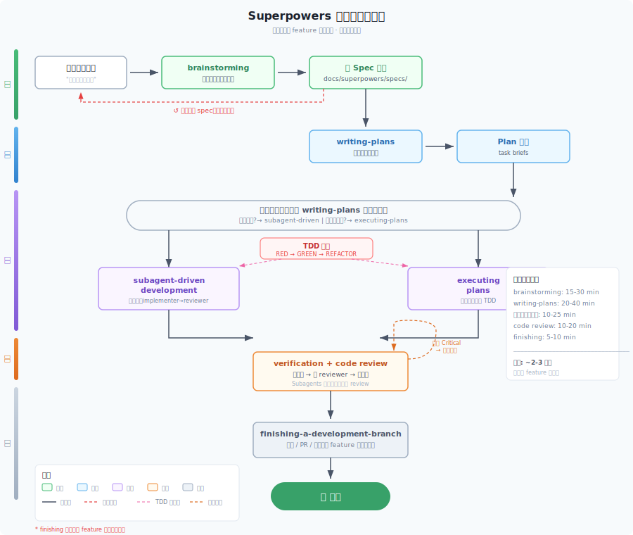
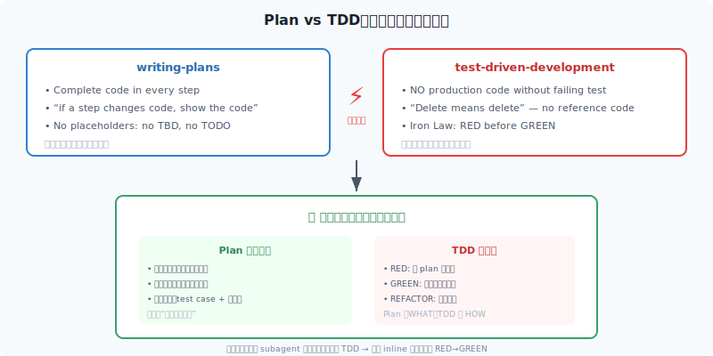
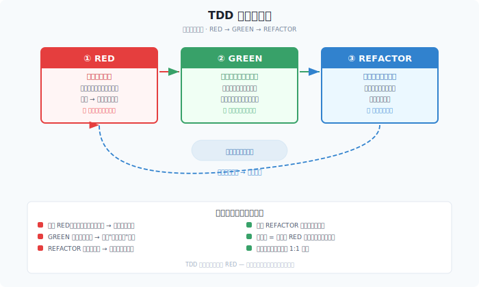
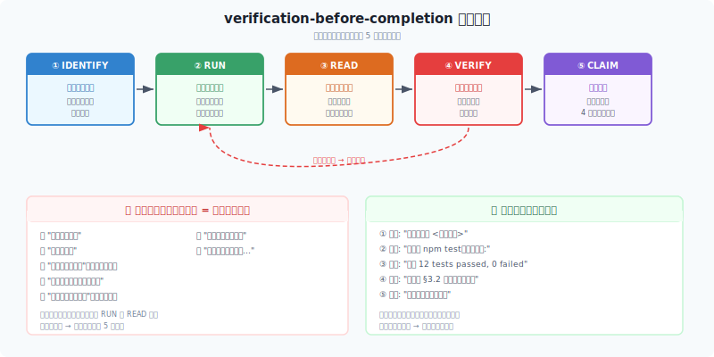
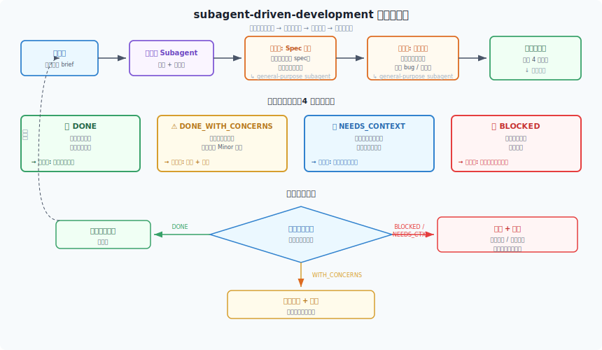
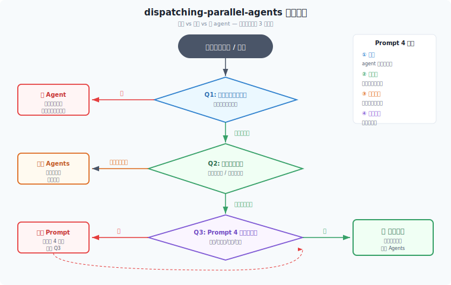
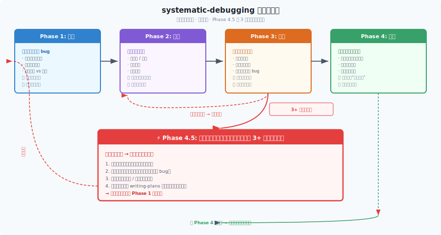
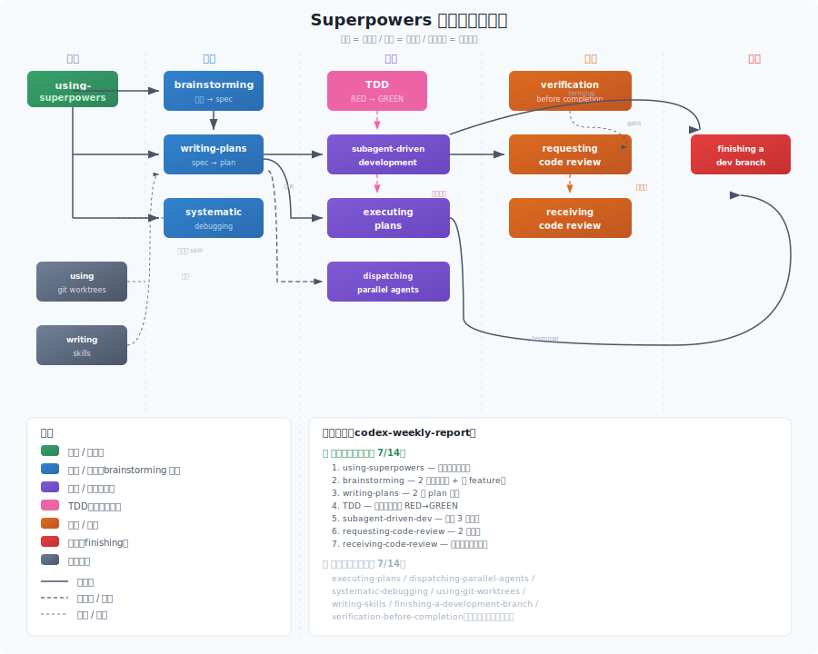

# Superpowers 实践手册

> 基于真实项目（codex-weekly-report）的实践记录，不是理论翻译。

---

## 1. 概述

**Superpowers** 是一套 AI 编程代理 (coding agent) 的技能 (skill) 集合。每个 skill 是一个 Markdown 文件，告诉 AI 在特定场景下该怎么思考、按什么步骤走、别犯什么错。

### 它解决了什么问题

裸的 AI 编程代理有两个致命毛病：

1. **太急**：一上来就写代码，没搞清楚需求 → 返工
2. **太散**：面对多步骤任务，想一步走一步 → 到后面忘了前面

Superpowers 用一套**强约束的流程**来解决：

```
想清楚（brainstorming）→ 写设计（writing-plans/specs）
→ 写测试（TDD）→ 执行（subagent/inline）
→ 验证（verification）→ 审查（code review）→ 收尾（finishing）
```

每个环节都是一个 skill，告诉 AI："现在你在这个环节，只做这个环节的事，别跳到下一步。"

### 核心理念

| 理念 | 含义 |
|------|------|
| **Progressive disclosure** | 每个 skill 文件很短（~100 行），只讲当下该知道的 |
| **Surgical precision** | 设计阶段不写代码，执行阶段不改设计 |
| **Verification before assertions** | 说"完成了"之前，先跑测试看到绿色 |
| **Human in the loop** | 关键决策点（合并、丢弃、大规模重构）由人说了算 |

---

## 2. 安装与启动

### 安装方式

Superpowers 支持多种 AI 编程环境，按你使用的工具选对应方式安装。

---

#### Claude Code

有两种渠道，任选其一：

**方式 1：Anthropic 官方插件市场**

```bash
/plugin install superpowers@claude-plugins-official
```

**方式 2：Superpowers 自有市场** ← 本次实践选用

```bash
# 先注册市场
/plugin marketplace add obra/superpowers-marketplace

# 再安装插件
/plugin install superpowers@superpowers-marketplace
```

> **安装范围说明**：本次实践选用**仓库级别安装**（插件只对 `mysuperpower` 目录生效），目的是在隔离环境中做技术验证，不影响其他项目。如果把 Superpowers 作为主力开发工具，建议改用**用户级别安装**，让 skills 对你所有项目自动生效。

安装后目录结构：

```
mysuperpower/
  .claude/
    settings.local.json   ← enabledPlugins 中会出现 superpowers
```

---

#### Pi

有两种：

```bash
# 方式 1：全局安装（影响所有项目）
pi install superpowers

# 方式 2：项目本地安装（只影响当前项目）← 推荐
cd mysuperpower
pi install -l superpowers
```

**为什么选本地安装？** 全局安装会让所有项目都走 superpowers 流程，不想要。本地安装只在这个目录生效。

安装后目录结构：

```
mysuperpower/
  .pi/git/github.com/obra/superpowers/
    skills/           ← 14 个 skill 文件
    hooks/            ← hook 配置（session-start 等）
    .pi/extensions/   ← pi 扩展代码
```

### 启动流程

项目启动时，`hooks/session-start` 自动执行：

1. 检查项目环境
2. 加载 `using-superpowers` skill
3. 告诉 AI："你有这些 skill 可用，遇到匹配场景就用"

**关键点**：启动后 AI 就知道有哪些 skill，会自动匹配场景调用。不需要人每次说 "用 XXX skill"。

---

## 3. 核心流程



一个完整 feature 的标准流程：

```
  User 提需求
    ↓
  brainstorming        ← 不写代码，只澄清需求（3-5 个问题）
    ↓
  写 spec 文档         ← 设计文档，不含实现代码
    ↓
  writing-plans        ← 把 spec 拆成可执行的步骤
    ↓
  executing-plans      ← 或 subagent-driven-development
    ↓                   ↕ 每步配合 TDD（RED → GREEN）
  verification         ← 跑测试、生成报告，验证结果
    ↓
  requesting-code-review  ← 派 subagent 审查
    ↓
  修问题               ← receiving-code-review 约束怎么处理反馈
    ↓
  finishing            ← 合并 / PR / 保持 / 丢弃
```

**本项目的实际路径**（略有变形，因为直接在主分支开发）：

```
  "帮我写 Codex CLI 周报工具"
    ↓
  brainstorming（3 个问题澄清需求）
    ↓
  写 spec（docs/superpowers/specs/）
    ↓
  writing-plans（拆成 3 个任务）
    ↓
  subagent-driven-development（3 个子任务并行执行）
    ↓
  requesting-code-review（发现问题修复）
    ↓
  加新功能（event-level token tracking）
    ↓ brainstorming → spec → plan → inline TDD 执行（3 步，21 测试）
    ↓
  requesting-code-review（再审查）
    ↓
  收尾（finishing 不适用——直接提交在 main）
```

**注意**：finishing-a-development-branch 在本项目中未真正执行，因为我们在 `main` 分支上直接开发，没有 feature 分支可合并。

> 💡 **想深入了解每个 skill 的细节？** 14 个 skill 的完整介绍（功能、适用场景、核心约束、实践效果）见**附录 C**。正文接下来聚焦本次实践中最值得分享的发现。

---
## 4. 踩过的坑

本章记录实践中遇到的**真实矛盾和失误**，不是理论预习。这些是走完 superpowers 流程后沉淀下来的核心发现。


### 4.1 Plan 写代码 vs TDD 测试先行

**这是本次实践最大的发现。**



`writing-plans` 要求：
> "Complete code in every step — if a step changes code, show the code"

`test-driven-development` 要求：
> "NO PRODUCTION CODE WITHOUT A FAILING TEST FIRST"

这两个要求**直接矛盾**。如果计划里写了完整代码，执行者（subagent 或 inline）就不可能"先看测试失败再写代码"——代码已经在计划里了。

**解决方案（妥协）：**
- Plan 定位为**接口和边界地图**——定义函数签名、返回值类型、文件位置
- TDD 定位为**执行纪律**——在执行过程中发现具体实现
- Plan 不再写"完整代码"，改为写"test case + interface contract"

实际效果：早期用 subagent 执行时，计划里写了完整代码，导致执行者直接跳过了 RED→GREEN 循环。后来改成 inline 执行，手动删掉 plan 中的实现代码，才真正走完了 TDD。

### 4.2 Subagent 不返回结果

dispatch subagent 后有时收到 "No result provided"。可能原因：超时、上下文爆炸、内部错误被吞掉。

**教训：** 不要塞整段计划给 subagent；用 `task-brief` 脚本提取单任务；如果连续失败，切到 inline 执行。

### 4.3 Finishing 在我们的场景里不适用

`finishing-a-development-branch` 假设你在 feature 分支开发，需要一个合并回 main 的收尾。但我们直接在 main 上开发，所有提交已经合入。这个 skill 只有 Step 1（验证测试）有意义。

**教训：** 不是所有 skill 都适合所有项目。在 main 上做小改动，finishing 可以跳。

### 4.4 技能过度使用

有些场景不需要走完整 skill 流程："文件叫什么名"不需要 brainstorming，"改个变量名"不需要 writing-plans，"看一眼代码"不需要 systematic-debugging。

`using-superpowers` 的规则是"有 1% 可能就用"，但过度触发会打断流畅对话。**平衡点：** 用户说"不执行，只解释"时跳过；实际代码变更时严格遵守。

### 4.5 AI 审 AI 的盲区

请求审查时 reviewer (AI) 和作者 (AI) 本质是同一个模型，只是给了不同 prompt。Reviewer 可能漏掉作者也漏掉的问题，或做出和作者一样的隐含假设。实际发现了一些问题（大小写、continue），但也漏掉了（cross-date token 精度问题直到集成才知道）。

**建议：** 如果有条件，让人类做最终审查。

### 4.6 执行机制的缺失

**这是对比原始 skill 后的新发现。**

Superpowers 的原始 skill 有大量**强制执行机制**，我们在实践中部分跳过了：

| 机制 | 原始要求 | 本次实践 | 后果 |
|------|---------|---------|------|
| **Checklist 转 Todo** | brainstorming 要求创建 9 个 todo | 没创建 | 容易漏步骤 |
| **两阶段审查** | 每个任务先审 spec 合规再审质量 | 只审了一次 | 可能偏离设计 |
| **门控函数** | verification 要求 5 步走完才能声称 | 隐式做了但没显式验证 | 有声称风险 |
| **防借口表** | TDD 有 11 行、verification 有 12 行 | 知道概念但没对照检查 | 可能不自知地违反 |
| **自审清单** | writing-plans、brainstorming 都有 | 没显式走清单 | 可能遗漏检查项 |
| **4 种状态** | subagent 应返回 DONE/DONE_WITH_CONCERNS/NEEDS_CONTEXT/BLOCKED | 没有结构化状态 | 无法识别 subagent 顾虑 |
| **模型选择** | 机械任务用小模型，判断任务用大模型 | 都用同一个模型 | Token 效率不是最优 |

**为什么会缺失？**

1. **隐式遵守 vs 显式执行**：我们实际做了验证、自审，但没有显式走清单 → 结果看起来对，但过程不可复现
2. **Subagent 机制不完善**：没有结构化返回、没有状态码 → 无法利用 4 种状态、两阶段审查
3. **"知道概念"≠"对照检查"**：知道有防借口表，但不对照表检查 → 可能在不自知的情况下违反

**为什么会缺失（这次会话进一步发现）：**

我们对 superpowers 仓库本身进行了代码审查，发现：

- **hooks.json 只 hook SessionStart**——没有可挂载验证提醒的事件
- **pi 扩展只 hook session_start / session_compact / agent_end / context**——且 `agent_end` 后 bootstrap 注入会被禁用
- **Claude Code 集成也是同样限制**——hooks.json 只 hook SessionStart
- **porting-to-a-new-harness.md 文档说明这是设计选择**：superpowers 只提供"会话开始一次性注入"，不依赖平台 hook 机制提醒每轮

因此 "机制缺失" 不全是我们不会用——**有些机制在仓库里就不存在**：

| Skill | 要求的执行机制 | superpowers 提供吗？ | 我们的实践 |
|-------|--------------|--------------------|-----------|
| verification-before-completion | 5 步门控自动触发 | ❌ 没有 hook，靠模型自检 | 隐性做了，但只能靠人类提醒才能想起来 |
| brainstorming | 9 个 todo 自动创建 | ❌ 没提供 todo 创建机制 | 手动问问题，没创建 todo |
| subagent-driven-development | 4 种状态返回（DONE/DONE_WITH_CONCERNS/NEEDS_CONTEXT/BLOCKED） | ⚠️ skill 定义了状态但没 hook 强制返回 | subagent 不返回结果，没有结构化状态 |
| requesting-code-review | 两阶段审查（spec 合规 + 质量） | ⚠️ skill 定义了两阶段但 subagent 不一定遵守 | 只审了一次 |
| writing-plans | NO PLACEHOLDERS（7 种模式） | ❌ 没有自动检测占位符机制 | 检查了但没对照 7 种模式清单 |

**教训（最终版）：**

Superpowers 不只是**流程指南**，更是**纪律执行系统**。如果只学流程不用机制，效果会打折扣。

**原始 skill 为什么设计这些机制？**

根据 `writing-skills` skill 的说明，这些机制是通过**"给文档做 TDD"** 发现的：

1. 派 subagent 执行任务（没有 skill）→ 看它怎么犯错 → 记录
2. 写 skill 堵住这个错误 → 再派 subagent 测试 → 看是否还犯错
3. 发现新的绕过方式（借口、Red Flag）→ 补充到 skill → 再测试
4. 循环往复，直到 subagent 不再犯错

所以那些"数不清的防借口表"不是理论推导，是**实战测试堵出来的漏洞**。

**对未来实践的启示：**

- 显式走清单 > 隐式遵守（可复现、可审查）
- 用 Todo 工具跟踪 checklist（Superpowers 原始设计如此）
- 如果 subagent 机制不完善，考虑增强（结构化输出、状态码）
- 定期对照防借口表自查（即使觉得"我知道了"）
- **接受 superpowers 的设计限制**：仓库没提供 UserPromptSubmit/PreToolUse 之类的 hook，verification/brainstorming 等技能触发靠 bootstrap + 模型自觉，**不是机械保证**
- **约定俗成机制**（仓库未提供但补足）：让人类在关键节点（commit、PR、声明完成）主动说一句"走 verification gate"或"走 brainstorming"，模型才走完整流程。这是现实中可用的补充机制

---

## 5. 你的角色（人类 vs AI 分工）

### 你应该主动做的

| 环节 | 动作 | 原因 |
|------|------|------|
| brainstorming | 回答问题，**不要说"随便"** | AI 需要上下文才能正确取舍 |
| spec 文档 | **读一遍**再批准 | AI 可能写了你自己都不想要的东西 |
| 审查 | **手动看 diff** | AI 审 AI 有盲区 |
| 关键决策 | **拍板**：选方案、合并还是 PR | AI 可以有建议，但不能替你决策 |
| 争议 | 和 AI 想法不一样时**说出来** | AI 不会主动质疑你的决定 |

### AI 应该自动做的

| 环节 | 动作 | 触发条件 |
|------|------|---------|
| using-superpowers | 启动时加载 | 自动 |
| brainstorming | 提问澄清需求 | 你说 "build/make/create" |
| writing-plans | 拆任务写计划 | brainstorming 完成后 |
| TDD | 先写测试 | 任何代码变更 |
| subagent-driven-dev | 派 subagent 干活 | 计划有独立任务 |
| verification | 跑测试报结果 | 声称完成前 |
| requesting-code-review | 审查一轮 | 任务完成或合并前 |

### 什么时候该干预

- AI 说 "太简单了不需要设计" → 打断，要求 brainstorming
- AI 说 "测试应该能过" 但没跑 → 要求他跑
- AI 跳过了 spec 开始写代码 → 要求先写 spec
- AI 在不适用场景强行走 skill → 告诉他跳过
- Subagent 反复失败 → 要求 inline 执行

### 什么时候不用管

- AI 大段读文件、写测试 → 正常工作过程
- AI 自言自语分析逻辑 → systematic-debugging 的 Phase 1
- AI 问你问题 → 需要你的上下文
- 测试是红色的 → TDD 要求先红后绿

---

## 6. 实战案例：Codex CLI 周报

### 完整时间线

整个过程分两个阶段：

**第一阶段：基础功能搭建**
- 安装 superpowers（project-local）
- 探索 Codex CLI 数据格式
- brainstorming（3 个问题 → spec）
- writing-plans（拆 3 个任务：日期范围 + 文件扫描、会话解析 + 数据提取、聚合 + 报告生成）
- subagent-driven-development（3 个子任务并行执行）
- requesting-code-review → 修复 3 个问题

**第二阶段：功能扩展**
- 讨论 plan vs TDD 矛盾（这是整篇手册最核心的发现）
- 新需求：event-level token tracking
- brainstorming → spec → plan → inline TDD 执行（3 步，21 个测试）
- 集成发现 info:null bug → 修复
- 第二次审查 → 发现大小写、continue 等问题
- 收尾（finishing 不适用）

### 最终产出

| 文件 | 行数 | 说明 |
|------|------|------|
| `codex-weekly-report.py` | 344 | 单文件，零外部依赖 |
| `test_report.py` | 430 | 21 个测试 |
| spec 文档 × 2 | — | 设计文档 |
| plan 文档 × 2 | — | 实现计划 |
| 周报 | 生成 | 4 节（总体、项目、模型、趋势）|

### 关键数字

- 14 个 skill 中用了 **7 个**，未用 7 个
- **最易跳过的：** brainstorming
- **最严格的：** TDD（数不清的防借口表）
- **最有价值的发现：** plan vs TDD 的矛盾

### 核心收获

1. **Superpowers 不是银弹**：需要选择性使用
2. **Plan vs TDD 是真实矛盾**：不是理解问题，是设计冲突
3. **AI 审 AI 有盲区**：人类需要介入
4. **项目本地安装正确**：不污染全局

---

## 附录 A：Skill 速查表

> 如果你只想快速定位该用哪个 skill，看这里。完整介绍见附录 C。

| 你要做什么 | 用哪个 skill | 触发方式 | 关键约束 |
|-----------|-------------|---------|---------|
| 开始新功能 | brainstorming | 自动 | HARD-GATE：没批准不写代码 |
| 想法变计划 | writing-plans | brainstorming 后 | NO PLACEHOLDERS（7 种模式） |
| 写代码 | test-driven-development | 自动 | RED→GREEN→REFACTOR，Delete means delete |
| 执行独立任务 | subagent-driven-development | 手动 | 两阶段审查（spec + 质量） |
| 执行依赖任务 | executing-plans | 手动 | Pre-flight 计划审查 |
| 多个独立问题 | dispatching-parallel-agents | 手动 | 3+ 独立根因 |
| 遇到 bug | systematic-debugging | 自动 | Phase 1 完成前不能提修复 |
| 声称完成 | verification-before-completion | 自动 | 5 步门控：IDENTIFY→RUN→READ→VERIFY→CLAIM |
| 代码审查 | requesting-code-review | 手动 | 获取 SHA → 派 reviewer → 处理反馈 |
| 收到反馈 | receiving-code-review | 自动 | 6 步：READ→UNDERSTAND→VERIFY→EVALUATE→RESPOND→IMPLEMENT |
| 收尾合并 | finishing-a-development-branch | 手动 | Provenance-based cleanup |
| 隔离工作空间 | using-git-worktrees | 手动 | Step 0：先检测现有隔离 |
| 写新 skill | writing-skills | 手动 | TDD for documentation：subagent 基线测试 |
| 一切的入口 | using-superpowers | 自动 | 1% 规则，流程 skill > 实现 skill |

---

## 附录 B：Plan vs TDD 矛盾详解

---

## 附录 C：14 个 Skill 详解

> 以下逐个介绍 14 个 superpowers skill，均基于原始 SKILL.md 内容编写。如果你只想快速定位该用哪个 skill，看附录 A 的速查表就够了。

### 4.1 流程技能（按使用顺序排列）

#### using-superpowers

**功能：** 所有 superpowers 的入口和基础规则。设定一条铁律：**在任何回应或行动之前，先检查是否有适用的 skill。** 即使是想问一个澄清问题，先检查 skill。同时还定义了 skill 优先级（流程 skill > 实现 skill）和常见"借口识别表"（Red Flags）。

**适用场景：** 每次会话开始时自动加载。是所有 skill 的"元规则"。

**触发方式：** 自动激活——hook `session-start` 加载。

**与其他 skill 的关系：** 被所有其他 skill 引用。定义了 "skill 优先级"（brainstorming/systematic-debugging > 其他）和 red flags 机制。不直接调用其他 skill，但约束所有 skill 的使用规则。

**核心约束：**
- **"1% 规则"**：如果有哪怕 1% 的可能性 skill 适用，就**必须**（ABSOLUTELY MUST）调用
- **Red Flags 识别表**（11 项）：包括 "这只是简单问题"、"我需要先了解更多上下文"、"让我先探索代码库"、"我先快速检查一下文件"、"让我先收集信息"、"这不需要正式的 skill"、"我记得这个 skill"、"这算不上任务"、"我先做这一件事"、"这感觉很高效"、"我知道那是什么意思" 等常见自我欺骗
- **Skill 优先级**：流程 skill（brainstorming, systematic-debugging）> 实现 skill（frontend-design 等）
- **平台适配**：不同平台（Codex/Pi/Antigravity）有专门的工具参考文件

**本次实践：** 全程自动激活。我们遵循了 skill 优先级——先 brainstorming 后写 spec，先 TDD 后实现。但也遇到了"red flag"悖论：有时 skill 检查太频繁会打断自然流程。

**与原始 skill 的差距：**
- ✅ 遵守了核心规则和优先级
- ⚠️ 没有显式对照 11 项 Red Flags 表自查
- ⚠️ 未使用平台特定工具参考（因为是通用项目）

---

#### brainstorming

**功能：** 把模糊的想法变成完整的设计文档（spec）。强制要求：在写任何代码之前，必须先完成设计并获得用户批准。流程分 9 步：探索项目上下文 → 逐个提问澄清需求 → 提出 2-3 个方案对比 → 展示设计 → 写 spec 文档 → 自我审查 → 用户审查 → 转交 writing-plans。

**适用场景：** 任何创造性工作——新功能、新组件、行为修改。即使是"简单到不需要设计"的项目也必须走。

**触发方式：** 自动激活（关键词："let's build", "create", "add feature"等）。

**与其他 skill 的关系：** 终端状态是调用 `writing-plans`。明确禁止调用任何实现 skill（如 frontend-design）。

**核心约束：**
- **HARD-GATE（硬门控）**：没有用户批准的设计文档，**绝对不能写代码**。这不是建议，是铁律。
- **头号反模式**："太简单不需要设计"——这个借口适用于**所有项目**都是错的，包括"只改一行"的任务
- **多子系统 scope check**：如果项目涉及多个子系统，在详细提问前先做范围检查，避免无限展开
- **逐个提问**：一次只问一个问题，等用户回答后再问下一个（不要一次甩出 3-5 个问题）
- **Spec 自审清单**（4 项检查）：
  1. 是否有占位符（TBD、TODO、待定）？
  2. 设计是否内部一致？
  3. 范围是否清晰？
  4. 是否有歧义表述？
- **用户审查门**：写完 spec 后必须停下，等用户批准才能继续
- **Visual companion**：适时提供（不要一开始就问），用于复杂 UI/架构

**本次实践：** 在初期（写 codex-weekly-report）和后来（加 event-level token tracking）各走了一次。第一次中途跳过了 spec 文档步骤（被用户纠正后补上），第二次完整走完。关键学习：逐个提问很重要，不要一次甩多个问题。

**与原始 skill 的差距：**
- ⚠️ 第一次违反了 HARD-GATE（跳过 spec 直接想写代码）
- ⚠️ 没有显式走 spec 自审清单（虽然内容质量可以）
- ✅ 正确做了逐个提问
- ✅ 第二次完全遵守了流程

---

#### writing-plans

**功能：** 将 spec 转化为可执行的实现计划。每个计划包含精确的文件路径、完整的代码示例、测试命令和预期输出。**不允许占位符**——"TBD"、"TODO"、"implement later"都是计划失败。每个步骤是一个 2-5 分钟的操作："写测试" → "跑测试（看它失败）" → "写代码" → "跑测试（看它通过）" → "提交"。

**适用场景：** 有 spec 后，多步骤任务开始前。

**触发方式：** 自动激活（由 brainstorming 调用，或手动）。

**与其他 skill 的关系：** 终端分叉——推荐 `subagent-driven-development`（并行子任务），备选 `executing-plans`（本会话顺序执行）。

**核心约束：**
- **任务粒度定义**："smallest unit worth a fresh reviewer's gate"（值得一次全新审查的最小单元）——不是"最小可能的步骤"，而是"小到可以快速审查，大到值得审查"
- **Bite-sized 步骤**：每个步骤 2-5 分钟——写测试（1 分钟）→ 跑/验证失败（30 秒）→ 实现（2 分钟）→ 跑/验证通过（30 秒）→ 提交（30 秒）
- **NO PLACEHOLDERS 规则**（7 种禁止模式）：
  1. "TBD" / "TODO" / "待定"
  2. "implement later" / "稍后实现"
  3. "... (rest of implementation)" / "（其余实现）"
  4. "similar to above" / "类似上面"
  5. 函数签名但没有返回语句
  6. 空的测试用例
  7. "see previous step for pattern" / "参考之前的模式"
- **文件结构优先**：在任务列表前先定义设计决策（新文件、修改文件、架构变更）
- **接口块（Interfaces）**：每个任务包含 Interfaces 块——定义函数签名、类型、契约
- **自审清单**（3 项）：
  1. 每个任务是否独立可测试？
  2. 是否有占位符？
  3. 顺序是否合理（先基础后上层）？

**本次实践：** 走了两次。第一次拆成 3 个任务，每个任务代码完整（包含函数签名和返回值类型）。但这也暴露出一个张力和矛盾——计划里的完整代码和 TDD 的"测试先行"有**直接冲突**（详见第五章第 5.1 节）。

**与原始 skill 的差距：**
- ✅ 任务拆分合理，粒度适中
- ✅ 遵守了 NO PLACEHOLDERS
- ⚠️ 没有显式做自审清单（虽然质量可以）
- ⚠️ 第一次计划包含完整实现代码，导致 TDD 冲突
- 💡 **发现矛盾**：Plan 要求"完整代码"，TDD 要求"先测试"——我们的妥协是 Plan = 接口地图（签名、类型），TDD = 执行纪律（发现实现）

---

#### test-driven-development

**功能：** 铁律——**没有失败的测试，不写生产代码**。三阶段循环：RED（写测试，看它失败）→ GREEN（写最小代码，看它通过）→ REFACTOR（清理）。核心论点：如果你没看到测试失败，你就不知道它是否测对了东西。

**适用场景：** 所有功能、bug 修复、重构、行为修改。例外（需人类许可）：一次性原型、生成代码、配置文件。

**触发方式：** 自动激活（任何涉及代码编写的场景）。

**与其他 skill 的关系：** 被 `writing-plans` 强制要求（TDD 粒度的步骤），被 `executing-plans`/`subagent-driven-development` 在每步执行时要求。`writing-skills` 将 TDD 的概念应用到文档编写。

**核心约束：**
- **铁律（Iron Law）**："NO PRODUCTION CODE WITHOUT A FAILING TEST FIRST"——违反文字 = 违反精神
- **Delete means delete**：如果你在测试之前写了代码，必须**删除**它（不是注释，不是"保留作参考"，是真删除），然后从测试开始
- **RED-GREEN-REFACTOR 验证**：
  - RED：必须跑测试，看到它失败，读失败信息，确认失败原因正确
  - GREEN：写最小代码让它通过，再跑测试，看到它通过
  - REFACTOR：清理代码，再跑测试，确保仍然通过



- **11 行借口识别表**（部分）：
  - "测试很简单，我知道怎么写"
  - "我先写个框架，然后再写测试"
  - "这只是重构，不需要新测试"
  - "我会在完成后写测试"
  - "我可以心理模拟测试失败"
  - "保留代码作为参考，从测试开始"
  - ...（共 11 行）
- **13 行 Red Flags**（部分）：
  - "让我先写个快速原型"
  - "这太简单了不需要测试"
  - "我稍后会添加测试"
  - "测试会降低速度"
  - ...（共 13 行）
- **9 项验证清单**：每个 RED/GREEN/REFACTOR 阶段都有具体验证项

**本次实践：** 早期用 subagent 执行时，subagent 实际跳过了 RED → GREEN 的循环（因为计划里已有完整代码）。后来改为 inline 执行后严格遵守了 TDD。关键矛盾：writing-plans 要求"完整代码在每步"，但 TDD 要求"不能先写生产代码"（详见第五章）。

**与原始 skill 的差距：**
- ✅ 后期严格遵守了 RED-GREEN-REFACTOR
- ⚠️ 早期 subagent 执行时跳过了（计划包含实现导致）
- ⚠️ 没有显式对照 11 行借口表和 13 行 Red Flags 自查
- ⚠️ 没有使用 9 项验证清单（虽然实际做了验证）
- 💡 **发现**：这是"最严格的" skill，有"数不清的防借口表"——这些表是通过 subagent 测试逐步堵出来的

---

#### executing-plans

**功能：** 顺序执行一个已写好的实现计划。读计划 → 辩证审查 → 逐任务执行 → 完成后调用 finishing。适合**不需要并行**的场景。

**适用场景：** 有 writing-plans 产出的计划，任务之间有依赖关系，不能用并行。

**触发方式：** 手动或由 writing-plans 调用。

**与其他 skill 的关系：** 终端调用 `finishing-a-development-branch`。前置是 `writing-plans`。备选是 `subagent-driven-development`（推荐后者）。

**核心约束：**
- **铁律（Iron Law）**："EXECUTE THE PLAN AS WRITTEN, DON'T IMPROVE IT"——执行者不能在执行过程中修改计划；如果发现问题，先完成当前任务，再创建新任务
- **辩证审查（Devil's Advocate Review）**：执行前必须先审查计划本身，检查：
  - 有没有矛盾的假设？
  - 有没有缺失的依赖？
  - 有没有更好的顺序？
  - 如果发现问题，先提出然后继续（不要自行修改）
- **连续执行原则**：任务之间不停下来问人类（除非有阻塞），直到计划全部完成
- **完成时调用 finishing**：所有任务完成后自动调用 `finishing-a-development-branch`
- **备选路径**：如果任务可以独立，推荐用 `subagent-driven-development` 替代（提供独立 context 和审查）

**本次实践（一期）：** 未使用。选择了 subagent-driven-development（因为有独立任务），后来又改用 inline 执行但没有明确调用 executing-plans skill。

**本次实践（二期：--output 参数）：** 完整使用。在 worktree 内用 executing-plans 执行了 `docs/superpowers/plans/2026-07-01-output-parameter.md`，顺序执行了 4 个任务（baseline test → 参数解析 → 文件输出逻辑 → CLI test）。完成后自动调用了 finishing-a-development-branch。

关键体验：
- 连续执行（不中途停下来问）使得流程非常顺畅
- 计划有依赖顺序（需要解析完才能测 CLI），executing-plans 比 SDD 更合适
- 调用 finishing 是自然的终止点，不需要手动判断什么时候结束

**与原始 skill 的差距：**
- ✅ 二期完整使用了 executing-plans 流程
- ✅ 连续执行任务，没有中途打断
- ✅ 完成后正确调用了 finishing-a-development-branch
- ⚠️ 一期完全未使用
- 💡 **关键设计**：辩证审查（Devil's Advocate）是防止执行者盲目执行低质量计划的机制——发现问题但不自行修改，而是提出后继续，保持计划权威性
- 💡 **选择 SDD vs executing-plans**：有独立任务 → SDD；有依赖顺序 → executing-plans；二期的 4 个任务有明确顺序依赖，所以 executing-plans 是正确选择

---

#### verification-before-completion

**功能：** 铁律——**没有新鲜验证证据，不能声称完成**。它规定了"声称完成"之前的门控函数：识别 → 运行 → 阅读 → 验证 → 然后才能声称。把"should work"、"probably fixed"这种模糊词定义为"撒谎"。

**适用场景：** 任何声称完成/修复/通过之前——提交前、创建 PR 前、任务完成前。

**触发方式：** 自动激活（检测到即将声称完成时）。

**与其他 skill 的关系：** 被 `systematic-debugging` 引用（Phase 4 验证修复），被 `receiving-code-review` 隐含要求（改一个测一个）。

**核心约束：**
- **铁律（Iron Law）**："NO COMPLETION CLAIMS WITHOUT FRESH VERIFICATION EVIDENCE"——"fresh"指的是本次对话中实际运行得到的证据
- **门控函数（Gate Function）——5 步**：
  1. **IDENTIFY**：识别需要运行什么验证（测试？命令？手动检查？）
  2. **RUN**：实际运行它（不是"应该能过"，是真的跑）
  3. **READ**：读取输出（不要假设，看实际输出）
  4. **VERIFY**：对照预期验证结果（通过？失败？部分？）
  5. **CLAIM**：只有前 4 步完成了，才能声称完成



- **12 行借口识别表**（部分）：
  - "代码看起来是对的"
  - "这和之前通过的测试一样"
  - "测试应该能过"
  - "我验证了逻辑"
  - "改动很小，不会破坏东西"
  - "我之前测过类似的代码"
  - ...（共 12 行）
- **禁用词 Red Flags**：
  - "should work" / "应该能工作"
  - "probably fixed" / "大概修好了"
  - "seems to" / "看起来"
  - "likely" / "可能"
  - "appears to" / "似乎"
- **适用范围**：所有表达成功/满意的声明——"完成了"、"修好了"、"测试通过"、"问题解决了"

**本次实践：** 隐式使用。每次声称"测试通过"时都跑了 `python3 test_report.py` 看到了 21/21 pass。但没有显式创建 checklist，这点不够严格。

**与原始 skill 的差距：**
- ✅ 实际做了验证（每次都跑了测试）
- ⚠️ 没有显式走 5 步门控函数（虽然隐式做了）
- ⚠️ 没有对照 12 行借口表自查
- ⚠️ 有时用了"应该"、"大概"等模糊词（虽然后面补了验证）
- 💡 **教训**：显式走流程比隐式做到更安全——防止自己在不知不觉中跳过验证

**本次会话进一步发现（会话中验证）：**

在这次和人类伙伴的对话中，专门验证了 verification 的**机制层级问题**——结果发现：

- **superpowers 仓库本身不给 verification 提供 hook**。查 `<repo>/hooks/hooks.json`，只 hook 了 `SessionStart`，没有 `UserPromptSubmit`/`PreResponse`/`PreToolUse` 等可挂验证提醒的事件。
- **pi 扩展 (`<repo>/.pi/extensions/superpowers.ts`) 只 hook 四个事件**：`session_start`、`session_compact`、`agent_end`、`context`。其中 `agent_end` 还会把 bootstrap 注入设为 `false`，每轮重新注入都不可行。
- **Claude Code 集成（`<user-home>/.claude/plugins/cache/superpowers-marketplace/.../hooks/hooks.json`）也是同样的限制**——只 hook `SessionStart`。
- **`docs/porting-to-a-new-harness.md` 明确说明了设计选择**：superpowers 的集成是"bootstrap 一次性注入 + 模型自约束"，**不依赖平台提供的 hook 机制**。

这意味着：
- ✅ "自动触发" 其实是**伪命题**——bootstrap 只在会话开始时注入一次
- ⚠️ verification 的 5 步门控完全靠**模型每次 claim 前自检**
- ⚠️ 这是设计选择，不是 bug——superpowers 假设模型读完 bootstrap 后会记住并自我约束
- 💡 **真正的教训**：verification skill 强弱**等于模型自觉性的强弱**。如果你的模型忘了读、忘了想、忘了用——verification 形同虚设。

**与 5.6 节的关系：** 5.6 节说 verification 是"隐式做了但没显式验证"——这个发现**更深一层**：不是我们没走流程，是 superpowers 根本没给"提醒走流程"的机制。模型（我）能在这次对话中想起 verification，是因为人类伙伴提了具体问题——**机制来源不是 skill，是人**。

---

#### requesting-code-review

**功能：** 派一个 subagent 审查代码。流程：获取 BASE/HEAD SHA → 填充审查模板（改了什么、需求是什么）→ 派 reviewer → 收到报告（Strengths / Issues / Assessment）→ 修问题。

**适用场景：** 完成任务后、实现主要功能后、合并前。subagent-driven-development 要求每个任务后审查一次。

**触发方式：** 手动或由 `subagent-driven-development` 调用。

**与其他 skill 的关系：** 被 `subagent-driven-development` 用于最终审查。和 `receiving-code-review` 形成审查的"发起→接收"两端（详见 4.4）。

**本次实践：** 走了两次。第一次用 subagent dispatch 失败（subagent 不返回结果），改为直接 inline 审查。第二次用的也是 inline。发现的真实问题：模型名大小写不统一、null info 处理用 continue。

**核心约束：**
- **审查三段式输出**：reviewer 必须返回 Strengths / Issues / Assessment 三段——缺任何一段都不完整
- **Issue 分级（三级）**：
  - **Critical**：立即修复，阻断继续进行
  - **Important**：合并前修复
  - **Minor**：记录，稍后处理
- **SHA 边界精确**：必须用 BASE_SHA + HEAD_SHA 定位变更范围，不能让 reviewer 猜
- **Reviewer context 隔离**：reviewer subagent 只拿 DESCRIPTION + PLAN_OR_REQUIREMENTS + SHA 范围，不拿当前会话历史——这保证审查角度新鲜
- **Red Flags（绝不）**：
  - 因为"改动很小"就跳过审查
  - 忽略 Critical issue 继续推进
  - 带未修复的 Important issue 合并
  - 反驳有效技术反馈（没有技术论据）

**与原始 skill 的差距：**
- ✅ 两次都做了审查，发现了真实问题
- ⚠️ 第一次 subagent 不返回结果后直接改 inline，没有诊断 subagent 失败原因
- ⚠️ 没有严格用 BASE_SHA/HEAD_SHA 模板（inline 审查时直接描述了改动）
- ⚠️ 没有显式按 Critical/Important/Minor 分级处理（虽然实际优先修了重要问题）
- 💡 **教训**：inline 审查是务实的降级方案，但失去了 reviewer 隔离 context 的价值——reviewer 和作者共享同一个会话历史，盲区更大

---

#### receiving-code-review

**功能：** 收到审查反馈后的**正确反应流程**。核心：不要表演性同意（"你说得对！"）、不要盲改、要验证、该反驳就反驳。六步：READ → UNDERSTAND → VERIFY → EVALUATE → RESPOND → IMPLEMENT。

**适用场景：** 收到任何代码审查反馈时——来自 reviewer subagent、GitHub PR 评论、人类随口说的建议。

**触发方式：** 自动激活（收到反馈时）。

**与其他 skill 的关系：** 和 `requesting-code-review` 独立但互补——一个发起审查，一个处理审查结果。也可以独立应对非 subagent 来源的反馈。

**核心约束：**
- **6 步流程（必须按顺序）**：
  1. **READ**：完整读取反馈（不要跳读、不要假设）
  2. **UNDERSTAND**：理解反馈者的意图和关注点
  3. **VERIFY**：验证反馈是否正确（检查代码、运行测试、查文档）
  4. **EVALUATE**：评估反馈的优先级和适用性
  5. **RESPOND**：回应反馈（同意、反驳、澄清）
  6. **IMPLEMENT**：只有经过验证和评估后，才实施修改
- **禁止的回应**（3 种明确模式）：
  1. "你说得对！"（表演性同意，没验证）
  2. "好的，我马上改"（盲目接受，没评估）
  3. "明白了，已修复"（没跑测试验证修复）
- **来源特定处理**：
  - **你的人类伙伴**：优先级最高，但仍要验证理解
  - **外部审查者**：需要评估是否符合项目上下文
  - **Subagent reviewer**：可能有盲区，需要独立验证
- **YAGNI 检查**：对于"专业化"建议（添加配置、扩展性、未来特性），检查是否 YAGNI（You Aren't Gonna Need It）
- **何时/如何反驳**：
  - 反馈基于错误假设 → 澄清假设
  - 反馈不适用当前上下文 → 说明上下文
  - 反馈是 YAGNI → 指出当前需求
- **优雅地纠正反驳**：如果反驳后发现自己错了，承认并修正

**本次实践：** 部分使用。处理审查反馈时没有做表演性同意（好），但也没有显式走六步流程（不够严格）。早期对话中发现"receiving-code-review ≠ requesting-code-review 的对偶"，这是一个重要的理解纠正。

**与原始 skill 的差距：**
- ✅ 避免了表演性同意
- ✅ 做了验证（改完后跑测试）
- ⚠️ 没有显式走 6 步流程
- ⚠️ 没有显式评估来源（虽然对 subagent 反馈有独立判断）
- ⚠️ 没有遇到需要反驳的情况（所以反驳机制未测试）
- 💡 **重要理解**：这个 skill 和 requesting-code-review **不是对偶关系**——一个是发起审查的流程，一个是处理反馈的纪律

---

#### finishing-a-development-branch

**功能：** 开发完成后的收尾。四步：验证测试 → 检测环境 → 展示选项 → 执行选择。四种选项：合并到主分支、创建 PR、保持现状、丢弃。关键安全措施：丢弃操作需要用户输入 "discard" 确认。

**适用场景：** 所有任务完成，测试通过，需要决定如何整合工作。

**触发方式：** 手动或由 `executing-plans`/`subagent-driven-development` 终端调用。

**与其他 skill 的关系：** 是 `executing-plans` 和 `subagent-driven-development` 的终端状态。

**本次实践（一期）：** 未真正执行。因为我们直接在 `main` 分支上开发，没有 feature 分支可合并，也没有 worktree 可清理。

**本次实践（二期：--output 参数）：** 完整走完了 4 选项流程。用 EnterWorktree（原生工具）创建了 harness-owned worktree（branch: `worktree-add-output-parameter`），开发完成后：1) 验证 23/23 测试通过；2) 呈现 4 选项，选择 Option 1（合并到 main）；3) fast-forward merge 成功；4) 用 ExitWorktree（`discard_changes: true`）清理 worktree。

遇到的关键问题：
- `git pull` 失败（main 没有 remote tracking）→ 直接跑 `git merge` 绕过，结果等价
- ExitWorktree 第一次拒绝（4 commits 未合并）→ merge 成功后再次调用加 `discard_changes: true`
- `git branch -d` 返回 "branch not found"（ExitWorktree 已自动删了）→ benign

**核心约束：**
- **测试验证是硬前置**：Step 1 测试不过，不能进入 Step 2——"Cannot proceed with merge/PR until tests pass"
- **4 选项严格呈现**（正常 repo / named-branch worktree）：
  1. Merge back to `<base-branch>` locally
  2. Push and create a Pull Request
  3. Keep the branch as-is
  4. Discard this work
  - 不能自由发挥选项，不能省略，不能合并
- **丢弃需要打字确认**："discard" 精确字符串——防止误删
- **Provenance-based cleanup（来源检查）**：只清理 superpowers 创建的 worktree（路径在 `.worktrees/` 或 `worktrees/` 下）；harness 创建的 worktree 不碰
- **Option 2/3 保留 worktree**：创建 PR 或保持现状时，不能删 worktree——用户还需要它迭代
- **先 merge 后删 branch**：Option 1 顺序：merge → worktree cleanup → `git branch -d`；反过来会报错
- **cd 到主 repo root 再执行 worktree remove**：在 worktree 内部执行会静默失败
- **Red Flags（绝不）**：
  - 带失败测试合并或创建 PR
  - 不询问直接丢弃
  - 合并前不在结果上重新跑测试
  - 在 worktree 内部执行 `git worktree remove`
  - 清理非 superpowers 创建的 worktree

**与原始 skill 的差距（二期之后更新）：**
- ✅ 二期完整走完：验证测试 → 呈现 4 选项 → Option 1 merge → worktree 清理
- ✅ Provenance-based cleanup 正确执行——用 ExitWorktree 而非 `git worktree remove`
- ⚠️ `git pull` 失败绕过了（main 无 remote tracking）——实际上等价，但偏离了 skill 原始步骤
- ⚠️ ExitWorktree 第一次需要 `discard_changes: true` 才成功——因 worktree 中有未 merge 的 commit（要先 merge 再 exit）
- 💡 **教训（实战证实）**：先 merge 后 exit worktree 的顺序是硬性要求；反过来 ExitWorktree 会拒绝执行

---

### 4.2 并行与调试技能

#### subagent-driven-development

**功能：** 用 subagent 执行计划——每个任务派一个全新 subagent，做完后派 reviewer 审查，通过后继续下一个。是 writing-plans 推荐的执行方式。亮点：每个 subagent 拿自己的 task brief（不读整个计划）、review 有两轮（spec 合规 + 代码质量）、支持 ledger 断点恢复。

**适用场景：** 有 writing-plans 产出的计划，任务之间独立或低耦合。

**触发方式：** 手动或由 writing-plans 调用。

**与其他 skill 的关系：** 前置 `writing-plans`，终端调用 `requesting-code-review`（最终审查）→ `finishing-a-development-branch`。备选 `executing-plans`。要求 subagent 使用 `test-driven-development`。

**核心约束：**
- **两阶段审查（关键机制）**：每个任务完成后派**两个** reviewer：
  1. **Spec 合规审查**：实现是否按照设计文档来？有没有偏离 spec？
  2. **代码质量审查**：实现本身质量如何？有没有 bug、坏味道、性能问题？
  - 两个都要通过才能继续下一个任务
- **4 种实现者状态**（implementer 会返回其中之一）：
  - **DONE**：完成了，没问题
  - **DONE_WITH_CONCERNS**：完成了，但有顾虑（需要审查关注）
  - **NEEDS_CONTEXT**：需要更多上下文才能继续
  - **BLOCKED**：被阻塞，无法继续



- **模型选择策略**：
  - 机械任务（格式转换、重复模式）：用较小模型
  - 判断任务（架构决策、权衡取舍）：用较大模型
- **文件交接系统**（3 个脚本）：
  - `task-brief`：从完整计划中提取单个任务
  - `report`：实现者生成的完成报告
  - `review-package`：打包给 reviewer 的材料（spec + diff + report）
- **持久化进度账本（ledger）**：记录每个任务的完成状态，支持 context compaction 后恢复
- **Reviewer 构建规则**（9 条）：如何构建 reviewer prompt，包括 spec、diff、concerns 等
- **Pre-flight 计划审查**：执行前先审查计划本身是否合理
- **连续执行原则**：任务之间不需要人类 check-in，连续执行（除非遇到 BLOCKED）

**本次实践：** 第一期走了完整的三任务流程——每个任务派 subagent 实现 + reviewer 审查。发现的问题：1) subagent 有时不返回结果（可能超时/超 context）；2) 审查后的修复增加了不少 token 消耗；3) review-package 脚本相对复杂。第二期改为 inline TDD 执行，更快但失去了 subagent 的独立上下文优势。

**与原始 skill 的差距：**
- ⚠️ **只做了一轮审查**（代码质量），没有做两轮（spec 合规 + 质量）——这是关键缺失
- ⚠️ 没有处理 4 种实现者状态（因为 subagent 没返回结构化状态）
- ⚠️ 没有显式用模型选择策略（都用了同一个模型）
- ✅ 使用了 task-brief 概念（虽然不是脚本）
- ⚠️ 没有持久化 ledger（因为没遇到 compaction）
- ⚠️ 遇到 subagent 不返回结果后切换到 inline，没有调试 subagent 机制
- 💡 **教训**：两阶段审查是质量保证的关键——spec 合规防止偏离设计，代码质量防止实现问题

---

#### dispatching-parallel-agents

**功能：** 并行派遣多个 subagent 处理独立问题。适用于多个不相干的测试失败、多个子系统独立损坏。每次 dispatch 应该是一个独立的问题域，配精确的 scope 和 expected output。

**适用场景：** 3+ 个测试文件有不同根因的失败、多个子系统独立损坏、每个问题不需要其他问题上下文。**不适用：** 失败相互关联、需要全系统理解、subagent 会互相干扰。

**触发方式：** 手动。

**与其他 skill 的关系：** 和 `subagent-driven-development` 互补——SDD 是串行逐任务，这个是并行独立问题。都依赖 subagent 工具。

**本次实践：** 未使用。我们的 3 个任务是按依赖顺序串行的（Task 1 产出被 Task 2 消费），不适合并行。

**核心约束：**
- **独立性前提检查（必须）**：并行前必须确认问题真正独立——"修一个不影响另一个"。相关失败要串行调查，不能并行



- **每个 agent prompt 必须包含 4 要素**：
  1. **Specific scope**：一个测试文件或一个子系统（不是"修所有测试"）
  2. **Clear goal**：明确目标（"让这 3 个测试通过"）
  3. **Constraints**：约束范围（"不改其他文件"）
  4. **Expected output**：返回什么（"根因摘要 + 改了什么"）
- **并行触发机制**：同一个 response 中发出多个 dispatch = 并行；一个 response 发一个 = 串行——顺序至关重要
- **4 步验证（agent 返回后）**：
  1. 读每个 summary（理解改了什么）
  2. 检查冲突（多个 agent 有没有改同一段代码？）
  3. 跑完整 suite（所有修复合并后是否还能通过？）
  4. Spot check（agent 可能犯系统性错误，随机抽查）
- **绝不使用 dispatching-parallel-agents 的情况**：
  - 失败相互关联（修一个可能修另一个）
  - 需要全系统上下文
  - Exploratory debugging（还不知道哪里坏了）
  - Shared state（agent 会互相干扰，编辑同一个文件）
- **常见错误（4 种）**：scope 太宽、无上下文、无约束、输出要求模糊

**与原始 skill 的差距：**
- ⚠️ 完全未使用（任务有依赖顺序，不满足前提条件）
- ✅ **判断正确**：识别出"Task 1 产出被 Task 2 消费"→ 串行依赖，不能并行——这正是 skill 中"Don't use when: failures are related"的场景
- 💡 **关键设计**：并行 vs 串行的判断标准是"独立性"——不是任务数量，而是能否互不干扰
- 💡 **教训**：如果未来遇到多文件、多子系统独立失败的场景（如大规模重构后多处测试断开），这个 skill 可以大幅节省时间——记住 4 要素 prompt 格式

---

#### systematic-debugging

**功能：** 四阶段调试法——Phase 1 找根因（不是表象）、Phase 2 模式分析（对比正常代码）、Phase 3 假设验证（一次一个变量）、Phase 4 实现修复（写测试→修→验证）。铁律：**没有完成 Phase 1，不能提修复方案。** 特有规则：如果 3+ 个修复失败了 → 问题不在代码，在架构设计。

**适用场景：** 任何技术问题——测试失败、生产 bug、意外行为、性能问题。

**触发方式：** 自动激活（检测到 bug 或失败时）。

**与其他 skill 的关系：** Phase 4 引用 `test-driven-development` 写失败测试。引用 `verification-before-completion` 验证修复。

**核心约束：**
- **铁律（Iron Law）**："NO FIXES WITHOUT ROOT CAUSE INVESTIGATION FIRST"——没完成 Phase 1，不能提修复方案
- **四阶段（必须按顺序）**：
  - **Phase 1：根因追踪**——多组件诊断插桩（不只看一个地方），找到真正原因（不是表象）
  - **Phase 2：模式分析**——对比正常代码，找出差异
  - **Phase 3：假设验证**——一次改一个变量，不要同时改多个
  - **Phase 4：实现修复**——先写失败测试，再修复，再验证
  - **Phase 4.5：架构问题识别**——如果 3+ 次修复都失败 → 问题不在代码实现，在架构设计，停止修补，重新设计



- **多组件诊断插桩**：不要只看一个地方——在调用链的多个点加日志/断点，追踪数据流
- **根因追踪技术**（有单独参考文档）：5 Whys、数据流追踪、时间线重建
- **你的人类伙伴的信号**（5 种重定向）：
  1. "够了，先这样"——停止深入，接受当前方案
  2. "换个方向"——当前路径不对，换思路
  3. "解释一下"——你陷入细节了，先讲大局
  4. "简化一点"——方案太复杂，要更简单的
  5. "继续"——当前方向对，深入下去
- **8 行借口识别表**（部分）：
  - "我知道问题是什么"
  - "这明显是 X 导致的"
  - "让我快速修一下"
  - "根因很明显"
  - ...（共 8 行）

**本次实践：** 隐式使用。在 real data 集成阶段遇到了 `info: null` 导致的 bug——我们没有跳过 Phase 1 直接改代码，而是先通过日志分析确定了根因（token_count 事件中 info 字段为 null），然后才修复。但如果有复杂的 bug，这个 skill 的价值会很大。

**与原始 skill 的差距：**
- ✅ 正确做了根因追踪（info: null 问题）
- ✅ 没有跳过 Phase 1 直接修复
- ⚠️ 没有显式走四阶段流程（虽然实际遵循了）
- ⚠️ 没有多组件诊断插桩（因为 bug 相对简单）
- ⚠️ 未遇到 3+ 次修复失败的情况（所以 Phase 4.5 未触发）
- 💡 **教训**：对于复杂 bug，Phase 1 的多点插桩和根因追踪技术会非常关键

---

### 4.3 基础设施技能

#### using-git-worktrees

**功能：** 创建和管理隔离的 git worktree。流程：检测现有隔离 → 优先用平台原生工具 → fallback 到 `git worktree add`。做完后跑项目 setup（npm install/pip install）和 baseline 测试。

**适用场景：** 开始需要隔离的特征工作时（保护当前分支不受影响）。

**触发方式：** 手动。

**与其他 skill 的关系：** 被 `executing-plans` 和 `subagent-driven-development` 引用为前置条件（确保在隔离空间中工作）。

**本次实践（一期）：** 未使用。选择了直接在本地 `main` 上开发，没有开 worktree。

**本次实践（二期：--output 参数）：** 完整走了 using-git-worktrees 流程。Step 0 运行 `GIT_DIR` vs `GIT_COMMON` 检测，确认在普通 repo（非 worktree）中。Step 1a：使用平台原生工具 `EnterWorktree`（而非 `git worktree add`），创建了 harness-owned worktree，branch `worktree-add-output-parameter`。Step 3：验证 baseline 测试全部通过（21/21）后才开始实现。

关键体验：
- Step 0 检测是真实有用的——确认了起点状态，避免意外嵌套
- 原生工具（EnterWorktree）确实比 `git worktree add` 更简洁，cleanup 是自动的
- Baseline 测试验证提供了清晰的安全起点

**核心约束：**
- **Step 0 是强制的**：在创建任何东西之前，必须先检测现有隔离状态（`GIT_DIR` vs `GIT_COMMON`）——跳过 Step 0 会创建嵌套 worktree，这是最常见错误
- **Submodule 守卫**：`GIT_DIR != GIT_COMMON` 也可能是 submodule 内部——必须用 `git rev-parse --show-superproject-working-tree` 排除 submodule 情况，否则会把 submodule 误判为 worktree
- **原生工具优先（#1 高频错误）**：如果平台有 `EnterWorktree`、`WorktreeCreate`、`/worktree` 命令，**必须用它们**，绝不能用 `git worktree add`——用 `git worktree add` 绕过原生工具会创建 harness 看不见的"幽灵 worktree"
- **Step 1a 优先级**：只有在确认**没有**原生 worktree 工具时，才能 fallback 到 Step 1b（`git worktree add`）
- **目录选择优先级**（Step 1b）：显式用户指令 > 现有 `.worktrees/` 目录 > 现有 `worktrees/` 目录 > 默认 `.worktrees/`
- **gitignore 验证是必须的**（项目本地目录）：用 `git check-ignore` 确认目录被忽略，否则 worktree 内容会被 git 追踪——如果未忽略，先加进 `.gitignore` 并 commit，再创建
- **Baseline 测试验证**：Step 3 必须跑测试验证干净基线。失败了不能直接开始工作，要上报并询问是否继续
- **Sandbox fallback**：如果 `git worktree add` 因权限错误失败（sandbox），告知用户并在原地工作，不要报错退出
- **Quick Reference 表**（9 种情况）：已在 worktree / 在 submodule / 有原生工具 / 无原生工具 / `.worktrees/` 存在 / `worktrees/` 存在 / 两者都存在 / 两者都没有 / 目录未被忽略——每种情况有明确行动

**与原始 skill 的差距：**
- ✅ 二期完整走了 Step 0 → Step 1a → Step 3 流程
- ✅ 正确使用了原生工具（EnterWorktree），没有用 `git worktree add`
- ✅ Baseline 测试通过后才开始开发
- ⚠️ 一期完全未使用（在 main 直接开发）
- 💡 **关键设计**：Step 0 的 submodule 守卫是容易被忽略的细节——`GIT_DIR != GIT_COMMON` 有两种可能（worktree 和 submodule），必须区分
- 💡 **关键设计**：原生工具优先（Step 1a before 1b）是 skill 的核心设计原则——原生工具有自动 cleanup，用 `git worktree add` 绕过会产生 harness 管理不到的状态
- 💡 **教训**：EnterWorktree 返回的 worktree 是 harness-owned 的——cleanup 必须用 ExitWorktree，不能手动 `git worktree remove`（ExitWorktree 第一次会因未合并 commits 拒绝，merge 完成后加 `discard_changes: true` 再调用）

---

#### writing-skills

**功能：** 教你如何创建 superpowers skill。核心思想：**写 skill 就是给文档做 TDD**。用 subagent 做基线测试（看没有 skill 时 AI 怎么犯错）→ 再写 skill → 再跑同样场景（看 AI 是否遵守）→ 不断堵漏洞。

**适用场景：** 创建新 skill、编辑已有 skill、部署前验证。

**触发方式：** 手动。

**与其他 skill 的关系：** 依赖 `test-driven-development` 作为前置知识（"写 skill 就是 TDD 应用于文档"）。产出被 `using-superpowers` 加载。

**核心约束：**
- **铁律（Iron Law）**："NO SKILL WITHOUT A FAILING TEST FIRST"——先做 subagent 基线测试（看没有 skill 时 AI 犯什么错），再写 skill
- **Skill Discovery Optimization（SDO）关键 bug**：skill 的 `description` 字段是**触发条件**（什么时候用），不是工作流摘要。如果把工作流写进 description，AI 会认为只需要读 description 就够了，跳过 skill 正文 → skill 形同虚设
- **Skill 类型**（3 种）：
  - **Technique**：解决单一技术问题的方法
  - **Pattern**：可复用的架构/设计模式
  - **Reference**：指向外部资源的索引
- **4 种失败类型 × 对应形式**：不同的 AI 失败模式需要不同形式的 skill（铁律 vs 清单 vs 示例 vs 红旗表）
- **防弹化技术**（5 种）：使 skill 更难被 AI 绕过的写法
- **Micro-test 优先**：先用最小场景测 skill 是否生效，再写完整场景
- **Skill 创建清单**（24 项）：从意图到部署的完整验证

**本次实践：** 未使用。没创建新 skill，但理解了这个 skill 后，对"为什么 TDD 和其他 skill 有那么多防借口表"有了更深理解——它们是经过 subagent 基线测试后逐步堵出来的。

**与原始 skill 的差距：**
- ⚠️ 完全未使用，属于"理论理解"阶段
- 💡 **关键发现**：SDO bug 解释了为什么所有 skill 的 description 都是"Use when X" 而不是工作流描述——这是刻意设计，防止 AI 跳过 skill 正文
- 💡 **防借口表的来源**：不是凭空想出来的，而是通过 subagent 基线测试发现 AI 真实犯的错，一条条堵出来的

---

### 4.4 技能关系全景



**本次实践的实际路径（green path）：**

```
using-superpowers → brainstorming → writing-plans
                                     │
                          ┌──────────┴──────────┐
                          ▼                      ▼
                   subagent-driven-dev    inline TDD execution
                   (一期: 3 tasks)        (二期: 3 task cycles)
                          │                      │
                          └──────────┬───────────┘
                                     ▼
                              requesting-code-review
                                     │
                                     ▼
                              修复 → 完成
```

**本次未使用但属于标准流程的技能（gray path）：**
- `systematic-debugging` — 没有遇到复杂 bug
- `dispatching-parallel-agents` — 任务是串行依赖的
- `using-git-worktrees` — 选择在 main 开发
- `writing-skills` — 没有创建新 skill
- `finishing-a-development-branch` — 在 main 上开发，无可合并的分支
- `verification-before-completion` — 隐式使用但未显式走流程
- `executing-plans` — 用 subagent-driven-development 替代了

---

本章记录实践中遇到的**真实矛盾和失误**，不是理论预习。这些是走完 superpowers 流程后沉淀下来的核心发现。

